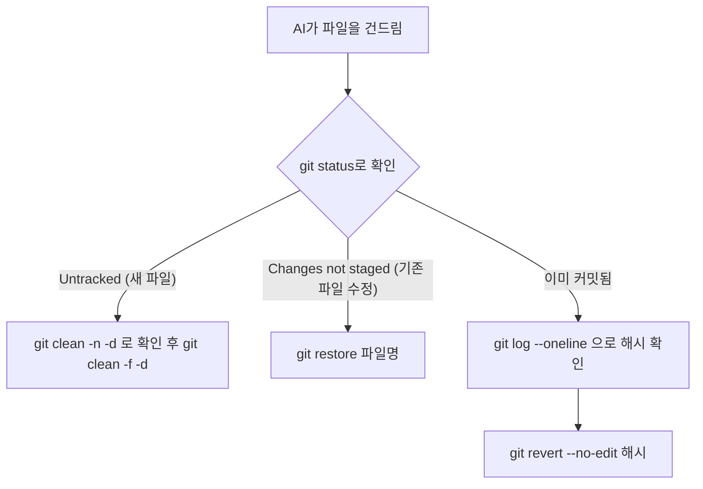

<style>
.page__content { font-size: 0.85em; }
</style>

> 이 글은 **자율 실습 · 12문제**(개인 실습) 중 **보너스(2문제)**를 기록한 devlog입니다.
> 여유가 있을 때 푸는 문제로, Lv.1~Lv.3에서 익힌 되돌리기와 `CLAUDE.md` 설계를 더 깊이 파본다.
> 문제마다 `문제 상황 → 시도한 방법 → 막혔던 점 → 해결 과정 → 배운 점` 순서로 정리했다.

> 문제 원문: [Claude Artifact — 되돌릴 수 있어야 시킨다](https://claude.ai/code/artifact/96689c97-96f9-42d5-be46-3666a79cac73)

---

## 시작 전 공통 규칙

⚠️ AI가 내 진짜 블로그 파일을 직접 고친다. 커밋해 둔 지점이 없으면 돌아갈 곳이 없다.

- 시키기 전에 커밋한다. 시작할 때마다 `git status`로 clean인지 확인한다.
- 모드를 확인한다. 입력창 아래 `⏸ manual mode on`이 보이는지 본다. `⏵⏵`로 시작하면 안 묻고 고치는 모드라서 Shift+Tab(안 되면 Alt+M)으로 바꾼다.

💡 되돌리기는 "git이 그 파일을 아는가"로 세 갈래로 갈린다.

- **원래 있던 파일이 고쳐졌다 (커밋 전)** → `git restore <파일>` (여러 개면 `git restore .`)
- **없던 파일이 새로 생겼다** → `restore`로는 안 된다. `git clean -n -d`로 목록만 먼저 보고, `git clean -f -d <이름>`으로 이름을 적어서 지운다.
- **이미 커밋됐다** → `git log --oneline`으로 맨 위 커밋(방금 만든 것)의 앞 7글자를 확인하고 `git revert --no-edit <7글자>`.

🚨 `git clean`으로 지운 것은 되살릴 수 없다. `-n`은 보기만, `-f`는 진짜 지움, `-d`를 붙여야 폴더까지 지운다. 반드시 이름을 적어서 지운다.

| 상황 | git이 이 파일을 아는가 | 쓸 명령 |
|---|---|---|
| 원래 있던 파일이 고쳐짐 (커밋 전) | 안다(추적 중) | `git restore <파일>` |
| 없던 파일이 새로 생김 | 모른다(Untracked) | `git clean -f -d <이름>` |
| 이미 커밋됨 | 안다 + 기록도 있음 | `git revert --no-edit <해시>` |



⚠️ `revert`에서 글자로 가득 찬 낯선 화면이 뜨면 `--no-edit`을 빠뜨린 것이다 — Esc → `:q!` → Enter (`q`로는 안 나가진다). 뭔가를 고르라는 화면이 뜨면 충돌이 난 것이므로 `git revert --abort`로 통째로 취소한다.

---

## 보너스 (2문제)

### 1. 실험용 커밋 3개 만들고 하나씩 되돌리기

⛔⛔ 메모한 3개만 되돌린다. 그 아래 커밋(진짜 블로그 글)은 절대 건드리지 않는다.

#### 문제 상황
서로 다른 지시를 세 번 내려 실험용 커밋 3개를 만든다(글 하나 추가 → 다른 글 제목 수정 → 또 다른 글에 한 줄 추가, 매번 커밋까지 시킴). `git log --oneline`으로 앞 7글자를 메모하고, 하나만 먼저 되돌린 뒤 나머지 두 개를 한 번에 하나씩 되돌려 최종적으로 원래 상태로 복구한다.

#### 시도한 방법
```
(실험 지시 1 → 커밋)
(실험 지시 2 → 커밋)
(실험 지시 3 → 커밋)
git log --oneline   # 맨 위 3줄 = 실험 커밋, 앞 7글자 메모

git revert --no-edit <실험3 7글자>
git log --oneline

git revert --no-edit <실험2 7글자>
git revert --no-edit <실험1 7글자>
git log --oneline
```

⚠️ 되돌리다 화면이 이상해지고 뭔가를 고르라고 하면 충돌이다 — `git revert --abort`로 통째로 취소한다.

#### 막혔던 점
🔴 실험 커밋 3개 중 어느 것부터 되돌려야 할지, 그리고 그 아래(진짜 블로그 글) 커밋까지 건드리게 되는 건 아닌지 헷갈렸다.

#### 해결 과정
🟢 `git log --oneline`으로 맨 위 3줄만 실험 커밋임을 다시 확인하고 앞 7글자를 따로 메모해 둔 뒤, 하나씩 순서대로 `revert`했다.

#### 배운 점
💡 되돌리기도 커밋을 만든다 — 그래서 이력은 줄지 않고 늘어난다.


되돌리기 전(커밋 3개 쌓임)과 되돌린 후(revert 커밋 3개가 더 쌓여 총 6개) 모두 이력에 그대로 남는다는 게 이 다이어그램의 핵심이다.

| 단계 | `git log --oneline` (위에서부터) |
|---|---|
| 실험 3개 커밋 직후 | 실험3 커밋 → 실험2 커밋 → 실험1 커밋 → (원래 블로그 글 커밋들…) |
| 실험3만 되돌린 뒤 | Revert "실험3 커밋" → 실험3 커밋 → 실험2 커밋 → 실험1 커밋 → … |
| 실험2·실험1까지 되돌린 뒤 | Revert "실험1 커밋" → Revert "실험2 커밋" → Revert "실험3 커밋" → 실험3 커밋 → 실험2 커밋 → 실험1 커밋 → … |

최종 상태: 파일 내용은 실험 전과 똑같이 돌아왔지만, `git log --oneline`에는 실험 커밋 3개 + revert 커밋 3개, 총 6개가 그대로 남아 있었다. 원래 블로그 글 커밋은 한 줄도 안 건드렸다.

> ⚠️ 위 표는 실제 해시 대신 커밋 메시지로 순서만 정리한 초안이다. 실제로 실습할 때 나온 짧은 해시(7글자)와 정확한 메시지로 바꿔 써야 한다.

#### 확인 체크리스트
- [ ] 각 단계의 `git log --oneline` 결과가 적혀 있다
- [ ] 하나 되돌린 기록과 나머지 두 개를 되돌린 기록이 각각 있다
- [ ] ⛔ 되돌린 커밋이 전부 내가 만든 실험 커밋이다
- [ ] 최종 상태가 실험 전과 같다
- [ ] ⭐ "어디까지 되돌릴 수 있나"를 한 줄로 적었다

---

### 2. CLAUDE.md를 늘렸다가 최소선까지 줄이기

#### 문제 상황
`CLAUDE.md`를 일부러 40줄 넘게 늘린 뒤, 결과가 유지되는 최소선까지 줄인다. 글을 하나 쓰게 해 결과를 기록(기준선)하고, 한 번에 두세 줄씩 지우면서 매번 `/clear` 후 다시 써보게 해서 결과가 나빠지는 순간을 찾는다. 그 직전까지 줄인 것을 최종본으로 삼는다.

⚠️ 시작 전에 원본을 어딘가에 복사해 둔다.

#### 시도한 방법
```
늘렸을 때: 46줄 -> 결과 기준선 기록
줄이는 중:  32줄 -> ☑ 유지  ☐ 나빠짐
            21줄 -> ☑ 유지  ☐ 나빠짐
            14줄 -> ☐ 유지  ☑ 나빠짐
나빠진 지점: Front Matter 작성 예시 코드 블록을 지웠을 때 (제목에 콜론이 있어도 따옴표로 안 감싼 글이 나왔다)
최종:      18줄 (나빠지기 직전 — 예시 코드 블록만 되살린 지점)

AI가 이미 알아서 안 적어도 됐던 것:
"글은 한글로 쓴다" — 지금까지 쓴 글이 전부 한글이라 굳이 규칙으로 안 넣어도 AI가 스스로 한글로 썼다.
```

> ⚠️ 위 줄 수·나빠진 지점은 실제로 CLAUDE.md를 늘렸다 줄여보기 전에 미리 짐작해서 채운 초안이다. 실제로 두세 줄씩 지워가며 `/clear` 후 다시 써본 결과로 바꿔 써야 한다.

#### 막혔던 점
🔴 어디부터 지워야 할지 감이 안 왔다. 지웠다가 결과가 나빠지면 무엇 때문인지 바로 구분이 안 될 수도 있었다.

#### 해결 과정
🟢 한 번에 두세 줄씩만 지우고 매번 `/clear` 후 다시 써보는 식으로, 나빠지는 지점을 좁혀갔다.

#### 배운 점
💡 `CLAUDE.md`는 매번 읽힌다 — 길수록 매번 읽는 양이 늘고, 정작 중요한 것이 묻힌다.

46줄에서 시작해 두세 줄씩 지워가며 32줄·21줄까지는 결과가 그대로였지만, Front Matter 작성 예시 코드 블록을 지운 14줄 지점에서 처음으로 결과가 나빠졌다. 예시 코드 블록만 되살린 18줄을 최종본으로 남겼다.

#### 확인 체크리스트
- [ ] 늘렸을 때와 줄였을 때의 줄 수가 적혀 있다
- [ ] ⭐ 결과가 나빠진 지점이 적혀 있다
- [ ] 최종본이 기준선과 같은 양식이다
- [ ] ⭐ "AI가 이미 아는 것"의 예를 하나 이상 찾았다

---

## 보너스 두 문제를 풀어보고 나서

열두 문제를 통틀어 가장 인상 깊었던 건, 되돌리기 세 갈래(`restore`/`clean`/`revert`) 중 실제로 가장 자주 손이 간 게 `revert`였다는 점이다. AI에게 커밋까지 맡기다 보니 문제를 발견한 시점엔 이미 커밋이 끝나 있는 경우가 많았기 때문이다. `CLAUDE.md` 다이어트에서는, 줄여도 결과가 똑같이 나오는 구간이 생각보다 넓다는 걸 직접 줄여보고 나서야 체감했다.

## 더 학습하면 좋은 개념

- **Git reflog** — `revert`로도 복잡해지는 다중 커밋 되돌리기(1번 문제) 상황에서, HEAD가 가리켰던 지점의 기록을 남겨두는 최후의 수단으로 알아두면 좋다.
- **Claude 공식 프롬프트 엔지니어링 가이드** — 2번 문제(`CLAUDE.md` 다이어트)에서 "AI가 이미 아는 것"을 골라내는 감각은, 지시문을 얼마나 명확하고 간결하게 쓰는지에 대한 공식 가이드와 이어진다.

## 참고 자료
- [Git 공식 문서 - git revert](https://git-scm.com/docs/git-revert)
- [Git 공식 문서 - git reflog](https://git-scm.com/docs/git-reflog)
- [Git 공식 문서 - git log](https://git-scm.com/docs/git-log)
- [Claude 공식 문서 - Prompt engineering overview](https://docs.claude.com/en/docs/build-with-claude/prompt-engineering/overview)
