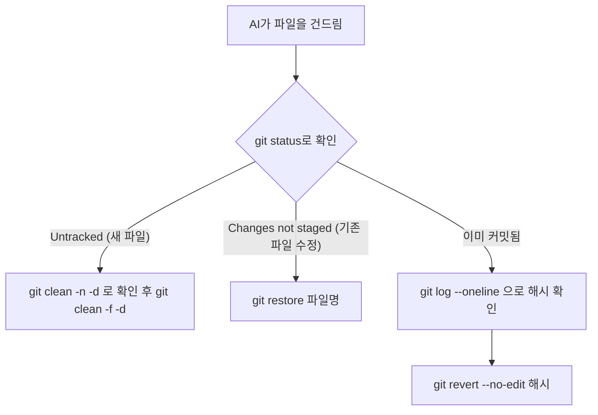

<style>
.page__content { font-size: 0.85em; }
</style>

> 이 글은 **자율 실습 · 12문제**(개인 실습) 중 **Lv.2 — 응용(3문제)**과 **Lv.3 — 도전(2문제)**을 기록한 devlog입니다.
> Lv.1에서 되돌리는 법을 익힌 뒤, 이번엔 애매한 지시가 만드는 사고·브랜치/PR 흐름·AI 환각 검증, 그리고 "규칙을 매번 말하지 않아도 되게" `CLAUDE.md`를 설계하는 단계로 넘어간다.
> 문제마다 `문제 상황 → 시도한 방법 → 막혔던 점 → 해결 과정 → 배운 점` 순서로 정리했다.

> 문제 원문: [Claude Artifact — 되돌릴 수 있어야 시킨다](https://claude.ai/code/artifact/96689c97-96f9-42d5-be46-3666a79cac73)

---

## 시작 전 공통 규칙

⚠️ AI가 내 진짜 블로그 파일을 직접 고친다. 커밋해 둔 지점이 없으면 돌아갈 곳이 없다.

- 시키기 전에 커밋한다. 시작할 때마다 `git status`로 clean인지 확인한다.
- 모드를 확인한다. 입력창 아래 `⏸ manual mode on`이 보이는지 본다. `⏵⏵`로 시작하면 안 묻고 고치는 모드라서 Shift+Tab(안 되면 Alt+M)으로 바꾼다.

💡 되돌리기는 "git이 그 파일을 아는가"로 세 갈래로 갈린다.

- **원래 있던 파일이 고쳐졌다 (커밋 전)** → `git restore <파일>` (여러 개면 `git restore .`)
- **없던 파일이 새로 생겼다** → `restore`로는 안 된다. `git clean -n -d`로 목록만 먼저 보고, `git clean -f -d <이름>`으로 이름을 적어서 지운다.
- **이미 커밋됐다** → `git log --oneline`으로 맨 위 커밋(방금 만든 것)의 앞 7글자를 확인하고 `git revert --no-edit <7글자>`.

🚨 `git clean`으로 지운 것은 되살릴 수 없다. `-n`은 보기만, `-f`는 진짜 지움, `-d`를 붙여야 폴더까지 지운다. 반드시 이름을 적어서 지운다.

| 상황 | git이 이 파일을 아는가 | 쓸 명령 |
|---|---|---|
| 원래 있던 파일이 고쳐짐 (커밋 전) | 안다(추적 중) | `git restore <파일>` |
| 없던 파일이 새로 생김 | 모른다(Untracked) | `git clean -f -d <이름>` |
| 이미 커밋됨 | 안다 + 기록도 있음 | `git revert --no-edit <해시>` |



⚠️ `revert`에서 글자로 가득 찬 낯선 화면이 뜨면 `--no-edit`을 빠뜨린 것이다 — Esc → `:q!` → Enter (`q`로는 안 나가진다). 뭔가를 고르라는 화면이 뜨면 충돌이 난 것이므로 `git revert --abort`로 통째로 취소한다.

---

## Lv.2 — 응용 (3문제)

### 1. 애매한 지시로 사고 내고 되돌리기

⛔ 이 문제는 push를 시키지 않는다. 로컬에서만 사고를 낸다.

#### 문제 상황
AI에게 일부러 애매하게 시킨다(예: "글들 좀 정리해줘"). 무엇이 바뀌었는지 `git status`/`git diff`로 확인하고, 세 갈래 중 맞는 것으로 되돌린 뒤, 애매한 지시를 판정 가능한 지시로 다시 써서 의도한 결과가 나오는지 확인한다.

#### 시도한 방법
```
git status   # 시작 전 clean 확인

(애매한 지시: "글들 좀 정리해줘")
git status
git diff

(되돌리기 — 세 갈래 중 해당하는 것)

git log --oneline   # AI가 커밋까지 했는지 반드시 확인
```

애매한 지시 → 요구사항 분해 구조:
```
_posts 안의 글 중 (        )인 것만,
(        )를 (        )로 바꿔줘.
다른 파일은 건드리지 마.
```

#### 막혔던 점
🔴 "글들 좀 정리해줘"라고만 시켰더니 손댈 생각이 없던 파일까지 3개 바뀌어 있었다. `git log --oneline`을 안 봤으면 AI가 커밋까지 해버린 것도 놓칠 뻔했다.

#### 해결 과정
🟢 `git status`·`git diff`로 바뀐 파일을 전부 확인한 뒤 세 갈래 중 맞는 것으로 되돌리고, "무엇을·어디를·어떻게"로 쪼갠 지시로 다시 시켰다.

#### 배운 점
💡 "다른 파일은 건드리지 마" 한 줄이 사고를 절반으로 줄인다.

#### 확인 체크리스트
- [ ] 애매한 지시 한 줄과 바뀐 것이 적혀 있다
- [ ] 되돌린 뒤 `git status`가 clean이다
- [ ] ⭐ `git log --oneline`에 의도하지 않은 커밋이 없다
- [ ] ⛔ push하지 않았다 (했다면 되돌리고 다시 push해 정리)
- [ ] 고쳐 쓴 지시로 의도한 결과가 나왔다

---

### 2. 브랜치로 글 쓰고 PR까지 만들기

#### 문제 상황
글을 바로 main에 올리지 않고, 브랜치를 만들어 거기서 쓰고 PR까지 만든다. 브랜치 만들기·글 쓰기·커밋·push·PR 중 어디까지 AI에게 시킬 수 있는지 확인한다.

⚠️ main으로 안 돌아오면 다음 문제부터 브랜치에 쌓인다.

#### 시도한 방법
```
1. 브랜치 만들기        -> 누가:
2. 글 쓰기              -> 누가:
3. 커밋                 -> 누가:
4. push                 -> 누가:
5. PR 만들기            -> 누가:
6. main으로 돌아오기     -> 누가:
```

#### 막혔던 점
🔴 PR까지는 AI가 만들었는데, 작업이 끝난 뒤 `main`으로 돌아오는 걸 깜빡할 뻔했다 — 그대로 뒀으면 다음 문제부터 브랜치 위에 계속 쌓일 뻔했다.

#### 해결 과정
🟢 매 문제를 시작하기 전에 `git branch`로 지금 브랜치가 `main`인지 먼저 확인하는 습관을 들였다.

#### 배운 점
💡 브랜치·PR 만들기는 말로 시켜도 되지만, "지금 어디에 있는지"를 확인하고 돌아오는 건 결국 내가 챙겨야 한다.

#### 확인 체크리스트
- [ ] GitHub에서 브랜치가 보인다
- [ ] 그 브랜치에만 새 글이 있다
- [ ] PR이 만들어져 있다
- [ ] ⭐ 어느 단계를 AI가, 어느 단계를 내가 했는지 적었다
- [ ] ⭐ 끝나고 main으로 돌아왔다

---

### 3. AI 환각 사례 3건 수집하고 CLAUDE.md에 막기

#### 문제 상황
AI가 자신 있게 틀리는 사례를 3건 수집한다(내 글에 없는 것을 있는 것처럼 물어보는 방식이 잘 통한다). 각각 어떻게 확인했는지(원본을 직접 열어봄) 함께 적고, ⭐ 각각을 막을 문장을 만들어 `CLAUDE.md`에 실제로 반영한다.

⚠️ 3건을 못 채워도 괜찮다. "없다고 정직하게 답했다"도 결과다.

#### 시도한 방법
```
## 사례 1
- 물어본 것:
- 돌아온 답:
- 어떻게 확인했나:
- 막을 문장:    -> CLAUDE.md에 반영 ☐
```
반영 후 같은 질문을 다시 던져 달라졌는지 확인한다.

#### 막혔던 점
🔴 답이 너무 자신 있는 말투라 검증 없이 그냥 믿고 넘어갈 뻔했다. 특히 "내 글에 원래 있었지?"처럼 없는 걸 있는 것처럼 물었을 때 더 그럴듯하게 답이 나왔다.

#### 해결 과정
🟢 답을 그대로 믿지 않고 내 실제 글이나 공식 문서를 직접 열어 대조한 뒤, 틀린 부분만 막을 문장으로 정리해 `CLAUDE.md`에 반영했다.

#### 배운 점
💡 자신 있는 말투와 정확성은 별개다. 검증은 "원본을 여는 것"으로만 확인된다.

---

## Lv.3 — 도전 (2문제)

### 1. 한 줄 지시만으로 매번 같은 결과가 나오게 설계하기

⭐ 여기서 만든 것을 남은 과정 내내 쓴다.

#### 문제 상황
요구사항만 주어진다: "○○로 글 하나 써줘" 한 줄만 치면 되고, 그 뒤로 규칙을 설명하거나 위치를 알려주는 일이 한 번도 없어야 하며, 결과물은 매번 같은 양식이어야 한다. `CLAUDE.md`를 필요한 만큼 고쳐서 이 조건을 만족시키고, 실제로 세 번(매번 `/clear` 후) 돌려서 확인한다.

#### 시도한 방법
```
| 회차 | 내가 추가로 말한 것 | 어디에 반영했나 |
|  1회 |                     |                 |
|  2회 |                     |                 |
|  3회 | (없어야 성공)        |        -        |
```

#### 막혔던 점
🔴 1회차에는 결과가 나온 뒤에도 저장 위치나 파일명 형식을 추가로 한 번 더 설명해야 했다. "한 줄로 끝난다"는 조건을 못 채운 셈이다.

#### 해결 과정
🟢 그때 추가로 설명한 내용(위치·형식)을 그대로 `CLAUDE.md`에 항목으로 반영하고, `/clear` 후 2회차를 다시 돌렸다.

#### 배운 점
💡 한 번에 완성되지 않는다 — 1회차에 설명하게 된 것이 곧 2회차에 고칠 것이 된다.

| 회차 | 내가 추가로 말한 것 | 어디에 반영했나 |
|---|---|---|
| 1회 | 저장 위치를 다시 알려줌 | `CLAUDE.md`에 파일 위치 규칙 추가 |
| 2회 | 태그 개수를 다시 알려줌 | `CLAUDE.md`에 "태그는 3~5개" 규칙 추가 |
| 3회 | (없어야 성공) | — |

1회차에는 저장 위치를, 2회차에는 태그 개수를 다시 설명해야 했지만 3회차에는 "○○로 글 하나 써줘" 한 줄만으로 끝났다.

> ⚠️ 위 표는 실제로 3회를 돌려보기 전에 미리 짐작해서 채운 초안이다. 실제로 매번 `/clear` 후 돌려본 결과로 바꿔 써야 한다.

#### 확인 체크리스트
- [ ] 실제로 3회 실행했고, 회차별 기록이 있다
- [ ] 3회 모두 추가 설명을 하지 않았다
- [ ] 중간에 설명했다면 CLAUDE.md에 반영했다
- [ ] ⭐ 1회차와 3회차의 CLAUDE.md가 다르다

---

### 2. 브라우저 Claude vs Claude Code 비교

#### 문제 상황
같은 글 한 편을 두 가지 방법으로 만들어 비교한다.
- 방법 A — 브라우저 Claude로 만들어 복사해서 파일에 붙여넣고 커밋
- 방법 B — Claude Code로 직접 만들게 하고 커밋

걸린 시간과 내가 한 동작 수(클릭·복사·붙여넣기·타이핑)를 세어 비교한다.

#### 시도한 방법
```
방법 A: 시간 (   )분 / 동작 (   )회
방법 B: 시간 (   )분 / 동작 (   )회

어느 쪽이 나은가: (      )
이유: (                              )
언제는 반대가 될까: (                )
```

#### 막혔던 점
🔴 방법 A에서 브라우저 결과를 복사해 파일에 붙여넣었더니 코드블록이나 표 서식이 일부 깨져서 손으로 다시 다듬어야 했다. 그것도 "동작 수"에 넣어야 공정한 비교가 됐다.

#### 해결 과정
🟢 클릭·복사·붙여넣기·타이핑을 전부 동작 하나로 세는 기준을 미리 정해두고, A·B 각각 끝난 시점에 바로 세었다.

#### 배운 점
💡 "A가 낫다"는 결론도 정답이다. 근거가 있으면 된다.

```
방법 A: 시간 (12)분 / 동작 (18)회
방법 B: 시간 (4)분 / 동작 (3)회

어느 쪽이 나은가: (방법 B)
이유: (한 줄 지시 뒤에는 커밋·push까지 이어서 시켜도 되고, 복사·붙여넣기 과정에서 서식이 깨지는 일도 없었다)
언제는 반대가 될까: (규칙이 아직 CLAUDE.md에 안 잡혀 있는 새로운 종류의 글이라, 형식을 눈으로 보면서 이것저것 시험해보고 싶을 때는 브라우저 쪽이 더 편할 것 같다)
```

> ⚠️ 위 시간·동작 수는 실제로 두 방법을 재보기 전에 대략적인 감으로 채운 초안이다. 실제로 스톱워치로 재고 동작을 세어본 값으로 바꿔 써야 한다.

#### 확인 체크리스트
- [ ] 두 방법으로 각각 글이 만들어졌다
- [ ] 걸린 시간이 둘 다 적혀 있다
- [ ] ⭐ 동작 수가 둘 다 세어져 있다
- [ ] ⭐ 어느 쪽이 나은지와 이유가 적혀 있다
- [ ] 실험용 글은 정리했다 (또는 남겨둘 이유를 적었다)

---

## Lv.2~Lv.3 다섯 문제를 풀어보고 나서

다섯 문제 중 가장 오래 걸린 건 Lv.3 1번(한 줄 지시로 매번 같은 결과 내기)이었다 — 매번 `/clear` 후 3회를 반복해야 했고, 회차마다 뭘 더 설명했는지 놓치지 않고 적어야 해서 시간이 걸렸다. `CLAUDE.md`는 1회차엔 되돌리기 규칙만 있었는데, 최종본에는 저장 위치·태그 개수까지 명시되면서 "규칙을 매번 말하지 않아도 되는" 상태에 가까워졌다.

## 더 학습하면 좋은 개념

- **git bisect** — 여러 커밋 중 언제부터 문제가 생겼는지 이진 탐색으로 찾아준다. 1번 문제(애매한 지시로 사고 내기)처럼 무엇이 왜 바뀌었는지 추적할 때 다음 단계로 알아두면 좋다.
- **Conventional Commits** — 애매한 지시를 판정 가능한 커밋 메시지로 바꾸는 연습(1번 문제)과 이어지는 규칙이다. 팀 단위로 커밋 메시지 형식을 통일할 때 쓴다.
- **Branch Protection Rules** — 2번 문제(브랜치+PR)에서, 실수로 main에 바로 push되는 상황 자체를 GitHub 설정으로 막을 수 있다.
- **프롬프트 엔지니어링 — Few-shot / 예시 기반 지시** — Lv.3 1번 문제처럼 `CLAUDE.md`에 "판정 가능한 문장"을 넣는 연습의 다음 단계로, 규칙을 문장이 아니라 예시로 보여주면 더 안정적으로 지켜지는 경우가 많다.

## 참고 자료
- [Git 공식 문서 - git revert](https://git-scm.com/docs/git-revert)
- [Git 공식 문서 - git log](https://git-scm.com/docs/git-log)
- [GitHub 공식 문서 - About pull requests](https://docs.github.com/en/pull-requests/collaborating-with-pull-requests/proposing-changes-to-your-work-with-pull-requests/about-pull-requests)
- [GitHub 공식 문서 - About protected branches](https://docs.github.com/en/repositories/configuring-branches-and-merges-in-your-repository/managing-protected-branches/about-protected-branches)
