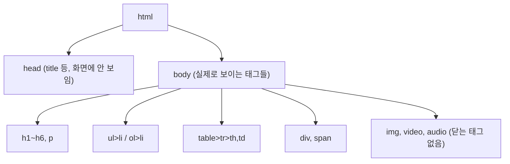

<style>
.page__content { font-size: 0.85em; }
</style>

> 이 글은 **"웹이 동작하는 법과 HTML 뼈대" 자율 실습 · 전체 26문제**(개인 실습) 중 **Lv.1 — 개념 하나만 쓰는 문제(10문제)**를 기록한 devlog입니다.
> "이렇게 나와야 합니다" 화면 하나를 보고, 그 화면을 만드는 태그를 하나씩 골라 맞춰보는 단계다. 문제마다 태그가 딱 하나(또는 짝 하나)만 새로 등장한다.
> 문제마다 `문제 상황 → 시도한 방법 → 막혔던 점 → 해결 과정 → 배운 점` 순서로 정리했다.

> 문제 원문: [Claude Artifact — 화면 보고 HTML 만들기](https://claude.ai/code/artifact/0e439cbf-68f6-4b70-959c-c857547be66c)


---

## Lv.1 — 개념 하나만 쓰는 문제 (10문제)

### 1-1. 제목 세 단계

#### 문제 상황
`titles.html`을 만들어 이름 · 소개 · "좋아하는 것" 세 줄이 위에서 아래로 점점 작아지고 셋 다 굵게 나오게 만든다. 브라우저 탭 이름도 "OOO의 첫 페이지"로 맞춰야 한다.

#### 시도한 방법
```html
<head>
  <meta charset="UTF-8">
  <title>김지수의 첫 페이지</title>
</head>
<body>
  <h1>김지수</h1>
  <h2>프론트엔드를 배우는 중</h2>
  <h3>좋아하는 것</h3>
</body>
```

#### 막혔던 점
🔴  세 줄 다 `h1`로 써버려서 크기가 똑같이 나왔다. "크기가 다르다"는 화면 설명을 글자 크기를 직접 지정해야 하는 문제로 오해했다.

#### 해결 과정
🟢 힌트대로 "크기가 다르다는 것은 태그가 다르다는 뜻"이라는 걸 다시 읽고, `h1`~`h3`로 숫자만 바꿔서 해결했다. 탭 이름은 화면에 안 보이니 `head` 안 `title`에 쓴다는 것도 여기서 다시 확인했다.

#### 배운 점
💡 제목 태그는 숫자가 클수록 작아진다 — 크기를 직접 지정하는 게 아니라 "몇 번째로 중요한 제목인가"를 숫자로 고르는 것이다. `title`은 화면(body)이 아니라 탭에 쓰이는 별개의 정보다.

---

### 1-2. 문단 세 개

#### 문제 상황
세 문장을 태그 없이 엔터로만 줄바꿈해서 먼저 보고, 그다음 각각 `p`로 감싸서 차이를 비교한다.

#### 시도한 방법
```html
<!-- 1단계: 태그 없이 -->
안녕하세요. 카페에서 일하다가 개발을 시작했습니다.
지금은 부트캠프에서 HTML을 배우고 있습니다.
언젠가 제 손으로 서비스를 만드는 것이 목표입니다.

<!-- 2단계: p로 감싸기 -->
<p>안녕하세요. 카페에서 일하다가 개발을 시작했습니다.</p>
<p>지금은 부트캠프에서 HTML을 배우고 있습니다.</p>
<p>언젠가 제 손으로 서비스를 만드는 것이 목표입니다.</p>
```

#### 막혔던 점
🔴 1단계 화면에서 세 문장이 한 줄로 붙어 나오는 걸 보고 처음엔 "코드가 잘못됐나"부터 의심했다.

#### 해결 과정
🟢 "HTML은 연속된 공백과 줄바꿈을 한 칸으로 합친다"는 힌트를 읽고 나서야 정상 동작이라는 걸 알았다. `p`로 감싸니 문장 사이에 빈 줄만큼 간격이 생기는 걸 보고 메모에 "엔터를 쳐도 화면에서는 줄이 안 바뀐다"고 적었다.

#### 배운 점
💡 줄바꿈은 소스 코드의 엔터가 아니라 태그가 결정한다. 이 감각이 없으면 나중에 들여쓰기·공백을 아무리 맞춰도 화면이 안 바뀌는 이유를 못 찾는다.

---

### 1-3. 점이 붙는 목록

#### 문제 상황
`list.html`에 점(•)이 붙은 항목 5개를 만든다.

#### 시도한 방법
```html
<ul>
  <li>커피 내리기</li>
  <li>영화 보기</li>
  <li>주말 산책</li>
  <li>사진 찍기</li>
  <li>보드게임</li>
</ul>
```

#### 막혔던 점
🔴 `li`를 `ul` 바깥에 그냥 나열했더니 점은 안 붙고 글자만 세로로 나왔다.

#### 해결 과정
🟢 목록은 "전체를 감싸는 태그"와 "항목 하나를 감싸는 태그"가 짝으로 필요하다는 걸 다시 확인하고, `li`를 `ul` 안으로 옮겨 넣었다.

#### 배운 점
💡 목록은 항상 바깥(`ul`)과 안쪽(`li`) 두 겹 구조다. `li`만 따로 두면 목록으로 인식되지 않는다.

---

### 1-4. 숫자가 붙는 목록

#### 문제 상황
`steps.html`에 번호가 자동으로 붙는 항목 4개를 만든다. 숫자를 직접 타이핑하면 안 된다.

#### 시도한 방법
```html
<ol>
  <li>HTML</li>
  <li>CSS</li>
  <li>JavaScript</li>
  <li>그다음은 아직 모릅니다</li>
</ol>
```

#### 막혔던 점
🔴 별생각 없이 문장 앞에 "1. "을 직접 써서 이중으로 번호가 붙었다.

#### 해결 과정
🟢 1-3에서 쓴 구조와 완전히 같고 바깥 태그 이름만 `ol`로 바뀐다는 힌트를 보고, 직접 친 숫자를 지우고 브라우저가 번호를 붙이게 뒀다. 항목을 하나 지웠다 되살려서 번호가 저절로 다시 매겨지는 것도 확인했다.

#### 배운 점
💡 순서 있는 목록의 번호는 항목 개수에 따라 브라우저가 계산한다 — 항목이 늘거나 줄어도 직접 손댈 필요가 없다는 게 `ol`을 쓰는 이유다.

---

### 1-5. 링크 세 개

#### 문제 상황
`links.html`에 누르면 실제로 이동하는 링크 3개를 한 줄에 나란히 만든다.

#### 시도한 방법
```html
<a href="https://www.google.com">구글 검색</a>
<a href="https://github.com">깃허브</a>
<a href="https://my-blog-example.github.io">내 블로그</a>
```

#### 막혔던 점
🔴 `href` 값에 따옴표를 빼먹고 저장했더니 에러 없이 그냥 글자만 파랗게 안 나오고 밑줄도 없는 채로 나와서 뭐가 문제인지 한참 못 찾았다.

#### 해결 과정
🟢 코드를 한 글자씩 읽으며 속성 표기 `이름="값"` 규칙을 다시 확인하고 따옴표를 채워 넣었다. 세 개가 한 줄에 붙어 나오는 것도 정상이라는 걸 확인 방법에서 재차 확인했다.

#### 배운 점
💡 속성은 태그 이름만으로 부족한 정보(어디로 갈지)를 채워주는 자리이고, 값은 반드시 따옴표로 감싼다. HTML은 이걸 빼먹어도 에러 없이 조용히 다르게 동작하므로 눈으로 확인하는 습관이 필요하다.

---

### 1-6. 사진과 대체 텍스트

#### 문제 상황
`images` 폴더에 사진을 넣고 `photo.html`에 표시한 뒤, `src`를 일부러 틀리게 바꿔 깨진 화면을 확인하고 되돌린다.

#### 시도한 방법
```html

```

#### 막혔던 점
🔴 사진을 폴더에 넣긴 했는데 파일 이름이 `내사진.jpg`처럼 한글이라, `src`를 영어로 바꿔 적었더니 안 보였다.

#### 해결 과정
🟢 힌트의 확인 순서(① 폴더 이름 ② 파일 이름 철자 ③ 대소문자 ④ 확장자)대로 하나씩 짚어보다가 실제 파일명과 `src` 값이 다르다는 걸 찾았다. 파일 이름 자체를 영어로 바꾸고 `src`도 맞춰 고쳤다.

#### 배운 점
💡 `src`가 틀려도 브라우저는 에러를 띄우지 않고 `alt` 글자만 대신 보여준다 — 그래서 `alt`는 아무 말이나 적으면 안 되고, 사진을 못 보는 사람도 무슨 사진인지 알 수 있게 적어야 한다.

---

### 1-7. 글자를 꾸미는 태그

#### 문제 상황
문단 안에서 취소선 · 굵게 · 형광펜 · 기울임 · 윗첨자 · 줄바꿈 · 가로줄을 각각 필요한 자리에만 적용한다.

#### 시도한 방법
```html
<p>
  정가 <del>129,000원</del> → <strong>89,000원</strong><br>
  <mark>이번 주까지만</mark> 이 가격입니다.
</p>

<hr>

<h3>소재</h3>
<p>겉감 <em>폴리에스터</em> 100%, 충전재 거위털 80%</p>
<p>보관 시 1m<sup>2</sup> 이상 공간을 두세요.</p>
```

#### 막혔던 점
🔴  "정가…"와 "이번 주까지만…"을 각각 `p`로 나눠 썼더니 문단 두 개가 만들어져서, 화면의 좁은 줄 간격과 다르게 간격이 넓게 벌어졌다.

#### 해결 과정
🟢 확인 방법에 적힌 "간격이 좁으면 한 문단 안에서 줄만 바꾼 것"이라는 기준을 보고, 두 문장을 한 `p` 안에 넣고 그 사이에만 `br`을 넣어 줄만 바꿨다.

#### 배운 점
💡 문단을 새로 여는 것과 문단 안에서 줄만 바꾸는 것은 화면 간격이 다르게 나온다 — `br`과 `hr`은 감쌀 내용이 없어서 닫는 태그가 없는 부류(이미지와 같은 부류)라는 것도 함께 기억해뒀다.

---

### 1-8. 표의 뼈대

#### 문제 상황
`price.html`에 표 제목, 굵고 가운데 정렬된 머리 줄, 자료 세 줄로 된 배송비 표를 만든다.

#### 시도한 방법
```html
<table border="1">
  <caption>주문 금액별 배송비</caption>
  <tr>
    <th>주문 금액</th>
    <th>기본 배송비</th>
    <th>도서산간 추가</th>
  </tr>
  <tr>
    <td>3만원 미만</td>
    <td>3,000원</td>
    <td>3,000원</td>
  </tr>
  <tr>
    <td>3만원 이상</td>
    <td>무료</td>
    <td>3,000원</td>
  </tr>
  <tr>
    <td>10만원 이상</td>
    <td>무료</td>
    <td>무료</td>
  </tr>
</table>
```

#### 막혔던 점
🔴  머리 줄도 `td`로 써버려서 굵게도 가운데 정렬도 안 됐고, 왜 안 되는지 CSS를 찾아 헤맬 뻔했다.

#### 해결 과정
🟢 확인 방법의 "굵게·가운데를 지정한 곳이 어디에도 없는데 그렇게 나오면 머리 칸 태그를 제대로 쓴 것"이라는 문장을 보고, 굵게/정렬은 직접 지정하는 게 아니라 `th` 태그 자체의 기본 동작이라는 걸 알고 머리 줄만 `th`로 바꿨다.

#### 배운 점
💡 표는 표 전체(`table`) → 가로 한 줄(`tr`) → 칸(`td`/`th`) 세 겹 구조이고, 머리 칸은 `td` 대신 `th`를 쓰는 것만으로 굵게·가운데 정렬이 자동으로 따라온다. `caption`은 `table`을 연 바로 다음 줄에 쓴다.

---

### 1-9. div와 span의 차이

#### 문제 상황
같은 세 낱말을 `div`로 묶으면 세 줄, `span`으로 묶으면 한 줄로 나오게 만든다.

#### 시도한 방법
```html
<h2>div로 묶으면</h2>
<div>커피 내리기</div>
<div>영화 보기</div>
<div>주말 산책</div>

<h2>span으로 묶으면</h2>
<p>
  <span>커피 내리기</span>
  <span>영화 보기</span>
  <span>주말 산책</span>
</p>
```

#### 막혔던 점
🔴  처음에 `div` 대신 `p`로 세 낱말을 묶었더니 줄은 나뉘었지만 문단 간격까지 생겨서, 확인 방법에 적힌 "줄 사이에 빈 줄 간격이 없어야 한다"는 조건과 달라졌다.

#### 해결 과정
🟢 `p`를 `div`로 바꾸니 줄은 그대로 나뉘면서 간격만 사라졌다. 문단은 줄 분리 + 여백을 같이 만들지만 `div`는 줄 분리만 한다는 차이를 화면으로 직접 비교했다.

#### 배운 점
💡 `div`는 줄 전체를 차지하고, `span`은 글자 길이만큼만 차지한다 — 둘 다 글자 생김새는 하나도 바꾸지 않는, 순수하게 "묶기"만 하는 태그다.

---

### 1-10. 동영상과 소리 넣기

#### 문제 상황
`media` 폴더에 동영상 · 소리 파일을 넣고 재생 막대가 보이게 `media.html`에 얹는다.

#### 시도한 방법
```html
<video src="media/product-demo.mp4" controls></video>
<audio src="media/guide.mp3" controls></audio>
```

#### 막혔던 점
🔴  `controls`를 안 써서 파일은 제대로 걸렸는데 재생 막대 자체가 안 보였다. 처음엔 파일 경로가 틀린 줄 알고 경로만 계속 고쳤다.

#### 해결 과정
🟢 확인 방법의 "재생 막대가 아예 안 보인다면 막대를 켜는 속성을 빠뜨린 것"이라는 문장을 보고 나서야 경로가 아니라 속성 문제라는 걸 알았다. `controls`는 값 없이 이름만 쓴다는 점도 여기서 확인했다.

#### 배운 점
💡 `video`/`audio`는 이미지와 달리 `src`만으로는 재생 막대가 안 나온다 — `controls`처럼 값이 없는 속성(이름만 쓰는 속성)이 있다는 걸 처음 알았다.

---

## Lv.1 열 문제를 풀어보고 나서

열 문제를 통틀어 가장 오래 걸린 건 1-7(글자 꾸미기)이었다. 태그 종류가 한 번에 여섯 개(`strong`/`b`, `em`/`i`, `mark`, `del`, `sup`, `br`, `hr`)나 나왔고, 그중 두 개는 닫는 태그가 없다는 걸 헷갈려서 처음엔 `<br></br>`처럼 잘못 닫았다. 반대로 가장 빨리 끝난 건 1-4(숫자 목록)였는데, 1-3에서 쓴 구조를 태그 이름만 바꿔 그대로 재사용할 수 있었기 때문이다.

| 문제 | 태그 | 닫는 태그 필요 여부 | 핵심 |
|---|---|---|---|
| 1-1 | `h1`~`h6` | 필요 | 숫자가 클수록 작아짐(크기 아닌 중요도) |
| 1-2 | `p` | 필요 | 엔터·공백은 무시, 태그가 줄바꿈을 결정 |
| 1-3 | `ul`, `li` | 필요 | 바깥(`ul`)+안쪽(`li`) 두 겹 구조 |
| 1-4 | `ol`, `li` | 필요 | 번호는 직접 안 씀, 브라우저가 계산 |
| 1-5 | `a` | 필요 | `href` 값은 반드시 따옴표로 감싸기 |
| 1-6 | `img` | **불필요** | `alt`는 사진이 안 보일 때만 쓰는 게 아니라 접근성 정보 |
| 1-7 | `strong`/`em`/`mark`/`del`/`sup` | 필요 | `br`/`hr`은 예외 |
| 1-7 | `br`, `hr` | **불필요** | 감쌀 내용이 없는 태그 |
| 1-8 | `table`/`tr`/`th`/`td` | 필요 | `th`는 굵게·가운데 정렬이 기본 |
| 1-9 | `div`, `span` | 필요 | `div`는 줄 전체, `span`은 글자만큼만 |
| 1-10 | `video`, `audio` | 필요 | `controls`처럼 값 없는 속성도 있음 |



## 더 학습하면 좋은 개념

- **HTML 시맨틱 태그 (Semantic HTML)** — 지금은 `div`/`span`으로만 영역을 묶었지만, `header`/`nav`/`main`/`article`처럼 의미를 가진 태그로 바꾸면 검색 엔진과 스크린 리더가 페이지 구조를 더 잘 이해한다.
- **HTML 유효성 검사기 (HTML Validator)** — 1-7·1-8처럼 태그를 잘못 써도 브라우저는 에러를 안 띄운다는 걸 직접 겪었다. W3C Validator 같은 도구로 코드를 검사하는 습관을 들이면 눈으로 놓친 실수를 기계가 잡아준다.
- **대체 텍스트와 웹 접근성 (Alt Text & Accessibility)** — 1-6에서 `alt`를 처음 써봤는데, 이건 "사진이 안 보일 때만" 쓰는 게 아니라 스크린 리더 사용자를 위한 필수 정보라는 걸 더 깊이 배울 필요가 있다.
- **CSS 박스 모델 (Box Model)** — 1-9에서 `div`가 줄을 통째로 차지하는 이유는 사실 CSS의 기본 `display` 값(`block`) 때문이다. CSS 차시에서 이 값을 직접 바꿔보면 지금의 "왜 이렇게 나오지?"가 풀린다.

## 참고 자료
- [MDN - HTML: HyperText Markup Language](https://developer.mozilla.org/ko/docs/Web/HTML)
- [MDN - HTML 텍스트 기초](https://developer.mozilla.org/ko/docs/Learn/HTML/Introduction_to_HTML/HTML_text_fundamentals)
- [MDN - img: 이미지 삽입 요소](https://developer.mozilla.org/ko/docs/Web/HTML/Element/img)
- [MDN - table: 표 요소](https://developer.mozilla.org/ko/docs/Web/HTML/Element/table)
