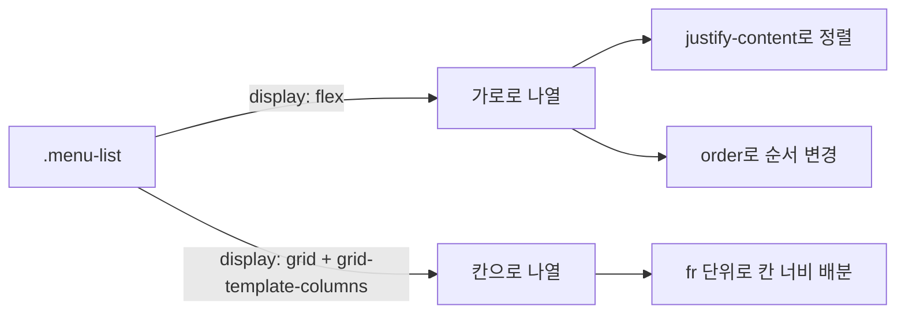

<style>
.page__content { font-size: 0.85em; }
</style>

> 이 글은 **"CSS 레이아웃 · 카드로 배치 익히기" 자율 실습 · 전체 14문제**(개인 실습) 중 **Lv.1 — 기본 변형(6문제)**을 기록한 devlog입니다.
> 카페 메뉴 카드 세 장(`menu-card`)이 가로로 놓인 시작 코드에서, 카드마다 이미 있는 속성값만 바꿔보며 박스 모델과 Flexbox 감각을 익히는 단계다.
> 문제마다 `문제 상황 → 시도한 방법 → 막혔던 점 → 해결 과정 → 배운 점` 순서로 정리했다.

---

## Lv.1 — 기본 변형 (6문제)

### 1-1. 카드 분위기 바꾸기

#### 문제 상황
`.menu-card`의 `padding`·`border`·`border-radius` 숫자와 색만 바꿔서 "빽빽한 메뉴판" · "여유로운 카페" · "또렷한 테두리" 세 가지 분위기를 각각 만들어보고, 마음에 드는 하나를 남긴다.

#### 시도한 방법
```css
/* ① 빽빽한 메뉴판 */
.menu-card {
  padding: 6px;
  border-radius: 0;
}

/* ② 여유로운 카페 */
.menu-card {
  padding: 32px;
  border-radius: 20px;
}

/* ③ 또렷한 테두리 */
.menu-card {
  border: 3px solid #333333;
}
```

#### 막혔던 점
🔴 (...)

#### 해결 과정
🟢 세 가지를 순서대로 저장 → 새로고침하며 비교했고, 최종적으로 "여유로운 카페" 쪽을 남겼다.
```css
.menu-card {
  background-color: #ffffff;
  border: 1px solid #dddddd;
  border-radius: 20px;
  padding: 32px;
}
```

#### 배운 점
💡 `padding`을 키우면 글자만 안쪽으로 밀리는 게 아니라 카드 전체 높이가 같이 커진다. 개발자 도구 박스 모델 그림에서 padding 칸 숫자가 CSS에 준 값과 정확히 일치하는 것도 확인했다.

---

### 1-2. 다섯 가지 정렬 직접 비교하기

#### 문제 상황
`.menu-list`에 `justify-content`를 추가하고 `flex-start · center · flex-end · space-between · space-around` 다섯 값을 하나씩 넣어 화면 차이를 비교하고 메모를 남긴다.

#### 시도한 방법
```css
.menu-list {
  display: flex;
  gap: 20px;
  justify-content: space-between; /* 값을 하나씩 바꿔가며 테스트 */
}
```

메모(`memo.md`):
```
flex-start     : 카드 세 장이 왼쪽에 붙어서 시작, 오른쪽에 빈 공간이 몰림
center         : 카드 세 장이 가운데로 모이고 양옆에 빈 공간이 똑같이 남음
flex-end       : 카드 세 장이 오른쪽에 붙음
space-between  : 첫 카드는 왼쪽 끝, 마지막 카드는 오른쪽 끝, 사이 간격만 벌어짐
space-around   : 카드마다 양옆에 똑같은 여백이 생겨서 카드 사이 간격이 양 끝 간격의 두 배로 보임
```

#### 막혔던 점
🔴 (...)

#### 해결 과정
🟢 값을 바꿀 때마다 `gap: 20px;`을 지우지 않고 그대로 둔 채 `justify-content`만 바꿔서, 간격(gap)과 정렬(justify-content)이 서로 다른 역할이라는 걸 눈으로 구분했다.

#### 배운 점
💡 `justify-content`는 Flex가 카드를 늘어놓는 방향(가로)으로 "남는 공간을 어떻게 나눠 가질지"를 정한다. `space-between`과 `space-around`의 차이는 양 끝을 벽에 붙이느냐, 카드마다 똑같은 여백을 주느냐의 차이다.

---

### 1-3. "품절" 배지 붙이기

#### 문제 상황
첫 번째 카드에만 `<span>`으로 "품절" 배지를 붙인다. 글자 길이만큼만 차지해야 하고, 위아래 여백이 다른 줄과 겹치지 않아야 한다.

#### 시도한 방법
```html
<div class="menu-card">
  <div class="thumb"></div>
  <span class="badge">품절</span>
  <h2 class="menu-name">아메리카노</h2>
  <p class="price">4,500원</p>
</div>
```
```css
.badge {
  display: inline-block;
  background-color: #c0392b;
  color: #ffffff;
  padding: 4px 10px;
  border-radius: 12px;
}
```

#### 막혔던 점
🔴 처음에 `display`를 안 주고 `padding`만 줬더니, 배경색은 넓어졌는데 위아래 여백이 다음 줄(`menu-name`)과 겹쳐서 배지 글자와 메뉴 이름이 서로 침범해 보였다.

#### 해결 과정
🟢 `span`은 기본이 `inline`이라 위아래 여백(margin/padding)이 레이아웃에 자리를 안 만든다는 걸 다시 확인하고, `display: inline-block`으로 바꿨다. 이렇게 하면 옆으로는 글자만큼만 차지하면서 위아래 여백은 실제 공간을 차지한다.

추가로 `display: block`으로 바꿔봤다.
```
block으로 바꾸면: 배지가 카드 가로 전체를 차지하는 띠 모양이 되고, 글자는 왼쪽 끝에 붙는다. 알약 모양이 사라진다.
```

#### 배운 점
💡 `inline`은 옆으로 붙지만 위아래 여백이 자리를 못 만들고, `block`은 위아래 여백은 자리를 만들지만 가로를 꽉 채운다. `inline-block`은 두 성질을 섞어서 "옆으로 붙으면서도 크기(여백·너비)는 온전히 갖는" 상태다.

---

### 1-4. gap을 지우고 margin으로 되살리기

#### 문제 상황
`.menu-list`의 `gap: 20px;`을 지우고 `.menu-card`에 `margin`을 줘서 카드 사이를 다시 20px 정도 벌린 뒤, `gap`과 `margin`의 화면 차이를 찾는다.

#### 시도한 방법
```css
.menu-list {
  display: flex;
  /* gap 줄을 지웠습니다 */
}

.menu-card {
  background-color: #ffffff;
  border: 1px solid #dddddd;
  border-radius: 8px;
  padding: 16px;
  margin: 0 10px;
}
```

#### 막혔던 점
🔴 카드마다 `margin: 0 10px`를 주고 나니 카드 사이 간격은 20px(10px+10px)로 맞았는데, 목록의 가장 왼쪽·오른쪽에도 10px씩 여백이 남아서 `gap`을 쓸 때와 다르게 카드 목록 전체 폭이 더 넓어져 있었다.

#### 해결 과정
🟢 목록의 양 끝을 개발자 도구 박스 모델로 확인해보니, `gap`은 카드와 카드 "사이"에만 생기고 첫 카드 왼쪽·마지막 카드 오른쪽에는 아무 여백이 없는 반면, `margin`은 각 카드가 사방으로 갖는 값이라 양 끝에도 그대로 남는다는 걸 확인했다.

#### 배운 점
💡 `gap`은 부모(Flex 컨테이너)가 자식 "사이"에만 주는 간격이고, `margin`은 자식이 스스로 갖는 "바깥 전부"의 여백이다. 같은 20px을 만들어도 목록의 양 끝 모양이 달라진다.

---

### 1-5. HTML은 그대로, 순서만 뒤집기

#### 문제 상황
`<div>` 카드의 HTML 순서는 그대로 두고, 화면에 보이는 카드 순서만 바닐라 콜드브루 → 카페라떼 → 아메리카노로 바꾼다.

#### 시도한 방법
```html
<div class="menu-card first">…아메리카노…</div>
<div class="menu-card second">…카페라떼…</div>
<div class="menu-card third">…바닐라 콜드브루…</div>
```
```css
.first  { order: 3; }
.second { order: 2; }
.third  { order: 1; }
```

#### 막혔던 점
🔴 `order` 값을 처음엔 1·2·3 순서 그대로 줘서 화면 순서가 하나도 안 바뀌었다. `order`가 HTML 순서를 대체하는 게 아니라 "숫자가 작을수록 앞"이라는 별도의 규칙이라는 걸 놓쳤다.

#### 해결 과정
🟢 화면에서 가장 앞에 와야 하는 `third`(바닐라 콜드브루)에 가장 작은 숫자를 주는 방식으로 다시 계산해서 `third: 1, second: 2, first: 3`으로 맞췄다. `menu.html` 파일과 개발자 도구 요소 패널 양쪽에서 아메리카노가 여전히 첫 번째 태그로 남아있는 것도 확인했다.

#### 배운 점
💡 `order`는 HTML 문서 순서와 완전히 분리된 "화면에서의 자리 번호"다. 기본값은 모두 0이고, 값이 작을수록 앞에 놓인다. HTML 구조를 건드리지 않고 화면 배치만 바꿀 수 있다는 게 Flexbox가 자바스크립트 없이도 자주 쓰이는 이유 중 하나라는 걸 체감했다.

---

### 1-6. 같은 목록을 격자로 다시 만들기

#### 문제 상황
카드를 6장으로 늘리고 `.menu-list`를 Flex 대신 Grid로 바꿔 3칸씩 두 줄로 놓는다. 사진 자리(`.thumb`)도 칸을 꽉 채우게 만든다.

#### 시도한 방법
```css
.menu-list {
  display: grid;
  grid-template-columns: repeat(3, 1fr);
  gap: 20px;
}

.thumb {
  width: 100%;
  height: 110px;
  background-color: #e0e0e0;
  border-radius: 4px;
}
```

#### 막혔던 점
🔴 `display: grid`만 주고 `grid-template-columns`를 안 줬더니 카드 6장이 한 칸짜리 열로 세로로 쭉 쌓였다. Flex는 `display: flex`만 줘도 가로로 늘어섰던 것과 달리 Grid는 열 구성을 직접 알려줘야 한다는 걸 여기서 처음 부딪혔다.
🔴 `.thumb`의 `width`를 100%로 바꾸기 전에는 칸이 넓어져도 사진 자리는 160px 그대로라 오른쪽에 흰 여백이 남았다.

#### 해결 과정
🟢 `grid-template-columns: repeat(3, 1fr)`을 추가해서 열 3개를 남는 공간을 똑같이 나눠 갖게(`1fr`) 만들었다. `.thumb`의 `width`를 `160px`에서 `100%`로 바꾸니 부모(카드)의 안쪽 너비를 그대로 따라가며 칸을 꽉 채웠고, 창을 넓혀보니 `px`일 때와 달리 `%`는 같이 늘어나는 것도 확인했다.

#### 배운 점
💡 `fr`은 Grid 컨테이너의 남는 공간을 몫으로 나눠 갖는 단위이고, `repeat(3, 1fr)`은 "똑같은 몫 3개"라는 뜻이다. `px`는 창 크기와 무관하게 고정되지만 `%`는 기준이 되는 부모 크기에 따라 같이 변한다 — 같은 "칸을 채운다"는 목표도 단위 선택에 따라 반응형 여부가 갈린다.

---

## Lv.1 여섯 문제를 풀어보고 나서

여섯 문제를 통틀어 가장 헷갈렸던 건 1-3의 `inline`/`inline-block`/`block` 차이였다. `span`이 왜 위아래 여백을 못 받는지 감각이 없으면 "배경색은 넓어졌는데 왜 자리는 안 생기지"라는 질문에서 막힌다. 반대로 1-5(순서 뒤집기)는 `order` 개념만 알면 숫자 세 개로 바로 풀리는 문제였다.

| 문제 | 핵심 속성 | 배운 것 |
|---|---|---|
| 1-1 | `padding`·`border-radius` | padding은 카드 크기 자체를 바꾼다 |
| 1-2 | `justify-content` | Flex 진행 방향의 정렬을 결정 |
| 1-3 | `display: inline-block` | 옆으로 붙으면서 크기도 갖는 상태 |
| 1-4 | `gap` vs `margin` | 부모가 주는 간격 vs 자식이 갖는 여백 |
| 1-5 | `order` | HTML 순서와 분리된 화면 순서 |
| 1-6 | `grid-template-columns`, `fr` | Grid는 열 구성을 직접 지정해야 함 |



## 더 학습하면 좋은 개념

- **`box-sizing`** — 이번 실습에서 다루지 않았지만, `padding`이 카드 전체 크기를 키우는 걸 보면서 `width`에 `padding`·`border`를 포함시킬지 정하는 `box-sizing: border-box`가 왜 필요한지 궁금해졌다. 다음 단계에서 꼭 짚고 넘어가야 할 개념이다.
- **Flexbox의 `align-items`** — `justify-content`가 진행 방향 정렬이라면, 그 반대 축(교차축)을 다루는 `align-items`는 Lv.2의 디버깅 문제에서 다시 등장한다.
- **Grid의 `grid-template-rows`** — 이번엔 열만 지정했는데, 행 높이를 직접 제어하고 싶을 때 쓰는 속성도 알아두면 Grid를 더 세밀하게 쓸 수 있다.
- **CSS 단위 체계(px, %, fr, rem)** — 1-6에서 `px`와 `%`의 반응형 차이를 봤다. `fr`·`rem` 같은 다른 단위들도 각각 어떤 기준으로 계산되는지 비교해보면 레이아웃 설계가 쉬워진다.

## 참고 자료
- [MDN - CSS 상자 모델(Box Model)](https://developer.mozilla.org/ko/docs/Web/CSS/CSS_box_sizing/Introduction_to_the_CSS_box_model)
- [MDN - Flexbox 기본 개념](https://developer.mozilla.org/ko/docs/Web/CSS/CSS_flexible_box_layout/Basic_concepts_of_flexbox)
- [MDN - justify-content](https://developer.mozilla.org/ko/docs/Web/CSS/justify-content)
- [MDN - CSS Grid 레이아웃](https://developer.mozilla.org/ko/docs/Web/CSS/CSS_grid_layout)
- [MDN - display](https://developer.mozilla.org/ko/docs/Web/CSS/display)
