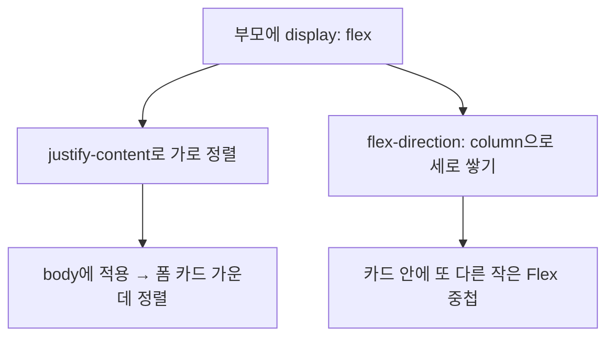

<style>
.page__content { font-size: 0.85em; }
</style>

> 이 글은 **"CSS 레이아웃 · 카드로 배치 익히기" 자율 실습 · 전체 14문제**(개인 실습) 중 **Lv.2 — 응용(4문제)**을 기록한 devlog입니다.
> Lv.1에서 익힌 박스 모델·Flexbox·Grid를 회원가입 폼, 일부러 망가뜨린 CSS, 머리/꼬리가 있는 페이지 골격, 게시글 목록처럼 다른 형태의 화면에 응용하는 단계다.
> 문제마다 `문제 상황 → 시도한 방법 → 막혔던 점 → 해결 과정 → 배운 점` 순서로 정리했다.

---

## Lv.2 — 응용 (4문제)

### 2-1. 회원가입 폼을 카드에 담기

#### 문제 상황
민무늬 회원가입 폼(`signup.html`)을 흰 카드 안에 담긴 모양으로 꾸민다. 카드는 화면 가로 가운데에 놓이고, 입력 칸은 한 줄씩 세로로 쌓여야 한다.

#### 시도한 방법
```css
body {
  display: flex;
  justify-content: center;
}

form {
  background-color: #ffffff;
  border: 1px solid #dddddd;
  border-radius: 12px;
  padding: 24px;
  display: flex;
  flex-direction: column;
  gap: 12px;
}
```

#### 막혔던 점
🔴 `form`에만 `display: flex`를 주고 `body`는 그대로 뒀더니, 입력 칸은 세로로 잘 쌓였지만 폼 카드 자체가 화면 왼쪽에 붙어 있었다. "가운데로 모으기"를 카드 자신에게 줘야 하는 줄 알았다.

#### 해결 과정
🟢 "가운데로 모으는 지시는 감싸는 쪽에 준다"는 힌트를 다시 읽고, `body`를 Flex 컨테이너로 만들어 `justify-content: center`를 줬다. 폼(자식)이 아니라 폼을 감싼 `body`(부모)에게 정렬을 지시해야 한다는 걸 1-2에서 배운 것과 연결해서 이해했다.

#### 배운 점
💡 정렬은 항상 "정렬시키고 싶은 대상의 부모"에게 지시한다. `body`도 다른 요소처럼 Flex 컨테이너로 쓸 수 있다는 것과, `flex-direction: column`으로 방향만 바꾸면 같은 Flex 지식으로 세로 쌓기도 가로 가운데 정렬도 둘 다 해결된다는 걸 확인했다.

---

### 2-2. 배치가 안 먹는 CSS 세 곳 고치기

#### 문제 상황
`broken.css`에 있는 세 가지 문제(① 카드가 세로로 쌓임 ② 카드 사이 간격이 안 생김 ③ `align-items: center`를 줬는데 변화가 없음)의 원인을 찾아 설명하고 고친다.

#### 시도한 방법
```css
/* ① display: flex가 자식(.menu-card)이 아니라 부모(.menu-list)에 있어야 함 */
.menu-list {
  display: flex;
}
.menu-card {
  /* display: flex; 를 지움 */
}

/* ② 철자 오류 */
.menu-list {
  gap: 20px; /* gab → gap */
}
```
③을 확인하려면 카드 하나의 높이를 다르게 만들어야 해서, 카드 하나에만 설명 문단을 추가했다.
```html
<div class="menu-card">
  <div class="thumb"></div>
  <h2 class="menu-name">아메리카노</h2>
  <p class="price">4,500원</p>
  <p>매장에서 직접 로스팅한 원두로 내립니다.</p>
</div>
```

#### 막혔던 점
🔴 ①에서 `.menu-card`에 `display: flex`가 있는 걸 보고 처음엔 "Flex가 있는데 왜 세로로 쌓이지"라고 생각했는데, 이건 카드 "안쪽" 내용(사진·이름·가격)을 가로로 늘어놓는 지시일 뿐 카드들끼리(`.menu-list`)를 가로로 늘어놓는 것과는 아무 상관이 없었다.
🔴 ②는 CSS가 `gab`이라는 모르는 속성을 그냥 조용히 무시해서, 브라우저 화면만 봐서는 오타인지 값이 잘못된 건지 구분이 안 갔다.
🔴 ③은 세 카드의 높이가 원래 다 똑같아서, `align-items` 값을 뭘 주든 화면이 똑같아 보였다 — 고장이 아니라 "차이가 안 보이는 조건"이었다.

#### 해결 과정
🟢 개발자 도구 스타일 패널에서 `.menu-list`에 붙은 규칙을 확인해 `gab`에 취소선(무시된 규칙 표시)이 그어져 있는 걸 보고 오타라는 걸 바로 잡았다. `display: flex`는 부모(`.menu-list`)로 옮기고 자식(`.menu-card`)에서는 지웠다. ③은 카드 하나에 문단을 한 줄 더 넣어 높이를 다르게 만든 뒤에야 `align-items: center`를 켜고 끌 때 짧은 카드 두 장이 위아래로 움직이는 게 보였다.

#### 배운 점
💡 CSS는 모르는 속성 이름을 에러 없이 조용히 버린다 — 개발자 도구 스타일 패널의 취소선이 이런 실수를 잡는 가장 빠른 방법이다. 또한 `align-items`처럼 "반대 축을 맞추는" 속성은 정렬 대상들의 크기가 전부 같으면 값을 바꿔도 화면이 똑같아 보일 수 있다는 것도 새로 알았다.

---

### 2-3. 머리와 꼬리를 붙여 페이지 골격 만들기

#### 문제 상황
카페 메뉴 페이지에 가게 이름이 들어간 머리(header)와 영업시간·전화번호가 들어간 꼬리(footer)를 각각 화면 가로를 꽉 채우는 띠 모양으로 붙인다.

#### 시도한 방법
```html
<body>
  <header class="site-head">
    <h1>카페 메뉴</h1>
    <p>매일 아침 갓 볶은 원두로 내립니다</p>
  </header>

  <main class="menu-list"> <!-- 카드들 --> </main>

  <footer class="site-foot">
    <p>영업시간 08:00 - 21:00</p>
    <p>02-1234-5678</p>
  </footer>
</body>
```
```css
body {
  margin: 0;
}

.site-head, .site-foot {
  background-color: #333333;
  color: #ffffff;
  padding: 20px;
}
```

#### 막혔던 점
🔴 `header`·`footer`에 배경색과 여백만 줬는데도 좌우에 회색 띠가 살짝 남아있어서, 태그 자체가 화면 가로를 꽉 못 채우는 줄 알고 `width: 100%`부터 찾아봤다.

#### 해결 과정
🟢 안내에 있던 "브라우저가 `body`에 기본 여백을 준다"는 내용을 떠올리고 `body { margin: 0; }`을 추가하니 좌우 회색 띠가 사라졌다. `header`·`footer`는 원래 블록 요소라 폭을 따로 지정하지 않아도 가로 전체를 차지한다는 것도 함께 확인했다.

#### 배운 점
💡 "화면 가로를 꽉 채운다"는 요구를 못 맞추는 원인이 항상 내가 만든 요소에 있는 건 아니다 — 브라우저가 기본으로 주는 `body`의 여백처럼, 내가 쓰지 않은 스타일이 원인일 수도 있다는 걸 이번에 직접 겪었다.

---

### 2-4. 같은 구조를 게시글 목록으로 옮기기

#### 문제 상황
카드의 구조는 그대로 두고 내용만 게시글(제목·작성자·작성일)로 바꿔, 세로로 쌓이는 게시글 목록 4개를 만든다. 작성자와 작성일은 한 줄에 나란히 놓는다.

#### 시도한 방법
```html
<div class="post-card">
  <h2 class="post-title">CSS Flexbox 정리</h2>
  <div class="post-meta">
    <span>홍길동</span>
    <span>2026-09-01</span>
  </div>
</div>
```
```css
.post-list {
  display: flex;
  flex-direction: column;
  gap: 12px;
}

.post-card {
  background-color: #ffffff;
  border: 1px solid #dddddd;
  border-radius: 8px;
  padding: 16px;
}

.post-meta {
  display: flex;
  gap: 10px;
  color: #777777;
}
```

#### 막혔던 점
🔴 `post-meta`를 처음엔 그냥 `<span>` 두 개를 나란히 뒀는데, `span`은 기본이 inline이라 옆에 붙긴 했지만 사이 간격을 `gap`으로 줄 수가 없었다(그때는 `.post-meta`에 Flex를 안 준 상태였다).

#### 해결 과정
🟢 `.post-meta`라는 감싸는 `div`를 만들고 그 자체를 Flex 컨테이너로 만든 뒤에야 `gap`이 적용됐다. `.post-list`는 `flex-direction: column`으로 방향만 바꾸니 `gap`이 자동으로 "세로 사이 간격"으로 바뀌는 것도 확인했다.

#### 배운 점
💡 `gap`은 Flex 컨테이너에만 적용되는 속성이라, 정렬하고 싶은 요소들을 감싸는 별도의 Flex 컨테이너가 있어야 한다. 카드 목록(세로) 안에 또 다른 작은 Flex(가로)가 중첩될 수 있다는 걸 이번에 처음 조합해봤다.

---

## Lv.2 네 문제를 풀어보고 나서

Lv.2에서 가장 인상 깊었던 건 2-2였다. 문제를 코드로 "고치는 것"보다 "왜 안 되는지 설명하는 것"이 목적이라고 되어 있었는데, 실제로 원인 세 개(부모/자식 착각, 오타, 조건부 무변화)가 전부 성격이 달라서 디버깅 감각을 나눠서 연습하는 느낌이었다. 2-1과 2-4는 결국 같은 Flexbox 지식(부모에게 정렬 지시, `flex-direction`으로 방향 전환, 중첩 Flex)을 다른 도메인(폼, 게시판)에 반복 적용하는 문제였다.



## 더 학습하면 좋은 개념

- **CSS 우선순위와 캐스케이드(Cascade)** — 2-2에서 오타난 속성이 조용히 무시되는 걸 봤다. 여러 규칙이 겹칠 때 어떤 게 이기는지(우선순위)까지 알면 "왜 이 스타일이 안 먹지"라는 질문에 더 빨리 답할 수 있다.
- **개발자 도구 Computed 탭** — 2-2·2-3처럼 특정 속성이 실제로 적용됐는지 헷갈릴 때, Styles 패널 대신 Computed 탭에서 최종 계산값을 바로 확인하는 습관을 들이면 좋다.
- **`fieldset`/`legend`** — 2-1의 폼 예시에는 없었지만, 폼 요소를 의미 단위로 묶는 시맨틱 태그를 알아두면 회원가입 폼처럼 여러 입력을 묶을 때 구조가 더 명확해진다.
- **CSS 초기화(Reset/Normalize)** — 2-3에서 `body`의 기본 여백 때문에 겪은 문제는 사실 브라우저마다 조금씩 다른 기본 스타일 때문이다. Reset CSS가 어떤 값들을 정리해주는지 알아두면 비슷한 문제를 미리 예방할 수 있다.

## 참고 자료
- [MDN - Flexbox와 다른 레이아웃 방법](https://developer.mozilla.org/ko/docs/Web/CSS/CSS_flexible_box_layout/Basic_concepts_of_flexbox)
- [MDN - align-items](https://developer.mozilla.org/ko/docs/Web/CSS/align-items)
- [MDN - gap](https://developer.mozilla.org/ko/docs/Web/CSS/gap)
- [MDN - header 요소](https://developer.mozilla.org/ko/docs/Web/HTML/Element/header)
- [MDN - footer 요소](https://developer.mozilla.org/ko/docs/Web/HTML/Element/footer)
