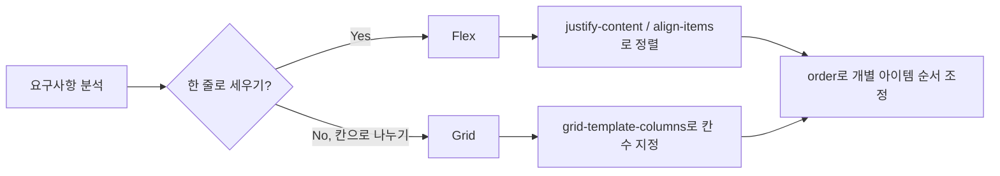

<style>
.page__content { font-size: 0.85em; }
</style>

> 이 글은 **"CSS 레이아웃 · 카드로 배치 익히기" 자율 실습 · 전체 14문제**(개인 실습) 중 **Lv.3 — 도전(2문제)**과 **보너스(2문제)**를 기록한 devlog입니다.
> Lv.1~Lv.2에서 배치 도구를 하나씩 익혔다면, 이번엔 요구사항만 보고 Flex와 Grid 중 무엇을 쓸지부터 스스로 설계해야 한다.
> 문제마다 `문제 상황 → 시도한 방법 → 막혔던 점 → 해결 과정 → 배운 점` 순서로 정리했다.

---

## 핵심 개념 정리

- **`order` 속성**
  - Flex 전용이 아니라 Flex·Grid 컨테이너의 자식(아이템)에 공통으로 적용되는 속성이다. 기본값은 0이고, 값이 작을수록 화면에서 앞자리에 놓인다.

- **표(`table`)와 Grid의 차이**
  - `table`은 태그 자체가 줄(`tr`)·칸(`td`)을 문서 구조로 강제해, 화면이 좁아져도 칸 너비만 줄어들 뿐 유연하게 줄바꿈되지 않는다. Grid는 열 개수만 정하면 요소 개수에 맞춰 줄이 자동으로 나뉜다.

- **`flex-wrap`의 한계**
  - `flex-wrap: wrap`은 공간이 부족할 때 다음 줄로 줄바꿈만 해줄 뿐, 요소 내부에 고정된 `px` 크기까지 줄여주지는 않는다. 화면 크기에 맞춰 크기 자체를 바꾸려면 미디어 쿼리 같은 별도의 도구가 필요하다.

## Lv.3 — 도전 (2문제)

### 3-1. 이벤트 배너 + 메뉴 4장 (설계부터)

#### 문제 상황
빈 파일에서 시작해서, 화면 가로를 꽉 채우고 높이 150px에 글자가 가로·세로 모두 가운데인 이벤트 배너, 2칸씩 두 줄로 놓이는 메뉴 카드 4장, "신메뉴" 배지, 꼬리 영역을 요구사항만 보고 설계한다. 두 번째 카드(HTML 기준)에 배지를 붙이되 화면에서는 그 카드가 맨 앞에 와야 한다.

#### 시도한 방법
요구사항을 먼저 표로 정리해서 어떤 도구를 쓸지 정했다.

| 요구사항 | 쓸 도구 |
|---|---|
| 배너 가로·세로 가운데 | Flex (`justify-content` + `align-items`) |
| 카드 2칸씩 두 줄 | Grid (`grid-template-columns`) |
| 배지가 글자만큼만 차지 | `display: inline-block` |
| 두 번째 카드를 맨 앞에 | `order` |

```html
<body>
  <div class="banner">신메뉴 출시 기념 20% 할인</div>

  <main class="menu-grid">
    <div class="menu-card"> …아메리카노… </div>
    <div class="menu-card new"> …신메뉴 카드… <span class="badge">신메뉴</span></div>
    <div class="menu-card"> …카페라떼… </div>
    <div class="menu-card"> …콜드브루… </div>
  </main>

  <footer class="site-foot">영업시간 08:00 - 21:00</footer>
</body>
```
```css
body { margin: 0; }

.banner {
  height: 150px;
  background-color: #333333;
  color: #ffffff;
  display: flex;
  justify-content: center;
  align-items: center;
}

.menu-grid {
  display: grid;
  grid-template-columns: repeat(2, 1fr);
  gap: 20px;
  padding: 20px;
}

.menu-card.new {
  order: -1;
}

.badge {
  display: inline-block;
  background-color: #c0392b;
  color: #ffffff;
  padding: 4px 10px;
  border-radius: 12px;
}
```

#### 막혔던 점
🔴 `order`가 Flex 전용 속성인 줄 알고 있어서, Grid로 만든 `.menu-grid` 안에서도 순서를 바꿀 수 있을지 확신이 없었다. 지레짐작하지 말고 직접 넣어보라는 힌트를 보고서야 시도했다.

#### 해결 과정
🟢 `.menu-card.new`에 `order: -1`을 줘서 다른 카드들(기본값 0)보다 항상 앞에 오게 만들었다. 저장 → 새로고침해보니 Grid 안에서도 `order`가 그대로 동작해서, HTML 두 번째 자리 카드가 화면 첫 번째 칸에 놓이는 걸 확인했다.

#### 배운 점
💡 `order`는 Flexbox 전용이 아니라 Flex·Grid 컨테이너의 "아이템"에 공통으로 적용되는 속성이다. 배치 도구(Flex/Grid)를 정하는 것과, 그 안에서 개별 아이템의 순서·정렬을 조정하는 것은 서로 다른 층위의 결정이라는 걸 이번 문제로 정리할 수 있었다.

---

### 3-2. 표로 만든 목록을 Flex · Grid로 다시

#### 문제 상황
`table`·`tr`·`td`로 배치한 옛날식 메뉴 목록(`old-menu.html`, 6칸)을 표 태그를 하나도 쓰지 않고 같은 화면으로 다시 만든다.

#### 시도한 방법
```html
<main class="menu-list">
  <div class="menu-card"> …아메리카노… </div>
  <div class="menu-card"> …카페라떼… </div>
  <div class="menu-card"> …바닐라 콜드브루… </div>
  <div class="menu-card"> …자몽 에이드… </div>
  <div class="menu-card"> …녹차 라떼… </div>
  <div class="menu-card"> …딸기 스무디… </div>
</main>
```
```css
.menu-list {
  display: grid;
  grid-template-columns: repeat(3, 1fr);
  gap: 20px;
}
```

#### 막혔던 점
🔴 표에서는 `tr`이 줄을 명시적으로 나눠줬는데, Grid에는 `tr`에 대응하는 태그가 없어서 처음엔 6장을 어떻게 두 줄로 나눠야 할지 헷갈렸다.

#### 해결 과정
🟢 `grid-template-columns: repeat(3, 1fr)`로 "한 줄에 3칸"만 정해주면, 카드 6장이 열 개수에 맞춰 저절로 2줄로 나뉜다는 걸 확인했다. 줄을 직접 나누는 대신 "한 줄에 몇 칸인지"만 정하면 된다는 점이 표와 가장 다른 부분이었다.

문제점 메모:
```
1. 표는 창을 좁혀도 칸 너비만 계속 줄어들 뿐, 카드처럼 다음 줄로 줄바꿈되지 않는다.
2. table은 원래 "표 형태의 데이터"를 위한 태그인데, 여기서는 순수하게 화면 배치 목적으로만 쓰였다 — 의미와 다른 용도로 태그를 쓴 것이다.
```

#### 배운 점
💡 Grid는 "줄"을 직접 만들 필요 없이 "열 개수"만 정하면 요소 개수에 맞춰 자동으로 줄바꿈된다. 반면 `table`은 태그 자체가 줄(`tr`)과 칸(`td`)을 문서 구조로 강제하기 때문에, 화면 크기에 따라 유연하게 줄어들거나 줄바꿈되는 배치에는 애초에 맞지 않는 도구라는 걸 직접 비교하며 체감했다.

---

## 보너스 — 심화 (2문제)

### B-1. 진짜 쇼핑몰의 카드 목록 해부하기

#### 문제 상황
실제 쇼핑몰·웹사이트 세 곳을 열어 카드 목록을 개발자 도구로 해부하고, `Flex인가 Grid인가 · gap 값 · 한 줄에 몇 장`을 표로 정리한다.

#### 시도한 방법
카드 하나에서 우클릭 → 검사 → 요소 패널에서 바깥으로 올라가며 `flex`/`grid` 배지가 붙은 조상을 찾는 방식으로 접근했다.

| 사이트 | 목록 이름 | Flex/Grid | gap | 한 줄에 몇 장 |
|---|---|---|---|---|
| (...) | (...) | (...) | (...) | (...) |
| (...) | (...) | (...) | (...) | (...) |
| (...) | (...) | (...) | (...) | (...) |

#### 막혔던 점
🔴 (...)

#### 해결 과정
🟢 (...)

#### 배운 점
💡 (...)

> ⚠️ 이 문제는 실제 웹사이트 세 곳을 직접 열어 개발자 도구로 확인해야 하는 문제라, 이 초안에는 표와 회고를 비워뒀다. 실제로 세 사이트를 조사한 뒤 표와 막혔던 점·배운 점을 채워 넣어야 한다.

---

### B-2. 창을 좁히면 무너지는 지점 찾기

#### 문제 상황
지금까지 만든 페이지(카페 메뉴 카드) 중 하나를 골라 브라우저 창을 좁혀가며 무너지는 지점을 찾고, `flex-wrap`으로 고칠 수 있는 것과 없는 것을 구분한다.

#### 시도한 방법
카페 메뉴 페이지(`menu.html`) 기준으로 창을 좁혀보며 아래를 확인했다.
```css
.menu-list {
  display: flex;
  flex-wrap: wrap; /* 줄바꿈 추가 */
  gap: 20px;
}
```

#### 막혔던 점
🔴 (...)

#### 해결 과정
🟢 창을 좁히기 전 `.menu-list`에는 `flex-wrap`이 없어서, 카드 3장이 줄어들 공간이 없어지면 카드 자체가 찌그러지거나 가로 스크롤이 생겼다. `flex-wrap: wrap`을 추가하니 공간이 부족해지면 카드가 다음 줄로 내려가면서 잘리지 않았다.

다만 `.thumb`처럼 `width: 160px`로 고정된 값은 `flex-wrap`을 줘도 그 자체가 줄어들지는 않아서, 창이 카드 폭보다도 좁아지면 사진 자리가 카드 밖으로 삐져나오는 지점이 남았다.

무너지는 지점 정리:
```
1. 카드 3장이 한 줄에 억지로 눌려 찌그러짐   → flex-wrap: wrap으로 고침
2. 카드 사이 가로 스크롤 발생                 → flex-wrap: wrap으로 고침
3. .thumb(160px 고정)이 카드보다 좁아진 창에서 삐져나옴 → 못 고침
```

#### 배운 점
💡 `flex-wrap`은 "줄바꿈"만 해결해줄 뿐, 요소 내부의 고정된 크기(`px`)까지 줄여주지는 않는다. 창 크기에 맞춰 요소 자체의 크기까지 바꾸려면 지금 배운 것만으로는 부족하고, 나중에 배울 미디어 쿼리 같은 도구가 필요하다는 걸 한계로 확인했다.

> ⚠️ 이 문제는 실제로 브라우저 창을 좁혀가며 확인해야 정확한 지점을 찾을 수 있다. 위 내용은 코드 구조로 미루어 짐작한 초안이라, 실제로 창을 좁혀보고 나온 지점으로 바꿔 써야 한다.

---

## Lv.3~보너스 네 문제를 풀어보고 나서

Lv.3에서 가장 크게 다가온 건 "어떤 문제에 Flex를 쓰고 어떤 문제에 Grid를 쓸지"를 표로 먼저 정리하고 시작한 것이었다. 3-1에서 `order`가 Grid 안에서도 동작하는 걸 직접 확인하면서, Flex와 Grid가 완전히 다른 도구가 아니라 "아이템에 공통으로 적용되는 속성"을 공유한다는 걸 알게 됐다. 3-2는 표와 Grid를 나란히 비교하면서 태그의 "의미"와 "화면 배치"가 별개라는 걸 다시 확인한 문제였다.



## 더 학습하면 좋은 개념

- **미디어 쿼리(Media Query)** — B-2에서 고정 `px` 크기는 `flex-wrap`만으로 해결이 안 되는 걸 확인했다. 화면 크기 구간별로 CSS 자체를 바꾸는 미디어 쿼리를 배우면 이 한계를 넘어설 수 있다.
- **`box-sizing: border-box`** — Lv.1의 padding부터 Lv.3의 고정폭 `.thumb`까지, 요소의 실제 차지 크기를 계산할 때 계속 등장한 개념이다. `width`에 `padding`·`border`를 포함시키는 방식으로 계산을 단순화할 수 있다.
- **CSS 단위와 반응형 이미지(`max-width`)** — B-2의 `.thumb` 문제는 `width`를 `%`나 `max-width`로 바꾸는 것만으로도 상당 부분 완화된다. 반응형 이미지/미디어 패턴을 다음에 짚어볼 필요가 있다.
- **Flexbox와 Grid를 함께 쓰는 레이아웃** — 실제 사이트(B-1)를 보면 큰 틀은 Grid, 그 안의 카드 내부는 Flex처럼 두 도구를 섞어 쓰는 경우가 많다. 언제 섞어 쓰는 게 유리한지 더 살펴볼 가치가 있다.

## 참고 자료
- [MDN - CSS Grid와 Flexbox 비교](https://developer.mozilla.org/ko/docs/Web/CSS/CSS_grid_layout/Relationship_of_grid_layout)
- [MDN - order](https://developer.mozilla.org/ko/docs/Web/CSS/order)
- [MDN - flex-wrap](https://developer.mozilla.org/ko/docs/Web/CSS/flex-wrap)
- [MDN - table 요소](https://developer.mozilla.org/ko/docs/Web/HTML/Element/table)
- [MDN - 미디어 쿼리 사용하기](https://developer.mozilla.org/ko/docs/Web/CSS/CSS_media_queries/Using_media_queries)
