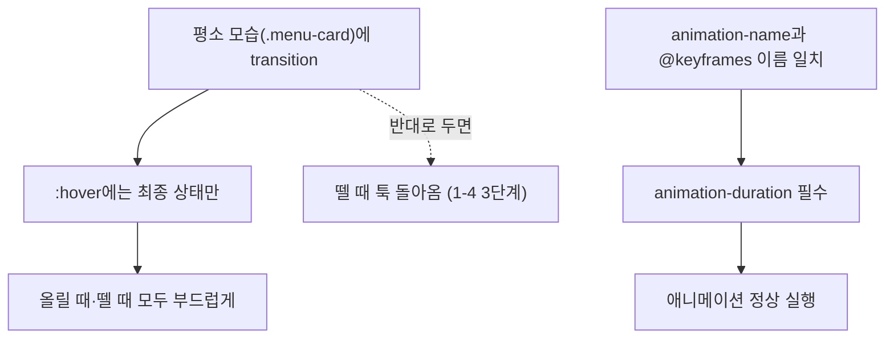

<style>
.page__content { font-size: 0.85em; }
</style>

> 이 글은 **"CSS 심화 · 움직이는 카드 만들기" 자율 실습 · 전체 14문제**(개인 실습) 중 **Lv.1 — 기본 변형(6문제)**을 기록한 devlog입니다.
> 카페 메뉴 카드 세 장이 가로로 놓인 시작 코드에서, `:hover`와 `transition`, `transform`, `@keyframes`를 하나씩 붙여보며 움직임의 기본 감각을 익히는 단계다.
> 문제마다 `문제 상황 → 시도한 방법 → 막혔던 점 → 해결 과정 → 배운 점` 순서로 정리했다.


---

## Lv.1 — 기본 변형 (6문제)

### 1-1. 몇 초가 적당한지 직접 재보기

#### 문제 상황
카드에 마우스를 올리면 배경색이 바뀌고 살짝 커지는 효과를 붙이고, `transition` 시간을 `0.05s · 0.3s · 1s · 3s` 네 가지로 바꿔가며 체감 속도를 비교한다.

#### 시도한 방법
```css
.menu-card {
  /* ... 기존 규칙 ... */
  transition: all 0.3s;
}

.menu-card:hover {
  background-color: #fef3c7;
  transform: scale(1.05);
}
```
`transition: all` 뒤의 시간만 `0.05s → 0.3s → 1s → 3s` 순서로 바꿔가며 저장 → 새로고침 → 카드에 마우스를 올려 비교했다.

| 값 | 체감 |
|---|---|
| 0.05s | 거의 순간적으로 바뀌어서 "부드럽다"는 느낌보다는 그냥 즉시 바뀐 것처럼 보였다 |
| 0.3s | 변화가 눈에 보이면서도 답답하지 않아 가장 자연스러웠다 |
| 1s | 확실히 느리다는 게 느껴지고, 카드 여러 장을 빠르게 훑어볼 때는 거슬렸다 |
| 3s | 마우스를 뗀 뒤에도 한참 커진 상태가 유지돼서, 다른 카드를 보려는데 자꾸 눈에 걸렸다 |

최종으로 남긴 값: 0.3s — 반응은 즉각적으로 느껴지면서도 뚝뚝 끊기지 않는 지점이라 이 값으로 남겼다.

#### 막혔던 점
🔴 `transition`을 `.menu-card:hover` 쪽에 넣고 테스트를 시작해서, 마우스를 올릴 때는 부드러운데 뗄 때는 툭 돌아오는 걸 보고 처음엔 "왜 반만 부드럽지" 하고 헷갈렸다.

#### 해결 과정
🟢 `transition`을 `:hover`가 아니라 평소 모습을 정의하는 `.menu-card` 쪽으로 옮기니 올릴 때·뗄 때 모두 부드러워졌다. 그 상태에서 시간 값만 네 가지로 바꿔가며 비교했다.

#### 배운 점
💡 `transition`은 "지금 적용된 규칙"이 값을 바꿀 때 중간 과정을 채워주는 것이라, `:hover` 안에만 있으면 마우스를 뗀 순간 그 규칙 자체가 사라져 이어줄 것이 없어진다는 걸 체감했다. 또한 `3s`처럼 너무 느린 값은 "반응이 늦는 UI"로 느껴져서, 카드 하나짜리 hover 효과에는 `0.2~0.3s` 사이가 무난하다는 감이 잡혔다.

---

### 1-2. 어디에 올려야 반응하는지 바꾸기

#### 문제 상황
1-1처럼 커지는 효과를 만든 뒤, `:hover`를 붙이는 대상을 ① 카드 전체 ② 사진 자리(`.thumb`)만 ③ 목록 전체(`.menu-list`) 세 가지로 바꿔보고 차이를 비교한다.

#### 시도한 방법
```css
/* ① 카드 전체 */
.menu-card:hover { transform: scale(1.05); }

/* ② 사진 자리만 */
.thumb:hover { transform: scale(1.05); }

/* ③ 목록에 올리면 카드 전부가 반응 */
.menu-list:hover .menu-card { transform: scale(1.05); }
```

| 구분 | 반응 범위 |
|---|---|
| ① 카드 전체 | 카드 어디에 올려도(사진·이름·가격 모두) 반응해서 가장 자연스러웠다 |
| ② 사진 자리만 | 회색 네모 위에서만 반응하고, 글자 위로 옮기면 바로 원래 크기로 돌아왔다 |
| ③ 목록 전체 | 카드 셋 중 아무 데나 올려도 세 장이 한꺼번에 커져서, 어떤 카드를 보고 있는지 구분이 안 됐다 |

#### 막혔던 점
🔴 ③을 처음에 `.menu-list.menu-card:hover`처럼 공백 없이 붙여 썼다가 아무 반응이 없었다. `.menu-list :hover`처럼 공백이 잘못 들어간 적도 있어서, 카드가 아니라 카드 안쪽 요소를 가리키는 셈이 됐다.

#### 해결 과정
🟢 "A에 올렸을 때 B가 바뀌게" 하려면 `A:hover B`처럼 `:hover`는 `A` 뒤에 공백 없이 붙이고, 그 뒤를 띄어서 자손 `B`를 지정해야 한다는 힌트를 다시 읽고 `.menu-list:hover .menu-card`로 고쳤다.

#### 배운 점
💡 효과를 받는 대상과 마우스를 감지하는 대상은 꼭 같은 요소가 아니어도 된다. `A:hover`(붙여쓰기, A 자신)와 `A:hover B`(띄어쓰기, A 위에 있을 때 자손 B)는 완전히 다른 의미라 셀렉터를 쓸 때 공백 하나까지 신경 써야 한다는 걸 알았다.

---

### 1-3. "할인" 배지를 비스듬히 붙이기

#### 문제 상황
첫 번째 카드에만 "할인" `<span>` 배지를 붙인다. 글자 길이만큼만 차지해야 하고, 배경색·안쪽 여백으로 알약 모양을 만든 뒤 비스듬히 기울인다.

#### 시도한 방법
```html
<span class="badge">할인</span>
```
```css
.badge {
  display: inline-block;
  background-color: #dc2626;
  color: #ffffff;
  padding: 4px 8px;
  border-radius: 999px;
  transform: rotate(-8deg);
}
```

#### 막혔던 점
🔴 `display`를 기본값(`inline`)인 채로 두고 `padding`을 줬더니, 위아래 여백이 배경색에는 칠해지는데 옆 텍스트와 살짝 겹쳐 보이는 것처럼 어색했다. `div`로 바꿔보기도 했는데 이번엔 배지가 가로 전체를 차지해버렸다.

#### 해결 과정
🟢 `span`은 그대로 두고 `display: inline-block`만 추가했다. 옆으로는 글자만큼만 차지하면서(inline 성질) 위아래 `padding`은 제대로 자리를 차지하는(block 성질) 상태가 됐다. 기울이기는 `transform: rotate(-8deg)`로 해결했다.

#### 배운 점
💡 `inline-block`은 "가로 배치는 inline처럼, 크기 계산은 block처럼" 동작하는 절충값이라는 걸 실제로 확인했다. `transform`으로 기울여도 옆 글자나 아래 글자가 밀려나지 않는 이유는 `transform`이 문서 흐름(레이아웃)에는 영향을 주지 않고 화면에 그려지는 모양만 바꾸기 때문이라는 것도 확인 방법 마지막 항목을 통해 다시 짚었다.

---

### 1-4. transition을 지우고 무엇이 달라지는지

#### 문제 상황
① hover 효과 + transition을 붙인 상태 ② transition을 지운 상태 ③ transition을 `.menu-card:hover` 안으로 옮긴 상태, 세 단계를 비교한다.

#### 시도한 방법
```css
/* 1단계 */
.menu-card { transition: all 0.3s; }
.menu-card:hover { transform: scale(1.05); }

/* 2단계 — transition 삭제 */
.menu-card { /* transition 없음 */ }

/* 3단계 — transition을 :hover 안으로 이동 */
.menu-card:hover {
  transition: all 0.3s;
  transform: scale(1.05);
}
```

| 단계 | 올릴 때 | 뗄 때 |
|---|---|---|
| 1단계 | 부드러움 | 부드러움 |
| 2단계 | 툭 | 툭 |
| 3단계 | 부드러움 | 툭 |

#### 막혔던 점
🔴 3단계 결과가 1-1에서 겪었던 증상과 똑같다는 걸 바로 알아채지 못하고, 처음엔 "transition을 넣었는데 왜 절반만 동작하지"라고 다시 헷갈렸다.

#### 해결 과정
🟢 세 단계를 순서대로 저장 → 새로고침하며 비교하고 나서야, 1-1에서 겪은 문제와 3단계가 같은 원인(마우스를 떼는 순간 `:hover` 규칙 자체가 사라짐)이라는 걸 연결해서 이해했다.

#### 배운 점
💡 `transition`의 위치는 "언제 이 변화가 부드러워야 하는가"를 정하는 것과 같다. 평소 규칙에 두면 올릴 때·뗄 때 둘 다, `:hover` 안에 두면 올릴 때만 적용된다는 걸 세 단계 비교로 명확히 확인했다.

---

### 1-5. 키프레임 순서를 뒤집어 결과 예측하기

#### 문제 상황
첫 번째 카드에 "NEW" 배지를 넣고, 왼쪽에서 미끄러져 들어오는 애니메이션을 한 번만 실행되게 붙인다. `0%`와 `100%`를 바꾸면 어떻게 될지 예측한 뒤 실제로 확인한다.

#### 시도한 방법
```css
.badge {
  /* ... 배지 모양 ... */
  animation-name: slide-in;
  animation-duration: 0.6s;
  animation-iteration-count: 1;
}

@keyframes slide-in {
  0%   { transform: translate(-40px, 0); }
  100% { transform: translate(0, 0); }
}
```

예측: "0%와 100%를 바꾸면 반대로, 제자리에서 시작해 왼쪽으로 미끄러져 나갈 것이다."

#### 막혔던 점
🔴 처음에 `@keyframes` 이름을 `slidein`으로, `animation-name`은 `slide-in`으로 써서 하이픈 하나 차이로 애니메이션이 전혀 실행되지 않았다. 에러가 안 떠서 원인을 바로 못 찾았다.

#### 해결 과정
🟢 `animation-duration`을 빼먹지 않았는지부터 확인하고, 그다음 두 이름을 나란히 놓고 글자 하나까지 비교해서 오타를 찾았다. 이름을 맞추자 배지가 왼쪽에서 미끄러져 들어왔다. 이후 `0%`/`100%` 내용을 서로 바꾸니 예측대로 반대 방향(왼쪽으로 나가는 모양)으로 재생됐고, 끝난 뒤에는 원래 규칙의 모습(제자리)으로 툭 돌아왔다.

#### 배운 점
💡 `@keyframes`의 이름과 `animation-name`은 글자 하나까지 정확히 같아야 하고, `animation-duration`을 빼먹으면 기본값이 `0s`라 아무 일도 안 일어난다는 두 가지 함정을 직접 겪었다. 애니메이션이 끝나면 원래 규칙 모습으로 돌아간다는 점도 예측·확인 과정에서 자연스럽게 이해했다.

---

### 1-6. CSS 규칙 하나를 Tailwind 클래스로

#### 문제 상황
`.menu-card` 규칙(`background-color`·`border`·`border-radius`·`padding`)을 CSS 파일 없이 Tailwind 클래스만으로 재현한다.

#### 시도한 방법
```html
<div class="bg-white border border-gray-200 rounded-lg p-4">
  <div class="w-44 h-28 bg-gray-200 rounded"></div>
  <h2 class="text-lg font-bold mt-2 mb-1">아메리카노</h2>
  <p class="text-red-700">4,500원</p>
</div>
```

#### 막혔던 점
🔴 테두리를 `border-gray-200` 하나만 썼더니 테두리가 아예 안 보이거나 굵은 검정으로 나와서, CSS의 `border: 1px solid #e5e7eb` 한 줄이 Tailwind에서는 왜 클래스 두 개(`border` + `border-gray-200`)로 나뉘는지 헷갈렸다.

#### 해결 과정
🟢 `border`는 두께·스타일(기본 검정 1px 실선)만 켜는 클래스이고, 색은 `border-{색}` 클래스가 따로 담당한다는 걸 공식 문서에서 확인하고 두 클래스를 함께 썼다. `p-4`(16px)·`rounded-lg`도 CSS 값과 같은 크기가 나오는지 개발자 도구로 비교했다.

#### 배운 점
💡 Tailwind는 CSS 속성 하나가 아니라 "값 하나"에 클래스 하나가 대응하는 경우가 많아서, `border`처럼 여러 하위 값(두께·색·스타일)을 가진 속성은 클래스가 여러 개로 쪼개질 수 있다는 걸 확인했다. 클래스 이름을 외우는 대신 공식 문서에서 속성 단위로 검색하는 습관이 더 낫다는 것도 체감했다.

---

## Lv.1 여섯 문제를 풀어보고 나서

Lv.1에서 가장 자주 반복된 실수는 결국 하나로 좁혀졌다 — **"부드러움을 담당하는 `transition`을 어디에 두느냐"**. 1-1과 1-4가 사실상 같은 함정을 다른 각도에서 확인시켜 준 문제였고, 1-5의 `@keyframes` 이름 오타도 성격이 비슷했다(둘 다 "에러 없이 조용히" 안 되는 케이스). 반면 1-2·1-3은 셀렉터와 `display` 값처럼 앞 시간에 배운 지식과 이번 시간 것을 조합해야 풀리는 문제였다.



## 더 학습하면 좋은 개념
- **transition-timing-function** — 이번엔 속도(초)만 비교했지만, `ease`·`linear`·`ease-in-out`처럼 "어떤 곡선으로" 변하는지도 별도 속성이다. 1-1에서 느낀 "뚝뚝 끊기는 느낌"의 상당 부분은 사실 곡선(기본값 `ease`) 때문일 수 있어 짚어볼 가치가 있다.
- **animation-fill-mode** — 1-5에서 "애니메이션이 끝나면 원래 모습으로 돌아온다"는 걸 확인했는데, `forwards` 값을 쓰면 끝난 모습을 그대로 유지시킬 수 있다. 문제에서 "나중에 배운다"고 안내한 부분이라 이름만 익혀두면 좋다.
- **cursor: pointer** — hover로 반응하는 요소는 클릭 가능하다는 신호를 커서 모양으로도 줄 수 있다. 배지·버튼처럼 상호작용 요소에 자연스럽게 이어지는 다음 스텝이다.
- **prefers-reduced-motion** — 실습 안내에도 나온 "움직임 줄이기" 사용자 설정을 CSS에서 존중하는 미디어 쿼리다. 접근성과 함께 배우면 애니메이션을 "언제 꺼야 하는지"까지 판단할 수 있게 된다.

## 참고 자료
- [MDN - transition](https://developer.mozilla.org/ko/docs/Web/CSS/transition)
- [MDN - transform](https://developer.mozilla.org/ko/docs/Web/CSS/transform)
- [MDN - @keyframes](https://developer.mozilla.org/ko/docs/Web/CSS/@keyframes)
- [MDN - animation](https://developer.mozilla.org/ko/docs/Web/CSS/animation)
- [MDN - :hover](https://developer.mozilla.org/ko/docs/Web/CSS/:hover)
- [Tailwind CSS 공식 문서 - Border Width](https://tailwindcss.com/docs/border-width)
