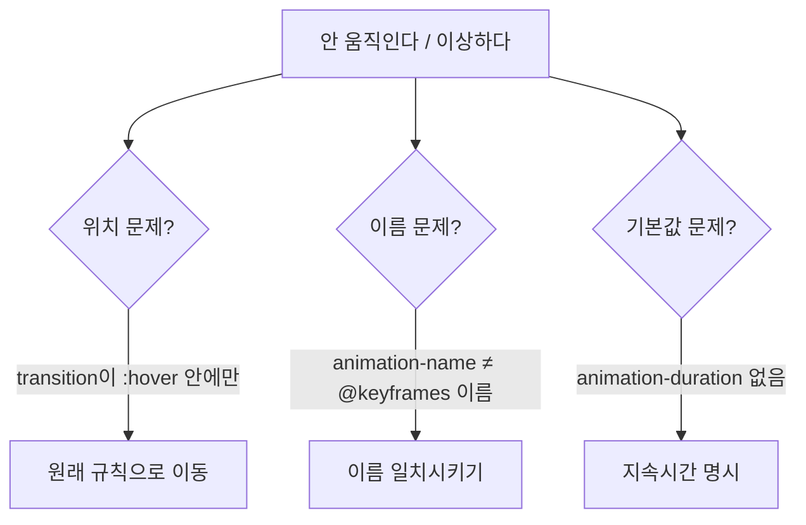

<style>
.page__content { font-size: 0.85em; }
</style>

> 이 글은 **"CSS 심화 · 움직이는 카드 만들기" 자율 실습 · 전체 14문제**(개인 실습) 중 **Lv.2 — 응용(4문제)**을 기록한 devlog입니다.
> Lv.1에서 익힌 `:hover`·`transition`·`transform`·`@keyframes`를 목록 전체, 다른 요소(가격), Tailwind, 게시글 목록처럼 다른 대상·다른 도구에 응용하는 단계다.
> 문제마다 `문제 상황 → 시도한 방법 → 막혔던 점 → 해결 과정 → 배운 점` 순서로 정리했다.


---

## Lv.2 — 응용 (4문제)

### 2-1. 목록 전체에 효과를 일괄로 입히기

#### 문제 상황
카드를 6장으로 늘리고, 카드 하나에 마우스를 올리면 그 카드만 떠오르며 커지고, 목록 전체(`.menu-list`)에 마우스를 올리면 목록 배경색이 바뀌게 만든다. 카드 6장이 한 줄에 안 들어가면 줄바꿈도 되게 한다.

#### 시도한 방법
```css
.menu-list {
  display: flex;
  justify-content: center;
  gap: 20px;
  flex-wrap: wrap;
  transition: all 0.3s;
}

.menu-list:hover { background-color: #f9fafb; }

.menu-card { transition: all 0.3s; }
.menu-card:hover { transform: translateY(-6px) scale(1.05); }
```

#### 막혔던 점
🔴 카드 한 장에 마우스를 올렸을 때 목록 배경색까지 같이 바뀌는 게 당연한 건지 헷갈렸다. `.menu-list` 안에 `.menu-card`가 들어있으니 카드 위에 마우스가 있어도 여전히 `.menu-list` 영역 "안"이기 때문이다.

#### 해결 과정
🟢 확인 방법에 있던 "카드 위에 올렸을 때는 두 효과가 동시에 일어난다"는 항목을 다시 읽고, 두 `:hover`가 서로 배타적인 게 아니라 마우스 위치에 따라 동시에 여러 규칙이 적용될 수 있다는 걸 이해했다. `flex-wrap: wrap`을 추가해 6장이 창 너비에 따라 줄바꿈되는 것도 확인했다.

#### 배운 점
💡 같은 클래스(`.menu-card`)라도 `:hover`는 실제로 마우스가 올라간 요소에만 적용되고, 부모(`.menu-list`)와 자식(`.menu-card`)이 동시에 `:hover` 조건을 만족할 수 있다는 걸 확인했다. Lv.1에서 배운 `:hover` 범위 감각과, 이전 시간에 배운 `flex-wrap`이 자연스럽게 이어졌다.

---

### 2-2. 효과가 안 먹는 세 곳 고치기

#### 문제 상황
① hover를 뗄 때 툭 돌아옴 ② NEW 배지가 안 깜빡임 ③ 가격에 마우스를 올리면 커지기만 하고 깜빡이지 않음, 세 곳의 원인을 찾아 설명하고 고친다.

#### 시도한 방법
```css
/* ① transition을 :hover가 아니라 원래 규칙으로 이동 */
.menu-card {
  transition: all 0.3s;
}
.menu-card:hover {
  transform: scale(1.05);
}

/* ② animation-name과 @keyframes 이름을 일치 */
.badge {
  animation-name: blink; /* blinking → blink */
  animation-duration: 1.2s;
  animation-iteration-count: infinite;
}
@keyframes blink { /* ... */ }

/* ③ animation-duration 추가 */
.price:hover {
  transform: scale(1.2);
  animation-name: blink;
  animation-duration: 0.6s;
  animation-iteration-count: 3;
}
```

#### 막혔던 점
🔴 ①은 겉으로는 잘 동작하는 것처럼 보여서(올릴 때는 확실히 부드러움) 뗄 때만 유심히 보지 않으면 문제가 있는지도 모르고 지나칠 뻔했다.
🔴 ②는 `blinking`과 `blink`처럼 이름이 "비슷하지만 다른" 경우라 눈으로 훑기만 해서는 잘 안 잡혔다.
🔴 ③은 `transform: scale(1.2)`가 확실히 동작해서 "효과가 아예 없는 건 아니니" 애니메이션 관련 값이 빠졌을 거라는 생각까지 가는 데 시간이 걸렸다.

#### 해결 과정
🟢 세 곳 모두 개발자 도구 스타일 패널에서 해당 규칙을 하나씩 열어 값을 확인했다. ①은 `transition`의 위치, ②는 이름 철자, ③은 `animation-duration` 누락이라는 걸 각각 확인하고 고쳤다. 특히 ②는 취소선 없이 그냥 "적용은 됐지만 아무 효과가 없는" 규칙이라 스타일 패널에서도 바로 티가 나지 않는다는 걸 알았다.

#### 배운 점
💡 세 문제가 겉보기엔 다르지만 전부 "CSS가 조용히 무시하거나 기본값으로 대체한다"는 같은 성질에서 나온다. ①은 규칙이 있어야 할 위치, ②는 이름 일치, ③은 기본값(`0s`)이 원인이라는 걸 구분해서 설명할 수 있게 됐다 — 이 문제의 목적이 "고치는 것보다 원인을 설명하는 것"이라는 안내와 맞아떨어졌다.

---

### 2-3. Tailwind 카드에 움직임 붙이기

#### 문제 상황
Tailwind로 만든 카드 세 장에 마우스를 올리면 위로 떠오르고, 커지고, 그림자가 생기며 부드럽게 이어지는 효과를 CSS 파일 없이 클래스만으로 붙인다.

#### 시도한 방법
```html
<div class="bg-white border border-gray-200 rounded-lg p-4
            transition hover:-translate-y-2 hover:scale-105 hover:shadow-lg">
  <div class="w-44 h-28 bg-gray-200 rounded"></div>
  <h2 class="text-lg font-bold mt-2 mb-1">아메리카노</h2>
  <p class="text-red-700">4,500원</p>
</div>
```
세 카드 각각에 같은 클래스 묶음을 붙였다.

#### 막혔던 점
🔴 `-translate-y-2`처럼 마이너스 기호를 어디에 붙여야 할지 헷갈려서 `hover:translate-y--2`, `-hover:translate-y-2`처럼 잘못된 위치에 넣었더니 조용히 무시됐다.
🔴 `transition` 클래스를 빼먹고 `hover:` 클래스만 붙였더니 효과 자체는 있는데 부드럽게 이어지지 않고 툭툭 바뀌었다.

#### 해결 과정
🟢 공식 문서에서 "음수 값"은 접두사(`hover:`) 뒤, 클래스 이름(`translate-y-2`) 앞에 마이너스를 붙인다(`hover:-translate-y-2`)는 걸 확인하고 고쳤다. `transition`은 접두사 없이 평소 클래스로 따로 붙여야 CSS의 `transition: all 0.3s`와 같은 역할을 한다는 것도 확인했다.

#### 배운 점
💡 Tailwind에서 "부드럽게 이어주는 것"(`transition`)과 "hover일 때 어떤 모습일지"(`hover:...`)는 CSS에서처럼 서로 다른 자리에 따로 붙여야 하는 클래스라는 걸 확인했다. CSS 방식(선택자 하나로 한 번에 정의)과 달리 Tailwind는 카드 세 장에 같은 클래스 묶음을 각각 붙여야 해서, "한 곳만 고치면 전체에 반영되는" CSS의 장점이 이럴 때 두드러진다는 것도 체감했다.

---

### 2-4. 같은 효과를 게시글 목록으로 옮기기

#### 문제 상황
카드의 구조와 효과는 그대로 두고 내용만 게시글(제목·작성자·작성일)로 바꿔, 세로로 쌓인 게시글 목록 4개를 만든다. 마우스를 올리면 항목이 오른쪽으로 밀려나며 배경색이 바뀐다.

#### 시도한 방법
```html
<div class="post-item">
  <h2 class="post-title">CSS 애니메이션 정리</h2>
  <div class="post-meta">
    <span>홍길동</span>
    <span>2026-09-03</span>
  </div>
</div>
```
```css
.post-list { display: flex; flex-direction: column; gap: 12px; }
.post-meta { display: flex; gap: 10px; color: #6b7280; }

.post-item { transition: all 0.3s; }
.post-item:hover {
  transform: translate(12px, 0);
  background-color: #f3f4f6;
}
```

#### 막혔던 점
🔴 `translate(12px, 0)`을 `translateX(12px)` 대신 콤마 표기로 처음 썼을 때, 두 번째 값을 빼먹고 `translate(12px)`라고만 써서 세로로도 살짝 밀리는 느낌이 났다.

#### 해결 과정
🟢 `translate(x, y)`는 두 값을 항상 같이 써야 하고, 세로로 밀지 않으려면 두 번째 값을 명시적으로 `0`으로 줘야 한다는 걸 다시 확인했다. 오른쪽으로만 정확히 이동하는 걸 확인한 뒤, `post-item`이 밀려나도 위아래 항목이 자리를 비켜주지 않는 것도 함께 확인했다(레이아웃에는 영향을 주지 않는 `transform`의 특성).

#### 배운 점
💡 카드에서 만든 hover·transition 조합이 "카드 모양"이 아니라 "레이아웃 구조 + 상태 전환"이라는 패턴 자체였다는 걸 게시글 목록에 옮겨보며 알았다. `flex-direction`만 바꾸면 가로 나열(카드 목록)이 세로 나열(게시판)로 바뀌고, `transform`의 이동 방향(가로/세로)만 바꾸면 다른 상호작용(오른쪽으로 밀림)이 되는 식으로, 같은 지식을 다른 도메인에 그대로 재사용할 수 있었다.

---

## Lv.2 네 문제를 풀어보고 나서

Lv.2에서 가장 인상 깊었던 건 2-2였다. "고치는 것보다 원인을 설명하는 것"이 목적이라는 안내대로, 세 원인(규칙 위치·이름 오타·기본값 누락)이 전부 성격이 달라서 "안 될 때 뭐부터 의심해야 하는지" 체크리스트가 자연스럽게 머릿속에 정리됐다. 2-1과 2-4는 Lv.1의 hover·transition·transform 지식을 각각 "여러 요소에 동시에", "다른 도메인(게시판)에" 응용하는 문제였고, 2-3은 같은 결과를 CSS와 Tailwind 두 가지 방식으로 만들어보며 두 방식의 차이(전역 규칙 vs 요소마다 클래스)를 체감하는 문제였다.



## 더 학습하면 좋은 개념
- **:not() 선택자** — 2-1에서 목록 전체 hover와 카드 hover가 동시에 걸리는 걸 확인했다. "이 카드는 빼고" 같은 예외 처리가 필요할 때 `:not()`을 알아두면 셀렉터를 더 세밀하게 쓸 수 있다.
- **개발자 도구 Styles 패널의 취소선** — 2-2처럼 "조용히 무시되는" 규칙을 찾을 때, 취소선이 그어진 속성을 보는 습관이 오타·중복 선언을 가장 빨리 잡는 방법이다.
- **Tailwind의 임의 값(Arbitrary values)** — 2-3에서 쓴 `-translate-y-2`처럼 정해진 숫자 스케일 밖의 값이 필요할 때 `translate-y-[10px]` 같은 대괄호 문법을 쓸 수 있다. 정해진 유틸리티만으로 부족할 때를 위해 알아두면 좋다.
- **CSS Custom Properties(변수)** — 2-4에서 카드와 게시글 목록에 같은 `transition: all 0.3s`를 반복해서 썼다. 반복되는 값을 변수로 뽑아두면 한 곳만 고쳐 전체 속도를 바꿀 수 있다.

## 참고 자료
- [MDN - CSS 선택자 목록](https://developer.mozilla.org/ko/docs/Web/CSS/CSS_selectors)
- [MDN - transform-function/translate](https://developer.mozilla.org/ko/docs/Web/CSS/transform-function/translate)
- [MDN - flex-wrap](https://developer.mozilla.org/ko/docs/Web/CSS/flex-wrap)
- [Tailwind CSS 공식 문서 - Hover, Focus, and Other States](https://tailwindcss.com/docs/hover-focus-and-other-states)
- [Tailwind CSS 공식 문서 - Transition Property](https://tailwindcss.com/docs/transition-property)
