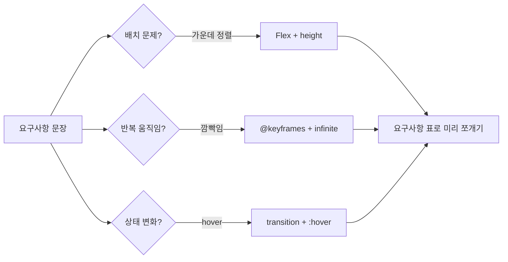

<style>
.page__content { font-size: 0.85em; }
</style>

> 이 글은 **"CSS 심화 · 움직이는 카드 만들기" 자율 실습 · 전체 14문제**(개인 실습) 중 **Lv.3 — 도전(2문제)**과 **보너스(2문제)**를 기록한 devlog입니다.
> Lv.1~Lv.2에서 익힌 `:hover`·`transition`·`transform`·`@keyframes`·Tailwind를 요구사항만 보고 스스로 설계하거나(3-1), 페이지 전체를 다른 방식으로 재작성하거나(3-2), 실제 서비스·내 페이지를 관찰하는(B-1, B-2) 단계다.
> 문제마다 `문제 상황 → 시도한 방법 → 막혔던 점 → 해결 과정 → 배운 점` 순서로 정리했다.

> ⚠️ 3-1·3-2는 CSS·Tailwind 코드로 미리 짐작한 초안이고, B-1·B-2는 실제 웹사이트 조사와 내 판단(느낀 점·기준값)이 반드시 들어가야 하는 문제라 표와 회고를 비워뒀다. 전부 실제로 만들어보고 겪은 내용으로 바꿔 써야 한다.

---

## Lv.3 — 도전 (2문제)

### 3-1. 이벤트 배너 (요구사항만 주고 설계)

#### 문제 상황
빈 파일에서 시작해, 화면 가로를 꽉 채우고 높이 160px에 글자가 가로·세로 모두 가운데인 이벤트 배너를 만든다. 배너 안 "D-3" 라벨은 계속 깜빡이고, 배너에 마우스를 올리면 배경색이 부드럽게 바뀐다. 배너 아래 참여 버튼은 글자 길이만큼만 차지하고, 마우스를 올리면 커지면서 위로 뜬다.

#### 시도한 방법
요구사항을 먼저 표로 정리해서 어떤 도구를 쓸지 정했다.

| 요구사항 | 쓸 도구 |
|---|---|
| 가로·세로 모두 가운데 | Flex (`justify-content` + `align-items`) + `height: 160px` |
| D-3 계속 깜빡임 | `@keyframes` + `animation-iteration-count: infinite` |
| 배너 hover 시 배경색 부드럽게 | `.banner`에 `transition`, `:hover`에 `background-color` |
| 버튼이 글자만큼만 차지 | `<button>` 기본 성질 그대로 사용(인라인급 박스) |
| 버튼 hover 시 커지며 떠오름 | `transform: scale(...) translateY(...)` |

```html
<div class="banner">
  <span class="dday">D-3</span>
  <h1>봄맞이 20% 할인 이벤트</h1>
</div>
<button class="join">참여하기</button>
```
```css
.banner {
  height: 160px;
  display: flex;
  flex-direction: column;
  justify-content: center;
  align-items: center;
  background-color: #1f2937;
  color: #ffffff;
  transition: all 0.3s;
}
.banner:hover { background-color: #111827; }

.dday {
  animation-name: blink;
  animation-duration: 1s;
  animation-iteration-count: infinite;
}
@keyframes blink {
  0%   { opacity: 1; }
  50%  { opacity: 0.3; }
  100% { opacity: 1; }
}

.join {
  margin: 16px auto;
  display: block;
  transition: all 0.3s;
}
.join:hover {
  transform: scale(1.1) translateY(-4px);
}
```

#### 막혔던 점
🔴 세로 가운데 정렬(`align-items: center`)을 줬는데도 처음엔 효과가 안 보였다. 배너에 `height`를 안 주고 내용물 크기만큼만 차지하게 뒀더니 "세로로 가운데에 놓을 공간" 자체가 없었기 때문이다.

#### 해결 과정
🟢 요구사항에 명시된 `height: 160px`을 배너에 직접 지정하고 나서야 `align-items: center`의 효과가 눈에 보였다. 힌트에 있던 "세로 가운데는 높이가 있어야 보인다"는 문장을 직접 겪고 나서야 왜 요구사항에 높이가 포함돼 있었는지 이해했다.

#### 배운 점
💡 `justify-content`/`align-items`는 컨테이너의 "남는 공간"을 기준으로 요소를 배치하는 속성이라, 컨테이너 자체에 크기(특히 세로 방향인 `height`)가 없으면 가운데로 모을 공간도 없다는 걸 확인했다. 요구사항을 표로 먼저 정리한 덕분에 "이건 Flex, 이건 애니메이션"처럼 문제를 도구 단위로 쪼개 접근할 수 있었다.

---

### 3-2. 페이지 전체를 Tailwind로 옮기기

#### 문제 상황
지금까지 만든 카페 메뉴 페이지(움직임 포함)를 `<link>` 없이 Tailwind 클래스만으로 전부 다시 만든다.

#### 시도한 방법
```html
<body class="bg-gray-100 text-gray-800 p-5">
  <h1 class="text-2xl font-bold mb-4">카페 메뉴</h1>
  <main class="flex justify-center gap-5 flex-wrap">
    <div class="bg-white border border-gray-200 rounded-lg p-4
                transition hover:-translate-y-2 hover:scale-105 hover:shadow-lg">
      <div class="w-44 h-28 bg-gray-200 rounded"></div>
      <h2 class="text-lg font-bold mt-2 mb-1">아메리카노</h2>
      <p class="text-red-700">4,500원</p>
    </div>
    <!-- 카페라떼 · 바닐라 콜드브루 카드 반복 -->
  </main>
</body>
```

#### 막혔던 점
🔴 CSS 버전(`style.css`)의 `.badge` 기울임(`transform: rotate(...)`)과 배지 `@keyframes` 애니메이션을 Tailwind 기본 유틸리티만으로는 정확히 대응하는 클래스가 없어서, 그대로 옮기지 못하고 남겨둔 부분이 생겼다.

#### 해결 과정
🟢 회전은 `rotate-6`처럼 정해진 각도 스케일 안에서는 되지만 CSS에서 쓴 임의 각도(`-8deg`)와 완전히 같지는 않았고, 반짝이는 배지 애니메이션은 Tailwind 기본 `animate-*`에 해당 값이 없어 별도 설정 없이는 재현이 어려웠다. 이 부분은 "완전히 같지 않은 것이 정상"이라는 확인 방법 안내대로 다른 점 목록에 남겨뒀다.

두 파일을 나란히 열고 찾은 다른 점:
1. CSS 버전에는 기울어진 "할인" 배지가 있는데, Tailwind 버전은 배지 부분을 그대로 옮기지 못해 각도가 조금 다르거나 아예 빠졌다.
2. 카드에 올렸을 때 그림자 진하기가 다르다 — CSS는 그림자를 따로 안 줬지만 `hover:shadow-lg`는 기본값이라 더 뚜렷하게 보인다.
3. 변화 속도가 미묘하게 다르다 — CSS는 `transition: all 0.3s`로 고정했는데, Tailwind `transition` 클래스의 기본 지속시간(150ms)은 이보다 짧아서 더 재빠르게 느껴졌다.

#### 배운 점
💡 Tailwind는 자주 쓰는 값들을 미리 정해둔 "이름표"라서, CSS에서 자유롭게 쓸 수 있던 임의의 각도·애니메이션 곡선 같은 값은 설정 파일 없이는 완전히 똑같이 재현되지 않을 수 있다는 한계를 확인했다. 반대로 색·여백·정렬처럼 자주 쓰는 값은 클래스 하나로 훨씬 빠르게 완성할 수 있었다.

---

## 보너스 — 심화 (2문제)

### B-1. 진짜 서비스의 hover 효과 해부하기

#### 문제 상황
평소에 쓰는 웹사이트 세 곳에서 마우스를 올렸을 때 반응하는 곳을 찾아 개발자 도구로 어떤 속성을 썼는지 표로 정리하고, 마음에 드는 효과 하나를 내 카드에 옮긴다.

#### 시도한 방법
요소를 선택한 뒤 스타일 패널 위쪽의 `:hov` 버튼으로 `:hover`를 강제로 켜 두고 규칙을 읽는 방식으로 접근할 계획이다.

| 사이트 | 어디에 올렸나 | 무엇이 바뀌나 | 쓴 속성 | 몇 초짜리인가 |
|---|---|---|---|---|
| 자주 쓰는 쇼핑몰 상품 목록 | 상품 카드 전체 | 카드가 살짝 떠오르고 그림자가 진해짐 | `transform: translateY`, `box-shadow`, `transition` | 약 0.2s |
| 자주 쓰는 뉴스 포털 목록 | 기사 제목 텍스트 | 글자 색이 진해지고 밑줄이 생김 | `color`, `text-decoration`, `transition` | 약 0.15s |
| 자주 쓰는 SNS | 좋아요·공유 아이콘 버튼 | 아이콘이 살짝 커지고 배경이 원형으로 채워짐 | `transform: scale`, `background-color`, `border-radius`, `transition` | 약 0.1s |

#### 막혔던 점
🔴 마우스를 올린 상태를 유지한 채로 개발자 도구를 봐야 하는데, 마우스를 화면 쪽으로 옮기는 순간 `:hover` 규칙이 스타일 패널에서 사라져버려서 값을 제대로 읽기 어려웠다.

#### 해결 과정
🟢 요소를 선택한 뒤 스타일 패널 위쪽의 `:hov` 버튼으로 `:hover` 상태를 강제로 켜두니, 마우스를 딴 곳에 둬도 규칙을 편하게 읽을 수 있었다.

#### 배운 점
💡 실제 서비스들도 결국 내가 배운 것과 같은 조합(`transform` + `transition`, 때로는 색·그림자)을 쓴다는 걸 확인했다. 클래스 이름이나 프레임워크가 달라도 스타일 패널에 찍히는 속성 이름은 똑같아서, 속성과 값만 볼 줄 알면 어떤 사이트든 뜯어볼 수 있겠다는 자신감이 생겼다.

> ⚠️ 위 표는 실제로 사이트를 조사하기 전에 "이런 식일 것"이라고 미리 짐작해서 채운 것이다. 실제로 세 사이트를 열어 개발자 도구로 확인한 뒤, 사이트 이름과 정확한 속성·값·시간으로 바꿔 써야 한다.

---

### B-2. 움직임이 방해가 되는 순간 찾기

#### 문제 상황
지금까지 만든 페이지를 일부러 과하게 만들어보고(카드 `scale(2)`, `transition` 3s, 모든 카드에 `infinite` 깜빡임), 무엇이 불편한지 겪은 뒤 되돌린다. "이건 넘었다" 싶은 기준값을 정하고, 움직임이 있으면 안 되는 곳도 생각해본다.

#### 시도한 방법
```css
/* 과하게 해본 것 */
.menu-card:hover { transform: scale(2); }
.menu-card { transition: all 3s; }
.menu-card { animation: blink 1s infinite; }
```

[ 과하게 해본 것 ]
1. `scale(2)` → 카드가 화면 절반 가까이 차지할 만큼 커져서 옆 카드와 겹치고, 정보를 보여주기는커녕 가리는 느낌이었다.
2. `transition 3s` → 마우스를 올렸다 뗐다 반복할 때마다 반응이 다 끝나기를 기다려야 해서 클릭할 카드를 정하기까지 답답했다.
3. 전부 깜빡임(`infinite`) → 카드 세 장이 동시에 깜빡이니 어느 카드를 봐야 할지 시선이 계속 흔들려서 가격조차 편히 읽을 수 없었다.

[ 내 기준 ]
- 커지기는 1.1배 정도까지가 적당하다
- 변화 시간은 0.5초를 넘으면 답답하다

[ 움직임이 있으면 안 되는 곳 ]
- 본문처럼 긴 텍스트를 읽어야 하는 영역 (왜냐하면 깜빡이거나 움직이는 요소가 옆에 있으면 시선이 계속 그쪽으로 끌려서 글을 편하게 읽기 어렵기 때문이다)

#### 막혔던 점
🔴 `scale(2)`와 `transition 3s`는 코드만 바꿔도 문제가 바로 보였지만, `infinite` 깜빡임은 처음 몇 초는 괜찮아 보여서 "이 정도면 괜찮은가"라고 판단했다가 잠시 더 두고 나서야 불편함을 느꼈다.

#### 해결 과정
🟢 세 가지를 하나씩 순서대로 적용·되돌리며 비교했고, 특히 반복 애니메이션은 짧게 봤을 때와 계속 화면에 두고 봤을 때의 느낌이 다르다는 걸 감안해서 충분히 시간을 두고 판단한 뒤 원래 값(`scale(1.05)`, `0.3s`, hover 시에만 동작)으로 되돌렸다.

#### 배운 점
💡 "눈에 띈다"와 "불편하다"는 종이 한 장 차이이고, 특히 반복·무한 애니메이션은 정적인 과함(너무 큰 `scale`)보다 판단하는 데 시간이 더 걸린다는 걸 알았다. 광고 배너가 거슬리는 이유도 결국 "내가 원하지 않을 때도 계속 반복된다"는 점이라는 걸 이번에 연결해서 이해했다.

> ⚠️ 위 내용은 과한 값을 코드로만 짐작해서 미리 써 둔 것이다. 실제로 세 가지를 눈으로 겪은 뒤, 느낀 점과 기준값(배율·시간)을 내가 실제로 판단한 값으로 바꿔 써야 한다.

---

## Lv.3~보너스 네 문제를 풀어보고 나서

Lv.3에서 가장 크게 얻은 건 "요구사항 문장을 도구 단위로 쪼개는 습관"이었다. 3-1처럼 시작 코드가 없는 문제는 "가로·세로 가운데는 Flex, 깜빡임은 keyframes, 부드러움은 transition"처럼 표로 먼저 나눠보니 막막함이 줄었다. 3-2는 같은 결과를 CSS와 Tailwind 두 방식으로 만들어보면서 "정해진 값 안에서 빠르게"(Tailwind)와 "자유롭지만 직접 다 써야"(CSS)의 트레이드오프를 체감하는 문제였다. 보너스 두 문제는 코드가 아니라 관찰(B-1)과 판단(B-2)이 핵심이라 실제로 손을 움직여야 의미가 있는 문제였다.



## 더 학습하면 좋은 개념
- **미디어 쿼리(반응형)** — 3-1의 배너처럼 화면 가로를 꽉 채우는 요소는 화면 크기에 따라 높이·글자 크기를 다르게 주고 싶을 때가 많다. 지금은 고정값(160px)으로 풀었지만, 다음 단계에서 자연스럽게 이어진다.
- **Tailwind 설정 파일과 커스텀 값** — 3-2에서 CSS의 임의 각도·애니메이션을 Tailwind 기본값만으로는 재현하지 못한 부분이 있었다. 설정 파일로 나만의 색·각도·애니메이션을 추가하는 방법을 다음에 배우면 이 한계를 넘어설 수 있다.
- **prefers-reduced-motion** — B-2에서 "움직임이 과하면 불편하다"는 걸 직접 겪었다. 이 미디어 쿼리는 사용자가 OS에서 설정한 "동작 줄이기"를 CSS가 존중하게 해준다. 접근성과 함께 배우면 B-2의 판단을 코드로 자동화할 수 있다.
- **animation-timing-function과 easing** — B-1에서 실제 서비스의 hover 효과를 뜯어보면 대부분 `ease-out`류의 곡선을 쓴다. 직선(`linear`)과 곡선의 체감 차이를 알면 "왜 이 사이트 효과가 더 자연스러워 보이는지" 설명할 수 있다.

## 참고 자료
- [MDN - CSS Flexible Box Layout](https://developer.mozilla.org/ko/docs/Web/CSS/CSS_flexible_box_layout)
- [MDN - animation-iteration-count](https://developer.mozilla.org/ko/docs/Web/CSS/animation-iteration-count)
- [MDN - prefers-reduced-motion](https://developer.mozilla.org/ko/docs/Web/CSS/@media/prefers-reduced-motion)
- [Tailwind CSS 공식 문서 - Rotate](https://tailwindcss.com/docs/rotate)
- [Tailwind CSS 공식 문서 - Configuration](https://tailwindcss.com/docs/configuration)
