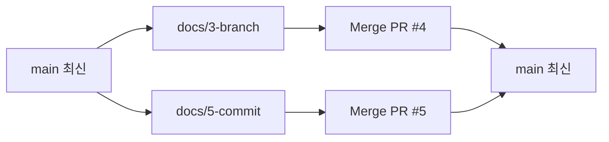

> 이 글은 **GIT & GITHUB · 팀 협업 드릴(16문제)** 전체를 기록한 devlog입니다.
> 혼자 명령 하나씩 연습하던 것에서 벗어나, 팀(4명)이 이슈 → 브랜치 → PR → 리뷰 → 병합 한 바퀴를 돌고, 그 바퀴가 어긋났을 때(뒤처진 PR · 잘못된 병합 · 비밀 파일)까지 되돌려 보는 드릴이다.
> 문제마다 `문제 상황 → 시도한 방법 → 막혔던 점 → 해결 과정 → 배운 점` 순서로 정리했다.

## 출발 준비

팀장이 조직에 `git-drill` 저장소를 Public으로 만들고(Add a README file 체크), 전원이 `C:\dev\git-drill`에 clone했다. `git branch`로 `* main`을 확인한 뒤, 팀장이 README 아래에 역할표 4줄을 적어 main에 직접 커밋·push했다 — 이게 이 저장소에서 main에 직접 push하는 마지막 순간이었다.

| 역할 | 인원 | 하는 일 |
|---|---|---|
| 팀장 | 1 | 저장소 생성 · 최종 병합 · 되돌리기 결정 |
| 템플릿 담당 | 1 | P0에서 `.github/` 템플릿 두 개를 PR로 올림 |
| 리뷰어 | 2 | 모든 PR에 Comment/Approve/Request changes 중 하나를 반드시 남김 |

💡 이후 모든 문제에 공통으로 걸리는 규칙 여섯 가지 — main 직접 push 금지, 모든 PR은 이슈 하나를 가리킴, 리뷰는 질문·제안 1개 필수, 남의 브랜치/PR/이슈를 직접 고치지 않음, `reset --hard`·`rebase`·`push --force` 금지(되돌리기는 `revert`와 GitHub Revert 버튼만), 명령 전후 `git status`·`git branch` 확인 — 을 드릴 내내 지켰다.

#### 막혔던 점
🔴 organization을 새로 만든 직후라 관리자가 멤버들에게 저장소 권한(멤버십 승인·쓰기 권한)을 부여하지 않은 상태였다. clone까지는 됐는데, 브랜치를 만들고 `git push -u origin <브랜치>`를 치면 계속 403으로 거부당했다. 처음엔 브랜치 이름이 잘못됐거나 명령을 잘못 친 줄 알고 같은 명령을 여러 번 반복했다.

또 하나, PR이라는 개념 자체를 처음 접해서 왜 브랜치에서 바로 main으로 병합하지 않고 굳이 PR을 열어야 하는지, PR과 이슈가 어떻게 다른지 감이 안 잡혀서 힌트를 하나씩 짚어가며 한참 헤맸다.

#### 해결 과정
🟢 push가 403으로 거부되는 건 명령 문제가 아니라 조직 권한 문제라는 걸 힌트에서 확인하고, 관리자(강사/팀장)에게 바로 알려 organization 설정에서 멤버 권한을 부여받으니 같은 명령이 그대로 통과됐다. PR 개념은 "브랜치의 변경을 main에 합치기 전에 누군가에게 봐 달라고 요청하는 절차"라는 것을 직접 하나 열어보고, Comment/Approve/Request changes가 남는 걸 눈으로 보면서 감을 잡았다.

#### 배운 점
💡 push 실패가 전부 명령 실수는 아니다 — 403처럼 권한 관련 에러는 로컬에서 아무리 다시 시도해도 안 풀리고, 조직 관리자 쪽 설정을 봐야 한다. 그리고 PR은 "병합 버튼"이 아니라 "리뷰와 합의의 기록"이라는 것 — 이슈가 "무엇을 할지"를 적는 곳이라면, PR은 "그걸 어떻게 했고, 남이 확인했는지"가 남는 곳이라는 차이를 이번에 알게 됐다.

---

## P0 — 출발 · 템플릿을 세운다

### 템플릿 두 개를 PR로 올린다

#### 문제 상황
템플릿 담당이 브랜치 `chore/templates`에서 이슈 템플릿(`task.md`)과 PR 템플릿(`pull_request_template.md`)을 만들어 PR을 연다. 경로와 머리말 키 이름(`name`·`about`·`title`·`labels`)은 그대로 두고 문장만 자기 말로 바꾼다.

#### 시도한 방법
```
git switch main
git pull
git switch -c chore/templates
mkdir .github\ISSUE_TEMPLATE
(VS Code로 task.md · pull_request_template.md 작성)
git add -A
git commit -m "이슈/PR 템플릿 추가"
git push -u origin chore/templates
```
GitHub에서 Compare & pull request → 리뷰어가 "리뷰어가 확인할 것" 항목이 판정 가능한 문장인지 보고 Approve → Merge. 병합 뒤 전원 `git switch main` → `git pull`.

#### 막혔던 점
🔴 처음 폴더를 `.Github/Issue_template`처럼 대소문자를 대충 적어서 New issue를 눌러도 템플릿 선택 화면이 안 떴다. GitHub는 이름이 틀려도 에러를 안 띄워서 한참 원인을 못 찾았다.

#### 해결 과정
🟢 `.github`는 점으로 시작, `ISSUE_TEMPLATE`은 대문자라는 걸 다시 확인하고 폴더명을 정확히 맞추니 New issue에 "작업" 템플릿 선택 화면이 바로 떴다.

#### 배운 점
💡 템플릿 안 뜨는 문제의 90%는 이름 문제다. GitHub가 침묵으로 실패하기 때문에, 안 될 때는 기능부터 의심하지 말고 경로·이름부터 확인해야 한다.

---

## Lv.1 — 한 바퀴를 돈다

### 1-1. 이슈 4개 열기

#### 문제 상황
팀원마다 이슈 1개를 "작업" 템플릿으로 연다. 소재는 `rules/` 아래 문서 넷 — `branch.md`(브랜치 이름 규칙) · `commit.md`(커밋 메시지 규칙) · `review.md`(리뷰 규칙) · `release.md`(릴리스 규칙). "끝나면 보이는 것"을 확인할 수 있는 문장으로 2줄 이상 쓴다.

#### 시도한 방법
```
## 무엇을
rules/branch.md 에 브랜치 이름 규칙 3줄을 적는다

## 끝나면 보이는 것
- [ ] rules/branch.md 가 main 에 있고 3줄이다
- [ ] 모든 줄이 "~한다 / ~하지 않는다" 로 끝난다

## 담당
(각자 이름)
```

#### 막혔던 점
🔴 처음엔 "규칙이 잘 정리된다"처럼 확인 불가능한 문장을 썼는데, 짝이 읽고 "이게 되면 통과인지 애매하다"고 지적했다.

#### 해결 과정
🟢 "3줄이다", "~로 끝난다"처럼 세거나 볼 수 있는 문장으로 바꾸니 짝과 O/X가 같아졌다.

#### 배운 점
💡 이슈 템플릿이 칸을 채워줘도, 그 칸에 들어갈 문장이 흐리면 리뷰어가 판정할 수 없다. 확인할 수 있는 문장은 인수 조건과 같은 기준이다.

### 1-2. 이슈 번호를 브랜치·커밋에 담기

#### 문제 상황
자기 이슈로 브랜치 `docs/<이슈번호>-<파일>`을 만들고, 문서 첫 줄을 커밋한다. 메시지는 `#<이슈번호> <무엇을>` 형식. push까지만 하고 PR은 아직 안 연다.

#### 시도한 방법
```
git switch main
git pull
git branch
git switch -c docs/3-branch
(rules/branch.md 첫 줄 작성)
git add rules/branch.md
git commit -m "#3 브랜치 이름 규칙 첫 줄"
git push -u origin docs/3-branch
```

#### 막혔던 점
🔴 커밋 메시지에 이슈 번호를 안 넣고 그냥 "브랜치 규칙 추가"라고만 써서 push한 뒤, GitHub에서 이슈 #3을 열어봤는데 타임라인에 커밋이 안 걸려 있었다.

#### 해결 과정
🟢 커밋 메시지 맨 앞에 `#3`을 넣어 다시 커밋하고 push하니 이슈 타임라인에 그 커밋이 바로 연결됐다.

#### 배운 점
💡 GitHub는 커밋 메시지의 `#N`을 읽고 자동으로 이슈에 연결해준다. 그냥 참고용 문구가 아니라 실제로 동작하는 연결 장치다.

### 1-3. Closes #N — 병합하면 이슈가 닫히나

#### 문제 상황
1-2의 브랜치로 PR을 열고 템플릿의 `Closes #` 뒤에 이슈 번호를 채운다. 리뷰어 1명이 Approve → 병합 → 이슈가 닫혔는지 확인한다.

#### 시도한 방법
```
[ GitHub ] Pull requests → New → base: main ← compare: docs/3-branch
## 이 PR 이 닫는 이슈
Closes #3
## 바꾼 것
- rules/branch.md 첫 줄
```
리뷰어가 Files changed를 보고 Approve → Merge pull request.

#### 막혔던 점
🔴 처음에 `Closes #3` 대신 실수로 PR 번호를 적었는데(PR 번호가 5번이었음), 병합해도 이슈 #3이 안 닫혔다.

#### 해결 과정
🟢 이슈 탭에서 내 이슈 번호를 다시 확인하고 `Closes #3`으로 고쳐 다시 커밋하니, 다음 병합에서 이슈가 정상적으로 Closed로 바뀌었다.

#### 배운 점
💡 이슈와 PR은 같은 번호대를 공유해서 헷갈리기 쉽다. `Closes #N`은 반드시 이슈 번호여야 하고, main으로 병합될 때만 작동한다.

### 1-4. 리뷰 3종을 한 번씩

#### 문제 상황
남은 PR 셋을 각자 열고(Closes # 채움), 리뷰어들이 Comment · Approve · Request changes를 한 번씩 남긴다. Request changes 받은 PR은 아직 고치지 않는다.

#### 시도한 방법
```
[ 리뷰어 ] PR → Files changed → Review changes
  PR A: ○ Comment          "이 줄은 어떤 뜻인가요?"
  PR B: ○ Approve          "예시를 한 줄 더 넣으면 어떨까요"
  PR C: ○ Request changes  "2번 줄이 판정할 수 없습니다 — 숫자를 넣어 주세요"
```

#### 막혔던 점
🔴 Request changes를 남길 때 처음엔 "이 부분 애매해요"라고만 써서, 담당자가 뭘 어떻게 고쳐야 할지 되물어왔다.

#### 해결 과정
🟢 "2번 줄이 판정할 수 없습니다. 몇 줄인지 숫자를 넣어 주세요"처럼 구체적인 지시로 바꾸니 담당자가 바로 이해했다.

#### 배운 점
💡 Comment·Approve·Request changes는 단순히 "좋다/싫다"가 아니라 각기 다른 의미(막지 않음 / 병합 가능 / 병합 금지)를 가진 판정이고, Request changes 코멘트는 다음 커밋을 위한 구체적 지시여야 한다.

### 1-5. 병합 뒤 전원 pull — 그래프로 읽는다

#### 문제 상황
병합된 PR이 2개 이상 된 시점에 전원이 `git switch main` → `git pull` → `git log --oneline --graph`를 치고, 갈라지고 합쳐진 모양을 그린다.

#### 시도한 방법
```
git switch main
git pull
git log --oneline --graph
*   ab12 Merge pull request #4 …
|\
| * cd34 #3 브랜치 이름 규칙 첫 줄
|/
*   ef56 …
```

#### 막혔던 점
🔴 팀원 한 명의 그래프 모양이 나머지 셋과 달랐다 — 확인해보니 병합 후 `git pull`을 안 하고 바로 `git log`를 친 것이었다.

#### 해결 과정
🟢 그 팀원이 `git pull`을 한 뒤 다시 `git log --oneline --graph`를 치니 넷의 그래프가 같은 모양이 됐다.

#### 배운 점
💡 남이 병합한 커밋은 내가 `git pull`하기 전엔 내 컴퓨터에 없다. 그래프가 다른 사람을 찾는 게 곧 pull을 안 한 사람을 찾는 것과 같다.



### 1-6. 템플릿 항목 하나를 빼면 리뷰가 어떻게 달라지나

#### 문제 상황
템플릿 담당이 PR 템플릿에서 "바뀐 파일이 이슈에 적힌 파일뿐이다" 한 줄을 빼는 PR을 낸다. 그다음 다른 팀원이 이슈에 없는 파일을 슬쩍 하나 더 고친 PR을 내고, 리뷰어가 잡아내는지 본다.

#### 시도한 방법
```
[ 템플릿 담당 ] 이슈 "PR 템플릿에서 한 줄 빼기" → docs/9-template → 줄 삭제 → PR → 병합
[ 다른 팀원 ]   이슈 "commit.md 규칙 추가" → 브랜치 → commit.md 고침
                + review.md 도 한 줄 슬쩍 → PR (템플릿에 그 줄이 없다)
```

#### 막혔던 점
🔴 그 줄이 빠진 템플릿으로 리뷰하다 보니, 리뷰어가 실제로 Files changed 탭을 열어볼 생각을 못 하고 본문만 보고 Approve할 뻔했다.

#### 해결 과정
🟢 병합 직전에 습관적으로 Files changed를 다시 확인해서 `review.md`가 이슈에 없던 파일이라는 걸 발견하고 Request changes로 돌려보냈다. 그 뒤 템플릿 담당이 그 줄을 되살리는 PR을 내고 병합했다.

#### 배운 점
💡 PR 템플릿의 체크리스트는 리뷰어의 눈을 대신한다. 줄이 하나 빠지는 것만으로도 리뷰어가 놓치는 지점이 생긴다는 걸 직접 겪었다.

---

## Lv.2 — 바퀴가 어긋났을 때

### 2-1. 내 PR이 뒤처졌다 — main을 따라잡고 충돌을 푼다

#### 문제 상황
A와 B가 같은 파일 `rules/review.md`의 같은 줄을 각자 브랜치에서 다르게 고친다. A의 PR이 먼저 병합되고, B의 PR 화면에 충돌 표시가 뜬다.

#### 시도한 방법
```
[ B ]
git switch main
git pull
git switch docs/7-review-b
git merge main
→ CONFLICT (content): rules/review.md
(VS Code 로 <<<<<<< ======= >>>>>>> 사이를 한 줄로 합친다)
git add rules/review.md
git commit -m "#7 main 따라잡기 · 충돌 해결"
git push
```

#### 막혔던 점
🔴 방향이 헷갈렸다. 수업 때는 main에 서서 브랜치를 merge했는데, 이번엔 내 브랜치에 서서 main을 merge해야 해서 처음엔 반대로 시도해 오히려 뒤처짐이 더 심해졌다.

#### 해결 과정
🟢 "내가 갈라진 뒤 main이 앞서갔다"는 상황을 다시 그려보고, 내 브랜치(`docs/7-review-b`)에 선 채로 `git merge main`을 실행하니 충돌 표시가 파일에 정확히 나타났고, A와 B의 뜻을 둘 다 살려 한 줄로 정리한 뒤 push하자 PR의 충돌 경고가 사라졌다.

#### 배운 점
💡 "뒤처진 PR"은 내가 갈라진 뒤 main이 앞으로 간 상태다. 충돌을 풀 때는 어디에 서서 무엇을 끌어오는지부터 그려야 방향을 안 헷갈린다. GitHub 웹 에디터가 아니라 로컬에서 풀어야 커밋 메시지에 맥락(#7 main 따라잡기)을 남길 수 있다.

### 2-2. 반려 → 같은 브랜치에 고쳐 다시 요청

#### 문제 상황
1-4에서 Request changes를 받은 사람이 같은 브랜치에서 코멘트대로 고치고 커밋·push한다.

#### 시도한 방법
```
git switch docs/8-release
(코멘트대로 2번 줄에 숫자 추가)
git add -A
git commit -m "#8 리뷰 반영: 2번 줄에 줄 수 명시"
git push
```
PR에 "고쳤습니다 — 2번 줄에 숫자 추가" 코멘트 후 리뷰어에게 다시 리뷰 요청.

#### 막혔던 점
🔴 반려당했다고 생각해서 처음엔 브랜치를 지우고 새 PR을 열려고 했다.

#### 해결 과정
🟢 팀원이 "PR은 브랜치를 가리키니까 같은 브랜치에 커밋만 더 쌓으면 된다"고 알려줘서, 그대로 같은 브랜치에 이어서 커밋·push했더니 기존 PR에 새 커밋이 자동으로 얹혔다.

#### 배운 점
💡 PR은 대화다. 반려당했다고 브랜치를 지우고 새로 열면 리뷰 기록(타임라인)이 끊긴다. 같은 자리에서 이어가는 게 맞다.

### 2-3. 잘못 병합된 PR을 되돌린다 — GitHub의 Revert

#### 문제 상황
누군가 `rules/commit.md`에 점심 메뉴처럼 상관없는 내용을 쓴 PR을 내고, 리뷰어가 일부러 Approve, 병합한다. 팀장이 Revert 버튼으로 되돌린다.

#### 시도한 방법
```
[ 아무나 ] 이슈 "commit.md 예시 추가" → 브랜치 → 점심 메뉴 한 줄 → PR
[ 리뷰어 ] (일부러) Approve → Merge
[ 팀장 ]  병합된 PR 페이지 맨 아래 → Revert → 새 PR 오픈
          Closes #(되돌리기 이슈) → 리뷰어 Approve → Merge
```

#### 막혔던 점
🔴 병합 커밋은 부모가 둘이라 터미널로 되돌리려면 `git revert -m 1`처럼 옵션이 필요하다는 걸 알고 살짝 긴장했다.

#### 해결 과정
🟢 GitHub의 Revert 버튼을 쓰니 그 복잡한 옵션 없이 되돌리기 PR이 자동으로 만들어졌고, 그 PR도 똑같이 이슈 → 리뷰 → 병합 절차를 거쳤다.

#### 배운 점
💡 Git은 지우지 않고 쌓는다. 되돌리기도 새 커밋이라서 `git log`에는 원래 커밋과 Revert 커밋이 둘 다 남는다 — 그래서 "누가 언제 왜 되돌렸는지"가 기록에 남는다.

### 2-4. 이슈로 일을 나눈다 — 담당자·라벨·진행 코멘트

#### 문제 상황
`rules/release.md`를 세 절(버전 이름·릴리스 전 확인·공지)로 나눠 이슈 3개를 열고, 각 이슈에 Assignees와 라벨 `task`·`docs`를 붙인다.

#### 시도한 방법
```
[ 팀장 ] Issues → New issue(작업 템플릿) × 3
         Assignees → 담당 지정 / Labels → task, docs(새로 만들기)
[ 담당 ] 이슈에 "시작합니다" → git switch main → pull → switch -c docs/N-release-…
         (자기 절만 고친다) → PR (Closes #N) → 리뷰 → 병합
```

#### 막혔던 점
🔴 세 사람이 같은 파일의 다른 절을 나눠 맡았는데, 한 명이 절 경계 바로 위 줄까지 살짝 건드려서 충돌이 한 번 났다.

#### 해결 과정
🟢 절과 절 사이에 빈 줄을 하나씩 두는 규칙을 정하고 나서는 같은 파일을 셋이 나눠 고쳐도 충돌이 안 났다.

#### 배운 점
💡 Assignees는 역할표의 "파일 하나 = 담당 하나"를 GitHub 기능으로 옮긴 것이고, 라벨은 이슈가 많아졌을 때 거르는 용도다. 같은 파일이라도 절 경계에 여유를 두면 충돌을 줄일 수 있다.

---

## Lv.3 — 릴리스와 사고 대응

### 3-1. 첫 릴리스 — 태그를 붙이고 변경 목록을 로그에서 뽑는다

#### 문제 상황
지금까지 병합된 것을 `v0.1`로 묶고, 파일을 열어보지 않고 `git log`만으로 `CHANGELOG.md`를 작성한다.

#### 시도한 방법
```
[ 팀장 ] git switch main → git pull
         git tag v0.1
         git push origin v0.1
[ 담당 ] 이슈 "CHANGELOG 첫 판" → 브랜치
         git log --oneline → Merge 줄만 골라 옮긴다
# v0.1
- #3 브랜치 이름 규칙 (rules/branch.md)
- #7 리뷰 규칙 충돌 해결 (rules/review.md)
- #8 릴리스 규칙 (rules/release.md)
```

#### 막혔던 점
🔴 태그를 만들고 `git push`만 쳤더니 GitHub 저장소의 태그 목록에 `v0.1`이 안 보였다.

#### 해결 과정
🟢 `git push`는 태그를 올리지 않는다는 걸 알고 `git push origin v0.1`을 따로 쳤더니 태그가 바로 보였다.

#### 배운 점
💡 CHANGELOG는 병합 커밋 메시지(PR 번호·제목)에서 나온다. 파일을 하나도 안 열어봐도 `git log --oneline`만으로 "무엇이 바뀌었는지" 설명할 수 있다는 걸 확인했다.

### 3-2. 사고 대응 2건 — main 직접 push · 비밀 파일 커밋

#### 문제 상황
① 팀원 한 명이 `rules/branch.md`를 main에서 직접 고쳐 push한다(규칙 1 위반). ② 누군가 `.env` 파일(가짜 값 `SECRET=1234`)을 커밋·push·PR한다.

#### 시도한 방법
```
① [ 팀원 ] git switch main → (branch.md 고침) → add → commit → push   ← 사고
   [ 팀장 ] git pull → git log --oneline -1 → git revert HEAD → git push
② [ 누군가 ] 브랜치 → .env 에 SECRET=1234 → add -A → commit → push → PR
   [ 리뷰어 ] Files changed 에 .env → Request changes "비밀 파일"
   [ 담당 ]   .env 삭제 → .gitignore 에 .env 한 줄 → add -A → commit → push → 재요청 → 병합
```

#### 막혔던 점
🔴 ②에서 `.env`를 지우고 `.gitignore`에 추가한 뒤 병합까지 마쳤는데, PR의 Commits 탭을 열어보니 첫 커밋에 `SECRET=1234`가 여전히 그대로 보였다.

#### 해결 과정
🟢 삭제 커밋을 해도 그 파일이 들어 있던 옛 커밋은 히스토리에 그대로 남는다는 걸 확인했다. 이번엔 가짜 값이라 재발급 없이 넘어갔지만, 진짜 비밀값이었다면 지우는 게 아니라 값 자체를 재발급하는 게 유일한 복구라는 걸 팀 규칙에 적었다.

#### 배운 점
💡 ①은 규칙이 "부탁"이라서 깨진다 — 사람이 실수하면 revert로 되돌리고 규칙 문장을 다시 남겨야 한다. ②는 복구보다 발견이 핵심이다 — Git은 지우는 게 아니라 쌓는 도구라서, 한 번 커밋된 값은 삭제 커밋 뒤에도 히스토리에서 열어볼 수 있다.

---

## 보너스 — 심화

### B-1. 반려 이유를 PR 템플릿 체크리스트로 되돌려 넣는다

#### 문제 상황
지금까지 받은 Request changes 코멘트를 모아 PR 템플릿의 "리뷰어가 확인할 것"을 보강한다.

#### 시도한 방법
```
반려 코멘트 모음 → 항목
"숫자가 없어요"        → - [ ] 규칙 문장에 숫자나 횟수가 하나 이상 있다
"이슈가 없어요"        → - [ ] Closes # 뒤에 이슈 번호가 있다
→ 이슈 → docs/13-template-v2 → PR → 병합 → PR 두 개로 시험
```

#### 막혔던 점
🔴 반려 이유를 그대로 체크리스트 문장으로 옮겼더니 "잘 썼는가"처럼 여전히 판정하기 애매한 항목이 하나 섞여 있었다.

#### 해결 과정
🟢 "이슈 번호가 커밋 메시지 첫머리에 있는가"처럼 O/X로 바로 답할 수 있는 문장으로 다시 고쳐 넣었다.

#### 배운 점
💡 템플릿은 처음부터 완성되지 않는다. 반려 한 번이 체크리스트 한 줄을 만든다는 걸 직접 겪었다.

### B-2. 하던 일을 stash로 치우고 급한 PR을 먼저

#### 문제 상황
자기 브랜치에서 문서를 반쯤 고친 상태(커밋 전)에서 리뷰어가 다른 PR을 지금 고쳐 달라고 한다.

#### 시도한 방법
```
git status                    ← modified: rules/release.md (커밋 전)
git stash
git switch docs/8-release
(고침) → add → commit -m "#8 리뷰 반영" → push
git switch docs/12-release-note
git stash pop
git status
```

#### 막혔던 점
🔴 stash를 하지 않고 그냥 브랜치를 옮기려 했더니 커밋되지 않은 변경이 있어 switch가 막혔다.

#### 해결 과정
🟢 `git stash`로 변경을 서랍에 넣고 브랜치를 옮겨 급한 PR을 먼저 처리한 뒤, 원래 브랜치로 돌아와 `git stash pop`을 하니 반쯤 고친 내용이 그대로 돌아왔다.

#### 배운 점
💡 stash는 커밋 전 변경을 잠깐 치워두는 것뿐이고, 원래 브랜치의 커밋 기록에는 아무 영향을 주지 않는다.

### B-3. CONTRIBUTING.md — 팀 규칙 8줄을 이슈 → PR로

#### 문제 상황
드릴에서 겪은 것으로 팀 규칙 8줄을 판정 가능한 문장으로 `CONTRIBUTING.md`에 쓴다.

#### 시도한 방법
```
# CONTRIBUTING
1. 브랜치 이름은 docs/<이슈번호>-<파일> 로 짓는다
2. 커밋 메시지는 #이슈번호로 시작한다
3. PR 하나는 파일 2개 · 이슈 하나까지다
4. 리뷰 요청을 받으면 24시간 안에 셋 중 하나를 남긴다
5. 이슈 없는 PR 은 Request changes 로 돌려보낸다
6. main 에 직접 push 하지 않는다 — 했으면 revert 하고 PR 로 다시
7. 비밀값은 .env 에, .env 는 .gitignore 에. 올라갔으면 재발급
8. 되돌리기는 revert 로만 — 기록을 지우지 않는다
```

#### 막혔던 점
🔴 "PR 크기"와 "리뷰 응답 시간"처럼 숫자를 정해야 하는 항목에서 팀원마다 생각하는 기준이 달라 잠깐 의견이 갈렸다.

#### 해결 과정
🟢 드릴에서 실제로 겪은 경계(파일 2개까지 나눠 맡았던 2-4, 반려 후 재요청까지 걸린 시간)를 근거로 숫자를 정하니 합의가 빨랐다.

#### 배운 점
💡 8줄은 드릴에서 겪은 문제 하나씩에 대응한다. 겪어보지 않은 상황은 규칙으로 못 쓴다는 걸 체감했다.

---

## 16문제를 다 풀어보고 나서

| 구간 | 새로 배운 것 | 핵심 도구 |
|---|---|---|
| P0 | 이슈/PR 템플릿 설정 | `.github/ISSUE_TEMPLATE`, `pull_request_template.md` |
| Lv.1 | 이슈 ↔ 브랜치 ↔ 커밋 ↔ PR 연결 | `#N`, `Closes #N`, 코드 리뷰 3종 |
| Lv.2 | 어긋난 바퀴 되돌리기 | merge 충돌 해결, Re-request review, GitHub Revert, Assignees/Labels |
| Lv.3 | 릴리스와 사고 복구 | 태그(`git tag`), `CHANGELOG`, `revert`, `.gitignore` |
| 보너스 | 팀 규칙을 도구로 굳히기 | PR 템플릿 개정, `stash`, `CONTRIBUTING.md` |

가장 인상 깊었던 문제는 2-1이었다 — 수업 때는 항상 main에 서서 브랜치를 merge했는데, 뒤처진 PR을 따라잡을 때는 방향이 반대라는 걸 직접 충돌을 내보고서야 체감했다. 그리고 3-2에서 `.env`를 지웠는데도 옛 커밋에 값이 남아있는 걸 본 순간이 "Git은 지우지 않고 쌓는다"는 말을 가장 실감한 순간이었다.

## 더 학습하면 좋은 개념

- **브랜치 보호 규칙(Branch Protection Rules)** — 2-3에서 겪은 "대충 Approve되고 병합된 PR" 사고를 애초에 막는 GitHub 설정이다. 리뷰 승인 없이는 병합을 못 하도록 강제할 수 있다.
- **git revert -m 1** — 2-3에서 버튼으로 처리했던 병합 커밋 되돌리기를 터미널에서 직접 하려면 필요한 옵션이다. 부모가 둘인 병합 커밋을 되돌릴 때 어느 부모를 기준으로 할지 지정한다.
- **GitHub Releases** — 3-1에서 만든 태그(`v0.1`)에 설명과 파일을 붙여 공개하는 화면이다. CHANGELOG를 태그와 묶어 배포 단위로 관리하는 다음 단계다.
- **CODEOWNERS 파일** — 2-4의 Assignees처럼 "누가 무엇을 리뷰해야 하는가"를 파일/폴더 단위로 자동 지정하는 설정이다. 팀 규모가 커질수록 필요해진다.
- **히스토리에서 민감 정보를 완전히 제거하는 도구** — 3-2에서 "삭제해도 히스토리엔 남는다"를 확인했는데, 진짜 비밀값이 올라갔을 때 히스토리 자체를 정리하는 도구(`git filter-repo` 등)가 따로 있다. 이 드릴에서는 다루지 않았지만 실제 사고 시엔 재발급이 우선이라는 전제를 알고 접근해야 한다.

## 참고 자료
- [GitHub 공식 문서 - Creating an issue template for your repository](https://docs.github.com/en/communities/using-templates-to-encourage-useful-issues-and-pull-requests/creating-issue-templates)
- [GitHub 공식 문서 - Linking a pull request to an issue](https://docs.github.com/en/issues/tracking-your-work-with-issues/linking-a-pull-request-to-an-issue)
- [GitHub 공식 문서 - Reverting a pull request](https://docs.github.com/en/pull-requests/collaborating-with-pull-requests/incorporating-changes-from-a-pull-request/reverting-a-pull-request)
- [Git 공식 문서 - git revert](https://git-scm.com/docs/git-revert)
- [Git 공식 문서 - git merge](https://git-scm.com/docs/git-merge)
- [Git 공식 문서 - git stash](https://git-scm.com/docs/git-stash)
- [Git 공식 문서 - git tag](https://git-scm.com/docs/git-tag)
- [GitHub 공식 문서 - About protected branches](https://docs.github.com/en/repositories/configuring-branches-and-merges-in-your-repository/managing-protected-branches/about-protected-branches)
