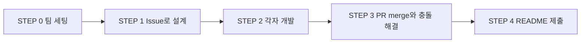
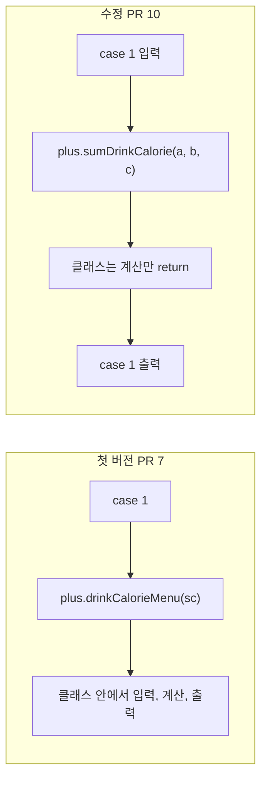
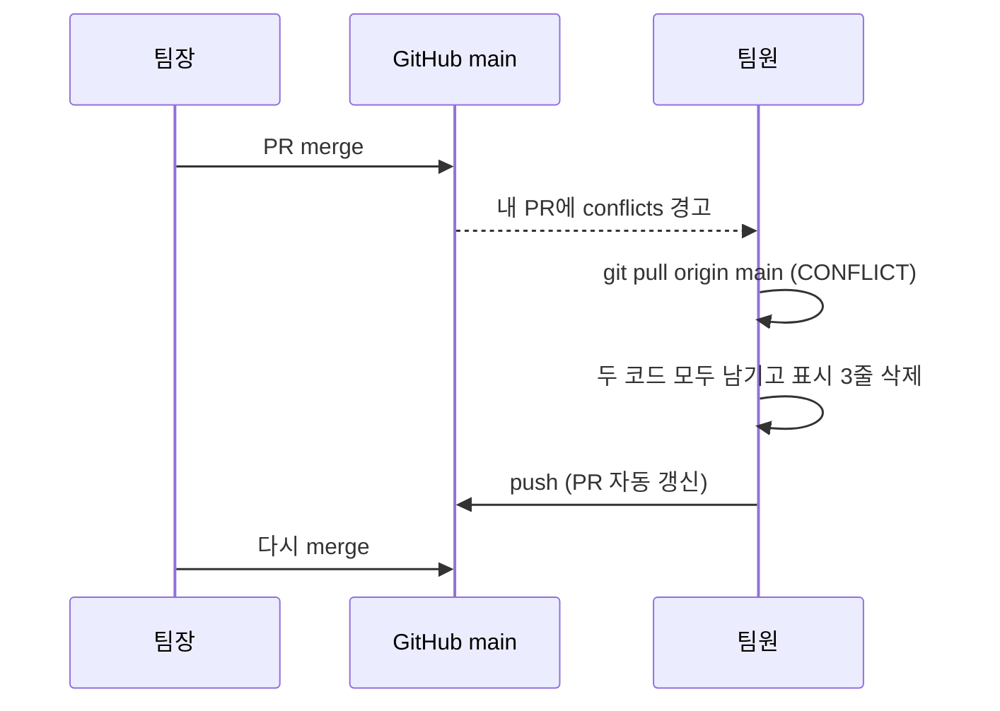

> 이 글은 **우리 팀 식단 계산기** 팀 과제의 devlog입니다.
> 변수·연산자·조건문·반복문·메소드를 한 프로그램에 모으고, Issue → 브랜치 → Pull Request → merge로 팀이 코드를 합치는 과제입니다. 우리 팀(부끄뿌끄)은 컨셉을 **음료 칼로리 계산기**로 잡았고, 나는 **팀원 A(팀장) · PlusCalculator · 메뉴 1**을 맡았습니다.
> 팀 저장소: [bukkeu/bk-food-calculator](https://github.com/bukkeu/bk-food-calculator)

## 과제 한눈에 보기

팀마다 GitHub 저장소 하나에 계산기를 만듭니다. 팀원이 사칙연산 하나씩을 맡아 자기 클래스를 만들고, 공용 파일 `Application.java`에는 메뉴 한 줄과 `case` 하나만 추가합니다.

| 담당 | 클래스 | 메뉴 | 우리 팀 기능 | Issue | PR |
|---|---|---|---|---|---|
| 팀원 A (팀장, 나) | `PlusCalculator` | 1 | 오늘 마신 음료 칼로리 합계 | #1 | #7, #10 |
| 팀원 B | `MinusCalculator` | 2 | 목표 칼로리까지 남은 양 | #2 | #11 |
| 팀원 C | `MultiplyCalculator` | 3 | n인분 칼로리 표 | #3 | #6, #9, #12, #14 |
| 팀원 D | `DivideCalculator` | 4 | 배달비 나눠 내기 | #4 | #5, #8, #13 |

💡 과제가 일부러 설계한 구조가 있습니다. 계산 클래스는 한 사람만 만들기 때문에 충돌이 나지 않고, 모두가 같은 자리를 고치는 `Application.java`에서만 충돌이 납니다. 충돌은 실패가 아니라 **이번 과제의 목표**입니다.



## STEP 0. 팀 세팅

### 문제 상황
코드를 쓰기 전에 팀 컨셉, 역할, 저장소를 정해야 했습니다. 팀장은 저장소를 만들고 팀원을 초대하고, `Application.java` 뼈대를 main 브랜치에 첫 push 하는 것까지 맡습니다. 팀장도 기능 1개를 똑같이 맡습니다.

### 시도한 방법
- 컨셉: 칼로리 대상을 음식에서 **음료**로 바꿨다. 과제도 "팀 컨셉에 맞게 주제는 바꿔도 되지만 메소드가 받는 값과 돌려주는 값의 모양은 그대로 둔다"고 했다.
- 저장소: `bk-food-calculator`, 패키지 `com.bukkue`. 9월 29일 16시 20분에 뼈대를 첫 커밋(`원본`)으로 올렸다.
- 뼈대는 `do-while`로 메뉴를 반복하고 `switch`로 분기하며, 각자 코드를 넣을 자리가 주석 `(1)` 메뉴 줄, `(2)` case 블록으로 표시되어 있다.

### 막혔던 점
🔴 뼈대를 올릴 때 주석으로 표시한 자리가 `(1)` 메뉴 줄, `(2)` case 블록뿐이라, 팀원이 어디에 어떻게 끼워 넣을지 처음부터 분명하지 않았다. 그래서 뼈대를 올린 뒤 "여기에 추가해주세용" 같은 안내 주석을 한 번 더 달았다.

### 해결 과정
🟢 자리마다 안내 주석을 붙여 팀원이 같은 위치에 한 줄씩만 추가하게 했다. 팀원의 코드를 팀장이 한 파일에서 합치는 구조라서, 합쳐질 자리를 미리 정해 두는 것이 충돌을 예측하는 첫 단계였다.

### 배운 점
💡 공용 파일의 뼈대는 팀장이 만들고, 팀원이 고칠 자리를 주석으로 못 박아 두면 충돌이 어디서 날지 미리 알 수 있다.

## STEP 1. Issue로 설계하기

### 문제 상황
코드보다 문서가 먼저입니다. 기능을 GitHub Issue에 글로 쓰고, 팀원 댓글(질문·제안 1개 이상)을 받은 뒤 팀장의 "설계 확정" 댓글이 달리면 코딩을 시작합니다. 여기서 정한 메뉴 번호·클래스 이름·메소드 이름·매개변수·반환타입은 팀 전체가 믿고 쓰는 약속입니다.

### 시도한 방법
내 Issue는 `#1`, 제목은 `[메뉴 1] …` 형식으로 쓰고 클래스 `PlusCalculator.java`, 메소드 `sumDrinkCalorie(int morning, int lunch, int afternoon)`를 정했다. 과제 힌트대로 `c_method/Application01`의 `sumTwoNumber` 선언부에서 매개변수 하나를 더 이은 모양이다.

### 막혔던 점
🔴 팀원마다 메소드 이름을 따로 지었더니 이름이 서로 어색하게 갈렸다. 우리 팀 README에도 `ser3`, `serving`, `minus`, `judge`, `DivideCalculator`처럼 스타일이 제각각인 이름이 남았다. Issue에서 이름 규칙을 먼저 맞추지 않은 결과다.

### 해결 과정
🟢 내 메소드는 "무엇을 하는지 드러나게 영어 소문자로 시작한다"는 과제 규칙에 맞춰 `sumDrinkCalorie`로 지었다. 팀 전체 이름은 README의 표에 한 번에 모아 서로 겹치지 않는지 확인했다.

### 배운 점
💡 Issue에 적은 이름과 모양이 곧 팀의 계약서라서, 개발 중에 바꾸고 싶으면 코드를 먼저 고치지 않고 Issue 댓글 → 본문 수정 → 코드 순서로 가야 한다. 이름 규칙(동사로 시작, 클래스 이름과 겹치지 않기)은 설계 단계에서 같이 정해 두는 편이 낫다.

## STEP 2. 각자 개발하기

### 문제 상황
`feature/<Issue번호>-<기능명>` 브랜치에서 내 클래스를 만들고, `Application.java`에는 메뉴 한 줄과 case 하나만 추가합니다. 과제 요구사항 R3은 **계산은 전부 내 클래스의 메소드에서 하고, `case`는 입력받기 · 메소드 호출 · 결과 출력만 한다**는 것입니다.

### 시도한 방법
브랜치 `feature/1-drink-sum`에서 작업해 9월 29일 17시 15분에 `feat: 오늘 마신 음료 칼로리 합계 (#1)`을 커밋하고 PR #7로 올려 17시 47분에 merge했다.

첫 버전은 `PlusCalculator`를 `Application.java` 아래에 같이 두었고, 입력·계산·출력을 클래스의 메소드 하나가 전부 했다.

```java
// PR #7 — 첫 버전 (Application.java 안의 클래스)
class PlusCalculator {
    // 화면 : 입력받고, 계산 메소드를 부르고, 결과를 출력한다
    public void drinkCalorieMenu(Scanner sc) {
        System.out.print("오전 음료 칼로리 : ");
        int morning = sc.nextInt();
        // ... 점심 후, 오후 입력 ...
        int total = sumDrinkCalorie(morning, lunch, afternoon);
        System.out.println("오늘 마신 음료는 총 " + total + " kcal 입니다.");
    }

    public int sumDrinkCalorie(int morning, int lunch, int afternoon) {
        return morning + lunch + afternoon;
    }
}
```

다음 날 아침(9월 30일 8시 52분) `fix: 안내문 구조에 맞게 PlusCalculator 분리 (#1)`로 고쳐 PR #10으로 올렸다. 클래스를 `PlusCalculator.java`로 분리하고, 입력·출력은 `case`로 옮겨 클래스에는 계산 메소드만 남겼다.

```java
// PR #10 — PlusCalculator.java
package com.bukkue;

public class PlusCalculator {

    public int sumDrinkCalorie(int morning, int lunch, int afternoon) {
        return morning + lunch + afternoon;
    }
}
```

```java
// PR #10 — Application.java 의 case 1
case 1: {
    System.out.print("오전 음료 칼로리 : ");
    int morning = sc.nextInt();
    System.out.print("점심 후 음료 칼로리 : ");
    int lunch = sc.nextInt();
    System.out.print("오후 음료 칼로리 : ");
    int afternoon = sc.nextInt();

    PlusCalculator plus = new PlusCalculator();

    int total = plus.sumDrinkCalorie(morning, lunch, afternoon);

    System.out.println("오늘 마신 음료는 총 " + total + " kcal 입니다.");
    break;
}
```



### 막혔던 점
🔴 PR #7을 merge하고 나서야 첫 버전이 과제의 구조와 다르다는 걸 알았다. 클래스가 `Application.java` 안에 들어 있었고, 입력과 출력까지 `PlusCalculator`가 하고 있어 "case는 입력·호출·출력, 계산은 클래스" 규칙(R3)과 맞지 않았다. 팀장이라 내 PR이 다른 팀원이 따라 할 본보기가 되는 상황이어서, 그대로 두면 팀 전체가 같은 구조로 갈 수 있었다.

### 해결 과정
🟢 안내문의 구조를 다시 읽고, 클래스를 별도 파일로 분리하고 `Scanner`를 받던 메소드를 없앴다. 입력과 출력은 `case 1`로 옮기고, 클래스에는 값 3개를 받아 합을 `return`하는 메소드만 남겼다. 같은 브랜치 이름이 아니라 `feature/1-fix`로 새 PR #10을 열어 merge했다.

### 배운 점
💡 메소드는 "받은 값으로 계산해서 돌려주는 것"까지만 맡기고 입출력은 호출하는 쪽에 두면, 같은 메소드를 다른 화면에서도 쓸 수 있고 팀원 코드와도 겹치지 않는다. 그리고 안내문의 구조는 처음에 한 번 꼼꼼히 읽고 시작해야 나중에 PR을 한 번 더 열지 않는다.

## STEP 3. 합치기와 충돌 해결

### 문제 상황
팀장이 PR을 merge합니다. 첫 PR은 그냥 들어가지만 두 번째부터는 `Application.java`의 같은 자리를 고쳤기 때문에 충돌이 납니다. 해결 규칙은 네 가지입니다. 두 사람의 코드를 모두 남기고, 지우는 건 `<<<<<<<`·`=======`·`>>>>>>>` 세 줄뿐이며, 남의 case 내용은 건드리지 않고, push 전에 두 메뉴가 둘 다 동작하는지 실행합니다.

### 시도한 방법
팀장으로서 메뉴 2번의 PR #11을 9월 30일 11시 28분에 merge했고, 3분 뒤 `Application.java`의 `// ▼ 추가` 같은 임시 주석을 정리하는 커밋을 직접 올렸다. 3번(C)과 4번(D) 팀원은 각자 브랜치에서 `main`을 가져와 merge한 뒤(`Merge branch 'main' … into feature/3-multiply`, `… into feature/4-divide`) PR을 갱신했고, 이후 PR #12, #13, #14가 차례로 merge됐다.

README의 충돌 해결 기록에는 다음을 남겼다.

- PR #5 : main 브랜치에서 pull 받은 후에 작성한 내용을 밑에 추가함.
- PR #6 : 클래스를 Application에서 분리하고, main 브랜치에서 pull 받은 후에 작성한 내용을 밑에 추가함.



### 막혔던 점
🔴 여러 팀원이 같은 시간에 `Application.java`를 고쳐 PR을 올리면 먼저 merge된 쪽을 뺀 나머지가 모두 충돌했다. 3번·4번 PR은 `main`을 가져와 합친 뒤에도 PR이 여러 번(#6·#9·#12·#14, #5·#8·#13) 다시 열려야 했고, 충돌 해결 기록을 PR마다 남기는 일도 뒤처져 #8, #9는 README에서 비어 있다.

### 해결 과정
🟢 한 명씩 merge한 뒤 다음 사람이 `main`을 받아 자기 내용을 아래에 이어 붙이는 순서로 정했다. 오류가 난 PR은 닫고 새로 열지 않고, 같은 브랜치에 push하면 PR이 그대로 갱신된다는 것을 확인했다. 팀장으로서는 merge 순서를 정하고, merge 뒤에 `Application.java`의 임시 주석을 정리했다.

### 배운 점
💡 충돌은 "누가 틀렸다"가 아니라 "같은 자리를 둘이 고쳤다"는 신호다. 한 명씩 merge하고 다음 사람이 `main`을 받아 이어 쓰면 충돌이 줄어들고, 변수명·메소드명은 겹치지 않게 미리 맞춰야 한다.

## STEP 4. README와 제출

### 문제 상황
발표가 없어서 README가 팀의 결과 보고서입니다. 팀원 표(Issue · PR 링크), 실행 화면, 충돌 해결 기록, 협업하며 배운 점을 적습니다.

### 시도한 방법
팀원 표에 Issue · PR 번호와 메소드 이름을 채우고, 메뉴별 실행 화면 스크린샷을 한 표로 나란히 넣었다. 실행 화면 이미지 크기를 맞추느라 9월 30일 14시대에 README 수정 커밋이 여러 번 이어졌다.

### 막혔던 점
🔴 실행 화면 스크린샷이 GitHub README에서 너무 크게 나와 표가 깨졌고, 이미지 크기를 맞추는 README 수정 커밋이 여러 번 이어졌다. 팀원 여러 명이 같은 README를 동시에 고쳐서 이 파일에서도 충돌이 날 수 있는 상태였다.

### 해결 과정
🟢 이미지를 `` 로 크기를 고정해 메뉴별 화면을 한 표에 나란히 놓았다. 코드뿐 아니라 README도 공용 파일이라 한 사람씩 순서대로 고쳤다.

### 배운 점
💡 공용 파일은 코드만이 아니다. README도 같은 규칙(한 명씩 수정, 먼저 pull)을 적용해야 하고, 결과 보고서이므로 실행 화면과 충돌 해결 기록을 PR 번호와 함께 남겨야 나중에 누가 무엇을 했는지 찾을 수 있다.

## 결과

| 확인 항목 | 결과 |
|---|---|
| 클래스 4개(`Plus`·`Minus`·`Multiply`·`Divide`Calculator) | 모두 존재 |
| Issue | #1~#4, 팀원마다 1개 |
| Pull Request | #5~#14, 총 10개 merge |
| 내 PR | #7(첫 구현), #10(구조 수정) — 2회 |
| 충돌 해결 기록 | README에 PR #5, #6 기록 (#8, #9는 미기록) |

가장 기억에 남는 순간은 PR #10이었다. 첫 구현이 merge된 뒤에야 안내문의 구조와 다르다는 걸 알고 같은 기능을 한 번 더 고쳐 올렸는데, 팀장이 만든 PR이 팀의 본보기가 된다는 점을 그때 체감했다.

## 개념 정리

- **매개변수와 반환값**
  - 메소드가 받는 값이 매개변수, 돌려주는 값이 반환값입니다.
  - 값을 돌려주는 메소드는 모든 경로에 `return`이 있어야 하고, 출력만 하는 메소드는 반환타입이 `void`입니다.
  - 이번 과제: `sumDrinkCalorie`는 정수 3개를 받아 정수 1개를 돌려줍니다.

- **객체 생성과 호출 (`new`)**
  - 다른 클래스의 메소드는 `클래스명 변수명 = new 클래스명();` 으로 객체를 만든 뒤 `변수명.메소드()`로 부릅니다.
  - 같은 클래스 안의 메소드끼리는 객체 없이 이름만으로 부를 수 있습니다.

- **Pull Request와 `closes #N`**
  - 내 브랜치를 main에 합쳐 달라는 요청이며, 본문에 `closes #N`을 쓰면 merge될 때 Issue가 자동으로 닫힙니다.

- **병합 충돌 (Merge Conflict)**
  - 같은 파일의 같은 줄을 두 브랜치가 다르게 고쳤을 때 Git이 자동으로 합치지 못하는 상태입니다.
  - 파일 안에 `<<<<<<<` `=======` `>>>>>>>` 표시가 남고, 사람이 직접 정리해서 커밋해야 끝납니다.

## 더 학습하면 좋은 개념

- **브랜치 보호 규칙(Branch Protection Rules)** — 이번 과제는 팀장이 PR을 눈으로 확인하고 merge했다. 리뷰 승인 없이는 merge를 못 하게 GitHub 설정으로 강제하면 같은 규칙이 사람 기억에 의존하지 않게 된다.
- **`git merge` vs `git rebase`** — 충돌 해결 때 `main`을 내 브랜치로 합친 방식이 merge다. rebase는 같은 충돌을 히스토리를 다르게 남기며 푸는 방법이라, 팀의 히스토리 정책을 이해하는 데 필요하다.
- **메소드 오버로딩(Overloading)** — 도전 과제의 "3개 받는 메소드 + 4개 받는 메소드"가 바로 이것이다. 이름은 같고 매개변수만 다른 메소드를 한 클래스에 두는 규칙을 알면 도전 과제를 깔끔하게 풀 수 있다.
- **예외 처리(try-catch)와 입력 검증** — 과제는 숫자만 입력한다고 가정했지만 `Scanner.nextInt()`에 문자를 넣으면 프로그램이 멈춘다. 다음 단계에서 `InputMismatchException`을 다루게 되는 이유를 미리 알 수 있다.
- **CODEOWNERS와 PR 리뷰 자동 지정** — "남의 파일은 고치지 않는다"는 이번 규칙을 파일 단위 리뷰어 지정으로 자동화하는 방법이다. 팀이 커질 때 필요해진다.

## 참고 자료
- [GitHub 공식 문서 - Linking a pull request to an issue](https://docs.github.com/en/issues/tracking-your-work-with-issues/linking-a-pull-request-to-an-issue)
- [GitHub 공식 문서 - Resolving a merge conflict using the command line](https://docs.github.com/en/pull-requests/collaborating-with-pull-requests/addressing-merge-conflicts/resolving-a-merge-conflict-using-the-command-line)
- [Git 공식 문서 - git merge](https://git-scm.com/docs/git-merge)
- [Oracle Java Tutorials - Defining Methods](https://docs.oracle.com/javase/tutorial/java/javaOO/methods.html)
- [Java SE API - Scanner](https://docs.oracle.com/en/java/javase/21/docs/api/java.base/java/util/Scanner.html)
