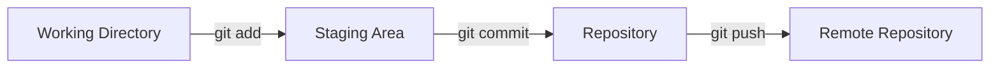
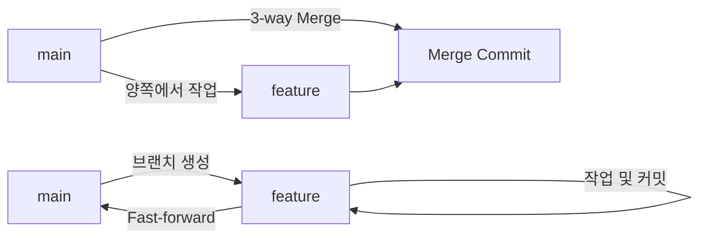

<style>
.page__content { font-size: 0.8em; }
</style>

# 오늘 배운 것: CLI와 Git의 기본기

## 들어가며 (Situation)

오늘은 명령어(CLI)로 컴퓨터를 다루는 법과, Git이 내 코드를 어떻게 버전으로 관리하는지를 배웠다. 명령어를 외우는 것보다, **왜 이렇게 나눠져 있는지**를 이해하는 게 훨씬 중요하다는 걸 느낀 하루였다.

## 문제 상황 (Task)

배워야 했던 건 크게 세 가지였다.

- 마우스로 클릭하는 GUI 대신 굳이 텍스트로 명령어를 입력하는 **CLI를 쓰는 이유**
- Git이 파일을 관리하는 세 가지 작업 영역(Working Directory, Staging Area, Repository)과 `HEAD`가 가리키는 것
- 여러 사람이 함께 작업할 때 코드를 안전하게 나누고 합치는 **브랜치/병합 전략**

그리고 이 개념들을 직접 실습 명령어로 옮기는 과정에서 실제로 에러를 맞닥뜨리며 원인을 파악하는 것도 오늘의 과제였다.

## 해결 과정 (Action)

### 1. CLI를 쓰는 이유

마우스로 클릭하는 GUI 대신 굳이 텍스트로 명령어를 입력하는 CLI를 왜 쓰는지 궁금했는데, 이유는 단순했다.

💡 Git, Docker, AWS 같은 핵심 서버 기술이 전부 CLI 기반으로 동작하기 때문에, CLI를 배우는 것 자체가 이후 학습의 전제 조건이었다.

| 구분 | GUI | CLI |
|---|---|---|
| 조작 방식 | 마우스로 클릭 | 텍스트 명령어 입력 |
| 장점 | 직관적, 배우기 쉬움 | 세밀한 제어, 자동화(스크립트)에 유리 |
| 한계 | 반복 작업·정밀 제어에 약함 | 처음엔 명령어를 외워야 해서 진입장벽이 있음 |

### 2. Git의 3가지 작업 영역과 HEAD

Git이 파일을 어떻게 관리하는지 이해하려면, 파일이 거쳐 가는 세 공간을 먼저 구분해야 했다.

- **Working Directory**
  - 실제로 코드를 작성·수정하는 로컬 폴더.
- **Staging Area**
  - 커밋에 포함할 파일을 임시로 올려두는 공간.
- **Repository**
  - 커밋(버전)이 영구적으로 기록되는 공간 (Local/Remote).



`HEAD`는 지금 내가 작업하고 있는 위치(브랜치나 커밋)를 가리키는 포인터라는 개념도 여기서 같이 이해했다.

### 3. 브랜치와 병합 전략

브랜치는 메인 코드를 안전하게 유지하면서 기능 개발이나 버그 수정을 독립적으로 진행하기 위해 복제해 둔 작업 공간이다. 병합 방식은 크게 두 가지로 나뉜다.

| 병합 방식 | 상황 | 결과 |
|---|---|---|
| Fast-forward Merge | 분기된 브랜치에서만 작업이 일어남 | 충돌 없이 포인터만 앞으로 이동 |
| 3-way Merge | 메인과 분기 브랜치 양쪽에서 작업이 일어남 | 공통 조상을 기준으로 새 병합 커밋 생성 |

협업 브랜치 모델도 팀 규모에 따라 다르다는 걸 알게 됐다.

| 모델 | 브랜치 구성 | 적합한 경우 |
|---|---|---|
| Git Flow | `main`, `develop`, `feature`, `release`, `hotfix` | 주기적 릴리즈가 있는 대형 프로젝트 |
| GitHub Flow | `main`, `feature` | 수시 배포가 일어나는 애자일한 소규모 팀, PR 중심 협업 |



### 4. 실습 명령어 정리

터미널(Git Bash)에서 파일 제어부터 원격 저장소 연동까지 실습한 명령어들이다.

```bash
# CLI 파일/폴더 제어
pwd                     # 현재 작업 디렉토리 절대 경로 확인
ls -a                   # 숨김 폴더(.git 등) 포함 목록 확인
mkdir [폴더명]           # 새 폴더 생성
cd [경로]                # 디렉토리 이동 (cd .. 은 상위 폴더)
touch [파일명]           # 빈 파일 생성

# Git 초기 설정
git config --global user.name "이름"
git config --global user.email "깃허브 이메일"
git init                # 현재 폴더를 Git 저장소로 초기화

# 스테이징과 커밋
git status              # 파일 추적 상태 확인
git add .               # 변경 파일을 Staging Area로 올림
git commit -m "메시지"   # 스테이징된 내용을 커밋
git commit -am "메시지"  # add + commit (단, 이미 추적 중인 파일만 가능)

# 브랜치
git branch [브랜치명]    # 브랜치 생성
git switch [브랜치명]    # 브랜치 이동
git switch -c [브랜치명] # 생성과 동시에 이동

# 되돌리기
git restore [파일명]     # 워킹 디렉토리 변경 사항 취소
git revert [커밋 해시]   # 특정 커밋을 취소 커밋으로 남김

# 원격 저장소
git remote add origin [URL]
git push origin main
git pull origin main
git clone [URL]
```

### 5. 막혔던 것 (시행착오)

실습 중에 세 번 막혔다.

**(1) `git commit -am` 관련 에러**

🔴 새로 만든 파일(`screens.txt`)을 `add` 없이 바로 `-am`으로 커밋하려다가 "Untracked files..." 에러를 만났다.

🟢 `-am` 옵션은 **이미 한 번이라도 추적된 파일의 수정**에만 동작한다는 걸 이 에러를 보고서야 알았다. 새 파일은 반드시 최초 1회 `git add`로 스테이징해야 한다.

**(2) 브랜치 병합 충돌**

🔴 `main`과 `feature/gorilla` 양쪽에서 같은 파일(`tiger.md`)의 같은 줄을 다르게 고쳐서 `CONFLICT (content): Merge conflict in ...` 에러가 발생했다.

🟢 충돌 난 파일을 열어보니 `<<<<<<< HEAD` / `=======` / `>>>>>>> feature/gorilla`로 두 버전이 나란히 표시돼 있었고, IntelliJ의 Merge Tool로 원하는 코드를 고른 뒤 다시 `git add`와 `git commit`을 해서 해결했다.

**(3) `git clone` 이후 `git log`가 먹히지 않는 문제**

🔴 `git clone`으로 원격 저장소를 받은 뒤 `git log`가 동작하지 않았다.

🟢 원인은 단순히 터미널 경로가 클론된 프로젝트 폴더 **바깥**에 머물러 있었기 때문이었다. `cd [프로젝트 폴더명]`으로 `.git` 폴더가 있는 안쪽까지 들어가야 한다는 걸 다시 확인했다.

⚠️ 세 에러 모두 "무엇을 몰라서" 생긴 문제였다는 공통점이 있었다. 에러 메시지를 그냥 넘기지 않고 원인을 짚고 넘어가야겠다고 느꼈다.

## 결과 (Result)

- CLI 명령어를 단순 암기하는 게 아니라 Working Directory → Staging Area → Repository로 이어지는 흐름을 이해하니 `add`와 `commit`이 왜 나뉘어 있는지 자연스럽게 납득이 됐다.
- 에러를 세 번 만났는데, 셋 다 "무엇을 몰라서" 생긴 문제였다는 공통점이 있었다. 앞으로도 에러 메시지를 그냥 넘기지 않고 원인을 짚고 넘어가야겠다.
- 다음 할 일: 팀 미션 회고 작성 및 다른 팀과 결과 공유하기.
- 다음 할 일: 자율 실습 — 내 개인 GitHub 계정에 블로그 기획 저장소 만들고 글 초안 3편 커밋 완료하기.

## 더 학습하면 좋은 개념

- **git rebase** — merge와는 다른 방식으로 브랜치를 합치는 방법이다. 오늘 배운 3-way merge의 대안으로, 커밋 히스토리를 한 줄로 정리하고 싶을 때 알아두면 좋다.
- **.gitignore** — 특정 파일/폴더를 Git 추적에서 제외하는 설정 파일이다. Staging Area에 올리고 싶지 않은 로그·빌드 산출물 등을 다룰 때 필요하다.
- **SSH를 이용한 원격 저장소 인증** — `git remote add origin`으로 원격 저장소를 연결할 때 HTTPS 대신 SSH 키 기반 인증을 쓰면 push/pull 때마다 로그인하지 않아도 된다.
- **git stash** — 작업 중이던 변경 사항을 커밋하지 않고 임시로 치워두는 명령이다. 브랜치를 급하게 전환해야 할 때 오늘 겪은 것과 같은 충돌 상황을 피하는 데 도움이 된다.

## 참고 자료
- [Git 공식 문서 - Git Basics: Recording Changes to the Repository](https://git-scm.com/book/en/v2/Git-Basics-Recording-Changes-to-the-Repository)
- [Git 공식 문서 - Branches in a Nutshell](https://git-scm.com/book/en/v2/Git-Branching-Branches-in-a-Nutshell)
- [Git 공식 문서 - Basic Branching and Merging](https://git-scm.com/book/en/v2/Git-Branching-Basic-Branching-and-Merging)
- [Git 공식 문서 - git clone](https://git-scm.com/docs/git-clone)
- [Git 공식 문서 - Rebasing](https://git-scm.com/book/en/v2/Git-Branching-Rebasing)
- [Git 공식 문서 - gitignore](https://git-scm.com/docs/gitignore)
- [Git 공식 문서 - git stash](https://git-scm.com/docs/git-stash)
- [GitHub 공식 문서 - Connecting to GitHub with SSH](https://docs.github.com/en/authentication/connecting-to-github-with-ssh)
