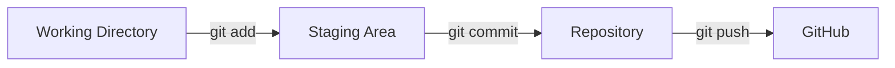
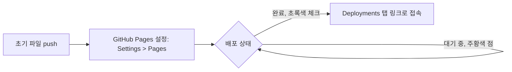

# 오늘 배운 것: 커밋 흐름 정리와 나만의 블로그 만들기

## 들어가며 (Situation)

Git은 **저장 지점을 남기고 되돌릴 수 있게** 해주는 도구라는 걸 다시 정리하면서, 동시에 지금까지 익힌 Git/GitHub 지식을 실제로 써서 나만의 블로그를 처음부터 구축해보는 날이었다.

## 문제 상황 (Task)

- `git add`와 `git commit`이 왜 굳이 단계가 나뉘어 있는지
- `git log`를 실행했을 때 화면이 멈춘 것처럼 보이는 현상의 원인
- GitHub 저장소 하나로 실제 접속 가능한 블로그를 배포하는 방법
- Jekyll 블로그가 깨지지 않으려면 반드시 지켜야 하는 파일 구조와 Front Matter 규칙

## 해결 과정 (Action)

### 1. 커밋까지의 세 단계

| 단계 | 명령 | 하는 일 |
|---|---|---|
| 1 | `git add` | 커밋에 담을 것을 고른다 |
| 2 | `git commit` | 고른 것을 한 덩어리로 기록한다 |
| 3 | `git push` | 기록을 GitHub로 올린다 |

가장 헷갈렸던 건 `add`와 `commit`이 왜 나뉘어 있는가였다.

💡 파일을 두 개 고쳤는데 **하나만 커밋하고 싶을 때**가 있기 때문에, 담을 것을 고르는 단계(`add`)와 기록하는 단계(`commit`)가 분리돼 있다는 걸 이해했다.

### 2. 막혔던 것: `git log`가 멈춘 것처럼 보이는 현상

🔴 `git log`를 쳤더니 화면이 멈춘 것처럼 보였다.

🟢 알고 보니 기록을 보여주는 화면(페이저)이 열린 것이었고, `q`를 누르면 빠져나온다.

### 3. 나만의 블로그 구축 및 커스터마이징

#### 3-1. 기초 환경 세팅 및 필수 도구 활용

CLI 명령어 대신 직관적인 GUI와 통합개발환경을 활용하여 작업 효율을 높였다.

- **Git GUI (소스트리)**
  - 저장소 생성, 스테이징, 커밋, 원격 연결 및 푸시, 협업을 위한 클론 등 복잡한 버전 관리를 직관적인 버튼 클릭으로 진행한다.
- **VS Code 및 마크다운**
  - 터미널에서 `code .`을 입력해 작업 폴더를 에디터로 즉시 실행한다. 이후 제목(`#`), 텍스트 강조(`**`), 목록(`-`), 인용문(`>`), 링크, 코드 블록 등 마크다운 기본 문법을 활용해 글을 작성한다.

#### 3-2. 블로그 저장소 개설 및 초기 배포

GitHub 저장소를 생성하고 설정하여 접속 가능한 나만의 웹페이지를 구축했다.

- **저장소 연동**
  - GitHub에 퍼블릭 저장소를 개설하고, 로컬의 초기 파일들을 소스트리를 통해 원격 저장소에 푸시한다.
- **GitHub Pages 배포**
  - 원격 저장소의 'Settings' > 'Pages' 메뉴에서 브랜치를 'Main'으로 변경하여 저장한다.
- **배포 확인**
  - GitHub의 배포 대기(주황색 점) 상태가 완료(초록색 체크)로 바뀌면, 우측 'Deployments' 탭의 링크를 통해 블로그에 접속할 수 있다.

#### 3-3. 원격 테마 적용 및 커스터마이징

기본 설정 파일인 `_config.yml`을 통해 블로그의 디자인과 환경을 관리했다.

- **환경설정 파일 구성**
  - 최상위 폴더에 `_config.yml` 파일을 만들고 블로그 제목(`title`), 오픈소스 템플릿(`remote_theme`), 시작 페이지 주소(`baseurl`)를 작성한다.
- **자동 재배포**
  - 설정 파일 변경 사항을 커밋하고 푸시하면, GitHub가 Main 브랜치의 업데이트를 감지하여 테마가 적용된 화면으로 자동 재배포를 진행한다.

#### 3-4. 블로그 필수 골격 구조 및 주의사항

오류 없는 블로그 운영을 위해 반드시 지켜야 할 핵심 유지 규칙이다.

🚨 3대 필수 구조 — `index.md`(메인 페이지 역할을 하는 파일), `_posts`(작성한 게시글들이 들어가는 폴더), `_config.yml`(환경설정 파일)의 이름은 규칙상 절대 변경되어서는 안 된다.

- **변수(Front Matter) 설정**
  - 파일 상단 하이픈 3개(`---`) 영역의 `layout`, `title` 등의 키(Key)는 정해진 고정값이다. 메인 페이지는 `layout: home`, 작성한 글이 블로그 포스트로 노출되려면 `layout: post`로 설정해야 한다.

⚠️ 제공되는 오픈소스 테마나 레퍼런스는 버전 업데이트에 따라 호환되지 않을 수 있으므로, 적용 후 직접 테스트를 거쳐야 한다.

## 결과 (Result)

- `add`와 `commit`이 분리되어 있는 이유(파일을 부분적으로만 커밋하고 싶을 때가 있다는 것)를 이해했다.
- `git log`처럼 화면이 멈춘 것처럼 보이는 명령어도 사실은 페이저가 열린 정상 동작이라는 것, `q`로 빠져나오면 된다는 걸 알게 됐다.
- 저장소 생성부터 GitHub Pages 배포, `_config.yml` 테마 적용까지 나만의 블로그를 처음으로 직접 완성했다. 아침에 "내일 볼 것"으로 남겨뒀던 마크다운 글쓰기와 배포가 같은 날 오후 실습으로 이어진 것이다.

## 더 학습하면 좋은 개념

- **git log 옵션과 페이저 제어** — `--oneline`, `--graph`, `--no-pager` 같은 옵션을 알면 오늘 겪은 것처럼 화면이 멈춘 것처럼 보이는 상황을 줄일 수 있다.
- **Jekyll Front Matter 전체 옵션** — 오늘은 `layout`, `title` 정도만 다뤘지만, `permalink`, `categories`, `date` 등 더 많은 예약 변수가 있다.
- **GitHub Pages 커스텀 도메인 연결** — `github.io` 대신 직접 구매한 도메인을 블로그 주소로 쓰고 싶을 때 필요한 다음 단계다.
- **정적 사이트 생성기(SSG) 비교 (Jekyll vs Hugo vs Next.js)** — 오늘 Jekyll로 블로그를 만들어봤으니, 왜 이 방식(SSG)을 쓰는지, 다른 선택지와는 뭐가 다른지 비교해보면 좋다.

## 참고 자료
- [Git 공식 문서 - git log](https://git-scm.com/docs/git-log)
- [Jekyll 공식 문서 - Front Matter](https://jekyllrb.com/docs/front-matter/)
- [Jekyll 공식 문서 - Configuration](https://jekyllrb.com/docs/configuration/)
- [GitHub 공식 문서 - GitHub Pages](https://docs.github.com/en/pages)
