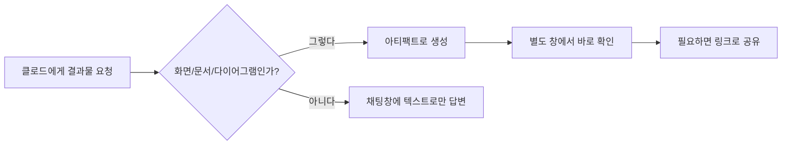
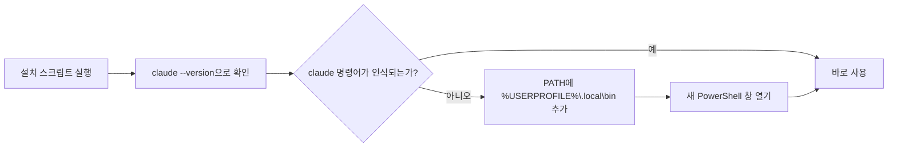
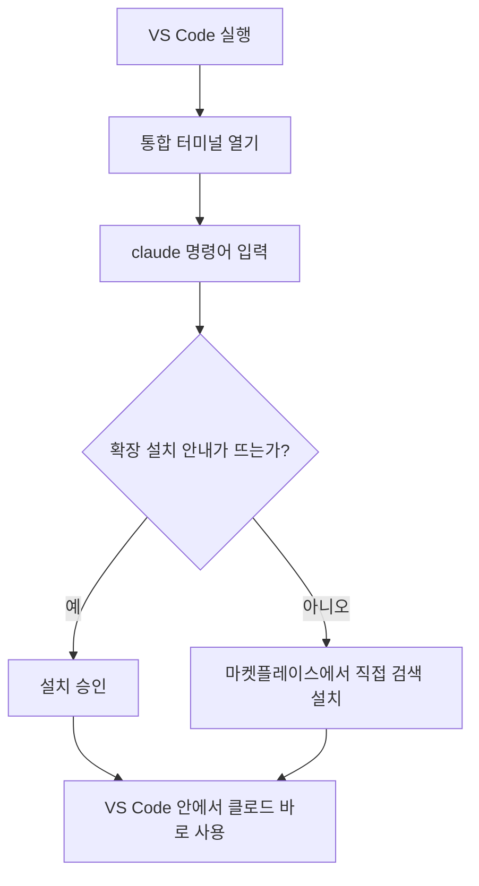
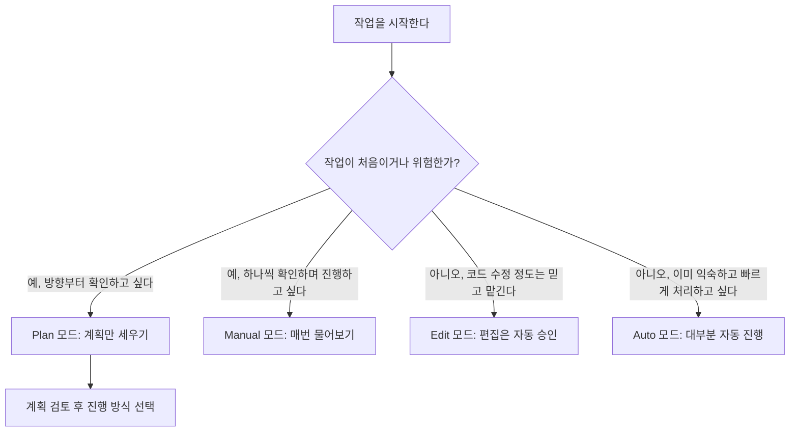
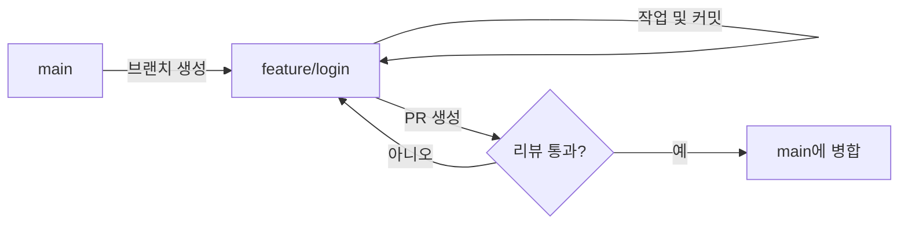
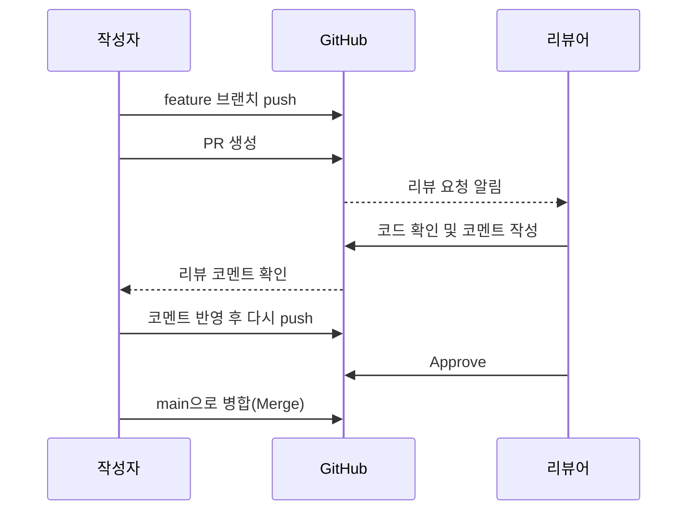

<style>
.page__content { font-size: 0.8em; }
</style>

# 오늘 배운 것: 프롬프트 엔지니어링부터 클로드 코드, 그리고 협업할 때의 commit·push·PR

## 들어가며 (Situation)

지난 금요일에 클로드(Claude) 계정을 제공받았고, 오늘은 그 계정을 100% 활용하는 법을 배웠다. 최종 목표는 나무위키처럼 검색만 하면 언제든 필요한 정보를 찾아볼 수 있는 **나만의 위키(wiki)**를 만드는 것이다. 지난 금요일부터 만든 이 블로그도 "학습한 걸 1대1로 옮겨 적는 기록장"이 아니라 위키처럼 쓰라고 만든 것이라고 한다.

오전에는 AI를 더 잘 쓰는 법 — 프롬프트 엔지니어링 → 아티팩트 → 클로드 코드 설치와 모드 → CLAUDE.md·스킬로 반복 설정 자동화하기 — 를 배웠고, 그 다음에는 지금까지 혼자 쓰던 `git add`·`commit`·`push`를 **여럿이 같은 저장소를 쓸 때** 어떻게 다뤄야 하는지를 배웠다. 명령어 자체는 똑같지만, 옆에 AI가 있거나 팀원이 있다고 생각하면 신경 써야 할 게 많아진다.

## 문제 상황 (Task)

- 프롬프트를 어떻게 써야 AI가 되묻지 않고 원하는 결과를 바로 주는가
- 클로드가 만들어주는 결과물을 채팅창이 아니라 별도 화면(아티팩트)으로 확인하는 방법
- PowerShell에서 Claude Code를 설치하고, 로그인·워크스페이스 지정까지 마쳐서 실제로 `claude` 명령어가 인식되게 만드는 방법
- VS Code 안에서 클로드를 바로 쓸 수 있게 붙이는 방법
- Manual / Plan / Edit / Auto 네 가지 모드가 각각 무엇을 자동으로 하고 무엇을 물어보는지, 그리고 언제 어떤 모드를 써야 "AI에게 사고를 뺏기지" 않는지
- 매번 맥락·역할·제약·예시를 반복 입력하는 번거로움을 어떻게 줄이는가 (CLAUDE.md, 스킬)
- 여러 명이 동시에 작업해도 `main`이 항상 배포 가능한 상태를 유지하려면 브랜치를 어떤 전략으로 나눠야 하는가
- 나만 알아보는 커밋 메시지가 아니라, 다른 사람이 `git log`만 보고도 무슨 변경인지 알 수 있으려면 어떤 규칙이 필요한가
- PR을 한 번 올리고 끝나는 게 아니라 병합되기까지 어떤 단계를 거치는가
- `push` 한 번으로 팀원의 작업을 통째로 날려버릴 수 있는 상황은 무엇이고, 어떻게 피해야 하는가

## 해결 과정 (Action)

### A. 프롬프트 엔지니어링(Prompt Engineering) — AI에게 "잘" 요청하는 법

#### 1. 프롬프트란, 그리고 왜 예전만큼 중요하지 않아졌나

**프롬프트**는 사용자가 AI 모델에게 입력하는 명령어다. 채팅창에 입력하는 모든 것이 곧 하나의 요청(request)을 AI에게 보내는 셈이다. **프롬프트 엔지니어링**은 이 프롬프트를 더 나은 방향으로 다듬는 작업을 말한다.

예전에는 AI가 이상한 답변을 자주 줬기 때문에 질문을 정교하게 다듬는 게 중요했지만, 최근 모델은 "개떡같이 말해도 찰떡같이" 알아듣는 수준까지 발전해서 프롬프트를 과하게 정교하게 쓰는 게 오히려 비효율적이라는 이야기를 들었다. 다만 반드시 필요한 핵심 요소는 여전히 있다.

#### 2. 프롬프트의 핵심 4요소

- **맥락 (Context)**
  - 내가 지금 처한 상황을 알려주는 것이다. 예를 들어 "나는 지금 부트캠프 4일차이고, Git을 막 배운 초급자다"처럼 알려주면, AI가 "실무 10년차 개발자" 관점이 아니라 내가 준 맥락을 기반으로 답변해준다.
- **역할 (Role)**
  - AI가 어떤 페르소나로 답변할지 정해주는 것이다. 예: "비전공자에게 프로그래밍을 처음 알려주는 선생님처럼 설명해줘." 필요하면 "무서운 선생님"처럼 톤도 지정할 수 있다.
- **제약 (Constraint)**
  - AI는 기본적으로 매우 창의적이라 제약을 걸지 않으면 내가 소화할 수 있는 범위를 넘어서는 답을 줄 수 있다. 4요소 중 **가장 중요한 것**으로 강조됐는데, 역할·맥락이 없어도 제약만 잘 걸면 결과물 품질 차이가 크게 난다고 한다. 예: "위 목록에 없는 내용은 작성하지 마라", "표와 Mermaid 차트, 클래스 다이어그램을 적극 활용해라."
- **예시 (Example)**
  - AI는 사용자의 입력을 바탕으로 확률적으로 가장 그럴듯한 답을 생성하기 때문에, 같은 질문에는 대체로 비슷한 답이 나온다. 그런데 사람마다 원하는 스타일(서두 길이, 예시 개수 등)이 다르므로, "나는 이런 형식을 원한다"는 걸 예시로 보여주는 게 좋은 방법이다.

> 옛날에는 이런 요소가 4단계가 아니라 8~10단계까지 세분화되어 있었지만, 지금은 이 4가지만 충족해도 충분하다고 정리됐다.

#### 3. 실습으로 확인한 차이

| 방식 | 결과 |
|---|---|
| "기술 블로그를 하나 작성해줘"만 입력 | AI가 주제·대상 독자·목적 등을 되물어봄 |
| 맥락·역할·제약·예시 4가지를 모두 채워서 요청 | 되묻지 않고 바로 원하는 결과물을 생성 |

💡 질문을 되묻는 상호작용이 줄어들면 토큰 소비도 절약된다는 걸 알게 됐다 — 프로/일반 계정 모두 쓸 수 있는 토큰이 제한되어 있기 때문이다. 결과물에는 표와 Mermaid(플로우차트) 다이어그램도 포함시킬 수 있는데, 텍스트만 나열하면 가독성이 떨어지므로 다이어그램을 적극 활용하면 훨씬 이해하기 편해진다.

⚠️ 다만 매번 4요소를 다 채우는 건 매우 귀찮은 작업이라는 걸 체감했다. 이 귀찮음을 해결하기 위해 이후 배운 게 CLAUDE.md(작업지시서)와 스킬(Skill)이다.

### B. 아티팩트(Artifact) — 결과물을 보기 좋게, 공유 가능하게

클로드와 대화하다 보면 코드나 문서, 화면(웹페이지) 같은 결과물을 채팅창 텍스트로만 받는 게 아니라 **별도의 화면에 띄워서 바로 확인**할 수 있다. 이 결과물 창을 **아티팩트(Artifact)**라고 부른다.

💡 대화창을 스크롤하며 긴 결과물을 찾는 대신, 별도 창에서 바로 확인하고 링크로 공유까지 할 수 있다는 게 핵심이었다.

| 상황 | 아티팩트를 쓰는 이유 |
|---|---|
| 클로드에게 HTML/웹페이지를 만들어 달라고 했을 때 | 코드를 눈으로만 보지 않고, 실제 화면이 어떻게 나오는지 바로 미리보기 할 수 있음 |
| 표나 다이어그램처럼 긴 결과물을 받았을 때 | 대화창을 스크롤하지 않고 별도 창에서 깔끔하게 확인 가능 |
| 결과물을 팀원이나 친구에게 공유하고 싶을 때 | 링크(URL) 형태로 공유해서 다른 사람도 열어볼 수 있음 |
| 이미 MD 파일로 다운로드해둔 글이 있을 때 | 채팅창에 다시 업로드 후 "이 MD 파일을 Artifact로 만들어줘"라고 요청하면 됨 |



이때 모델을 더 좋은 모델(예: Opus)로 바꿔서 요청할 수도 있다. 단, 더 똑똑한 대신 추론 과정이 복잡해서 토큰을 더 많이 소모하고 답변 속도도 느려진다.

- **실제 활용 사례**
  - 다른 분반(프론트엔드/백엔드) 수업에서, 서로 다른 요구사항과 진행 상황을 아티팩트로 만들어 구두 설명 없이도 공유하며 소통했다고 한다.
  - 실무에서도 기획팀·개발팀 등 코드·MD·커밋 같은 개념을 모르는 비개발자와 협업할 때, 아티팩트 형태의 시각화 자료를 많이 활용하는 추세라고 한다.

프롬프트에 디자인 예시를 넣어주면 아티팩트도 그 예시에 맞춰 스타일이 바뀐다 — 여기서도 4요소 중 "예시"가 왜 중요한지 다시 확인됐다.

### C. 클로드 코드(Claude Code) — 컴퓨터에 설치해서 쓰기

#### 1. 왜 로컬 설치가 더 좋은가 — 컨텍스트(Context) 개념

브라우저에서 대화를 계속 나누다 보면, 대화가 길어질수록 **컨텍스트**(AI가 기억할 수 있는 저장 공간)의 범위를 벗어나 이전 내용을 정확히 기억하지 못하게 된다. 카카오톡 대화가 90일 지나면 사라지는 것과 비슷한 개념이라고 이해했다. 또한 브라우저에서는 `_posts` 폴더의 내용을 AI가 전혀 알 수 없고, 직접 업로드해야만 알 수 있다.

반면 클로드 코드(CLI 환경)는 컨텍스트 자체를 지정한 폴더로 한정해두기 때문에, 폴더 안 파일을 스스로 검색해서 "이 폴더에 있는 글 제목을 보고 다음에 쓸만한 주제를 추천해줘" 같은 요청도 바로 처리할 수 있다. 즉, 로컬 설치 + 워크스페이스 지정 자체가 프롬프트의 "맥락"과 "제약"을 자동으로 만족시켜주는 셈이다.

#### 2. PowerShell에서 클로드(Claude Code) 설치하기

터미널에서 바로 클로드를 쓸 수 있게 해주는 도구가 **Claude Code**다. Windows에서는 PowerShell을 열어서 설치한다.

```powershell
# 1. 설치 스크립트 실행 (PowerShell)
irm https://claude.ai/install.ps1 | iex

# 2. 설치가 잘 됐는지 확인
claude --version

# 3. 클로드 코드 실행
claude
```

🔴 설치 스크립트는 정상적으로 끝났는데, 같은 PowerShell 창에서 `claude`를 입력하니 명령어를 찾지 못했다.

찾아보니 Windows용 네이티브 설치는 실행 파일을 `%USERPROFILE%\.local\bin` 폴더에 넣어주는데, 이 폴더가 내 PATH(환경 변수)에는 아직 등록돼 있지 않아서 생긴 문제였다.

🟢 그래서 아래 명령어로 PATH에 직접 그 경로를 추가해줬다.

```powershell
$currentPath = [Environment]::GetEnvironmentVariable('PATH', 'User')
[Environment]::SetEnvironmentVariable('PATH', "$currentPath;$env:USERPROFILE\.local\bin", 'User')
```

⚠️ 이 명령어를 실행한 뒤에는 **원래 열려 있던 창이 아니라 새 PowerShell 창**을 열어야 한다. PATH는 터미널이 처음 켜질 때 한 번 읽어오기 때문에, 기존 창에서는 아무리 다시 쳐도 반영이 안 된다. 새 창을 열고 `claude --version`을 치니 그제서야 정상적으로 버전이 출력됐다.



- 지난 주에 배운 `git init`처럼, 설치는 딱 한 번만 하면 된다. PATH도 한 번만 잡아두면 이후로는 새 터미널을 열 때마다 바로 `claude`가 인식된다.

#### 3. 로그인과 워크스페이스 지정

1. 터미널에서 `claude` 입력 → "Welcome to Claude" 화면 등장
2. 테마(다크/라이트) 선택 후 Enter
3. 로그인 진행 → 브라우저가 자동으로 열리며 로그인 승인 화면이 뜸 → 승인
4. 발급된 인증 코드를 복사해서 터미널에 붙여넣고 Enter → 로그인 성공
5. "Accessing Workspace" 단계 — 클로드 코드가 현재 작업 폴더(워크스페이스)에 접근하려고 함

🚨 만약 워크스페이스가 잘못된 위치(예: C드라이브의 Windows 시스템 폴더)라면 반드시 **"No, exit"**를 선택해서 빠져나와야 한다. 시스템 폴더를 워크스페이스로 잡으면 안 된다.

올바른 순서는 VS Code에서 블로그 저장소 폴더를 먼저 열고, 그 안에서 새 터미널을 연 뒤 현재 경로가 그 폴더인 걸 확인하고 `claude`를 실행해 "Yes"로 승인하는 것이다. 이렇게 하면 그 폴더가 워크스페이스로 인식된다.

#### 4. VS Code에 클로드 설치하기

VS Code(비주얼 스튜디오 코드)는 지난 주 마크다운 글을 쓸 때 썼던 그 에디터다. 여기에도 클로드를 붙여서 코드를 보면서 바로 물어볼 수 있다.

| 방법 | 어떻게 하나 |
|---|---|
| 확장(Extension) 마켓플레이스 이용 | VS Code 왼쪽 사이드바의 확장 아이콘 클릭 → "Claude Code" 검색 → Install 클릭 |
| 통합 터미널에서 실행 | VS Code 안의 터미널(Ctrl + `)에서 `claude` 명령어 입력 → VS Code용 확장 설치 여부를 물어보면 승인 |



#### 5. Manual / Plan / Edit / Auto 모드 차이 구분하기 (Shift+Tab으로 전환)

클로드 코드는 "어디까지 내 허락 없이 알아서 작업해도 되는지"를 4가지 모드로 나눠서 관리한다. 이걸 이해하지 못하면 "왜 자꾸 나한테 물어보지?" 혹은 "왜 허락도 없이 파일을 고쳤지?" 하고 당황할 수 있다.

| 모드 | 특징 | 언제 쓰나 |
|---|---|---|
| **Manual (수동)** | 파일 수정이든 명령 실행이든 매번 나에게 물어보고 허락을 받음 | 처음 써보거나, 클로드가 뭘 하는지 하나하나 확인하고 싶을 때 |
| **Plan (계획 모드)** | 아무것도 실제로 고치거나 실행하지 않고, "이렇게 하겠다"는 계획만 먼저 세워서 보여줌 | 큰 작업을 시키기 전에 방향이 맞는지 먼저 검토하고 싶을 때 |
| **Edit (자동 편집 승인)** | 되묻지 않고 AI가 알아서 판단해 파일을 수정·삭제·추가함 | 코드 수정은 믿고 맡기되, 이미 계획을 충분히 검토했을 때 |
| **Auto (자동 모드)** | 대부분의 확인 절차를 건너뛰고 알아서 끝까지 작업을 진행함 | 이미 여러 번 검증된 작업을 빠르게 반복 실행하고 싶을 때 |



🚨 **에딧 모드를 바로 쓰면 사용자의 "사고"가 멈춰버린다.** 학습 단계에서 가장 많이 써야 하는 건 **매뉴얼 모드와 플랜 모드**이며, 이 두 모드로 충분히 계획과 사전 검수를 마친 뒤에야 에딧 모드로 넘어가야 한다. 그래야 AI가 사고하는 과정을 내 사고와 합쳐서 실행할 수 있다. "계획 → 수정 → 커밋"을 반복하는 습관이 중요하다는 걸 여러 번 강조받았다.

#### 6. 실습: 첫 글 작성과 커밋 습관

1. 매뉴얼 모드로 전환.
2. "`_posts` 하위에 있는 포스트 제목만 보고, 내가 더 추가하면 좋을 주제가 있으면 알려줘"라고 요청 → AI가 폴더를 검색해 힌트를 제시(예: Git/GitHub를 배웠으니 "브랜치 전략", "풀리퀘스트", "머지 컨플릭트 해결" 등 추천).
3. 맥락·역할·제약·예시가 담긴 프롬프트를 붙여넣고(줄바꿈은 Shift+Enter가 아니라 **Alt+Enter**를 써야 전송되지 않고 줄만 바뀐다), "`_posts` 하위에 오늘 날짜와 (주제)로 파일 생성해줘"라는 저장 위치 지정 문구를 추가.
4. Enter로 전송 → 매뉴얼 모드이므로 파일 생성 전에 승인을 요청함 → "Yes"로 승인 → 새 파일 생성 확인.

🚨 만든 후 아직 커밋을 하지 않은 상태라면, 반드시 그 전에(또는 그 직후) 커밋해두는 습관이 필요하다. AI로 뭔가를 만들기 전에 항상 커밋해두면 마음에 안 들 때 언제든 되돌릴(revert/restore) 수 있다. 변경사항이 계속 쌓이면 "되돌려줘"라는 명령 자체가 AI 입장에서도 정확히 인식하기 어려워지기 때문이다.

### D. CLAUDE.md — 나만의 "작업지시서" 만들기

매번 글을 쓸 때마다 역할·맥락·제약·예시 4가지를 반복 입력하는 건 너무 번거롭다. 이 반복되는 설정을 하나의 표준 문서(템플릿)로 만들어두면, 이후에는 주제와 내용만 던져줘도 AI가 이 템플릿에 맞춰 자동으로 글을 생성해준다.

- **CLAUDE.md**
  - "작업지시서" 역할을 하는 파일이다. 클로드 코드는 프롬프트에 답하기 전에 항상 이 파일을 먼저 훑어보고(마치 아침 알람처럼 자동으로) 그 내용에 맞춰 답변한다.
  - 반드시 **워크스페이스 최상위**(예: 블로그 레포 폴더 바로 밑)에 있어야 한다. `_posts` 폴더 안 등 하위 폴더에 있으면 인식되지 않는다.

CLAUDE.md에 들어가야 할 구성 요소는 대략 이렇다.

1. **역할 정의** — 프롬프트 엔지니어링에서 다룬 "역할"과 동일한 개념을 고정으로 적어둔다.
2. **글 구조(STAR 기법)** — 이론만 나열하는 글은 메리트가 없다(이론은 어디서든 볼 수 있으니까). 대신 상황(Situation)-과제(Task)-행동(Action)-결과(Result) 순서로, 실제로 어떤 상황에서 어떤 행동을 취했고 어떤 결과가 나왔는지를 담아야 글의 가치가 생긴다.
3. **콘텐츠 작성 원칙(제약)** — 단순 기술 나열 금지, 추가 학습 내용은 공식 문서를 기반으로 작성하라는 제약을 걸어 AI가 부정확한 사설 정보 대신 공식 문서를 근거로 검증하며 작성하게 한다.
4. **파일명/저장 규칙** — `_posts` 폴더 하위에 저장해야 한다는 규칙을 명시한다.

💡 CLAUDE.md를 만든 뒤 다시 글을 요청하면 화면에 "Reading CLAUDE.md" 같은 표시가 뜨며 이 작업지시서를 기준으로 답변을 생성한다. 프롬프트만 짧게 입력해도(예: "Git 브랜치 전략에 대해 블로그 써줘") STAR 구조를 갖춘, 실제 상황 기반의 글이 자동으로 생성된다. 다만 처음에는 AI가 아직 겪어보지 못한 상황을 채우기 위해 되묻는 질문(상황이 뭐였는지 등)을 할 수 있는데, 실제 경험한 내용을 채워 넣을수록 결과물의 품질이 올라간다.

### E. 스킬(Skill) — 반복 작업을 명령어 하나로

CLAUDE.md가 "항상 적용되는 전역 지침"이라면, **스킬**은 `/스킬이름` 명령어를 입력했을 때만 동작하는 "특정 작업 전용" 지침이다. 직접 만들 수도 있고, 다른 사람이 만들어 공개한 걸 마켓플레이스에서 가져다 쓸 수도 있다(VS Code 익스텐션 마켓플레이스와 비슷한 개념).

#### 1. 외부 스킬 설치 실습 — ELI5

슬랙에 공유된 명령어로 마켓플레이스를 추가하고, `ELI5`(Explain Like I'm 5 — 다섯 살 아이에게 설명하듯 쉽게 설명해주는 스킬)를 설치했다.

- `/exit`로 현재 대화창을 나간 뒤 `claude`로 재진입 → `/eli` 입력 시 자동완성으로 `/eli5` 등장 → 선택 후 설명하고 싶은 주제(예: "Git 브랜치 충돌 해결 과정")를 이어서 입력 → Enter.
- 결과: 주제를 쉬운 언어와 시각 자료(HTML/아티팩트) 형태로 설명해주는 결과물이 생성됐다.

💡 이 ELI5 스킬은 출시된 지 약 10~21일밖에 안 됐는데도 GitHub 스타를 아주 많이 받았다고 한다. 코드 분량이 많지 않아도(핵심 아이디어 몇 줄) 인기를 얻을 수 있다는 예시로 소개됐다.

#### 2. 직접 스킬 만들기 — `/run`, `/note`

스킬 폴더 구조는 아래처럼 이름 규칙을 정확히 지켜야 자동완성/실행이 된다.

```
mybllog/.claude/skills/run/SKILL.md
mybllog/.claude/skills/note/SKILL.md
```

- **`/run` (학습 전용 스킬)**
  - `SKILL.md` 안에 "이 스킬을 실행하면 어떻게 동작할지"를 정의한다. 예: 선생님처럼 설명, 상황을 가정해서 설명, 마지막엔 "더 알아볼 것" 추천까지 포함.
  - 저장 후 `/exit`로 나갔다가 다시 `claude` 재진입 → `/run` 입력 시 자동완성 확인 → 정상 등록.
  - 사용 예: `/run 브랜치를 잘못 만들었는데 어떻게 되돌리나요?` → 지정해둔 대로 "선생님" 톤으로 답변, 마지막에 추가로 알아볼 내용 추천까지 포함된 결과 확인.
  - 🟢 여기에 "정답을 바로 주지 말고, 되물어라(다음에 뭘 해보면 좋을지, 놓친 게 무엇인지)"는 소크라테스식 질문법 규칙을 추가했더니, 이후부터는 질문하면 AI가 바로 답을 주지 않고 역질문을 해서 스스로 답을 찾아가게 유도하는 학습 효과가 생겼다.
- **`/note` (학습 정리용 스킬)**
  - 구조는 `/run`과 동일한 패턴, 이름만 `note`로.
  - 용도 구분: `/run`은 "학습이 필요할 때(질문하고 배울 때)" 쓰는 스킬, `/note`는 "학습이 끝난 뒤 배운 내용을 정리해서 블로그에 올릴 때" 쓰는 스킬이다.
  - 사용 예: `/note 커밋과 푸시, 풀에 대해서 정리해줘` → AI가 정리 방향에 대한 질문/예시를 제시하며 정리 글을 생성한다.

### F. 협업할 때의 commit, push, PR

#### 1. 브랜치 전략 — 다 같이 `main`에 바로 올리면 안 되는 이유

혼자 할 때는 `main` 브랜치 하나로 충분했지만, 여러 명이 동시에 작업하면 `main`이 항상 "배포 가능한 상태"를 유지해야 한다. 그래서 기능마다 브랜치를 따로 파고, 다 되면 `main`에 합치는 방식을 쓴다.

| 전략 | 핵심 아이디어 | 언제 쓰나 |
|---|---|---|
| **git-flow** | `main`(배포용), `develop`(통합용), `feature/*`, `release/*`, `hotfix/*` 등 브랜치 역할을 세분화 | 정식 배포 주기가 있는 큰 프로젝트 |
| **GitHub Flow** | `main` + `feature/*` 브랜치만 사용, 작업 끝나면 바로 PR로 병합 | 배포를 자주 하는 작은/중간 규모 팀 |



우리 팀은 규모가 크지 않아서 **GitHub Flow**가 더 맞겠다는 생각이 들었다. `develop` 브랜치까지 두면 오히려 병합 단계만 늘어날 것 같았다.

#### 2. 커밋 메시지 컨벤션 — 아무렇게나 쓰면 안 되는 이유

혼자 쓸 때는 "수정", "ㅇㅇ" 같은 커밋 메시지도 넘어갔지만, 협업할 때는 다른 사람이 `git log`만 보고도 무슨 변경인지 알 수 있어야 한다. 대표적으로 **Conventional Commits** 규칙을 많이 쓴다.

| 타입 | 의미 |
|---|---|
| `feat` | 새로운 기능 추가 |
| `fix` | 버그 수정 |
| `docs` | 문서만 변경 |
| `refactor` | 동작은 그대로, 코드 구조만 변경 |
| `chore` | 빌드/설정 등 잡일 |

형식은 `타입: 설명` 이다. 예를 들면:

```
feat: 로그인 실패 시 에러 메시지 표시
fix: 날짜 포맷이 잘못 표시되던 문제 수정
```

💡 이렇게 써두면 나중에 릴리스 노트를 쓸 때도 `feat`, `fix` 커밋만 모아서 정리할 수 있다는 걸 알고 나니, 커밋 메시지가 단순 "기록"이 아니라 "나중에 재사용할 데이터"라는 생각이 들었다.

#### 3. PR(Pull Request) 리뷰 프로세스

PR은 "내 브랜치의 변경 사항을 `main`에 합쳐도 될지 리뷰해 달라"는 요청이다. 그냥 push만 하면 끝나는 게 아니라, 병합되기 전까지 거치는 단계가 있다.



여기서 처음 알게 된 건, PR을 한 번 올리고 끝이 아니라 **같은 브랜치에 계속 push하면 PR이 자동으로 갱신**된다는 점이었다. 그래서 리뷰 코멘트를 받으면 새 PR을 만드는 게 아니라, 그 브랜치에 커밋을 추가로 쌓고 다시 push하면 된다.

#### 4. push할 때 조심해야 할 것

| 상황 | 문제 | 대처 |
|---|---|---|
| `git push --force` | 다른 사람이 이미 올린 커밋을 통째로 덮어써서 그 사람 작업이 사라질 수 있음 | 내 브랜치가 아니거나 팀원과 공유 중인 브랜치라면 절대 쓰지 않는다 |
| push 전 원격이 앞서 있음 | "Updates were rejected" 에러 발생 | `git pull`(또는 `fetch` + `merge`/`rebase`)로 먼저 최신 내용을 받아온 뒤 push |
| merge 충돌 발생 | 같은 파일의 같은 줄을 서로 다르게 고쳤을 때 | 충돌 표시(`<<<<<<<`, `=======`, `>>>>>>>`)를 직접 보고 어떤 코드를 남길지 정한 뒤 커밋 |

🚨 특히 `--force`는 "내가 실수해서 급하게 되돌리고 싶을 때" 쓰고 싶어지는 명령어인데, 협업 중인 브랜치에서는 팀원의 커밋 히스토리를 날려버릴 수 있다는 걸 알고 나니 왜 다들 조심하라고 하는지 이해가 됐다.

## 결과 (Result)

- 지난 주에는 Git으로 "내 코드"를 버전 관리하는 법을 배웠다면, 오늘은 그 코드를 "AI와 함께" 다루는 법과 "여럿이 함께" 다루는 법을 같이 배웠다.
- 프롬프트 엔지니어링의 4요소(맥락·역할·제약·예시)를 알고 나니, 왜 CLAUDE.md와 스킬이 필요한지가 명확해졌다 — 결국 반복되는 4요소 설정을 파일로 고정해두는 것이었다.
- PowerShell 설치 과정에서 PATH 문제를 직접 겪어보니, 앞으로 CLI 도구를 설치할 때는 같은 창에서 되든 안 되든 바로 판단하지 말고, 새 터미널을 열어서 명령어가 인식되는지부터 확인하는 습관을 들여야겠다고 느꼈다.
- ⚠️ 특히 Manual/Plan/Edit/Auto 모드 차이를 모르고 쓰면 의도치 않게 파일이 바뀔 수 있어서, 처음에는 Manual이나 Plan 모드로 시작하고 "계획 → 수정 → 커밋"을 반복하는 게 안전하다는 걸 느꼈다.
- CLAUDE.md와 스킬(`/run`, `/note`)을 직접 만들어보니, 매번 프롬프트를 길게 쓰지 않아도 원하는 형식의 결과물을 일관되게 받을 수 있다는 걸 체감했다.
- 혼자 쓸 때의 `add`-`commit`-`push`는 "내 작업을 저장하는 것"이었다면, 협업에서는 그 뒤에 "다른 사람이 이해하고 검토하는 과정"이 붙는다는 걸 알게 됐다.
- 커밋 메시지를 컨벤션에 맞춰 쓰는 게 귀찮게 느껴졌는데, 나중에 로그만 보고 변경 이력을 추적할 걸 생각하면 지금 조금 더 신경 쓰는 게 낫겠다고 느꼈다.
- `--force` push의 위험성을 알고 나니, 앞으로는 push가 거부되면 무작정 force를 쓰지 않고 먼저 원격 상태를 확인하는 습관을 들여야겠다.

## 더 학습하면 좋은 개념

- **환경 변수(PATH)의 동작 원리** — 오늘 겪은 설치 문제의 근본 원인이다. 새 터미널에서만 PATH가 다시 읽히는 이유를 이해하면 앞으로 다른 CLI 도구를 설치할 때도 같은 문제를 빠르게 진단할 수 있다.
- **MCP(Model Context Protocol)** — 클로드가 외부 도구·데이터와 연결되는 방식이다. 아티팩트·스킬 다음 단계로, 클로드에게 새로운 능력을 붙이는 법을 배우고 싶다면 필요한 개념이다.
- **Claude Code Hooks(후크)** — 특정 시점(도구 호출 전후 등)에 자동으로 명령을 실행하게 하는 기능이다. Manual/Auto 모드의 세밀한 통제를 코드로 확장하고 싶을 때 필요하다.
- **`git push --force-with-lease`** — 오늘 배운 `--force`의 위험성을 줄여주는 대안이다. 내가 마지막으로 받아온 상태 이후 원격에 새 커밋이 없을 때만 강제 push를 허용해서, 팀원의 작업을 실수로 덮어쓰는 사고를 막아준다.
- **브랜치 보호 규칙 (Branch Protection Rules)** — GitHub 저장소 설정에서 `main` 브랜치에 직접 push하거나 리뷰 없이 병합하는 것을 아예 막을 수 있다. 오늘 배운 "다 같이 main에 바로 올리면 안 되는 이유"를 도구 차원에서 강제하는 방법이다.
- **Squash / Rebase 병합** — 오늘은 기본 Merge만 다뤘지만, PR을 병합하는 방식에도 여러 옵션이 있다. 커밋 히스토리를 얼마나 깔끔하게 남길지와 직결되는 개념이라 함께 알아두면 좋다.

## 참고 자료
- [Claude Code 공식 문서 - Overview](https://docs.claude.com/en/docs/claude-code/overview)
- [Claude Code 공식 문서 - Use Claude Code in VS Code](https://code.claude.com/docs/en/vs-code)
- [Claude Code 공식 문서 - How Claude remembers your project (Memory/CLAUDE.md)](https://code.claude.com/docs/en/memory)
- [Claude Code 공식 문서 - Extend Claude with skills](https://code.claude.com/docs/en/skills)
- [Claude 공식 문서 - Prompt engineering overview](https://docs.claude.com/en/docs/build-with-claude/prompt-engineering/overview)
- [PowerShell 공식 문서 - about_Environment_Variables](https://learn.microsoft.com/en-us/powershell/module/microsoft.powershell.core/about/about_environment_variables)
- [Git 공식 문서 - Branches in a Nutshell](https://git-scm.com/book/en/v2/Git-Branching-Branches-in-a-Nutshell)
- [GitHub 공식 문서 - GitHub flow](https://docs.github.com/en/get-started/using-github/github-flow)
- [GitHub 공식 문서 - About pull requests](https://docs.github.com/en/pull-requests/collaborating-with-pull-requests/proposing-changes-to-your-work-with-pull-requests/about-pull-requests)
- [Conventional Commits 공식 사이트](https://www.conventionalcommits.org/)
- [Git 공식 문서 - git push](https://git-scm.com/docs/git-push)
