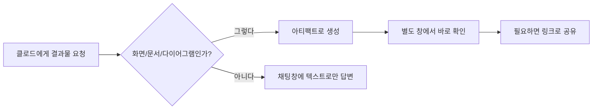
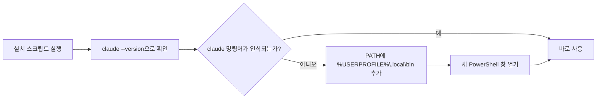
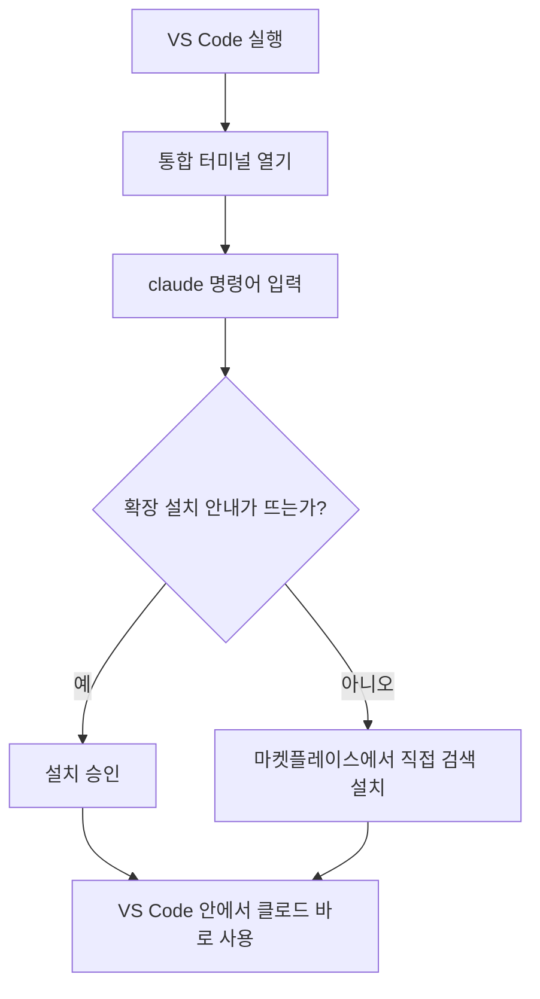
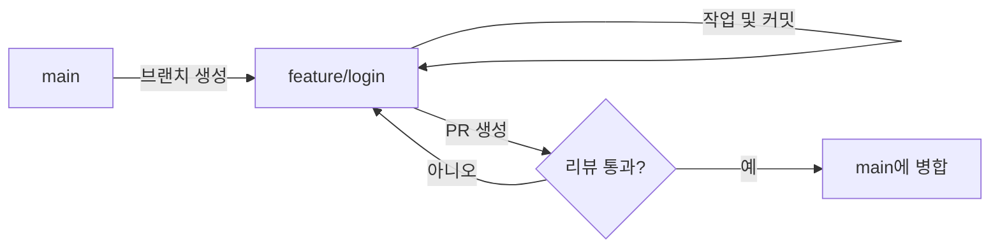
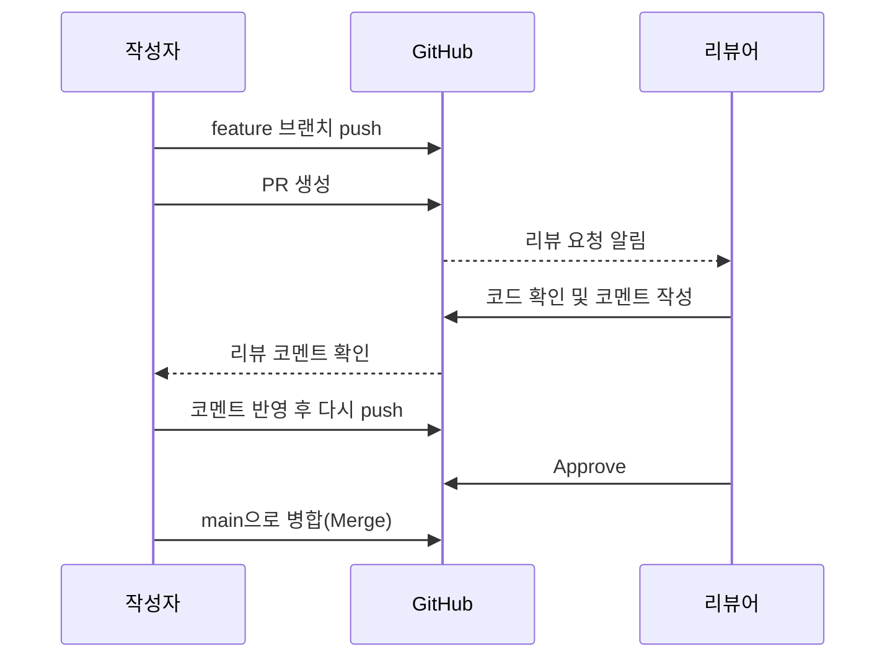

<style>
.page__content { font-size: 0.8em; }
</style>

# 오늘 배운 것: 클로드(Claude)와 친해지기, 그리고 협업할 때의 commit·push·PR

## 들어가며 (Situation)

지난 주에는 Git과 GitHub로 "버전 관리"와 "배포"를 배웠다면, 오늘은 두 가지를 함께 배웠다. 하나는 AI 코딩 도구인 **클로드(Claude)** 를 내 개발 환경에 설치하고 여러 "모드"의 차이를 이해하는 것이었고, 다른 하나는 지금까지 혼자 쓰던 `git add`·`commit`·`push`를 **여럿이 같은 저장소를 쓸 때** 어떻게 다뤄야 하는지였다. 명령어 자체는 똑같지만, 옆에 AI가 있거나 팀원이 있다고 생각하면 신경 써야 할 게 많아진다.

## 문제 상황 (Task)

- 클로드가 만들어주는 결과물을 채팅창이 아니라 별도 화면(아티팩트)으로 확인하는 방법
- PowerShell에서 Claude Code를 설치하고, 실제로 `claude` 명령어가 인식되게 만드는 방법
- VS Code 안에서 클로드를 바로 쓸 수 있게 붙이는 방법
- Manual / Edits / Plan / Auto 네 가지 모드가 각각 무엇을 자동으로 하고 무엇을 물어보는지
- 여러 명이 동시에 작업해도 `main`이 항상 배포 가능한 상태를 유지하려면 브랜치를 어떤 전략으로 나눠야 하는가
- 나만 알아보는 커밋 메시지가 아니라, 다른 사람이 `git log`만 보고도 무슨 변경인지 알 수 있으려면 어떤 규칙이 필요한가
- PR을 한 번 올리고 끝나는 게 아니라 병합되기까지 어떤 단계를 거치는가
- `push` 한 번으로 팀원의 작업을 통째로 날려버릴 수 있는 상황은 무엇이고, 어떻게 피해야 하는가

## 해결 과정 (Action)

### A. 클로드(Claude) 설치와 모드 이해

#### 1. 클로드 아티팩트(Artifact) 활용하기

클로드와 대화하다 보면 코드나 문서, 화면(웹페이지) 같은 결과물을 그냥 채팅창에 텍스트로만 받는 게 아니라, **별도의 화면에 띄워서 바로 확인**할 수 있다. 이 결과물 창을 **아티팩트(Artifact)** 라고 부른다.

💡 대화창을 스크롤하며 긴 결과물을 찾는 대신, 별도 창에서 바로 확인하고 링크로 공유까지 할 수 있다는 게 핵심이었다.

| 상황 | 아티팩트를 쓰는 이유 |
|---|---|
| 클로드에게 HTML/웹페이지를 만들어 달라고 했을 때 | 코드를 눈으로만 보지 않고, 실제 화면이 어떻게 나오는지 바로 미리보기 할 수 있음 |
| 표나 다이어그램처럼 긴 결과물을 받았을 때 | 대화창을 스크롤하지 않고 별도 창에서 깔끔하게 확인 가능 |
| 결과물을 팀원이나 친구에게 공유하고 싶을 때 | 링크(URL) 형태로 공유해서 다른 사람도 열어볼 수 있음 |



#### 2. PowerShell에서 클로드(Claude Code) 설치하기

터미널에서 바로 클로드를 쓸 수 있게 해주는 도구가 **Claude Code** 다. Windows에서는 PowerShell을 열어서 설치한다.

```powershell
# 1. 설치 스크립트 실행 (PowerShell)
irm https://claude.ai/install.ps1 | iex

# 2. 설치가 잘 됐는지 확인
claude --version

# 3. 클로드 코드 실행
claude
```

🔴 설치 스크립트는 정상적으로 끝났는데, 같은 PowerShell 창에서 `claude`를 입력하니 명령어를 찾지 못했다.

찾아보니 Windows용 네이티브 설치는 실행 파일을 `%USERPROFILE%\.local\bin` 폴더에 넣어주는데, 이 폴더가 내 PATH(환경 변수)에는 아직 등록돼 있지 않아서 생긴 문제였다.

🟢 그래서 아래 명령어로 PATH에 직접 그 경로를 추가해줬다.

```powershell
$currentPath = [Environment]::GetEnvironmentVariable('PATH', 'User')
[Environment]::SetEnvironmentVariable('PATH', "$currentPath;$env:USERPROFILE\.local\bin", 'User')
```

⚠️ 이 명령어를 실행한 뒤에는 **원래 열려 있던 창이 아니라 새 PowerShell 창**을 열어야 한다. PATH는 터미널이 처음 켜질 때 한 번 읽어오기 때문에, 기존 창에서는 아무리 다시 쳐도 반영이 안 된다. 새 창을 열고 `claude --version`을 치니 그제서야 정상적으로 버전이 출력됐다.



- 지난 주에 배운 `git init`처럼, 설치는 딱 한 번만 하면 된다. PATH도 한 번만 잡아두면 이후로는 새 터미널을 열 때마다 바로 `claude`가 인식된다.
- 설치 후 처음 `claude`를 실행하면 로그인 절차(계정 인증)를 거쳐야 사용할 수 있다.

#### 3. VS Code에 클로드 설치하기

VS Code(비주얼 스튜디오 코드)는 지난 주 마크다운 글을 쓸 때 썼던 그 에디터다. 여기에도 클로드를 붙여서 코드를 보면서 바로 물어볼 수 있다.

| 방법 | 어떻게 하나 |
|---|---|
| 확장(Extension) 마켓플레이스 이용 | VS Code 왼쪽 사이드바의 확장 아이콘 클릭 → "Claude Code" 검색 → Install 클릭 |
| 통합 터미널에서 실행 | VS Code 안의 터미널(Ctrl + `)에서 `claude` 명령어 입력 → VS Code용 확장 설치 여부를 물어보면 승인 |



#### 4. Manual / Edits / Plan / Auto 모드 차이 구분하기

클로드 코드는 "어디까지 내 허락 없이 알아서 작업해도 되는지"를 4가지 모드로 나눠서 관리한다. 이걸 이해하지 못하면 "왜 자꾸 나한테 물어보지?" 혹은 "왜 허락도 없이 파일을 고쳤지?" 하고 당황할 수 있다.

| 모드 | 특징 | 언제 쓰나 |
|---|---|---|
| **Manual (수동)** | 파일 수정이든 명령 실행이든 매번 나에게 물어보고 허락을 받음 | 처음 써보거나, 클로드가 뭘 하는지 하나하나 확인하고 싶을 때 |
| **Edits (자동 편집 승인)** | 파일 수정은 바로바로 진행하지만, 그 외 위험한 작업은 여전히 물어봄 | 코드 수정은 믿고 맡기되, 큰 작업(삭제, 실행 등)은 확인받고 싶을 때 |
| **Plan (계획 모드)** | 아무것도 실제로 고치거나 실행하지 않고, "이렇게 하겠다"는 계획만 먼저 세워서 보여줌 | 큰 작업을 시키기 전에 방향이 맞는지 먼저 검토하고 싶을 때 |
| **Auto (자동 모드)** | 대부분의 확인 절차를 건너뛰고 알아서 끝까지 작업을 진행함 | 이미 여러 번 검증된 작업을 빠르게 반복 실행하고 싶을 때 |


### B. 협업할 때의 commit, push, PR

#### 1. 브랜치 전략 — 다 같이 `main`에 바로 올리면 안 되는 이유

혼자 할 때는 `main` 브랜치 하나로 충분했지만, 여러 명이 동시에 작업하면 `main`이 항상 "배포 가능한 상태"를 유지해야 한다. 그래서 기능마다 브랜치를 따로 파고, 다 되면 `main`에 합치는 방식을 쓴다.

| 전략 | 핵심 아이디어 | 언제 쓰나 |
|---|---|---|
| **git-flow** | `main`(배포용), `develop`(통합용), `feature/*`, `release/*`, `hotfix/*` 등 브랜치 역할을 세분화 | 정식 배포 주기가 있는 큰 프로젝트 |
| **GitHub Flow** | `main` + `feature/*` 브랜치만 사용, 작업 끝나면 바로 PR로 병합 | 배포를 자주 하는 작은/중간 규모 팀 |



우리 팀은 규모가 크지 않아서 **GitHub Flow**가 더 맞겠다는 생각이 들었다. `develop` 브랜치까지 두면 오히려 병합 단계만 늘어날 것 같았다.

#### 2. 커밋 메시지 컨벤션 — 아무렇게나 쓰면 안 되는 이유

혼자 쓸 때는 "수정", "ㅇㅇ" 같은 커밋 메시지도 넘어갔지만, 협업할 때는 다른 사람이 `git log`만 보고도 무슨 변경인지 알 수 있어야 한다. 대표적으로 **Conventional Commits** 규칙을 많이 쓴다.

| 타입 | 의미 |
|---|---|
| `feat` | 새로운 기능 추가 |
| `fix` | 버그 수정 |
| `docs` | 문서만 변경 |
| `refactor` | 동작은 그대로, 코드 구조만 변경 |
| `chore` | 빌드/설정 등 잡일 |

형식은 `타입: 설명` 이다. 예를 들면:

```
feat: 로그인 실패 시 에러 메시지 표시
fix: 날짜 포맷이 잘못 표시되던 문제 수정
```

💡 이렇게 써두면 나중에 릴리스 노트를 쓸 때도 `feat`, `fix` 커밋만 모아서 정리할 수 있다는 걸 알고 나니, 커밋 메시지가 단순 "기록"이 아니라 "나중에 재사용할 데이터"라는 생각이 들었다.

#### 3. PR(Pull Request) 리뷰 프로세스

PR은 "내 브랜치의 변경 사항을 `main`에 합쳐도 될지 리뷰해 달라"는 요청이다. 그냥 push만 하면 끝나는 게 아니라, 병합되기 전까지 거치는 단계가 있다.



여기서 처음 알게 된 건, PR을 한 번 올리고 끝이 아니라 **같은 브랜치에 계속 push하면 PR이 자동으로 갱신**된다는 점이었다. 그래서 리뷰 코멘트를 받으면 새 PR을 만드는 게 아니라, 그 브랜치에 커밋을 추가로 쌓고 다시 push하면 된다.

#### 4. push할 때 조심해야 할 것

| 상황 | 문제 | 대처 |
|---|---|---|
| `git push --force` | 다른 사람이 이미 올린 커밋을 통째로 덮어써서 그 사람 작업이 사라질 수 있음 | 내 브랜치가 아니거나 팀원과 공유 중인 브랜치라면 절대 쓰지 않는다 |
| push 전 원격이 앞서 있음 | "Updates were rejected" 에러 발생 | `git pull`(또는 `fetch` + `merge`/`rebase`)로 먼저 최신 내용을 받아온 뒤 push |
| merge 충돌 발생 | 같은 파일의 같은 줄을 서로 다르게 고쳤을 때 | 충돌 표시(`<<<<<<<`, `=======`, `>>>>>>>`)를 직접 보고 어떤 코드를 남길지 정한 뒤 커밋 |

🚨 특히 `--force`는 "내가 실수해서 급하게 되돌리고 싶을 때" 쓰고 싶어지는 명령어인데, 협업 중인 브랜치에서는 팀원의 커밋 히스토리를 날려버릴 수 있다는 걸 알고 나니 왜 다들 조심하라고 하는지 이해가 됐다.

## 결과 (Result)

- 지난 주에는 Git으로 "내 코드"를 버전 관리하는 법을 배웠다면, 오늘은 그 코드를 "AI와 함께" 다루는 법과 "여럿이 함께" 다루는 법을 같이 배웠다.
- PowerShell 설치 과정에서 PATH 문제를 직접 겪어보니, 앞으로 CLI 도구를 설치할 때는 같은 창에서 되든 안 되든 바로 판단하지 말고, 새 터미널을 열어서 명령어가 인식되는지부터 확인하는 습관을 들여야겠다고 느꼈다.
- ⚠️ 특히 Manual/Edits/Plan/Auto 모드 차이를 모르고 쓰면 의도치 않게 파일이 바뀔 수 있어서, 처음에는 Manual이나 Plan 모드로 시작하는 게 안전하다는 걸 느꼈다.
- 혼자 쓸 때의 `add`-`commit`-`push`는 "내 작업을 저장하는 것"이었다면, 협업에서는 그 뒤에 "다른 사람이 이해하고 검토하는 과정"이 붙는다는 걸 알게 됐다.
- 커밋 메시지를 컨벤션에 맞춰 쓰는 게 귀찮게 느껴졌는데, 나중에 로그만 보고 변경 이력을 추적할 걸 생각하면 지금 조금 더 신경 쓰는 게 낫겠다고 느꼈다.
- `--force` push의 위험성을 알고 나니, 앞으로는 push가 거부되면 무작정 force를 쓰지 않고 먼저 원격 상태를 확인하는 습관을 들여야겠다.

## 더 학습하면 좋은 개념

- **환경 변수(PATH)의 동작 원리** — 오늘 겪은 설치 문제의 근본 원인이다. 새 터미널에서만 PATH가 다시 읽히는 이유를 이해하면 앞으로 다른 CLI 도구를 설치할 때도 같은 문제를 빠르게 진단할 수 있다.
- **MCP(Model Context Protocol)** — 클로드가 외부 도구·데이터와 연결되는 방식이다. 아티팩트 다음 단계로, 클로드에게 새로운 능력을 붙이는 법을 배우고 싶다면 필요한 개념이다.
- **Claude Code Hooks(후크)** — 특정 시점(도구 호출 전후 등)에 자동으로 명령을 실행하게 하는 기능이다. Manual/Auto 모드의 세밀한 통제를 코드로 확장하고 싶을 때 필요하다.
- **`git push --force-with-lease`** — 오늘 배운 `--force`의 위험성을 줄여주는 대안이다. 내가 마지막으로 받아온 상태 이후 원격에 새 커밋이 없을 때만 강제 push를 허용해서, 팀원의 작업을 실수로 덮어쓰는 사고를 막아준다.
- **브랜치 보호 규칙 (Branch Protection Rules)** — GitHub 저장소 설정에서 `main` 브랜치에 직접 push하거나 리뷰 없이 병합하는 것을 아예 막을 수 있다. 오늘 배운 "다 같이 main에 바로 올리면 안 되는 이유"를 도구 차원에서 강제하는 방법이다.
- **Squash / Rebase 병합** — 오늘은 기본 Merge만 다뤘지만, PR을 병합하는 방식에도 여러 옵션이 있다. 커밋 히스토리를 얼마나 깔끔하게 남길지와 직결되는 개념이라 함께 알아두면 좋다.

## 참고 자료
- [Claude Code 공식 문서 - Overview](https://docs.claude.com/en/docs/claude-code/overview)
- [Claude Code 공식 문서 - Use Claude Code in VS Code](https://code.claude.com/docs/en/vs-code)
- [PowerShell 공식 문서 - about_Environment_Variables](https://learn.microsoft.com/en-us/powershell/module/microsoft.powershell.core/about/about_environment_variables)
- [Git 공식 문서 - Branches in a Nutshell](https://git-scm.com/book/en/v2/Git-Branching-Branches-in-a-Nutshell)
- [GitHub 공식 문서 - GitHub flow](https://docs.github.com/en/get-started/using-github/github-flow)
- [GitHub 공식 문서 - About pull requests](https://docs.github.com/en/pull-requests/collaborating-with-pull-requests/proposing-changes-to-your-work-with-pull-requests/about-pull-requests)
- [Conventional Commits 공식 사이트](https://www.conventionalcommits.org/)
- [Git 공식 문서 - git push](https://git-scm.com/docs/git-push)
