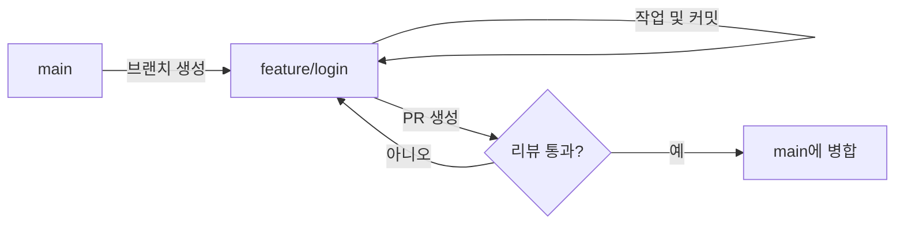
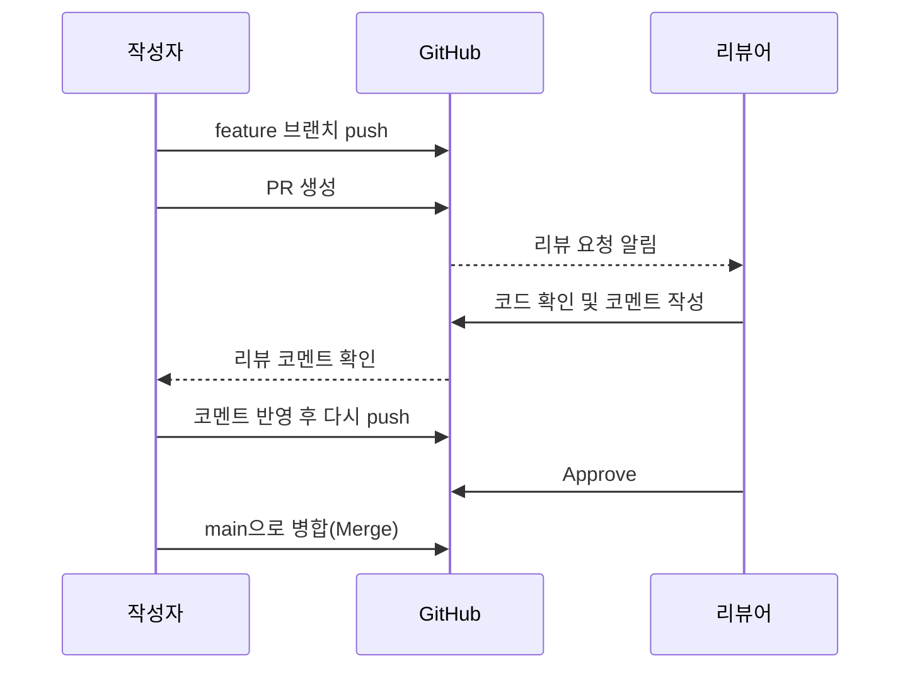

<style>
.page__content { font-size: 0.8em; }
</style>

# 오늘 배운 것: 협업할 때의 commit, push, PR

## 들어가며 (Situation)

지난 시간에는 `git add` → `git commit` → `git push`를 "혼자" 쓰는 법을 배웠다면, 오늘은 **여럿이 같은 저장소를 쓸 때** 이 세 가지를 어떻게 다루는지 배웠다. 명령어 자체는 똑같지만, 옆에 사람이 있다고 생각하면 신경 써야 할 게 많아진다.

## 문제 상황 (Task)

혼자 작업할 때는 고민하지 않아도 됐던 것들이 협업에서는 문제가 된다.

- 여러 명이 동시에 작업해도 `main`이 항상 배포 가능한 상태를 유지하려면 브랜치를 어떤 전략으로 나눠야 하는가
- 나만 알아보는 커밋 메시지가 아니라, 다른 사람이 `git log`만 보고도 무슨 변경인지 알 수 있으려면 어떤 규칙이 필요한가
- PR을 한 번 올리고 끝나는 게 아니라 병합되기까지 어떤 단계를 거치는가
- `push` 한 번으로 팀원의 작업을 통째로 날려버릴 수 있는 상황은 무엇이고, 어떻게 피해야 하는가

## 해결 과정 (Action)

### 1. 브랜치 전략 — 다 같이 `main`에 바로 올리면 안 되는 이유

혼자 할 때는 `main` 브랜치 하나로 충분했지만, 여러 명이 동시에 작업하면 `main`이 항상 "배포 가능한 상태"를 유지해야 한다. 그래서 기능마다 브랜치를 따로 파고, 다 되면 `main`에 합치는 방식을 쓴다.

| 전략 | 핵심 아이디어 | 언제 쓰나 |
|---|---|---|
| **git-flow** | `main`(배포용), `develop`(통합용), `feature/*`, `release/*`, `hotfix/*` 등 브랜치 역할을 세분화 | 정식 배포 주기가 있는 큰 프로젝트 |
| **GitHub Flow** | `main` + `feature/*` 브랜치만 사용, 작업 끝나면 바로 PR로 병합 | 배포를 자주 하는 작은/중간 규모 팀 |



우리 팀은 규모가 크지 않아서 **GitHub Flow**가 더 맞겠다는 생각이 들었다. `develop` 브랜치까지 두면 오히려 병합 단계만 늘어날 것 같았다.

### 2. 커밋 메시지 컨벤션 — 아무렇게나 쓰면 안 되는 이유

혼자 쓸 때는 "수정", "ㅇㅇ" 같은 커밋 메시지도 넘어갔지만, 협업할 때는 다른 사람이 `git log`만 보고도 무슨 변경인지 알 수 있어야 한다. 대표적으로 **Conventional Commits** 규칙을 많이 쓴다.

| 타입 | 의미 |
|---|---|
| `feat` | 새로운 기능 추가 |
| `fix` | 버그 수정 |
| `docs` | 문서만 변경 |
| `refactor` | 동작은 그대로, 코드 구조만 변경 |
| `chore` | 빌드/설정 등 잡일 |

형식은 `타입: 설명` 이다. 예를 들면:

```
feat: 로그인 실패 시 에러 메시지 표시
fix: 날짜 포맷이 잘못 표시되던 문제 수정
```

💡 이렇게 써두면 나중에 릴리스 노트를 쓸 때도 `feat`, `fix` 커밋만 모아서 정리할 수 있다는 걸 알고 나니, 커밋 메시지가 단순 "기록"이 아니라 "나중에 재사용할 데이터"라는 생각이 들었다.

### 3. PR(Pull Request) 리뷰 프로세스

PR은 "내 브랜치의 변경 사항을 `main`에 합쳐도 될지 리뷰해 달라"는 요청이다. 그냥 push만 하면 끝나는 게 아니라, 병합되기 전까지 거치는 단계가 있다.



여기서 처음 알게 된 건, PR을 한 번 올리고 끝이 아니라 **같은 브랜치에 계속 push하면 PR이 자동으로 갱신**된다는 점이었다. 그래서 리뷰 코멘트를 받으면 새 PR을 만드는 게 아니라, 그 브랜치에 커밋을 추가로 쌓고 다시 push하면 된다.

### 4. push할 때 조심해야 할 것

| 상황 | 문제 | 대처 |
|---|---|---|
| `git push --force` | 다른 사람이 이미 올린 커밋을 통째로 덮어써서 그 사람 작업이 사라질 수 있음 | 내 브랜치가 아니거나 팀원과 공유 중인 브랜치라면 절대 쓰지 않는다 |
| push 전 원격이 앞서 있음 | "Updates were rejected" 에러 발생 | `git pull`(또는 `fetch` + `merge`/`rebase`)로 먼저 최신 내용을 받아온 뒤 push |
| merge 충돌 발생 | 같은 파일의 같은 줄을 서로 다르게 고쳤을 때 | 충돌 표시(`<<<<<<<`, `=======`, `>>>>>>>`)를 직접 보고 어떤 코드를 남길지 정한 뒤 커밋 |

🚨 특히 `--force`는 "내가 실수해서 급하게 되돌리고 싶을 때" 쓰고 싶어지는 명령어인데, 협업 중인 브랜치에서는 팀원의 커밋 히스토리를 날려버릴 수 있다는 걸 알고 나니 왜 다들 조심하라고 하는지 이해가 됐다.

## 결과 (Result)

- 혼자 쓸 때의 `add`-`commit`-`push`는 "내 작업을 저장하는 것"이었다면, 협업에서는 그 뒤에 "다른 사람이 이해하고 검토하는 과정"이 붙는다는 걸 알게 됐다.
- 커밋 메시지를 컨벤션에 맞춰 쓰는 게 귀찮게 느껴졌는데, 나중에 로그만 보고 변경 이력을 추적할 걸 생각하면 지금 조금 더 신경 쓰는 게 낫겠다고 느꼈다.
- `--force` push의 위험성을 알고 나니, 앞으로는 push가 거부되면 무작정 force를 쓰지 않고 먼저 원격 상태를 확인하는 습관을 들여야겠다.

## 더 학습하면 좋은 개념

- **`git push --force-with-lease`** — 오늘 배운 `--force`의 위험성을 줄여주는 대안이다. 내가 마지막으로 받아온 상태 이후 원격에 새 커밋이 없을 때만 강제 push를 허용해서, 팀원의 작업을 실수로 덮어쓰는 사고를 막아준다.
- **브랜치 보호 규칙 (Branch Protection Rules)** — GitHub 저장소 설정에서 `main` 브랜치에 직접 push하거나 리뷰 없이 병합하는 것을 아예 막을 수 있다. 오늘 배운 "다 같이 main에 바로 올리면 안 되는 이유"를 도구 차원에서 강제하는 방법이다.
- **Squash / Rebase 병합** — 오늘은 기본 Merge만 다뤘지만, PR을 병합하는 방식에도 여러 옵션이 있다. 커밋 히스토리를 얼마나 깔끔하게 남길지와 직결되는 개념이라 함께 알아두면 좋다.
- **CODEOWNERS 파일** — 특정 파일/폴더가 바뀌는 PR에 자동으로 지정된 리뷰어를 요청하게 하는 설정이다. 팀 규모가 커질수록 "누가 리뷰해야 하는가"를 자동화하는 데 필요하다.

## 참고 자료
- [Git 공식 문서 - Branches in a Nutshell](https://git-scm.com/book/en/v2/Git-Branching-Branches-in-a-Nutshell)
- [GitHub 공식 문서 - GitHub flow](https://docs.github.com/en/get-started/using-github/github-flow)
- [GitHub 공식 문서 - About pull requests](https://docs.github.com/en/pull-requests/collaborating-with-pull-requests/proposing-changes-to-your-work-with-pull-requests/about-pull-requests)
- [Conventional Commits 공식 사이트](https://www.conventionalcommits.org/)
- [Git 공식 문서 - git push](https://git-scm.com/docs/git-push)
