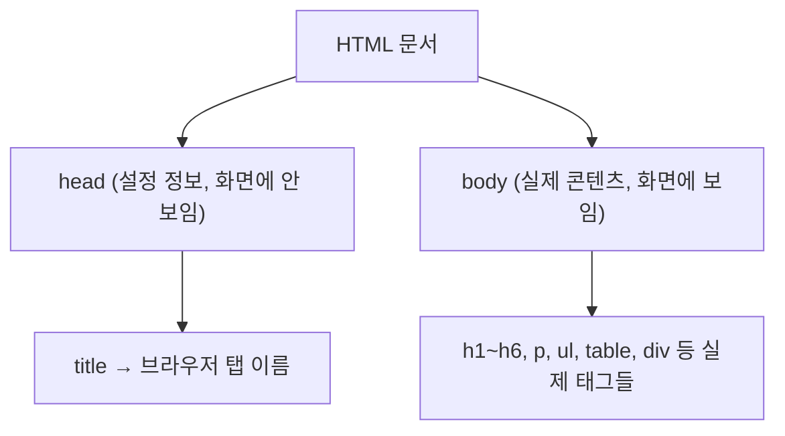
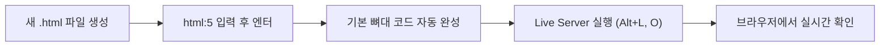

# 오늘 배운 것: HTML로 웹페이지의 뼈대 세우기

## 들어가며 (Situation)

지난주까지는 Git·GitHub로 코드를 버전 관리하고, 클로드 코드로 그 코드를 다루는 법을 배웠다. 오늘부터는 실제로 웹페이지를 이루는 코드, 즉 **HTML**을 처음부터 배우기 시작했다. 지금까지는 마크다운으로 블로그 글만 써봤는데, 마크다운 뒤에서 실제로 렌더링되는 화면을 만드는 언어가 HTML이라는 걸 알고 나니 지금 쓰고 있는 이 블로그 글도 결국 HTML로 변환되어 브라우저에 보인다는 게 새롭게 와닿았다.

## 문제 상황 (Task)

- HTML이 정확히 무엇이고, 지금까지 써온 마크다운과는 어떻게 다른가
- 웹페이지에서 눈에 보이는 부분과 보이지 않는 설정 부분이 어떻게 나뉘어 있는가
- 태그를 열고 닫는 규칙, 그리고 태그 안에 태그를 넣었을 때 생기는 관계는 무엇인가
- VS Code에서 HTML 파일을 만들고, 작성한 코드를 실제 화면으로 바로 확인하려면 어떻게 해야 하는가
- 문단, 목록, 표, 그룹, 링크·이미지처럼 자주 쓰는 태그들은 각각 언제 어떤 속성과 함께 쓰는가

## 해결 과정 (Action)

### A. HTML이란, 그리고 마크다운과 뭐가 다른가

**HTML(HyperText Markup Language)**은 웹페이지의 뼈대(골격)와 콘텐츠를 구성하는 마크업 언어다. 브라우저에서 `F12`를 눌러 개발자 도구를 열면, 예를 들어 네이버 같은 실제 사이트에서도 CSS(디자인)와 JavaScript(동작)를 걷어낸 순수 HTML 뼈대 구조를 확인할 수 있었다.

💡 마크다운은 비개발자도 쉽게 쓸 수 있도록 `#`, `-`, `**`같은 기호로 작성하지만, HTML은 꺾쇠(`< >`)로 감싼 **태그(Tag)**로 이루어진 표준 개발 언어라는 점이 가장 큰 차이였다. 지금까지 써온 마크다운도 결국 내부적으로는 HTML로 변환되어 브라우저에 그려진다.

### B. 문서 구조 — head와 body

HTML 문서는 크게 두 영역으로 나뉜다.

- **`<head>` (머리)**
  - 화면에 직접 노출되지 않는 영역이다.
  - 브라우저 탭에 표시되는 이름(`<title>`)처럼 문서의 설정 정보를 담는다.
- **`<body>` (몸통)**
  - 사용자 눈에 실제로 보여지는 뼈대와 콘텐츠를 작성하는 핵심 영역이다.

### C. 태그 작성 규칙 — 여는/닫는 태그, 부모-자식 관계, 속성

- **태그 세트 규칙**
  - 시작 태그를 열었으면 반드시 종료 태그(앞에 `/`가 붙는 형태)로 닫아야 한다.
  - 🔴 태그를 닫지 않으면 에러가 발생하거나 이후 태그들이 의도치 않게 영향을 받는다.
- **부모와 자식 관계**
  - 태그 내부에 다른 태그를 작성하면 부모-자식 관계가 형성된다.
  - 부모 태그에 적용된 속성(스타일, 링크 등)은 기본적으로 자식 태그에게 유전된다.
- **속성 (Attribute)**
  - 시작 태그 내부에 `속성명="속성값"` (Key-Value) 형태로 작성해서 기본 태그에 추가 기능이나 디자인을 부여한다.

⚠️ 태그를 열고 닫는 순서, 그리고 부모-자식 관계로 인한 속성 상속을 헷갈리면 스타일이 의도치 않은 곳까지 적용될 수 있어서 주의가 필요했다.

### D. VS Code 실습 환경 세팅

- **파일 생성**: 확장자를 `.html`로 지정해서 생성한다.
- **기본 골격 생성**: 첫 줄에 `html:5`를 입력하고 엔터를 치면 기본 뼈대 코드가 자동 완성된다. 이 기능은 **Emmet**이라는 축약 문법 확장 덕분에 동작한다.
- **태그 생성 단축키**: `ul>li*3`을 입력 후 엔터를 치면, `ul` 부모 태그 안에 `li` 자식 태그 3개가 한 번에 생성된다. 매번 태그를 손으로 열고 닫을 필요가 없어서 훨씬 빨랐다.
- **Live Server**: 작성한 코드를 실제 웹 브라우저 화면으로 즉시 확인하기 위한 익스텐션이다. (단축키: `Alt + L, O`)
- **주석 (`<!-- -->`)**: 화면에는 노출되지 않는 필기 전용 공간이다.

🟢 `html:5`, `ul>li*3` 같은 Emmet 축약 문법을 쓰니 태그를 하나하나 손으로 치는 것보다 훨씬 빠르게 뼈대를 잡을 수 있었다.

### E. 기능별 주요 태그 정리

| 분류 | 관련 태그 | 특징 및 속성 |
|---|---|---|
| 글자 및 문단 | `h1` ~ `h6` | 제목을 나타내며, 숫자가 커질수록 글자가 작아진다 |
| 글자 및 문단 | `br`, `hr` | 닫는 태그가 없는 단일 태그 (`br`: 줄바꿈, `hr`: 수평선) |
| 글자 및 문단 | `p`, `pre` | `p`는 엔터·공백을 무시하고 1칸만 인정, `pre`는 작성한 엔터·공백을 그대로 출력 |
| 목록(List) | `ul`, `ol`, `li` | `ul`은 순서 없는 목록, `ol`은 순서 있는 목록. 내부에 `li`(항목)를 포함하며 `ol`은 `type` 속성으로 번호 기호 변경 가능 |
| 표(Table) | `table`, `tr`, `th`, `td` | `tr`은 행(가로줄), `th`는 제목(굵은 글씨), `td`는 일반 데이터. `caption` 태그로 표 설명 가능 |
| 표 속성 | `border`, `width`, `height` | 각각 테두리 두께, 너비, 높이 조절 |
| 표 병합 속성 | `colspan`, `rowspan` | `td` 태그 안에서 사용. `colspan`은 열(가로) 병합, `rowspan`은 행(세로) 병합 (예: 이력서 양식) |
| 그룹 영역 | `div`, `span` | 여러 요소를 하나의 공통 영역으로 묶을 때 사용. `style` 속성으로 테두리·배경색(`background-color`)을 한 번에 적용 가능 |
| 링크 및 이미지 | `a`, `img` | `a`는 다른 페이지로 이동하는 앵커. `a` 자식으로 `img`를 넣으면 클릭 가능한 이미지 링크 완성 |

⚠️ `colspan`·`rowspan`은 이력서처럼 칸이 불규칙하게 합쳐지는 표를 만들 때 특히 헷갈리기 쉬워서, 표를 그려보고 어느 칸이 합쳐지는지 먼저 스케치한 뒤 코드를 짜는 게 실수를 줄이는 방법이었다.

## 결과 (Result)

- 마크다운으로만 글을 쓰다가 HTML을 직접 배우고 나니, 지금까지 편하게 써온 마크다운 문법들이 실제로는 어떤 태그로 변환되는지 감이 잡히기 시작했다.
- head/body 구조를 알고 나니, 브라우저 탭 제목처럼 "화면엔 안 보이지만 분명히 존재하는" 설정 영역이 있다는 걸 이해하게 됐다.
- 여는 태그와 닫는 태그, 부모-자식 상속 개념을 실습하면서 왜 HTML 코드가 들여쓰기(indentation)로 계층 구조를 표현하는지 이해할 수 있었다.
- Emmet 축약 문법(`html:5`, `ul>li*3`)을 실습해보니, 반복되는 태그 구조를 손으로 다 치지 않아도 되어 작성 속도가 눈에 띄게 빨라졌다.
- 표 태그(`table`, `colspan`, `rowspan`)를 이력서 양식으로 직접 만들어보면서, 표 구조를 글로만 이해하는 것과 실제로 칸을 병합해보는 것은 확실히 다르다는 걸 느꼈다.

## 더 학습하면 좋은 개념

- **CSS(Cascading Style Sheets)** — 오늘 배운 HTML은 뼈대일 뿐이고, 실제 디자인(색상, 여백, 레이아웃)은 CSS가 담당한다. `div`, `span`에 적용해본 `style` 속성이 CSS의 가장 기초적인 형태다.
- **시맨틱 태그 (Semantic HTML)** — `div`로만 구조를 나누는 대신 `header`, `nav`, `main`, `footer`처럼 의미를 가진 태그를 쓰면 접근성과 검색엔진 최적화(SEO)에 유리하다.
- **DOM (Document Object Model)** — 브라우저가 HTML 태그를 어떻게 트리 구조의 객체로 해석하는지에 대한 개념이다. 부모-자식 관계가 실제로 어떻게 동작하는지 이해하는 데 필요하다.
- **폼(Form) 태그** — 오늘은 다루지 않았지만, `input`, `button`, `select` 등으로 사용자 입력을 받는 방법은 웹페이지를 "보여주기"에서 "상호작용"으로 확장하는 다음 단계다.
- **웹 접근성 (Web Accessibility, a11y)** — `img`의 대체 텍스트(`alt`)처럼, 오늘 배운 태그 하나하나가 스크린 리더 사용자에게 어떻게 읽히는지까지 고려하면 더 좋은 웹페이지를 만들 수 있다.

## 참고 자료
- [MDN - HTML: HyperText Markup Language](https://developer.mozilla.org/en-US/docs/Web/HTML)
- [MDN - Getting started with HTML](https://developer.mozilla.org/en-US/docs/Learn_web_development/Core/Structuring_content/Basic_HTML_syntax)
- [MDN - HTML table basics](https://developer.mozilla.org/en-US/docs/Learn_web_development/Core/Structuring_content/HTML_table_basics)
- [Emmet 공식 문서 - Emmet Cheat Sheet](https://docs.emmet.io/cheat-sheet/)
- [VS Code 공식 문서 - Live Server 확장 마켓플레이스](https://marketplace.visualstudio.com/items?itemName=ritwickdey.LiveServer)
