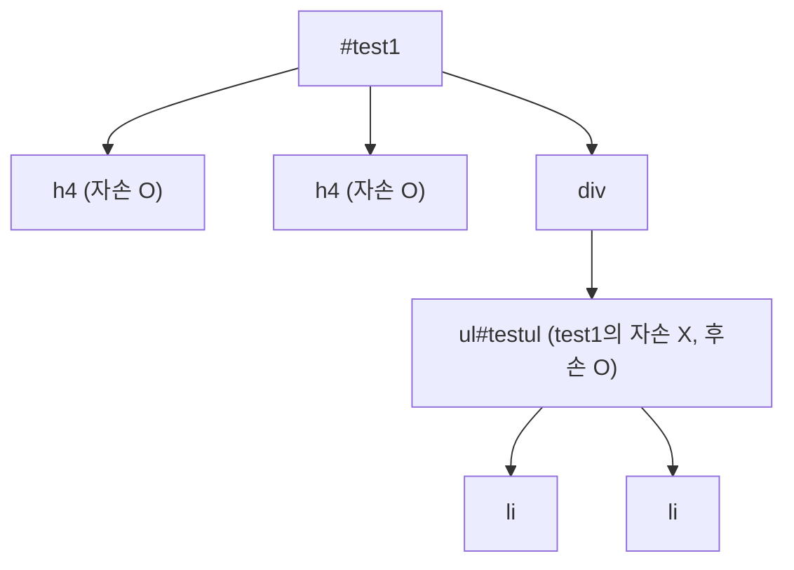

<style>
.page__content { font-size: 0.8em; }
</style>

# 오늘 배운 것: CSS 선택자 — 종류가 너무 많아서 일단 따라 쳐본 하루

## 들어가며 (Situation)

어제까지 HTML로 웹페이지의 뼈대(구조)를 세우는 법을 배웠다면, 오늘은 그 태그를 실제로 꾸며주는 **CSS(Cascading Style Sheets)**, 그중에서도 "어떤 요소를 골라서 스타일을 적용할지"를 정하는 **선택자(Selector)**를 배웠다. 예제 파일을 순서대로 따라 치면서 실습했다.

## 문제 상황 (Task)

- 선택자 종류가 기본(전체/태그/id/class)만 있는 게 아니라 동위, 구조, 부정, 문자, 속성, 상태 선택자까지 있어서 뭐가 뭔지 한 번에 정리가 안 됐다
- style 태그 안에 CSS를 직접 쓰는 방식과, 별도 `.css` 파일로 분리하는 방식이 뭐가 다른지
- "자손"과 "후손"이라는 비슷해 보이는 단어가 실제로는 다른 선택자를 가리킨다는 것

💡 사실 오늘은 하나하나를 완전히 이해하고 넘어갔다기보다는, 예제 코드를 그대로 따라 치면서 "이런 게 있구나" 하고 눈에 익히는 데 가까웠다. 그래서 이 글은 "완벽히 이해했다"는 기록보다는, 오늘 본 선택자들을 종류별로 다시 정리해서 다음에 복습할 때 쓸 지도(map)에 가깝다.

## 해결 과정 (Action)

### A. 선택자란, 그리고 style을 어디에 쓸 것인가

**선택자(Selector)**는 특정 HTML 요소를 골라서 원하는 스타일을 적용할 때 쓰는 기능이다. 오늘 실습은 두 가지 방식으로 CSS를 적용해봤다.

| 방식 | 작성 위치 | 특징 |
|---|---|---|
| 내부 스타일시트 | `<head>` 안 `<style>` 태그 | HTML 파일 하나에 다 들어있어서 파일을 옮기기는 쉽지만, 코드가 길어지면 head가 CSS로 꽉 참 |
| 외부 스타일시트 | 별도 `.css` 파일 + `<link rel="stylesheet" href="파일명.css">` | HTML과 CSS가 분리돼서 관리가 편함. 오늘 실습 기준으로 **우선순위는 동일** |

🔴 첫 예제 파일(`01_css선택자1.html`)은 `<style>` 태그 안에 CSS가 잔뜩 들어있었는데, 두 번째 예제(`02_css선택자2.html`)에서 바로 이 문제를 "외부 스타일시트로 분리해서 해결해보자"는 식으로 이어졌다. CSS를 style 태그에 몰아넣으면 나중에 파일이 지저분해질 수 있다는 걸 코드 주석으로 직접 확인했다.

### B. 기본 선택자

- **전체 선택자 (`*`)**
  - HTML 문서 안의 모든 요소를 한 번에 선택한다.
- **태그 선택자 (`태그명`)**
  - 예: `li { color: blue; }` — 문서 안의 모든 `li` 태그를 선택한다.
- **id 선택자 (`#id값`)**
  - `id="id3"`인 요소는 `#id3`로 선택한다. 한 문서 안에서 id는 원칙적으로 유일하다.
- **class 선택자 (`.class값`)**
  - `class="class3"`인 요소는 `.class3`으로 선택한다. class는 여러 요소에 중복으로 붙일 수 있다.

⚠️ 전체 선택자(`*`)와 태그 선택자(`li`)를 같이 쓰면 둘 다 적용 대상이 겹칠 수 있어서, 실제로 어떤 스타일이 최종적으로 이기는지(우선순위) 눈으로 결과를 보면서 확인해야 했다.

### C. 동위(형제) 선택자와 구조 선택자

**동위 관계(형제 관계)**는 부모-자식처럼 포함된 관계가 아니라, 같은 부모 아래 나란히 놓인 태그들의 관계를 말한다.

- **인접 형제 선택자 (`A + B`)**
  - `#div-test1 + div` — `id="div-test1"`인 요소 바로 다음에 오는 `div` 하나만 선택한다.
- **일반 형제 선택자 (`A ~ B`)**
  - `#div-test1 ~ div` — 그 요소보다 뒤에 있는 `div`를 전부 선택한다. (오늘 예제에서는 "추후 실습에 방해된다"는 이유로 주석 처리되어 있었다.)

**구조 선택자**는 태그 이름이나 id가 아니라 **위치**로 요소를 고르는 선택자다.

| 선택자 | 의미 |
|---|---|
| `:first-child` | 형제 중 첫 번째 요소 |
| `:last-child` | 형제 중 마지막 요소 |
| `:nth-child(2)` | 형제 중 2번째 요소 |
| `:nth-child(3n)` | 3, 6, 9 ... 번째처럼 3의 배수 번째 요소 |
| `:nth-child(2n-1)` | 홀수 번째 요소 |
| `:nth-last-child(4)` | 뒤에서 4번째 요소 |

⚠️ `nth-child`에 들어가는 수열(`3n`, `2n-1` 같은 것)이 오늘 가장 헷갈렸던 부분이다. 코드를 따라 치고 결과 화면에서 색이 어디에 칠해지는지 보면서야 "아 이게 이런 뜻이었구나" 하고 겨우 감을 잡았다.

### D. 부정 선택자와 문자 선택자

- **부정 선택자 (`:not()`)**
  - 지금까지의 선택자와 반대로 동작한다. `p:not(:nth-child(odd))`는 "홀수 번째가 아닌 `p`"를 선택한다.
- **문자 선택자**
  - `::first-letter` — 텍스트의 첫 글자만 선택
  - `::first-line` — 텍스트의 첫 줄만 선택
  - `::selection` — 사용자가 마우스로 드래그해서 선택한 부분

### E. 속성 선택자 — `[]` 안에 조건 넣기

기본 선택자 뒤에 대괄호(`[]`)로 속성과 속성값을 지정해서 더 세밀하게 요소를 고를 수 있다.

| 선택자 | 의미 |
|---|---|
| `div[name=name2]` | `name` 속성값이 정확히 `name2`와 일치하는 `div` |
| `div[name~=name1]` | `name` 속성값에 띄어쓰기로 구분된 값 중 `name1`이 포함된 `div` |
| `div[class\|=class]` | `class` 값이 `class`와 정확히 같거나, `class-`로 시작하는 `div` |
| `div[name^=name]` | `name` 속성값이 `name`으로 **시작하는** `div` |
| `div[class$=class]` | `class` 속성값이 `class`로 **끝나는** `div` |
| `div[class*=div]` | `class` 속성값 안에 `div`라는 문자열이 **포함된** `div` |

🔴 `^=`(시작), `$=`(끝), `*=`(포함), `~=`(단어 단위 포함), `|=`(정확히 일치 또는 `-` 접두사)가 기호만 보면 거의 구분이 안 갔다. 지금은 표로 정리해뒀지만, 실제로 손으로 몇 번 더 쳐봐야 기호와 의미가 매칭될 것 같다.

### F. 자손 선택자와 후손 선택자 — 가장 헷갈렸던 부분

- **자손 선택자 (`A > B`)**: A **바로 아래**에 있는 요소만 선택
- **후손 선택자 (`A B`, 공백)**: A 하위에 있는 요소를 **전부** 선택



예제 파일 주석에 이런 부분이 있었다.

```css
/* 사용할 수 있는 hint : 부모 태그의 id */
#test1>h4 {
    background: hotpink;
}

/* 아래는 불가능 */
#test1>ul>li {
    background: cadetblue;
}

/* 후손 선택자 테스트 */
#test1 ul {
    background: cadetblue;
}
```

🔴 `#test1 > ul > li`가 "불가능"하다고 적혀 있었는데, 실제 구조를 보니 `ul`이 `#test1`의 바로 아래(자손)가 아니라 `div`를 한 번 거친 아래(후손)에 있었다. `>`는 **한 단계 아래만** 인정하기 때문에, 부모-자식 관계가 한 칸이라도 어긋나면 선택이 안 된다는 걸 이 실패 사례로 이해했다.

🟢 반대로 `#test1 ul`처럼 공백으로 쓰면 몇 단계 아래에 있든 상관없이 선택된다. **"이번엔 왜 안 먹지?"** 싶을 때 자손(`>`)과 후손(공백)을 헷갈린 건 아닌지부터 확인해봐야겠다.

### G. 상태(이벤트) 선택자 — 사용자 행동에 반응하는 선택자

| 선택자 | 의미 |
|---|---|
| `:active` | 사용자가 클릭하는 순간 |
| `:hover` | 마우스 커서가 올라가 있을 때 |
| `:focus` | 입력창 등에 포커스가 잡혔을 때 (예: `#userId:focus`) |
| `:checked` | 체크박스/라디오가 선택된 상태 (예: `input[type=checkbox]:checked`) |
| `:enabled` / `:disabled` | `disabled` 속성 여부에 따라 활성/비활성 요소를 구분 |

실습 파일에는 `<option value="붕어빵" disabled>`처럼 일부 항목만 `disabled`를 걸어두고, `:enabled`와 `:disabled` 선택자로 각각 다른 배경색을 입히는 예제가 있었다. 체크박스, 라디오, select, input, button까지 실제 폼 요소로 직접 확인해볼 수 있어서 이 부분은 그나마 결과가 눈에 바로 보여서 이해하기 편했다.

## 결과 (Result)

- 오늘은 개념을 완전히 체화했다기보다, 예제를 따라 치면서 "이런 선택자가 있다"는 걸 눈에 익힌 날이었다. 솔직히 아직 스스로 처음부터 짜라고 하면 헷갈릴 것 같다.
- 그래도 가장 크게 남은 건 **자손(`>`)과 후손(공백)의 차이** — `#test1>ul>li`가 왜 안 먹혔는지를 구조 그림으로 직접 그려보고 나서야 이해가 됐다.
- 속성 선택자(`^=`, `$=`, `*=`, `~=`, `|=`)와 구조 선택자(`nth-child` 수열)는 기호와 의미를 아직 다 못 외웠고, 다음에 실습 파일을 다시 열어서 눈에 보이는 결과와 코드를 짝지어보며 반복해야 할 것 같다.
- 내부 스타일시트(`<style>`)와 외부 스타일시트(`.css` + `link`)를 둘 다 써보면서, 코드가 길어질수록 왜 외부 파일로 분리하는지 감이 왔다.

## 더 학습하면 좋은 개념

- **CSS 우선순위(Specificity)** — 오늘은 선택자를 "고르는 법"만 배웠는데, id·class·태그 선택자가 동시에 적용되면 어떤 스타일이 이기는지(우선순위 계산법)를 모르면 "왜 내가 준 스타일이 안 먹지"라는 상황을 계속 마주치게 될 것 같다.
- **CSS 상속(Inheritance)과 캐스케이딩(Cascading)** — 부모 요소의 스타일이 자식에게 어떻게 전달되는지, 그리고 여러 규칙이 충돌할 때 어떤 순서로 "누적(cascade)"되는지 이해하면 오늘 배운 선택자를 실전에서 더 잘 쓸 수 있다.
- **박스 모델(Box Model)** — `margin`, `border`, `padding`, `content`로 이루어진 개념으로, 선택자로 요소를 고른 다음 "그 요소를 얼마나 크게, 어떤 여백으로 배치할지"를 정하는 다음 단계다.
- **의사 클래스(Pseudo-class)와 의사 요소(Pseudo-element)의 차이** — 오늘 쓴 `:hover`, `:nth-child`는 의사 클래스(콜론 1개), `::first-letter`, `::selection`은 의사 요소(콜론 2개)다. 왜 콜론 개수가 다른지 공식 문서로 확인해보면 좋을 것 같다.
- **Flexbox / Grid 레이아웃** — 오늘 배운 선택자로 "어떤 요소를 고를지"는 익혔으니, 다음은 고른 요소들을 화면에 "어떻게 배치할지"를 배우는 단계다.

## 참고 자료
- [MDN - CSS selectors](https://developer.mozilla.org/en-US/docs/Web/CSS/CSS_selectors)
- [MDN - Attribute selectors](https://developer.mozilla.org/en-US/docs/Web/CSS/Attribute_selectors)
- [MDN - :nth-child()](https://developer.mozilla.org/en-US/docs/Web/CSS/:nth-child)
- [MDN - Child combinator](https://developer.mozilla.org/en-US/docs/Web/CSS/Child_combinator)
- [MDN - Descendant combinator](https://developer.mozilla.org/en-US/docs/Web/CSS/Descendant_combinator)
- [MDN - Pseudo-classes and pseudo-elements](https://developer.mozilla.org/en-US/docs/Web/CSS/Pseudo-classes_and_pseudo-elements)
