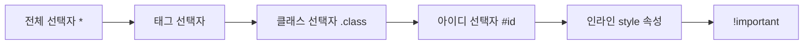

<style>
.page__content { font-size: 0.8em; }
</style>

# 오늘 배운 것: 우선순위 계산법, Flex/Grid 배치, 그리고 Tailwind와의 첫 비교

## 들어가며 (Situation)

어제는 CSS 선택자로 "어떤 요소를 고를지"를 배웠다. 오늘 배운 것은 그 다음 단계 세 가지다. 첫째, 여러 선택자가 같은 요소에 겹칠 때 누가 이기는지(우선순위). 둘째, 고른 요소를 화면에 어떻게 배치할지(Flexbox·Grid). 셋째, 이 모든 걸 매번 직접 CSS로 짜는 대신 유틸리티 클래스로 조합하는 **Tailwind**를 맛보기로 비교해봤다.

## 문제 상황 (Task)

- 같은 요소에 `id` 선택자, `class` 선택자, `style` 속성, `!important`가 동시에 걸리면 최종적으로 어떤 스타일이 적용되는지 헷갈렸다
- `div`로만 카드 영역을 나열하면 세로로 쌓이기만 하고, 화면 크기에 따라 유연하게 배치가 안 된다는 문제가 있었다
- 순수 CSS로 만든 카드 레이아웃과 Tailwind 유틸리티 클래스로 만든 결과물이 실제로 같은 걸 다른 방식으로 표현한 것뿐인지 확인이 필요했다

## 해결 과정 (Action)

### A. 선택자 우선순위 — 계급이 있다

CSS는 기본적으로 위에서 아래로 적용되지만, 같은 요소에 여러 선택자가 겹치면 아래 순서로 우선순위가 정해진다.

💡 `!important > 인라인 선택자 > 아이디 선택자 > 클래스 선택자 > 태그 선택자 > 전체 선택자`



오늘 실습 파일(`04_선택자우선순위.html`)에는 예제가 두 개 있었다.

```css
* {
    color: red;
}

div {
    background: blue;
    color: aqua;
}

#test1 {
    background: palegoldenrod;
}

.test1 {
    background: darkblue;
}
```

```html
<div id="test1" class="test1">우선순위테스트</div>
```

첫 번째 예시(`#test1`)는 아이디 선택자(`#test1`, palegoldenrod)와 클래스 선택자(`.test1`, darkblue)가 겹치는 경우인데, 실제 배경색은 **palegoldenrod**였다. id가 class보다 우선순위가 높기 때문이다. 글자색은 전체 선택자(`* { color: red }`)와 태그 선택자(`div { color: aqua }`)가 겹쳤는데, 태그 선택자가 전체 선택자보다 세서 **aqua**로 나왔다.

두 번째 예시(`#test2`)는 여기에 인라인 스타일까지 더해서 계급을 하나 더 확인했다.

```css
#test2 {
    background: dodgerblue;
}

.test2 {
    background: tomato !important;
}
```

```html
<div id="test2" class="test2" style="background: green;">우선순위테스트</div>
```

같은 `div`에 아이디 선택자(`#test2`), 클래스 선택자(`.test2`), 인라인 스타일(`style="background: green;"`)이 전부 걸려 있는데, 실제로 화면에 적용된 배경색은 **tomato**였다.

🔴 처음엔 "인라인 스타일이 태그에 직접 쓰여 있으니까 가장 강할 것"이라고 생각했다. id 선택자보다는 인라인이 세다는 것까지는 맞았지만, `!important`가 붙은 클래스 선택자가 인라인 스타일보다도 우선순위가 높다는 걸 놓쳤다.

🟢 결과를 보고 나서야 표로 정리한 계급 순서에서 `!important`가 맨 앞에 있는 이유를 체감했다. **"스타일이 왜 안 먹지?"** 싶을 때는 계급표를 순서대로 짚어보면 된다.

### B. block과 inline — 배치의 기본 단위

Flex/Grid를 배우기 전에 `display`의 기본값부터 다시 봤다.

- **block**
  - `div`의 기본값. 자기 줄을 통째로 차지해서 다음 요소는 무조건 아래로 밀린다.
- **inline**
  - `span`의 기본값. 내용 크기만큼만 차지하고 옆으로 이어 붙는다. `width`/`height`를 줘도 반영되지 않는다.
- **inline-block**
  - 옆으로 붙으면서도 `width`/`height`가 먹는, block과 inline을 섞은 방식.

⚠️ `display: block`을 준 `span`은 `div`처럼 자기 줄을 차지하고, `display: inline`을 준 `div`는 `span`처럼 옆으로 붙는다. 즉 태그 이름(`div`, `span`)이 아니라 `display` 속성값이 실제 배치 방식을 결정한다.

### C. Flexbox — 한 방향으로 줄 세우기

`div`로만 카드를 나열하면 세로로 쌓이기만 하고 화면을 줄이거나 늘여도 유연하게 반응하지 않는다. 이 문제를 **Flexbox**로 풀었다.

```css
.card-list {
    display: flex;
    flex-direction: row;
    justify-content: space-between;
    align-items: flex-start;
    gap: 20px;
    flex-wrap: wrap;
}
```

- **플렉스 컨테이너 / 플렉스 아이템**
  - `display: flex`를 준 요소(카드를 감싸는 `.card-list`)가 컨테이너, 그 내부의 카드 하나하나가 아이템이다. `flex`는 카드가 아니라 카드를 **감싸는 상자**에 줘야 한다.
- **주축과 교차축**
  - `flex-direction`이 정하는 방향이 주축(기본값 `row` = 가로), 주축과 직각인 방향이 교차축이다.
- **justify-content / align-items**
  - `justify-content`는 주축 방향 정렬(`flex-start`, `center`, `space-between`, `space-around`, `space-evenly`), `align-items`는 교차축 방향 정렬(`stretch`, `flex-start`, `center`, `flex-end`)을 담당한다.

🔴 `align-items`를 기본값(`stretch`)으로 두면 카드 하나의 설명(`desc`) 텍스트가 길어질 때, 그 옆 카드들도 똑같은 높이로 늘어나 버렸다. 카드마다 내용 길이가 다른데 높이는 같아 보이는 게 어색했다.

🟢 `align-items: flex-start`로 바꾸니 각 카드가 자기 내용만큼만 높이를 갖게 됐다. 설명이 있는 카드만 자연스럽게 더 길어졌다.

⚠️ `flex-wrap`을 기본값(`nowrap`)으로 두면 화면이 좁아졌을 때 카드가 줄어들거나 상자 밖으로 넘친다. `wrap`을 주면 화면 비율에 맞춰 다음 줄로 내려간다.

### D. Grid — 칸을 그려두고 채우기

Flex가 "한 줄로 세우고 정렬"이라면, **Grid**는 "칸을 행과 열로 미리 그려두고 그 칸에 아이템을 채우는" 방식이다.

```css
.grid-list {
    display: grid;
    grid-template-columns: repeat(3, 1fr);
    gap: 20px;
}
```

- `grid-template-columns: repeat(3, 1fr)`는 열을 3개로 나누고, `fr`(fraction)로 남은 공간을 균등하게 배분한다.
- 행의 개수는 따로 지정하지 않았다. 열 개수만 정하면 행은 아이템 수에 맞춰 자동으로 계산된다 (아이템 6개 ÷ 3열 = 2행).

| 구분 | Flexbox | Grid |
|---|---|---|
| 배치 방향 | 한 방향(주축) | 행과 열, 두 방향 동시 |
| 사고 방식 | 줄을 세우고 정렬 | 칸을 그려두고 채움 |
| 적합한 상황 | 네비게이션 바, 카드 한 줄 나열 | 갤러리, 대시보드처럼 격자형 배치 |

### E. 순수 CSS vs Tailwind — 같은 결과, 다른 방식

같은 "오늘의 추천 상품" 카드를 순수 CSS(`style.css`)와 Tailwind 유틸리티 클래스로 각각 만들어봤다.

**순수 CSS 버전**은 클래스 이름을 직접 정의하고, hover 효과와 배지 깜빡임 애니메이션까지 `@keyframes`로 만들었다.

```css
.card {
  transition: all 0.3s;
}

.card:hover {
  background-color: #F9FAFB;
  transform: translate(0, -8px) scale(1.05);
  box-shadow: 0 8px 20px rgba(0, 0, 0, 0.12);
}

@keyframes blink {
  0%   { background-color: #DC2626; }
  50%  { background-color: #F97316; }
  100% { background-color: #DC2626; }
}
```

⚠️ 주석으로 강조된 부분이 두 가지 있었다. `transition`은 `:hover` 규칙이 아니라 **원래 규칙**(`.card`)에 써야 마우스를 뗄 때도 부드럽게 되돌아온다는 것, 그리고 `.card:hover`처럼 붙여 써야 "카드 자신에게 마우스를 올렸을 때"라는 뜻이 되고, `.card :hover`처럼 띄어 쓰면 "카드 안쪽 요소"를 가리키는 완전히 다른 선택자가 된다는 것.

**Tailwind 버전**은 같은 hover 효과를 클래스 조합으로 표현했다.

```html
<div class="bg-white border border-gray-200 rounded-lg p-4 transition
            hover:bg-gray-50 hover:-translate-y-2 hover:scale-105 hover:shadow-lg">
```

| 항목 | 순수 CSS | Tailwind |
|---|---|---|
| 스타일 정의 위치 | 별도 `.css` 파일에 클래스 이름을 직접 정의 | HTML `class` 속성에 유틸리티 클래스를 바로 나열 |
| hover 효과 | `.card:hover { ... }` 규칙을 새로 작성 | `hover:` 접두사만 클래스 앞에 붙임 |
| 재사용 | 클래스 이름을 기억하고 CSS 파일을 오가야 함 | 클래스 이름 자체가 곧 스타일이라 HTML만 봐도 결과가 짐작됨 |

🔴 다만 오늘 만든 Tailwind 버전에는 NEW 배지의 깜빡임 애니메이션(`@keyframes blink`)에 해당하는 부분을 아직 옮기지 못했다. `hover:` 유틸리티만으로는 순수 CSS의 `animation` 속성을 그대로 대체할 수 없었고, Tailwind에서 커스텀 애니메이션을 쓰려면 설정(`tailwind.config`)에 키프레임을 직접 등록해야 한다는 것까지만 확인했다. 다음 실습에서 이어서 해봐야 할 부분이다.

## 결과 (Result)

- 선택자 우선순위 계급(`!important > 인라인 > id > class > 태그 > 전체`)을 표로만 외운 게 아니라, 실제로 셋이 충돌하는 코드에서 무엇이 이기는지 직접 확인하고 나니 훨씬 또렷해졌다.
- `div`만으로는 불가능했던 "카드 3장을 가로로, 화면 크기에 따라 유연하게" 배치를 `display: flex` 한 줄로 해결했다.
- Flexbox와 Grid를 같은 카드 목록에 각각 적용해보면서, "한 줄로 세우는 것"과 "칸을 채우는 것"이라는 사고방식 차이를 감으로 익혔다.
- 순수 CSS와 Tailwind로 같은 hover 효과를 두 번 만들어보니, Tailwind는 클래스 이름만 보고도 결과를 짐작할 수 있다는 장점이 크게 와닿았다. 다만 커스텀 애니메이션처럼 Tailwind가 기본 제공하지 않는 부분은 아직 어떻게 다뤄야 할지 못 풀었다.

## 더 학습하면 좋은 개념

- **CSS Cascade(캐스케이딩)** — 오늘은 선택자 간 우선순위만 봤는데, 우선순위가 같을 때는 "나중에 선언된 것이 이긴다"는 캐스케이딩 규칙까지 알아야 우선순위 계산이 완성된다.
- **박스 모델(Box Model)** — 카드에 `padding`, `border`, `gap`을 주면서 실제로 각 카드가 차지하는 크기가 어떻게 계산되는지 이해하면 Flex/Grid 배치가 왜 그렇게 나오는지 더 명확해진다.
- **CSS Transform과 Transition 심화** — 오늘은 `translate`, `scale`을 hover에 썼는데, `transition-timing-function`(easing)까지 배우면 움직임의 "느낌"을 더 세밀하게 조절할 수 있다.
- **@keyframes와 animation 속성** — 오늘 배지 깜빡임에 잠깐 등장했다. `animation-delay`, `animation-direction` 같은 세부 옵션과, 이걸 Tailwind 설정에 커스텀으로 등록하는 방법을 더 봐야 한다.
- **Tailwind의 유틸리티 우선(Utility-First) 철학** — 왜 이 방식이 등장했는지, 클래스가 많아질 때의 단점(가독성)을 팀에서는 어떻게 관리하는지 공식 문서로 확인하면 좋을 것 같다.

## 참고 자료
- [MDN - CSS Specificity](https://developer.mozilla.org/en-US/docs/Web/CSS/Specificity)
- [MDN - CSS Cascade](https://developer.mozilla.org/en-US/docs/Web/CSS/Cascade)
- [MDN - Flexbox 기본 개념](https://developer.mozilla.org/en-US/docs/Web/CSS/CSS_flexible_box_layout/Basic_concepts_of_flexbox)
- [MDN - Grid 레이아웃 기본 개념](https://developer.mozilla.org/en-US/docs/Web/CSS/CSS_grid_layout/Basic_concepts_of_grid_layout)
- [MDN - @keyframes](https://developer.mozilla.org/en-US/docs/Web/CSS/@keyframes)
- [Tailwind CSS 공식 문서](https://tailwindcss.com/docs)
