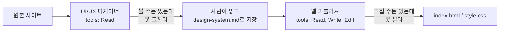

<style>
.page__content { font-size: 0.8em; }
</style>

# 오늘 배운 것: 서브에이전트로 역할 나누기, 그리고 디자인을 숫자로 검증하는 법

## 들어가며 (Situation)

여기서부터는 HTML과 CSS를 손으로 쓰지 않는다. 지금까지는 태그와 선택자, 박스 모델, Flexbox·Grid를 직접 손으로 다뤘는데, 오늘부터는 그 손이 자(scale)로 바뀐다. 화면은 에이전트가 짓고, 맞는지 판정하는 것은 사람이 하는 방식이다. 그래서 오늘 진짜 배운 결과물은 화면 하나가 아니라 **서로 다른 권한을 가진 에이전트 두 개**와 **판정 기준 하나**였다.

## 문제 상황 (Task)

오늘 수업의 학습 목표는 세 가지였다.

- 서브에이전트를 만들고 `tools:`로 역할을 강제할 수 있어야 한다 — 도구를 줄이는 것이 왜 "역할을 만드는 일"이 되는지 스스로 설명할 수 있어야 한다
- 따라 하고 싶은 사이트에서 디자인 시스템을 뽑아 `design-system.md` 한 장으로 적을 수 있어야 한다
- 에이전트가 뽑은 값을 개발자 도구로 직접 재서 반박하거나 확정할 수 있어야 한다 — 그리고 틀렸다면 왜 틀렸는지를 에이전트 규칙에 반영해야 한다

지금까지 AI에게 규칙을 주는 자리는 두 곳이었다. `CLAUDE.md`(항상 읽히는 사실)와 스킬(부를 때만 읽히는 절차). 그런데 둘 중 어디에도 "이 일을 하는 사람은 화면을 볼 수는 있지만 코드를 고쳐서는 안 된다"는 건 적을 수 없었다. 이건 사실도 절차도 아니고 **역할**이기 때문이다.

## 해결 과정 (Action)

### A. 서브에이전트 — 역할을 파일 하나에 적는다

서브에이전트는 `.claude/agents/이름.md` 파일 하나로 정의된다. 스킬(`.claude/skills/이름/SKILL.md`)과 모양은 거의 같지만 다른 점이 세 가지다.

| | 스킬 | 서브에이전트 |
|---|---|---|
| 두는 곳 | `.claude/skills/이름/SKILL.md` | `.claude/agents/이름.md` — 파일 하나가 곧 에이전트 |
| 부르는 법 | `/이름` | 이름을 말로 부른다 ("○○ 서브에이전트를 써서…") |
| 이름표 | 폴더 이름이 곧 이름, 머리말 없어도 됨 | `name:`을 반드시 적어야 함 |

🚨 `name:`을 빼고 만든 에이전트는 오류가 나는 게 아니라 목록에 아예 나타나지 않는다. 이름을 불러도 `Agent type 'noname' not found. Available agents: ...`처럼 쓸 수 있는 이름 전체를 알려줄 뿐이다. 이 메시지 덕분에 내 에이전트가 목록에 없다는 사실을 그 자리에서 알 수 있다.

```yaml
---
name: reader
description: 파일을 읽어 요약한다. 파일 요약이 필요할 때 사용한다.
tools: Read
---

## 역할
너는 파일을 읽어 요약하는 에이전트이다.
파일을 요약만 하고 파일을 수정하거나 생성하지 않는다.
```

이게 실제로 `clone-project/.claude/agents/reader.md`에 만든 파일이다.

### B. `tools:` — 부탁이 아니라 강제 (그런데 실제로 해보니 달랐다)

본문의 "파일을 수정하거나 생성하지 않는다"는 규칙처럼 보이지만 실제로는 **부탁**이다. 본문은 읽고 참고하는 글일 뿐이라 지켜질 수도, 안 지켜질 수도 있다.

💡 역할을 말이 아니라 구조로 정하는 방법이 `tools:` 한 줄이다. 머리말에 `tools: Read`를 추가하면 그 목록 밖의 일은 아예 할 수 없게 된다는 게 수업의 설명이었다. 사람은 열쇠가 없으면 가진 사람에게 부탁할 수 있지만, 에이전트는 부탁할 상대가 없다 — 목록에 없으면 그 일을 아예 못 한다는 것.

그래서 배운 대로 검증 절차(Step 2-3)를 그대로 해봤다. `reader` 서브에이전트에게 `sample.txt`(점심 메뉴 이야기가 담긴 짧은 텍스트)를 요약해 달라고 한 뒤, 그 요약을 `result.txt`라는 **새 파일로 만들어 달라**고 시켰다.

🔴 예상과 결과가 달랐다. `tools: Read`만 준 `reader`가 실제로 `result.txt` 파일을 만들어냈다. 안에는 `sample.txt` 요약("작성자가 곧 점심시간을 맞이할 예정", "오늘의 메뉴는 마라탕과 꿔바로우" 등)이 그대로 들어 있었다. 수업 자료에는 "도구가 없어서 못 만든다"고 답하고 폴더에 파일이 안 생기는 게 성공 조건이라고 적혀 있었는데, 정반대의 결과를 실제로 목격한 것이다.

⚠️ 이 지점은 아직 "왜 그런지"까지는 확인하지 못했다. `tools:` 제한이 버전에 따라 다르게 동작하는 건지, 내가 `reader.md`를 잘못 적었는지(예: `tools:` 값 뒤에 공백이나 표기 오류), 아니면 다른 경로로 파일이 생성된 건지는 **확인 필요**로 남겨둔다. 다만 이 실험 자체가 오늘 배운 것 중 가장 값진 부분이었다 — "머리말에 `tools: Read`라고 적었으니 당연히 안전할 것"이라고 그냥 믿지 않고, 직접 시켜서 반박(또는 확정)해야 한다는 수업의 원칙이 `tools:` 자체에도 그대로 적용된다는 걸 몸으로 확인했기 때문이다.

오늘 만든 두 에이전트(디자이너·퍼블리셔)도 같은 원리로 서로 다른 열쇠를 갖도록 설계했다.

| 에이전트 | `tools:` | 의도한 제약 | 그래서 생기는 것 |
|---|---|---|---|
| UI/UX 디자이너 (`ui-designer`) | `Read` | HTML·CSS 수정 불가 | 결과를 보고서로 돌려받아 내가 `design-system.md`로 저장 |
| 웹 퍼블리셔 (`web-publisher`) | `Read, Write, Edit` | 원본 사이트 열람 불가 | `design-system.md`가 가진 정보의 전부가 됨 |

이 두 에이전트에 대해서는 아직 "막아 둔 일을 일부러 시켜서" 재검증하지는 못했다. `reader`에서 나온 결과를 보면 이 둘도 똑같이 확인이 필요하다.



### C. 재는 도구 만들기 — `extract-design.js`로 당근마켓 4페이지 실측

"이런 느낌으로 만들어줘"에는 잴 수 있는 게 하나도 없다. 반대로 화면을 이루는 건 처음부터 끝까지 숫자다. 그래서 클론 대상을 **당근마켓**으로 정하고, Claude에게 재는 도구부터 만들어 달라고 했다.

실제로 입력한 프롬프트다.

```text
extract-design.js 를 만들어줘. playwright 로 동작하고, 조건은 이렇다.
- 주소를 여러 개 받아서 하나씩 연다 (창 너비 1440)
- 이미 깔린 크롬을 쓴다 (chromium.launch 에 channel: "chrome")
- 페이지마다 :root 에 선언된 CSS 변수를 전부 모은다
- 페이지마다 화면에 보이는 요소의 글자색 · 배경색 · 테두리색 · 글꼴 ·
  글자크기 · 글자굵기 · 모서리 · 간격 · 안쪽여백을 센다
- 색은 rgb 를 hex 로 바꾸고, 반투명은 버린다
- 모서리가 999px 이상이면 "알약" 으로 적는다
- 값마다 "쓰인횟수" 와 "나온페이지수" 를 세고,
  2개 페이지 이상이면 "시스템", 1개면 "한 페이지에만 — 예외일 수 있음" 으로 판정한다
- 결과를 tokens.json 으로 저장하고, 페이지마다 shot1.png, shot2.png ... 를 남긴다
- 못 여는 주소가 있으면 건너뛰고 계속한다
```

이 도구가 실제로 판정을 내리는 부분이다.

```js
// 최종 결과 정리
for (const [key, data] of Object.entries(aggregated)) {
  const pageCount = data.pages.size;
  const classification = pageCount >= 2 ? '시스템' : '한 페이지에만 — 예외일 수 있음';
  // ...
}
```

이 도구로 당근마켓 4개 페이지(홈, 중고거래 목록, 부동산, 동네 프로필)를 열어 **171개의 토큰**을 뽑아냈다. `tokens.json`에 실제로 남은 값 하나를 보면 판정 기준이 어떻게 적용됐는지 보인다.

```json
"colors.text.rgb(26, 28, 32)": {
  "value": "#1A1C20",
  "usage": 4096,
  "pageCount": 4,
  "classification": "시스템",
  "pages": [
    "https://www.daangn.com/kr/",
    "https://www.daangn.com/kr/buy-sell/s/",
    "https://www.daangn.com/kr/realty/s/",
    "https://www.daangn.com/kr/local-profile/"
  ]
}
```

`#1A1C20`은 4개 페이지 전부에서 총 4096번 쓰여서 "시스템"으로 확정됐다. 실제로 재보니 배운 이론(여러 화면에 반복되는 값만 시스템)이 그대로 숫자로 드러났다 — 한 페이지만 봤다면 이 색이 시스템인지 그 페이지만의 사정인지 구분할 방법이 없었을 것이다.

⚠️ 다만 여기서 판정 기준은 "2개 페이지 이상이면 시스템"이라는 **문턱값**이다. 수업 자료에 나온 것처럼 "1개 화면에만 있던 값이 나중에 3/4 화면에서 나오는" 역전 사례를 직접 겪지는 못했다 — 4페이지를 한 번에 재서 처음부터 종합 판정을 받았기 때문이다. 페이지를 하나씩 추가하며 판정이 바뀌는 과정을 직접 보는 건 다음 실습 과제로 남겨둔다.

### D. `ui-designer`에게 정리시키고 `design-system.md`로 확정하기

`tokens.json`과 `shot1.png`~`shot4.png`를 `ui-designer` 서브에이전트에게 보여주고, 클론 대상은 `shot2.png`(중고거래 목록 화면)라고 지정했다. 실제로 입력한 프롬프트다.

```text
ui-designer 서브에이전트에게 tokens.json 과 shot1.png ~ shot4.png 를 보고
디자인 시스템을 정리하게 해줘. 우리가 클론할 것은 shot2.png 의 목록 화면이야.
```

`ui-designer`는 `tools: Read`만 가진 상태로 이 값들을 보고서로 정리해 돌려줬고, 그걸 내가 직접 `design-system.md`로 저장했다. 실제로 확정된 값 일부다.

| 항목 | 값 | 출처 |
|---|---|---|
| 강조색 | `#FF6600` | 4페이지 반복 (당근마켓 시그니처 주황) |
| 본문 글자색 | `#1A1C20` | 4페이지 전부, 4096회 |
| 부제 글자색 | `#868B94` | 4페이지 전부 |
| 글자 크기 단계 | 12 / 14 / 16 / 20px | 4단계 사다리 |
| 간격 단계 | 4 / 8 / 12 / 16 / 24px | 4의 배수 사다리 |
| 모서리 | 4 / 6 / 8 / 12px, 9999px→"알약" | 카드는 12px, 둥근 버튼은 알약 |

💡 강조색이 본문 글자색보다 먼저 눈에 띄지만, 실제로 가장 많이 쓰인 색은 `#1A1C20`(글자색)이었다. 수업에서 배운 "가장 많이 쓰인 색은 강조색이 아니라 보통 본문 글자색"이라는 규칙이 실측으로도 그대로 맞았다.

### E. `web-publisher`로 클론 만들기 — 그리고 완벽하지 않았던 부분

`design-system.md`만 보고 `web-publisher`(`tools: Read, Write, Edit`, 인터넷 열람 불가)에게 `index.html`과 `style.css`를 만들게 했다. 실제 상품명은 규칙대로 지어낸 이름으로 채워졌다 — "엘코 AK87 슬림 프로", "5분전 당근이모지"처럼 원본에 없는 이름으로. 색과 간격은 `design-system.md`의 CSS 변수(`--color-accent-primary: #FF6600` 등)를 그대로 가져다 썼다.

🔴 솔직히 말하면 완벽하게 구현하지는 못했다. 몇 가지 미완성 지점이 있다.

- 수업 자료가 권장한 `docs/scope.md` → `docs/design/` → `docs/publish/checklist.md` 폴더 구조를 따로 만들지 않고, 프로젝트 루트에 `design-system.md`, `index.html`, `style.css`를 바로 뒀다. PM 문서(범위 정의)와 QA 체크리스트 단계를 건너뛴 셈이다.
- 중간에 방향을 바꾼 흔적이 있다 — `main.html`(브랜드를 "LocalHub"로 바꾼 버전)과 `index.html`(당근 이모지를 그대로 쓴 버전)이 프로젝트에 같이 남아 있다. 두 번째 시도를 하면서 첫 버전을 정리하지 않았다.
- 360 / 768 / 1280 반응형 3구간을 실제로 확인하는 절차(체크리스트)는 진행하지 못했다.

결론적으로, 클론 목표(shot2.png 목록 화면)를 색·간격·모서리 값 그대로 옮기는 데는 성공했지만, 수업이 요구한 "계약 문서(spec.md) → 퍼블리싱 → 체크리스트 검수"라는 전체 파이프라인 중 앞뒤 단계는 생략된 상태다.

### F. 클론의 안전선 — 그대로 쓰는 것과 바꾸는 것

오늘 만드는 건 학습용 클론이라 지켜야 할 선이 세 가지였다.

1. 인터넷에 올리지 않는다. 내 컴퓨터에서만 브라우저로 열어 확인한다.
2. **위치·크기·색은 그대로**, **로고·사진·실제 상품명·가격·지역명 같은 내용만** 바꾼다.
3. 파일 맨 위에 `<!-- 학습용 클론 — 배포하지 않음 -->` 표시를 남긴다.

한 줄로 외우면: 그대로 쓰는 건 색·크기·간격·배치, 바꾸는 건 그 안에 담기는 내용. `index.html` 맨 위에도 실제로 이 주석을 남겼다.

### G. 왜 에이전트를 나누는가 — 등교 알고리즘으로 이해한 원리

같은 날 배운 다른 자료(프로그래밍적 사고)가 이 구조를 이해하는 데 도움이 됐다. 매일 아침 "오늘은 버스 탈까 걸어갈까"를 정하는 것도 사실 알고리즘이다.

- **입력 → 나열 → 제외 → 점수 → 선택 → 예외 처리**, 이 여섯 단계가 그대로 에이전트 설계 순서가 된다.
- 제약 조건(어기면 무조건 탈락)과 목표(남은 후보 중 무엇을 고를지)를 구분하는 게 핵심이었다. 오늘 에이전트로 치면 `tools:` 제한이 제약 조건, `design-system.md`의 우선순위 판정이 목표에 해당한다.

정보 수집(스크린샷 분석, 시끄러움) · 판단(제외·점수·선택, 짧고 중요함) · 실행(결정대로 코드 작성, 손이 많이 감) 이렇게 성격이 다른 일은 책상(컨텍스트)을 나누는 게 맞다는 걸, 등교 알고리즘을 세 사람이 나눠 맡는 비유로 다시 확인했다.

### H. 실무 워크플로우를 PM + 에이전트 둘로 옮기기 (이론상 매핑)

실무에서는 기획자·디자이너·퍼블리셔·개발자·QA가 산출물을 넘기며(handoff) 진행한다. 수업 자료는 이 분업을 아래처럼 흉내 내라고 권했다.

| 실무 단계 | 실무 담당 | 오늘 프로젝트 담당 | 원래 계획된 산출물 | 실제로 한 것 |
|---|---|---|---|---|
| 요구사항 정의 | 기획자/PM | 나 (PM) | `docs/scope.md` | 별도 문서 없이 대화로 "당근마켓 목록 화면"만 정함 |
| 리서치·디자인 시스템 | 디자이너 | `ui-designer` | `analysis.md`, `tokens.json`, `spec.md` | `tokens.json` + `design-system.md`까지만 |
| 디자인 리뷰·핸드오프 | PM+디자이너+개발 | 내가 승인 | `spec.md` (계약 문서) | `design-system.md`를 그대로 계약 문서로 씀 |
| 퍼블리싱 | 웹 퍼블리셔 | `web-publisher` | `src/`, `checklist.md` | `index.html`, `style.css`만 (체크리스트 없음) |
| QA | QA | 나 (PM) | 반응형 3구간 비교 | 진행 못 함 |

🟢 그래도 두 에이전트 사이의 접점이 `design-system.md` 하나로 좁혀졌다는 원칙은 지켜졌다. 실무의 핸드오프 문서와 같은 역할이고, `ui-designer`는 이 파일 밖의 정보를 몰라서 지어낼 수가 없었다. 다만 공용 규칙(토큰 표기법 등)을 스킬로 따로 빼서 `skills:`로 물려주는 것까지는 이번엔 하지 않고, `ui-designer.md`·`web-publisher.md` 본문에 규칙을 직접 적었다 — 두 에이전트가 다른 토큰 표기를 쓸 위험이 남아 있다는 뜻이라 다음엔 스킬로 분리해볼 계획이다.

## 결과 (Result)

- **`tools:` 제한이 실제로 안 걸린 사례를 발견했다.** `tools: Read`만 준 `reader`에게 새 파일을 만들라고 시켰는데 `result.txt`가 실제로 생성됐다. 수업에서 배운 "목록 밖의 일은 아예 못 한다"는 원칙과 반대되는 결과라, 왜 그런지는 확인 필요로 남겨뒀다. `ui-designer`·`web-publisher`도 같은 방식으로 재검증이 더 필요하다.
- 당근마켓 4개 페이지를 실제로 재서 **171개 토큰**을 뽑았고, `#1A1C20`이 **4개 페이지 전부·총 4096회** 쓰인 걸 근거로 "시스템"으로 확정했다. "여러 화면에 반복되는 값만 시스템"이라는 판정 기준이 실측 숫자로 확인됐다.
- "가장 많이 쓰인 색은 강조색이 아니라 본문 글자색"이라는 규칙도 실제로 맞았다 — 강조색(`#FF6600`)보다 글자색(`#1A1C20`)의 쓰인 횟수가 훨씬 많았다.
- `design-system.md` 한 장(색 6개, 글자 크기 4단계, 간격 5단계, 모서리 5단계)으로 정리해서 `web-publisher`에게 넘겼고, 색·간격·모서리는 그 표에 있는 값만으로 클론 화면을 완성했다.
- 다만 수업이 제시한 전체 파이프라인(폴더 구조, 반응형 체크리스트, spec 승인·반려 왕복)은 절반만 따라갔다 — `docs/` 구조 없이 루트에서 바로 작업했고, `main.html`과 `index.html` 두 버전이 정리되지 않은 채 남아 있으며, 반응형 3구간 검증은 하지 못했다.

## 더 학습하면 좋은 개념

- **서브에이전트 권한 모델 (Permissions / tools 필드의 실제 동작)** — 오늘 겪은 것처럼 `tools: Read`만 줬는데도 파일이 생성됐다면, 문서에 적힌 것과 실제 동작 사이에 내가 모르는 조건(권한 모드, 설정 파일의 다른 규칙과의 상호작용 등)이 있을 가능성이 크다. 다음에 공식 문서로 반드시 재확인해야 할 1순위 항목이다.
- **원자 디자인 (Atomic Design)** — 오늘 다룬 토큰은 실무 디자인 시스템의 맨 아래층일 뿐이다. 토큰 → 컴포넌트 → 패턴으로 쌓아 올리는 방식을 알아야 다음 실습(컴포넌트 설계)이 이해된다.
- **CSS 변수 (CSS Custom Properties)** — 회사가 직접 적어 둔 디자인 토큰이 실제로는 `--spacing-1` 같은 CSS 변수로 선언된다. 값 하나를 바꾸면 전체에 반영되는 원리를 알아야 `tokens.json → tokens.css` 변환이 왜 중요한지 이해된다.
- **훅(Hook)과 MCP** — 오늘 배운 CLAUDE.md/스킬/서브에이전트 세 자리에 이어, "정해진 때 자동 실행"과 "바깥 도구 연결"을 담당하는 나머지 두 자리다. 이름만 익혀두고 다음에 정식으로 다룬다.
- **웹 접근성 (a11y)** — 웹 퍼블리셔 에이전트의 완료 기준에 "포커스 표시", "alt", "label"이 있었다. 왜 이게 디자인 재현만큼 중요한 품질 기준인지 공식 문서로 확인할 필요가 있다.
- **Playwright 기반 자동화** — `extract-design.js`가 여러 페이지를 자동으로 열어 값을 모으는 도구인데, 이 도구가 어떻게 동작하는지(브라우저 자동화 원리)는 다음 모듈에서 코드로 배운다.

## 참고 자료
- [Claude Code 공식 문서 — Subagents](https://code.claude.com/docs/en/sub-agents)
- [Claude Code 공식 문서 — Skills](https://code.claude.com/docs/en/skills)
- [Claude Code 공식 문서 — Settings (permissions/tools 관련)](https://code.claude.com/docs/en/settings)
- [MDN - CSS Custom Properties (변수)](https://developer.mozilla.org/en-US/docs/Web/CSS/Using_CSS_custom_properties)
- [MDN - Web Accessibility (a11y)](https://developer.mozilla.org/en-US/docs/Web/Accessibility)
