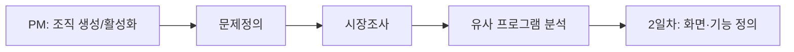

# 오늘 배운 것: 개발 프로세스 이론, 그리고 팀 프로젝트 1일차

## 들어가며 (Situation)

오늘은 두 갈래로 하루를 보냈다. 오전에는 소프트웨어 개발 프로세스와 요구사항에 대한 이론 자료를 학습했고, 오후부터는 실제로 4인 팀을 꾸려 프로젝트(팀명: team-hello)를 시작했다. 역할은 PM 1명, 형상관리자 1명, 리서처 2명(나 포함)으로 나눴고, PM이 깃허브 organization(`team-hello-pj`)을 만들어 조직을 활성화시키면서 실무 프로세스가 실제로 굴러가는 걸 처음부터 지켜봤다. 이론에서 배운 "요구사항 수집 → 분석 → 명세" 흐름을 팀 프로젝트의 1일차 작업(문제정의 → 시장조사 → 유사 프로그램 분석)에 그대로 대입해볼 수 있는 날이었다.

## 문제 상황 (Task)

- 이론적으로 워터폴과 애자일(스크럼)의 차이는 알겠는데, 우리 팀이 실제로 어떤 방식으로 움직이고 있는 건지 감이 필요했다
- 프로젝트 초반에 "무엇을 만들 것인가"가 명확하지 않으면 이후 설계·개발이 산으로 갈 수 있다는 걸 이론(요구사항 명세서 주의사항: 명확성, 완전성, 일관성)으로 배운 직후라, 실제 문제정의 단계에서 이 기준을 의식하게 됐다
- 팀 내 4명이 각자 다른 유사 서비스(유니다고, 데이코스, 트리플, 대한민국 구석구석, 뚜르 제이, Funliday AI 여행 플래너)를 나눠 써보고 비교해야 해서, 관점이 제각각인 조사 결과를 하나의 판단으로 모으는 게 과제였다

## 해결 과정 (Action)

### A. 이론 — 소프트웨어 개발 프로세스와 요구사항

**소프트웨어 개발 프로세스**는 요구사항 수집부터 설계, 구현, 테스트, 배포, 유지보수까지 소프트웨어 생명주기 전체를 다루는 절차다. 이게 왜 필요한지가 인상적이었는데, 지점토를 빚거나 개집을 짓는 정도는 머릿속 구상만으로 되지만, 다리나 빌딩처럼 참여 인력이 많고 기간이 긴 프로젝트는 복잡성 자체를 관리하는 체계가 없으면 무너진다는 비유였다.

오늘 비교한 두 모델은 다음과 같다.

| 구분 | 워터폴 | 애자일(스크럼) |
|---|---|---|
| 진행 방식 | 요구사항→설계→구현→테스트→배포가 순차적, 이전 단계 완료 후 다음 단계 | 짧은 스프린트(1~4주) 반복으로 점진적 개선 |
| 추가 요구사항 수용 | 반영하기 어려운 구조 | 수용할 수 있는 방법으로 설계됨 |
| 릴리즈 시점 | 최종 완성된 제품을 한 번에 릴리즈 | 스프린트마다 수시로 릴리즈 |
| 고객과의 의사소통 | 산출물 중심, 대화 부족 | 처음부터 사용자 참여 유도 |
| 적합한 상황 | 큰 규모, 변경이 거의 없는 프로젝트 | 빠르게 변화하는 요구사항 |

💡 워터풀과 애자일 중 어느 게 "더 좋다"가 아니라, 프로젝트 특성과 팀 구조에 따라 선택하는 것이라는 설명이 핵심이었다. 우리 팀은 22일 안에 발표까지 가야 하는 짧은 일정이라, 매일 할 일을 정하고 다음 날 바로 다음 단계로 넘어가는 지금의 흐름 자체가 스프린트에 가까운 방식이라는 걸 이론을 배운 뒤에야 알아챘다.

요구사항 쪽에서는 **기능적 요구사항**(시스템이 수행해야 하는 구체적 기능, 예: "사용자는 로그인을 할 수 있다")과 **비기능적 요구사항**(성능·보안처럼 어떻게 동작해야 하는지, 예: "3초 이내 응답")의 구분, 그리고 요구사항을 정리할 때 쓰는 사용자 스토리 형식을 배웠다.

- **사용자 스토리(User Story)**
  - "As a [역할], I want [기능], so that [이유]" 형식으로 요구사항을 정리하는 방법이다.
  - 역할·기능·목적이 한 문장에 다 들어가서, 왜 이 기능이 필요한지가 요구사항 자체에 남는다.

⚠️ 명세서 작성 시 주의사항으로 배운 명확성·완전성·일관성·추적 가능성·검증 가능성 다섯 가지는, 오늘 오후 문제정의 문서를 볼 때도 그대로 적용해볼 수 있는 체크리스트였다.

### B. 팀 프로젝트 착수 — 역할 분담과 깃허브 조직화

오후에는 실제로 4인 팀을 꾸렸다.

| 역할 | 담당 |
|---|---|
| PM | 류다연 |
| 형상관리자 | 박유수 |
| 리서처 1 | 김예린 |
| 리서처 2 | 양다연(본인) |

PM이 깃허브 organization `team-hello-pj`를 만들고 조직을 활성화시켰다. 이론에서 "프로젝트 관리를 위한 시스템 체계가 필요하다"고 배운 부분을 오후에 바로 눈으로 확인한 셈이다. 형상관리자라는 역할이 별도로 존재하는 것도, 소스코드와 문서 버전을 한 사람이 책임지고 관리하게 해서 나머지 팀원이 문제정의·조사에 집중할 수 있게 하려는 구조로 이해했다.

### C. 1일차 작업 — 문제정의, 시장조사, 유사 프로그램 분석

**1) 문제정의**

여러 아이디어 후보(리마인더, 분리수거 스캐너, 냉장고 재료 인식 레시피 추천, 가계부 OCR 자동분류 등) 중에서, 팀은 "동선/일정 짜기"를 최종 주제로 좁혔다.

- **문제**: 약속 장소는 정해졌는데 동선을 고려하기 어렵거나, 익숙하지 않은 장소에서 효율적으로 움직이기 어려움
- **대상**: 국내에서 이동하거나 일정이 있는 사람들
- **현재 해법**: 네이버 지도, 캐치테이블, 생성형 AI
- **불편**: 일정을 못 정함 / 생소한 지역에서 비효율적으로 움직임 / 이동에 막막함을 느낌

💡 개발할 부분 중 가장 메인으로 정한 것은 **동선 생성**이다. 그 외에 대중교통 시간대 안내, 우선순위 기반 일정(식사부터 vs 관광부터), 운영시간·혼잡도에 따른 유동적 일정 변경, 장소 추천, 상황 변화(짐 추가, 기상 상황) 대응까지 개발 후보로 정리했다.

**2) 시장조사**

유니다고, 데이코스, 트리플, 대한민국 구석구석, 뚜르 제이, Funliday AI 여행 플래너 6개 서비스를 조사하고 "가져올 만한 기능"을 표로 정리했다.

| 서비스 | 가져올 만한 기능 |
|---|---|
| 유니다고 | 효율적인 이동 순서 추천, 카카오맵 연동 경로 안내 |
| 데이코스 | 이동시간 자동계산·거리·동선 정리, 홈 화면 위젯 |
| 트리플 | 야놀자 연동, 일행 공유, 맞춤 장소 추천 |
| 대한민국 구석구석 | 개인 성향/유사 사용자 데이터 기반 AI 추천(AI콕콕) |
| 뚜르 제이 | AI 맞춤 일정 생성, 스마트 동선 최적화, 경비 정산 |
| Funliday | 챗봇 형식 질문으로 장소/일정/예산 답변 시 일정 자동 구성 |

**3) 유사 프로그램 분석**

팀원 4명이 각자 위 서비스를 직접 사용해보고 "좋았던 점"과 "불편했던 점"을 개별적으로 기록한 뒤 모았다. 내가 직접 써본 결과는 다음과 같다.

| 서비스 | 사용한 기능 | 좋았던 점 | 불편했던 점 |
|---|---|---|---|
| 유니다고 | 경로 탐색 | 클릭으로 위치 지정, 상호명 없는 곳도 추가 가능 | 카카오내비로 이동해야 함 |
| 대한민국 구석구석 | AI 탐색 | 자동으로 관광지 추천 | 관광지가 너무 밤타임(관광지 위주로 편중) |
| 뚜르 제이 | - | - | 유료 기능 위주라 접근성 낮음 |
| Funliday AI 여행 플래너 | AI 자동 일정 생성 | 간단한 문답만으로 일정 추천, 백지 상태에서 시작하기 좋음 | 관광지가 자동 설정돼서 가고 싶은 곳을 못 감 |

🔴 팀 전체 결과를 모아보니 반복되는 패턴이 하나 보였다. AI 자동 추천 기능이 있는 서비스(대한민국 구석구석, Funliday)는 하나같이 "사용자가 직접 고른 장소가 결과에 잘 반영되지 않는다"는 불편이 나왔다. 반대로 유니다고, 데이코스처럼 수동 입력 기반 서비스는 정확한 제어는 되지만 주소를 직접 찾아 넣어야 하는 번거로움이 있었다.

🟢 이 지점이 우리 팀의 문제정의(장소 추천 + 상황 고려 + 유연한 일정 변경)와 정확히 맞아떨어졌다. "자동 추천은 하되, 사용자가 고른 장소를 우선하고 수정 가능하게" 만드는 방향이 왜 필요한지, 이론이 아니라 우리가 직접 겪은 불편에서 근거가 나온 셈이다.

## 결과 (Result)

- 워터폴 vs 애자일 비교표를 배운 직후, 우리 팀의 "매일 할 일 정하고 다음 날 넘어가는" 진행 방식이 스프린트 구조에 가깝다는 걸 스스로 연결 지을 수 있었다
- 사용자 스토리 형식("As a [role], I want [feature], so that [reason]")과 명세서 작성 5원칙(명확성·완전성·일관성·추적 가능성·검증 가능성)을 배운 뒤 바로 팀의 문제정의 문서를 검토 기준으로 삼을 수 있었다
- 팀 4명이 6개 유사 서비스를 나눠 분석한 결과를 종합해, "AI 자동 추천 vs 사용자 직접 선택"이라는 공통된 불편 패턴을 발견했고 이것이 우리 프로젝트의 핵심 방향(동선 생성 + 사용자 우선순위 반영)을 뒷받침하는 근거가 됐다
- 깃허브 organization(`team-hello-pj`)이 만들어지고 형상관리자 역할이 별도로 배정되면서, 이론에서 배운 "프로젝트 관리를 위한 시스템 체계"가 실제 팀에 적용되는 과정을 처음부터 볼 수 있었다

## 더 학습하면 좋은 개념

- **유스케이스 다이어그램 / 시퀀스 다이어그램** — 오늘 요구사항 분석 절차 3단계(모델링 및 분석)에서 등장했다. 다음 단계인 "트리거와 행위자 명확화"를 진행하려면 이 다이어그램 작성법을 먼저 익혀야 한다.
- **깃허브 organization과 브랜치 전략** — PM이 조직을 만들었지만, 앞으로 4명이 동시에 커밋할 때 충돌을 막을 브랜치 전략(예: Git Flow, GitHub Flow)을 팀 차원에서 정해야 한다.
- **와이어프레임/프로토타이핑 도구** — 요구사항 검증 방법 중 하나로 배운 "프로토타입"을 실제로 만들려면 Figma 같은 도구의 기본기가 필요하다.
- **스프린트 백로그 작성법** — 애자일 이론에서 배운 스프린트 구현 목록(작업·담당자·예상 시간)을 실제로 우리 팀 일정에 적용해보면 22일 스케줄 관리에 바로 쓸 수 있다.
- **경쟁 서비스 포지셔닝 맵** — 오늘은 기능을 표로 나열하는 수준이었는데, 다음엔 "자동화 정도 vs 사용자 제어권" 같은 축으로 포지셔닝 맵을 그려보면 우리 서비스의 차별점이 더 선명해질 것 같다.

## 참고 자료
- [Atlassian - Waterfall vs Agile](https://www.atlassian.com/agile/project-management/project-management-intro)
- [Scrum.org - What is Scrum?](https://www.scrum.org/resources/what-is-scrum)
- [Mountain Goat Software - User Stories](https://www.mountaingoatsoftware.com/agile/user-stories)
