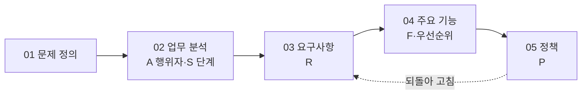

<style>
.page__content { font-size: 0.8em; }
</style>

# 오늘 배운 것: 서브에이전트와 인터뷰로 기획 문서 네 장 만들기

## 들어가며 (Situation)

깃허브 organization `team-hello-pj`의 `hello-planning` 저장소에서, 오늘 날짜에 해당하는 작업을 진행했다. `today` 폴더에 준비된 학습 자료(PDF)와 서브에이전트 정의(`planning-partner`, `product-planner`)를 바탕으로, 어제(9일차) 정한 문제 정의("약속 장소는 정해졌는데 동선을 고려하기 어렵거나, 익숙하지 않은 장소에서 효율적으로 움직이기 어려움" — 동선 생성 여행 서비스)를 업무 분석 → 요구사항 → 기능 → 정책, 네 장의 기획 문서로 펼치는 작업이었다. 어제는 문제를 한 문단으로 잡았다면, 오늘은 그 문제를 실제로 만드는 사람이 읽을 수 있는 문서로 구체화하는 단계였다.

## 문제 상황 (Task)

- 혼자 요구사항을 적으면 **자기 경험 안의 것만** 나온다는 게 문제였다. 총무 역할을 해본 사람은 총무의 불편만 적고, 중간에 들어온 신입 구성원이 겪는 일은 놓치기 쉽다.
- 그렇다고 에이전트에게 요구사항이나 기능을 대신 정하게 하면, 손님(사용자) 없이 주방(개발자)이 요리하는 꼴이 된다. 에이전트는 생각을 넓혀야지, 대신 결정하면 안 된다는 원칙을 지키면서 문서를 만드는 게 과제였다.
- 팀원 넷이 각자 초안을 쓰면 문서도 넷이 나온다. 이걸 하나의 최종 문서로 모으면서도, 누가 무엇을 왜 제안했는지 기록이 사라지지 않게 해야 했다.

## 해결 과정 (Action)

### A. 왜 인터뷰 방식인가 — 발산은 넓히고, 사람이 고른다

💡 오늘 자료의 핵심은 문서 작업을 **발산(Diverge)**과 **수렴(Converge)** 두 동작으로 나눈다는 것이다. 발산은 후보를 넓히는 일(팀원 + 기획 파트너가 각자 초안을 쓰고 파트너가 생각 못한 후보를 보탠다), 수렴은 팀이 고르는 일(코치의 비교표를 보고 채택·거절·결정)이다.

| 동작 | 누가 | 무엇을 | 산출 |
|---|---|---|---|
| 발산 | 팀원 전원 + 기획 파트너 | 각자 초안을 쓰고, 파트너가 생각하지 못한 후보를 `[제안]`으로 보탠다 | 초안 여러 장 |
| 수렴 | 팀 | 코치의 비교표를 보고 채택·거절·결정 | 결정 목록 → 최종 문서 |

⚠️ 시장에서 장 보는 비유가 딱 하나 어긋나는 지점이 있었다. 시장에서는 안 산 물건이 그냥 사라지지만, 우리는 **거절한 후보도 이유와 함께 문서 끝 「검토했으나 제외」 표에 남긴다.** 나중에 실제 개발 단계에서 에이전트가 "이건 왜 없나요?"라고 다시 물었을 때, 팀이 몰라서 빠뜨린 게 아니라 판단해서 뺐다는 걸 보여주기 위해서다.

### B. `planning-partner`에게 인터뷰를 시켜 02-workflow.md 만들기

가장 먼저 입력한 명령은 업무 분석 인터뷰였다.

```
planning-partner 서브에이전트에게 앞 문서를 읽고 업무 분석 인터뷰를 시작하게 해줘.
질문은 한 번에 하나씩. 내가 답한 것은 그대로 적고, 네가 보탤 후보는 [제안] 표시와
근거 한 줄을 붙여서 docs/02-workflow.md 에 양식대로 적어줘.
```

핵심은 세 가지 규칙이다.

- **용어 카드 — `[제안]`의 규칙 셋**
  - ① 파트너가 보탠 것에는 반드시 `[제안]` 표시와 근거 한 줄이 붙는다. 팀이 답한 문장과 섞이지 않는다.
  - ② 팀이 하나씩 채택(태그를 지운다)하거나 거절(「검토했으나 제외」 표에 이유를 적는다)한다.
  - ③ 채택한 `[제안]` 수를 따로 기록한다. 그 수가 곧 "우리가 못 생각했던 것"의 개수다.

업무 분석 문서는 **행위자(Actor)**와 **단계(As-Is → To-Be)** 두 표로 이뤄진다. 행위자는 "이 앱을 쓰는 역할"이고, 팀원 이름이 아니다. 실제로 우리 팀이 정리한 행위자는 다음과 같다.

| A | 역할 | 지금 상황 | 현재 도구 |
|---|---|---|---|
| A1 | 모임장 | 가고 싶은 곳을 취합해 동선을 제안하고 공유하는 사람 | 네이버 지도, 카카오톡 단톡방, 폰 캘린더 |
| A2 | 구성원 | 가고 싶은 곳을 제안하고 우선순위 변경을 요청하는 사람 | 카카오톡 |
| A3 | 새로운 구성원 | 중간에 들어와 가고 싶은 곳을 추가로 제안하는 사람 | 카카오톡 |

단계는 행동·감정·불편 세 칸에 To-Be 한 줄을 더해서 적는데, 실제로는 개인 일정 입력부터 후기 열람까지 총 **14개 단계(S1~S14)**가 나왔다. 예를 들어 S2("희망 장소 취합")는 감정 칸에 "여러 사람의 의견을 일일이 확인해야 해서 번거로움", 불편 칸에 "카카오톡 단톡방에 흩어진 의견을 찾아 옮겨 적어야 함"이 들어갔고, To-Be는 "모임장이 취합하면 구성원들은 한곳에서 확인 가능"으로 정리됐다.

### C. 발산 질문으로 초안 덧붙이기

두 번째로 입력한 명령은 발산 질문이었다.

```
planning-partner 서브에이전트에게 이 초안을 읽고 발산 질문을 던지게 해줘 -
이 행위자가 이 일을 하다가 겪을 수 있는데 아직 말하지 않은 단계나 불편은?
이 일에 얽힌 다른 사람은? 답은 전부 [제안] 으로 초안에 덧붙여줘.
```

🟢 이 발산 질문 두 개("겪을 수 있는데 말하지 않은 불편은?", "얽힌 다른 사람은?")가 실제로 효과가 있었다. 우리 팀도 처음엔 "모임장"과 "구성원"만 떠올렸는데, 이 질문을 거치고 나서야 "중간에 들어와 가고 싶은 곳을 추가로 제안하는" **A3 새로운 구성원**이 행위자로 추가됐고, S9(우선순위 변경 요청)·S10(추가 제안) 같은 단계도 이 발산 질문에서 나왔다. 자기 경험만으로는 못 채우는 자리를, 파트너가 되물어서 채우는 방식이다.

🔴 다만 파트너의 제안을 그대로 다 받아들이면 안 된다. 근거가 없거나 우리 팀 대상에게 해당하지 않는 제안은 거절해야 한다 — 파트너의 제안은 근거 없이도 그럴듯하게 나올 수 있기 때문이다(환각 가능성). 그래서 `[제안]`마다 근거 한 줄을 반드시 확인하고 넘어갔다.

### D. 02-workflow.md를 읽고 03-requirements.md 만들기

세 번째 명령으로 요구사항 정의 문서를 새로 만들었다.

```
planning-partner 서브에이전트에게 02-workflow 파일을 읽고 03-requirements.md
파일을 만들어서 요구사항 정의를 해달라고 해줘.
```

여기서 배운 가장 중요한 구분은 **요구사항(R)과 기능(F)을 가르는 기준**이었다.

| 구분 | 예시 | 왜 |
|---|---|---|
| ❌ 요구사항이 아니다 | "미응답자 목록 버튼이 있어야 한다" | 이건 기능(F)이다 — 앱이 하는 일 |
| ❌ 요구사항이 아니다 | "편해야 한다" | 확인할 수 없는 문장 |
| ❌ 요구사항이 아니다 | "DB에 저장해야 한다" | 기술 결정이지 요구가 아니다 |
| ✅ 요구사항이다 | "구성원들이 가고 싶은 장소를 한곳에서 모아 볼 수 있어야 한다"(R2) | 주어가 행위자, 끝이 "할 수 있어야 한다", 앱의 부품 이름이 없다 |

**판정 한 줄(R)**: "주어가 행위자이고, 끝이 '할 수 있어야 한다'이며, 앱의 부품 이름(버튼·화면·DB)이 없는가."

이 기준으로 14개 단계(S1~S14)의 불편을 옮겨 적으니 **요구사항 R1~R14**가 나왔다. 예를 들어 R3("원하는 기준(최단거리·최단시간 등)을 선택하면 그 기준에 맞는 동선을 받을 수 있어야 한다")는 S3의 불편에서, R9("우선순위 변경을 요청하면 그 내용이 전체 동선에 반영되어 다시 공지받을 수 있어야 한다")는 S9의 불편에서 나왔다. 14개 요구사항 모두 출처 열에 "S몇 불편"이 명시돼 있어서, 나중에 왜 이 요구가 생겼는지 되짚어볼 수 있다.

- **개념 카드 — 손님의 주문과 주방의 레시피**
  - 손님은 "덜 짜게 해주세요"(요구사항)라고 말하고, 주방은 "간장을 반으로"(기능)로 옮긴다.
  - 손님이 간장 양을 직접 정하지 않는 것처럼, 요구사항 단계에서는 앱의 부품 이름이 나오면 안 된다.
  - 단, 이 비유가 완전히 맞진 않는다. 현실 주방은 레시피를 혼자 정하지만, 우리 프로젝트에서는 **기능(F)도 팀이 정한다.** 파트너나 에이전트가 F까지 임의로 정해버리면 손님(사용자) 없이 요리하는 셈이라, 반드시 팀 회의를 거쳐 결정한다.

이렇게 만든 요구사항은 유형이 셋으로 나뉜다: **기능**(무엇을 할 수 있어야), **데이터**(무엇이 남아야·보여야), **제약**(하지 말아야 할 것). 그리고 각 요구사항에는 출처(어느 단계의 어떤 불편에서 나왔는지, 혹은 어떤 `[제안]`의 근거인지)와 중요도(상·중·하)를 함께 적었다.

### E. 왜 ID로 서로 가리키게 만드는가

⚠️ 이 문서들을 사람만 읽는 게 아니라 **다음 제작 주간에 에이전트가 읽는다**는 전제가 깔려 있다. 그래서 사람이 읽는 문서와 다른 조건이 셋 붙는다.

| 조건 | 없으면 생기는 문제 |
|---|---|
| ① ID로 가리킨다 (A·S·R·F·P) | 에이전트가 "이 기능이 어느 요구에서 왔는지" 몰라서 비슷한 기능을 하나 더 만든다 |
| ② 확인할 수 있는 문장 | "편리하게" 같은 표현을 에이전트가 자기 취향으로 해석한다 |
| ③ 없는 것은 `[?]`로 표시 | 빈칸을 에이전트가 지어낸다 |



단계(S)의 불편에서 요구(R)가 나오고, 요구를 만족시키는 것이 기능(F)이고, 기능에 규칙(P)이 걸린다. 문서를 순서대로 쓰다가도 뒤 문서를 쓰며 앞 문서에 빠진 게 보이면 되돌아 고친다 — 이게 폭포수와 애자일의 차이가 실제로 드러나는 지점이라는 설명이 인상적이었다.

### F. 04-features.md — 기능을 트리거·입력·결과·예외로 쪼개기

요구사항 14개를 하나씩 기능(F1~F14)으로 옮기면서, 트리거·입력·결과(보이는 것)·예외(안 될 때 보이는 것) 네 칸으로 나눠 적었다. 예를 들어 R3(기준을 고르면 동선을 받는다)는 F3으로 옮겨지며 이렇게 구체화됐다.

- 트리거: 동선을 생성하기 전 기준을 선택할 때
- 입력: 최단거리·최단시간 등 기준 선택
- 결과: 선택한 기준에 맞춰 동선이 자동 생성된다
- 예외: 기준에 맞는 동선을 만들 수 없으면(예: 장소가 1곳뿐) 안내 메시지를 보여준다

이후 **우선순위 2축(중요도×노력)**으로 F1~F14를 나눠보니, MVP 7개(F1·F2·F3·F4·F7·F9·F10)와 v2 7개(F5·F6·F8·F11·F12·F13·F14)로 갈렸다. F3(기준 기반 동선 생성)은 노력이 "상"으로 가장 어렵지만 "동선 생성이 서비스의 핵심 가치이므로 난이도가 높아도 반드시 포함"이라는 이유로 MVP에 남았고, 반대로 F6(대중교통 안내)은 노력이 "상"이면서 "지도 앱과 병행 사용으로 대체 가능"해서 v2로 밀렸다. 중요도만 보고 정하면 상(上)이 다섯 개씩 몰려서 우선순위가 무의미해지는데, 노력이라는 두 번째 축이 있어서 실제로 "5일 안에 만들 수 있나"를 기준으로 걸러낼 수 있었다.

### G. 05-policy.md — 되돌아 고친 흔적을 그대로 남기다

🔴 정책 문서를 쓰다가 실제로 시행착오가 있었다. 처음에는 동선(일정)에 "예정 → 진행중 → 지난일정"처럼 시각 기준으로 상태가 바뀌는 전이를 넣었는데, 팀이 다시 보니 이 서비스는 모임 전용이 아니라 **개인이 혼자 써도 되는 동선 도구**라는 전제와 맞지 않았다. 그래서 정책 문서 맨 위에 이런 메모를 남기고 처음부터 다시 썼다.

> 1. 대상은 동선을 짜기 어려운 사람이다.
> 2. 기본은 개인 사용이고, 같이 약속에 포함된 사람에게 공유하는 기능은 추가 기능이다 — 모임 전용이 아니다.
> 4. 공유(공지)는 동선을 만든 사람이 단순히 전달하는 것이지, 그 사람에게 절대적 권한을 주는 것이 아니다.

🟢 그 결과 "약속 시각이 지나면 종료"라는 상태 전이는 지워졌고, 대신 정책(P1~P3)과 서비스 정책(SP1~SP5)을 개인 사용을 기본으로 다시 세웠다. 예를 들어 SP4는 "시각이 지났다는 이유로 장소·일정·우선순위 변경을 막지 않는다 — 언제든 계속 바꿀 수 있다"로, 모임 시각에 종속된 정책이 아니라 개인 도구에 맞는 규칙으로 바뀌었다.

⚠️ 다만 정책 문서는 아직 완성이 아니다. `05-R-policy.md` 머리말에 "채택한 [제안] 0개"라고 적혀 있는 것처럼, P1~P3과 SP1~SP5 총 8개가 모두 `[제안]` 태그가 붙은 채로 팀의 채택·거절 결정을 기다리는 상태다. 04까지는 [제안] 14개를 전부 채택해서 태그가 사라졌지만, 05는 아직 회의 전 단계라는 걸 문서 상태만 보고도 구분할 수 있었다.

## 결과 (Result)

- 업무 분석 단계에서 행위자 3명(모임장·구성원·새 구성원), 단계 14개(S1~S14)를 뽑았고, 이걸 요구사항으로 옮기며 **R1~R14, 14개 요구사항**을 완성했다. 04-features.md 시점에는 채택한 `[제안]`이 **14개**, 열린 질문 `[?]`는 **0개**로 정리됐다 — 발산 질문에서 나온 후보를 팀이 하나도 빠짐없이 검토했다는 뜻이다.
- 기능 F1~F14를 중요도×노력 2축으로 나눠, **MVP 7개 / v2 7개**로 우선순위를 확정했다. "중요도만으로 정하면 상(上)이 몰려 우선순위가 무의미해진다"는 자료의 경고를 실제로 겪었다 — 노력(구현 난이도) 축을 더해서야 F3(어렵지만 핵심)과 F6(쉽지만 대체 가능)을 다르게 취급할 수 있었다.
- 정책 문서에서는 "모임 전용"으로 잘못 짰던 상태 전이를 팀이 스스로 찾아내 지우고, 5가지 전제를 다시 세워 정책(P1~P3)·서비스 정책(SP1~SP5) **8개 항목**을 새로 썼다. 다만 아직 팀 회의(수렴) 전이라 채택한 `[제안]`은 **0개**로 남아 있다 — 이 숫자 자체가 "다음에 할 일은 05-policy.md 회의"라는 걸 문서만 보고도 알 수 있게 해줬다.

## 더 학습하면 좋은 개념

- **요구사항 추적 매트릭스(Requirements Traceability Matrix)** — 오늘 만든 표의 참조 열(R이 S를, F가 R을, P가 F를 가리키는 구조)이 현업에서 이렇게 불리는 것의 가장 작은 형태다. 규모가 커지면 이 매트릭스를 별도 도구로 관리하게 된다.
- **BPMN / 스윔레인 다이어그램** — 오늘의 업무 분석은 표 한 장 + 흐름 한 줄로 끝냈지만, 행위자가 여럿이고 흐름이 복잡해지면 그림 표기법이 필요해진다.
- **상태 다이어그램(State Diagram)** — 정책 정의서에서 "예정 → 진행중 → 지난일정" 같은 상태 전이를 다룰 때 쓰인다. mermaid의 `stateDiagram-v2` 문법을 익혀두면 정책 문서를 쓸 때 바로 활용할 수 있다.
- **git 브랜치 전략과 충돌 해결** — 오늘 배운 "각자 브랜치에서 초안 → 종합 담당이 브랜치에서 병합"하는 절차는 결국 어제 배운 팀 협업 드릴(브랜치·PR·리뷰)의 응용이다. 충돌이 "에러가 아니라 결정 안 된 의견 차이"라는 관점을 확실히 잡아두면 다음에도 당황하지 않을 것 같다.
- **사용자 스토리 vs 요구사항 정의서** — 어제(9일차) 배운 "As a [역할], I want [기능], so that [이유]" 형식과 오늘의 R(요구)·F(기능) 분리 방식이 서로 어떻게 대응되는지 비교해보면 요구사항을 적는 여러 형식의 장단점이 더 선명해질 것 같다.

## 참고 자료
- [Atlassian - Requirements Gathering](https://www.atlassian.com/agile/product-management/requirements)
- [IIBA - Business Analysis Body of Knowledge (BABOK)](https://www.iiba.org/business-analysis-body-of-knowledge/)
- [Mermaid 공식 문서 - State Diagram](https://mermaid.js.org/syntax/stateDiagram.html)
