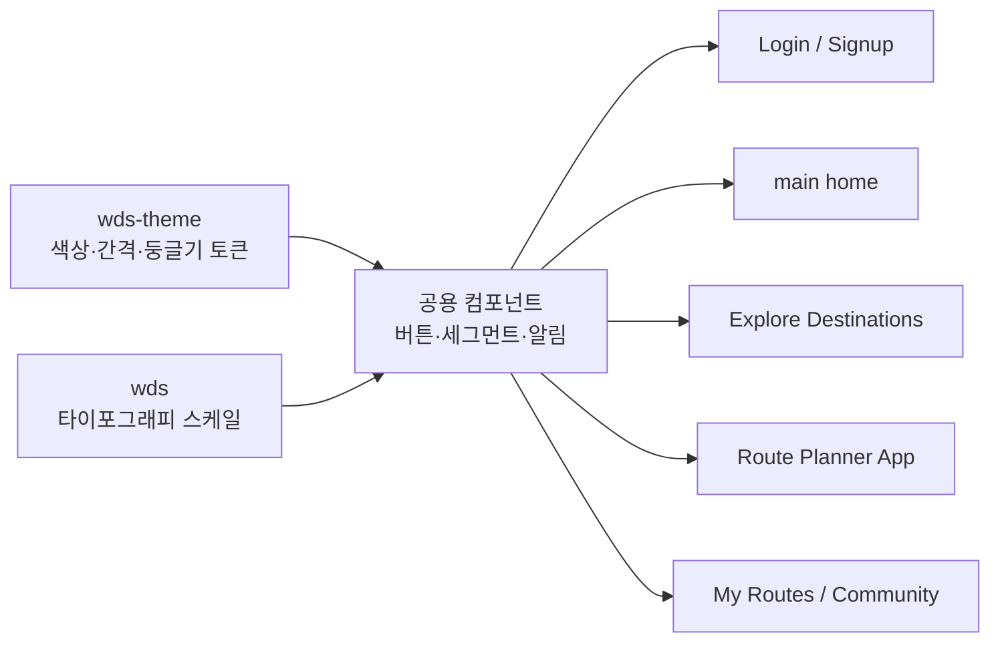

# 오늘 배운 것: 화면부터 그리지 않고, 디자인 시스템부터 가져오기

## 들어가며 (Situation)

어제(10일차)까지 `hello-planning` 저장소에서 동선 생성 여행 서비스("p:nder")의 요구사항·기능·정책 문서를 다 만들었다. 오늘은 그 문서를 실제 화면으로 옮기는 단계로 넘어갔는데, 화면을 하나씩 그리기 전에 먼저 **디자인 시스템, 디자인 토큰, 공용 컴포넌트**부터 세팅하기로 했다. 내 깃허브 레포에 이미 있는 디자인 시스템(`montage-web`)을 가져다 쓸 생각이었다.

## 문제 상황 (Task)

- 화면을 하나씩 그때그때 색을 골라가며 만들면, 로그인 화면과 홈 화면의 파란색이 미묘하게 달라지는 식으로 **일관성이 깨진다.**
- 팀(또는 나 혼자라도 여러 세션)이 화면을 나눠 만들면 버튼 모서리 둥글기, 그림자, 폰트 크기가 화면마다 제각각이 되기 쉽다.
- 이미 만들어둔 디자인 시스템 레포가 있는데 이걸 다시 손으로 베껴 적으면 시간 낭비이고, 원본이 바뀌면 화면도 다시 고쳐야 한다.

이 문제를 풀기 위해 오늘은 두 가지 도구를 새로 써봤다 — **Claude Design 모드**와 **Figma**.

## 해결 과정 (Action)

### A. Claude Design에게 화면이 아니라 "시스템"부터 시키기

가장 먼저 입력한 명령은 화면 디자인이 아니라 시스템 세팅 요청이었다.

```
여행지 추천 시스템을 만들건데, 화면을 구성하기 전에 디자인 시스템,
디자인 토큰, 공용 컴포넌트들을 세팅하고자 한다. 내 github repository 에서
가져올 예정임.
```

💡 오늘 가장 크게 배운 점은 이 순서다. "로그인 화면 만들어줘"로 바로 시작하지 않고, **토큰(색·간격·둥글기·타이포)과 공용 컴포넌트(버튼·세그먼트 컨트롤·알림)를 먼저 고정한 다음에** 화면을 만들면, 화면이 몇 개로 늘어나도 스타일이 흔들리지 않는다.

Claude Design은 내 깃허브 저장소 `dyryoo316/montage-web`의 `main` 브랜치를 동기화해서, 아래 패키지에서 값을 그대로 가져왔다.

| 가져온 값 | 소스 파일 |
|---|---|
| 색상(coolNeutral, blue, green, red, orange 등) | `packages/wds-theme/src/theme/atomic/*.ts` |
| 간격(spacing) · 시맨틱 색 | `packages/wds-theme/src/theme/{spacing,semantic}/index.ts` |
| 타이포그래피 스케일 | `packages/wds/src/components/typography/style.ts` |
| 버튼 / 세그먼트 컨트롤 / 알림 시각 스타일 | `packages/wds/src/components/{button,segmented-control,alert}/style.ts` |

- **개념 카드 — 디자인 토큰(Design Token)**
  - 색상·간격·둥글기·그림자·타이포그래피처럼 디자인의 "원자 단위 값"에 이름을 붙여 코드처럼 관리하는 방식이다.
  - `blue.500` 같은 이름으로 참조하면, 실제 색상 값이 나중에 바뀌어도 이름만 그대로 쓰면 모든 화면에 자동으로 반영된다.
  - 오늘은 `wds-theme` 패키지가 이 토큰 원본이었고, 화면 쪽(`wds` 패키지의 버튼·타이포 컴포넌트)은 그 토큰을 "소비"하는 쪽이었다.

🟢 이렇게 토큰을 먼저 고정해두니, 이후에 만든 화면들이 전부 같은 파란색(`#0066FF`)과 같은 border-radius·그림자 값을 공유했다. 서비스 전용으로 필요했던 녹색 강조 색만 로컬에서 얹었고, 원본 `wds` 패키지 자체는 건드리지 않았다 — 원본을 고치면 다음에 또 동기화할 때 충돌이 나기 때문이다.

### B. 토큰으로 실제 화면 7장 만들기

토큰과 공용 컴포넌트가 자리잡은 다음, 그 위에서 화면을 하나씩 만들었다.



| 화면 | 이번에 새로 쓴 것 |
|---|---|
| Login / Signup Screen | 토큰 기반 입력창·버튼 스타일 |
| main(home) | 홈 레이아웃, 공용 컴포넌트 재사용 |
| Explore Destinations | `korea-map.svg`로 지역 선택 |
| Route Planner App | 장소 카드, 드래그 재정렬, 이동수단/기준 세그먼트 컨트롤, 지도·요약 바 |
| My Routes / Community | 목록형 화면, 카드 컴포넌트 재사용 |

⚠️ 지도 이미지는 직접 그리지 않고, `VictorCazanave/svg-maps` 저장소(CC-BY-4.0 라이선스, `montage-web`과는 별개의 외부 레포)에서 `packages/south-korea/south-korea.svg`를 가져와 `korea-map.svg`로 프로젝트에 넣었다. 라이선스가 있는 외부 리소스는 어느 레포에서 왔는지, 어떤 라이선스인지 기록해두는 게 중요하다는 걸 배웠다.

🔴 시행착오도 있었다. 처음엔 Route Planner App 화면에 필요한 초록색 강조를 `wds-theme` 원본 파일에 직접 추가하려다가, "원본 디자인 시스템 패키지는 건드리지 않는다"는 원칙을 떠올리고 멈췄다. 대신 화면 쪽에 로컬 레이어로만 얹는 방식으로 바꿨다 — 다음에 `montage-web`을 다시 동기화해도 깨지지 않도록 하기 위해서다.

### C. Figma로 와이어프레임과 프로토타이핑

Claude Design으로 토큰 기반 화면을 잡은 뒤, Figma에서는 조금 다른 목적으로 입력했다.

```
장소 목록 사이트 와이어프레임과 프로토타이핑 만들어줘.
```

- **개념 카드 — 와이어프레임(Wireframe) vs 프로토타입(Prototype)**
  - 와이어프레임은 화면의 뼈대(레이아웃, 요소 배치)만 잡은 저해상도 설계도다. 색이나 폰트보다 "어디에 뭐가 있는지"에 집중한다.
  - 프로토타입은 그 화면들 사이를 실제로 클릭해서 이동할 수 있게 연결한 것이다. Figma에서는 프레임 간에 인터랙션(클릭 시 다음 화면으로 이동 등)을 연결해서 만든다.
  - 오늘은 "장소 목록"이라는 하나의 화면 종류를 기준으로, 목록 → 상세 같은 흐름을 와이어프레임 단계에서 먼저 확인했다.

💡 Claude Design과 Figma를 같은 날 써보면서 느낀 차이는, **Claude Design은 이미 있는 디자인 시스템(토큰)을 그대로 재사용해 완성도 있는 화면을 빠르게 만드는 데 강했고, Figma는 아직 토큰이 정해지지 않은 새 화면 구조를 저해상도로 빠르게 검증하는 데 강했다**는 점이다. 순서로 보면 Figma로 구조를 먼저 흔들어보고, Claude Design으로 확정된 토큰을 입혀 완성하는 흐름도 가능할 것 같다.

| 항목 | Claude Design | Figma |
|---|---|---|
| 오늘 입력한 것 | "디자인 시스템·토큰·공용 컴포넌트 세팅, 깃허브에서 가져올 예정" | "장소 목록 사이트 와이어프레임과 프로토타이핑" |
| 강점 | 기존 토큰 재사용, 코드 레포와 직접 동기화 | 구조 검증, 클릭 흐름 프로토타이핑 |
| 산출물 | 토큰이 적용된 실제 화면(.dc.html) 7장 | 저해상도 와이어프레임 + 클릭 가능한 프로토타입 |

## 결과 (Result)

- `montage-web` 레포에서 색상·간격·둥글기·타이포그래피·버튼/세그먼트/알림 스타일 등 디자인 토큰 전체를 가져와, **7개 화면**(Login, Signup, main(home), Explore Destinations, Route Planner App, My Routes, Community)에 동일하게 적용했다.
- 지역 선택 UI에는 외부 CC-BY-4.0 SVG 지도를 라이선스 출처를 남긴 채로 재사용해, 직접 그리는 시간을 아꼈다.
- Figma에서 장소 목록 사이트의 와이어프레임과 프로토타입을 만들어, 화면 뼈대와 클릭 흐름을 코드화하기 전에 먼저 검증할 수 있었다.
- 무엇보다 "화면부터 그리지 않고 시스템부터 세팅한다"는 순서를 지킨 덕분에, 화면이 7개로 늘어나도 파란색·둥글기·그림자가 전부 하나의 기준을 따랐다 — 나중에 화면이 더 늘어나도 토큰만 바꾸면 전체가 같이 바뀌는 구조를 확보했다.

## 더 학습하면 좋은 개념

- **아토믹 디자인(Atomic Design)** — 오늘 다룬 토큰(원자) → 공용 컴포넌트(분자) → 화면(유기체) 구조가 이 방법론과 거의 그대로 맞닿아 있다. 개념을 익혀두면 컴포넌트를 어느 단위로 쪼갤지 판단하기 쉬워진다.
- **W3C Design Tokens Community Group 포맷** — 오늘은 회사 레포 자체 포맷(`.ts` 파일)으로 토큰을 관리했는데, 표준화된 토큰 포맷을 알아두면 다른 도구(Figma Tokens 플러그인 등)와도 값을 공유하기 쉬워진다.
- **Figma Auto Layout** — 오늘 와이어프레임에서 목록형 화면을 만들 때 요소 간격을 수동으로 맞췄는데, Auto Layout을 쓰면 콘텐츠 길이가 달라져도 간격이 자동으로 유지된다.
- **디자인-개발 핸드오프(Design Handoff)** — Figma로 만든 프로토타입을 실제 코드로 옮길 때 스펙(색상 코드, spacing 값)을 어떻게 전달하는지가 다음 단계의 과제다. 오늘 Claude Design이 레포에서 토큰을 직접 읽어온 것도 넓게 보면 핸드오프를 자동화한 사례다.
- **SVG 라이선스와 오픈소스 에셋 재사용** — 오늘 `korea-map.svg`처럼 CC-BY 라이선스 리소스를 가져다 쓸 때 출처 표기 의무가 어디까지인지 정확히 알아두면 나중에 실제 서비스에 배포할 때 문제가 없다.

## 참고 자료
- [Claude Code Docs - What's new (Week 34, 2026): /design skill](https://code.claude.com/docs/en/whats-new/2026-w34)
- [Figma Help - Guide to prototyping in Figma](https://help.figma.com/hc/en-us/articles/360040314193-Guide-to-prototyping-in-Figma)
- [Figma Help - Guide to Auto layout](https://help.figma.com/hc/en-us/articles/5731482952599-Guide-to-auto-layout)
- [Creative Commons - CC BY 4.0 라이선스](https://creativecommons.org/licenses/by/4.0/)
