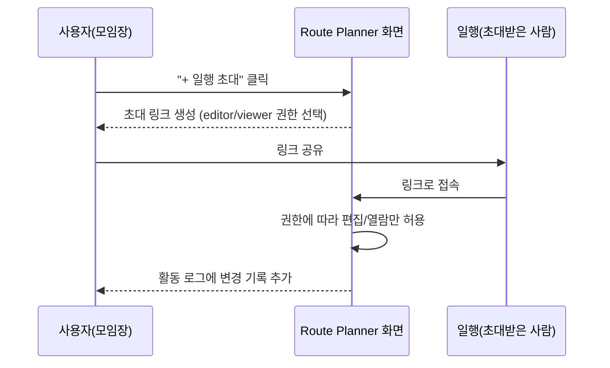

<style>
.page__content { font-size: 0.8em; }
</style>

# 오늘 배운 것: 화면 7개를 "따로 예쁜 것"에서 "하나로 이어지는 것"으로

## 들어가며 (Situation)

어제(11일차) `montage-web` 레포에서 디자인 토큰을 가져와 p:nder 화면 7장(로그인·회원가입·홈·탐색·동선짜기·내 일정·커뮤니티)을 만들었다. 색상·둥글기·그림자는 토큰 덕분에 처음부터 통일돼 있었지만, 화면마다 헤더 구조와 인터랙션은 따로 만들어져 있었다. 오늘은 그 화면들을 그대로 이어서, **화면 간 이동 경험을 하나로 통일하고 실제로 만져볼 수 있는 기능을 채워 넣는** 작업을 했다.

## 문제 상황 (Task)

- 화면마다 헤더의 로고 표기(`✈ p:nder` vs `p:nder`)와 내비게이션 링크 스타일이 조금씩 달라서, 화면을 오갈 때 "같은 서비스"라는 느낌이 약했다.
- 다크모드 토글은 있었지만 화면 상태로만 저장돼서, 새로고침하거나 다른 화면으로 넘어가면 다시 라이트모드로 돌아갔다.
- My Routes·Route Planner 같은 화면은 클릭해도 아무 일도 일어나지 않는 "그림"에 가까웠다. 제목을 눌러도 안 바뀌고, 삭제 버튼을 눌러도 안 지워졌다.
- 무엇보다 이 서비스는 혼자 쓰는 동선 도구를 기본으로 하되(10일차 정책 문서에서 정리한 것처럼) 같이 가는 일행과 공유하는 기능도 필요한데, 화면상에는 "일행 초대"에 해당하는 것이 전혀 없었다.

## 해결 과정 (Action)

### A. 공통 내비게이션과 다크모드부터 정리

💡 어제가 "토큰을 먼저 고정한다"였다면, 오늘은 그 위에서 **헤더 하나를 표준으로 정하고 모든 화면에 같은 구조로 다시 심는다**는 원칙으로 작업했다. 로고를 이모지(`✈`)에서 실제 마스코트 아이콘(`pinder_ant.png`, 개미 캐릭터)으로 바꾸고, `p`와 `nder` 사이의 콜론(`:`)만 초록색(`#26AB4E`)으로 강조하는 표기를 전 화면에 동일하게 적용했다.

```html
<!-- 어제(9/9): 화면마다 다른 로고 표기 -->
<span style="font-size: 35px">✈</span><span style="font-size: 35px">p:nder</span>

<!-- 오늘(9/10): 마스코트 아이콘 + 통일된 콜론 강조, 전 화면 동일 -->
<div style="width:55px;height:55px;background:{{ c.text }};
  -webkit-mask:url('./uploads/pinder_ant.png') center/contain no-repeat;
  mask:url('./uploads/pinder_ant.png') center/contain no-repeat"></div>
<span>p<span style="color:#26AB4E;font-size:1.4em;position:relative;top:-0.05em">:</span>nder</span>
```

⚠️ `mask` 속성으로 아이콘을 넣은 이유가 따로 있었다. ``로 바로 넣으면 다크모드에서 색이 안 바뀌는데, `mask`로 넣으면 `background` 색만 `{{ c.text }}`로 바꿔줘도 아이콘 색이 라이트/다크에 맞춰 같이 바뀐다. 아이콘 하나 넣는 방식 차이가 다크모드 대응 여부를 가른다는 걸 오늘 처음 알았다.

다크모드 저장 방식도 바꿨다.

| 구분 | 어제(9/9) | 오늘(9/10) |
|---|---|---|
| 테마 저장 위치 | 컴포넌트 state (`theme: 'light'`) | `localStorage`(`pd-theme`) |
| 화면 전환 시 | 초기값으로 리셋 | 마지막으로 고른 테마 유지 |
| 아이콘 전환 | 이모지 `☀`/`☾` 텍스트 | `isDark`/`isLight` 조건 + `moon-icon.png` 이미지 |

```js
toggleTheme = () => this.setState(s => {
  const next = s.theme === 'light' ? 'dark' : 'light';
  try { localStorage.setItem('pd-theme', next); } catch (e) {}
  return { theme: next };
});
```

🟢 `try/catch`로 감싼 이유도 배웠다. 브라우저 설정에 따라 `localStorage`가 막혀 있는 경우(시크릿 모드 등)가 있는데, 그때 에러가 나서 테마 전환 자체가 멈추면 안 되니까 저장이 실패해도 화면 전환은 그대로 되도록 방어한 것이다.

전역 마이크로 인터랙션도 CSS 한 줄로 모든 화면에 동시에 추가했다.

```css
[style*="cursor:pointer"],[style*="cursor: pointer"]{transition:transform .06s ease,filter .1s ease}
[style*="cursor:pointer"]:hover{filter:brightness(1.03)}
[style*="cursor:pointer"]:active{transform:scale(0.95)}
```

- **개념 카드 — 속성 선택자(Attribute Selector)로 인터랙션 통일하기**
  - `[style*="cursor:pointer"]`는 클래스 이름과 상관없이 "인라인 스타일에 `cursor:pointer`가 들어간 모든 요소"를 한 번에 고른다.
  - 화면마다 버튼 클래스 이름이 제각각이어도, 클릭 가능한 요소라는 공통점(`cursor:pointer`) 하나만으로 눌렀을 때 살짝 눌리는 느낌(`scale(0.95)`)과 호버 시 밝아지는 효과(`brightness(1.03)`)를 전 화면에 동시에 입힐 수 있었다.
  - 다만 이 방식은 인라인 스타일에 의존하기 때문에, 나중에 실제 컴포넌트 라이브러리로 옮길 때는 클래스 기반으로 다시 정리해야 한다는 한계도 있다.

### B. Community — "그림"에 기능을 채우기

어제 커뮤니티 화면은 카드 레이아웃만 있었는데, 오늘은 실제로 쓸 수 있는 요소를 붙였다.

- 🔥 아이콘 + "이번 주 인기 여행지" 섹션
- 🏷 아이콘 + "추천 태그" 섹션
- 검색창에 아이콘 클릭 시 검색 제출(`onSearchSubmit`)
- 기본 프로필 이미지(`community-avatar-default.png`)와 프로필 클릭 시 이동(`onOpenProfile`)

### C. My Routes — 클릭하면 실제로 바뀌는 목록으로

🔴 어제 화면에서는 일정 제목을 눌러도, 날짜를 눌러도 아무 일도 일어나지 않았다. 그냥 정적인 텍스트였다.

🟢 오늘은 각 항목에 "지금 보기 모드인지, 편집 모드인지"를 나누는 상태를 추가해서, 제목을 클릭하면 입력창으로 바뀌고(`isEditing`/`notEditing`), 날짜를 클릭하면 시작일·종료일 입력창 두 개가 나타나도록(`isDateEditing`/`notDateEditing`) 만들었다.

```html
<sc-if value="{{ route.isEditing }}"><input value="{{ route.editValue }}" onBlur="{{ route.onEditSave }}" autoFocus="{{ true }}" ...></sc-if>
<sc-if value="{{ route.notEditing }}">
  <div onClick="{{ route.onEditStart }}" title="클릭해서 제목 수정">{{ route.name }}</div>
</sc-if>
```

- **개념 카드 — 보기 모드 / 편집 모드 토글**
  - 하나의 텍스트를 "평소엔 글자로 보여주고, 클릭하면 입력창으로 바뀌는" 패턴이다. 흔히 "인라인 편집(inline editing)"이라고 부른다.
  - `isEditing`이 참이면 `<input>`을, 거짓이면 클릭 가능한 `<div>`를 보여주는 두 갈래로 나눠서 만든다.
  - 오늘은 제목뿐 아니라 날짜, 삭제 확인까지 같은 패턴을 반복해서 적용했다 — 한 번 패턴을 익히니 다른 항목에 그대로 재사용할 수 있었다.

### D. Route Planner App — 혼자 쓰는 도구에서 같이 쓰는 도구로

가장 크게 달라진 화면이었다(981줄 → 1349줄). 핵심은 **"일행 초대"** 기능이었다.



| 기능 | 무엇을 하는가 |
|---|---|
| 일행 초대 (`toggleInvite`) | 초대 링크(`montage.app/invite/8f2xk1`)를 생성하고 `editor`/`viewer` 권한을 선택 |
| 활동 로그 (`activityLog`) | 누가 언제 무엇을 바꿨는지 최신순으로 쌓아서 보여줌 |
| AI 어시스턴트 (`aiInput`, `sendAiMessage`) | 채팅창에 메시지를 입력하면 동선 관련 답을 받는 패널 |
| 짐 준비 메모 (`packItems`) | 장소별로 "우산, 신분증"처럼 챙길 것을 메모 |
| 내 일정 저장/불러오기 (`savedRoutes`) | 지금 짜는 동선을 저장하고 다시 불러오기 |

⚠️ 여기서 권한 구분(`editor`/`viewer`)을 넣은 이유가 10일차에 정한 정책과 바로 연결된다. 그때 "공유(공지)는 동선을 만든 사람이 단순히 전달하는 것이지, 절대적 권한을 주는 게 아니다"라고 정했었는데, 그 원칙을 화면으로 옮기면 "누구나 초대는 받되, 편집 권한은 모임장이 골라서 준다"는 형태가 된다. 문서에서 정한 정책이 화면 기능으로 그대로 이어진 첫 사례였다.

🔴 처음엔 활동 로그와 AI 채팅을 같은 패널에 넣으려다가, 정보량이 너무 많아져서 서랍(drawer) 형태로 따로 분리했다(`activityLogOpen`, `aiOpen`을 각각 토글). 한 화면에 기능을 다 몰아넣기보다, 필요할 때만 펼쳐 보이는 쪽이 나았다.

### E. Figma 쪽 작업

9/9에 만든 장소 목록 와이어프레임을 바탕으로, 오늘은 그 구조 위에 실제 화면 톤(커뮤니티 아이콘, 다크모드 배색)을 참고 이미지로 모아 `레퍼런스` 캔버스에 정리해두고 다음 화면 제작에 참고했다.

## 결과 (Result)

- 화면 7개 전체에 공통 헤더(로고·내비게이션·다크모드 토글)를 통일해서, 어느 화면에서도 같은 자리에서 테마를 바꾸고 다른 화면으로 이동할 수 있게 됐다.
- 다크모드를 `localStorage`에 저장해서, 화면을 이동하거나 새로고침해도 마지막에 고른 테마가 유지된다.
- Route Planner App 파일이 **981줄 → 1349줄(+368줄)**로 늘었는데, 늘어난 대부분이 일행 초대·활동 로그·AI 어시스턴트 같은 "협업" 기능이었다. My Routes(116→246줄), Community(375→560줄)도 클릭 가능한 인터랙션이 추가되며 크게 늘었다.
- 10일차에 문서로만 정했던 "개인 사용 기본 + 권한을 나눈 공유"라는 정책이, 오늘 초대 링크의 `editor`/`viewer` 권한 구분으로 화면에 실제로 반영되는 걸 확인했다.

## 더 학습하면 좋은 개념

- **CSS mask vs background-image** — 오늘 아이콘을 `mask`로 넣어서 다크모드에 맞춰 색을 바꾼 방식을 원리부터 이해해두면, 아이콘 세트 전체를 테마 대응시킬 때 훨씬 빨리 적용할 수 있다.
- **낙관적 업데이트(Optimistic Update)** — 오늘 만든 인라인 편집(제목·날짜 수정)은 지금은 화면 상태만 바꾸는 프로토타입이지만, 실제 서버와 연동하면 "먼저 화면에 반영하고 서버 응답을 나중에 확인하는" 이 패턴이 필요해진다.
- **역할 기반 접근 제어(RBAC, Role-Based Access Control)** — 오늘 만든 `editor`/`viewer` 두 단계 권한은 RBAC의 가장 단순한 형태다. 일행이 늘어나면 "모임장만 삭제 가능" 같은 세부 권한이 더 필요해질 수 있어서 미리 알아두면 좋다.
- **WebSocket / 실시간 동기화** — 오늘의 활동 로그는 지금은 로컬 상태에만 쌓이지만, 실제로 여러 명이 동시에 편집하는 걸 반영하려면 실시간 통신이 필요하다. 다음 단계에서 이 부분을 어떻게 붙일지 미리 찾아보면 좋을 것 같다.
- **접근성(Accessibility) 관점의 다크모드** — 오늘은 시각적으로 라이트/다크를 나눴는데, 색 대비(contrast ratio)가 WCAG 기준을 만족하는지는 아직 확인하지 않았다. 다음에 색상 대비 검사 도구로 점검해볼 계획이다.

## 참고 자료
- [MDN - mask-image](https://developer.mozilla.org/en-US/docs/Web/CSS/mask-image)
- [MDN - Window.localStorage](https://developer.mozilla.org/en-US/docs/Web/API/Window/localStorage)
- [W3C WAI - Understanding WCAG: Contrast (Minimum)](https://www.w3.org/WAI/WCAG21/Understanding/contrast-minimum.html)
- [Figma Help - Guide to prototyping in Figma](https://help.figma.com/hc/en-us/articles/360040314193-Guide-to-prototyping-in-Figma)
