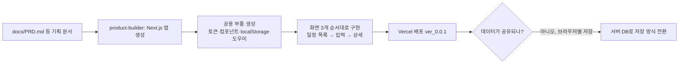

# 오늘 배운 것: 문서를 다시 채우는 이유, 그리고 배포에서 만난 첫 번째 함정

## 들어가며 (Situation)

오늘은 두 갈래로 작업이 나뉘었다. 하나는 팀 프로젝트(`montage-web` 기반 동선 생성 서비스) 쪽에서, 10일차에 만든 업무 분석 문서 `02-workflow.md`를 다시 열어 `02-H-workflow.md`로 고쳐 쓰는 일이었다. 다른 하나는 팀 프로젝트와 별개로 `deploy-planning` 폴더를 새로 만들어, 강사가 준 예시 프로젝트("동아리 총무의 일정 관리")를 가지고 기획 문서 → 화면 구현 → 실제 배포까지 **처음부터 끝까지 혼자 한 바퀴 돌려보는** 연습을 한 것이다. 전자가 "이미 만든 문서를 더 채우는" 작업이라면, 후자는 "아직 안 해본 배포까지 가보는" 작업이었다.

## 문제 상황 (Task)

- 10일차에 만든 업무 분석 문서는 행위자가 A1(모임장)·A2(구성원)·A3(새 구성원) 3명, 단계는 S1~S14 14개뿐이었다. 그런데 11~12일차 사이에 이미 화면 7장(로그인·회원가입·홈·탐색·동선짜기·내 일정·커뮤니티)을 만들었고, 그 안에는 로그인 없이 둘러보는 사람, 게시물을 관리하는 사람, 서비스를 운영하는 사람처럼 문서에 없는 역할이 이미 들어 있었다. **문서가 실제 화면보다 뒤처져 있었다.**
- 배포는 이번이 처음이었다. 지금까지는 Claude Design으로 화면을 그리기만 했지, 그 화면이 실제로 동작하는 앱이 되어 누군가 접속할 수 있는 주소를 갖는 과정은 해본 적이 없었다. `product-builder` 서브에이전트가 무엇을 어디까지 대신해주고, 어디서부터는 되물어야 하는지도 몰랐다.
- 배포 이후에 생긴 문제도 있었다. `ver_0.0.1`을 배포하고 나서야 데이터가 브라우저마다 따로 저장된다는 걸 깨달았다 — 이건 코드를 보기 전에는 예상하지 못한 문제였다.

## 해결 과정 (Action)

### A. 02-H-workflow.md — 행위자 3명에서 7명으로

💡 10일차 문서를 쓸 때는 "여행 일정을 만드는 사람"만 놓고 인터뷰했지만, 그 사이 만든 화면(커뮤니티 게시판, 로그인 화면, 관리자가 다룰 법한 신고 처리 등)을 다시 보니 그 화면을 실제로 쓰는 사람이 문서에는 없었다. 그래서 오늘은 화면을 기준으로 거꾸로 "이 화면은 누가 쓰지?"를 되짚어 행위자를 채웠다.

| A | 역할 | 10일차 문서(`02-workflow.md`) | 오늘 문서(`02-H-workflow.md`) |
|---|---|---|---|
| A1 | 사용자(개인/호스트) | 모임장 | 혼자 일정을 만들거나 그룹의 호스트로 권한 링크를 발급 |
| A2 | 공동 편집 사용자 | 구성원 | 수정 권한으로 장소 추가·동선 변경까지 직접 반영 |
| A3 | 열람 사용자 | 새로운 구성원 | 보기 권한으로 열람만(로그인 시 "내 일정"에 저장 가능) |
| A4 | 커뮤니티 사용자 | (없음) | 다른 사람의 여행 후기·동선을 둘러보고 반응 |
| A5 | 비회원(게스트) | (없음) | 로그인 없이 열람만, 편집 권한은 절대 불가 |
| A6 | 서비스 관리자 | (없음) | 서버·DB·장소 데이터 정확성 관리 |
| A7 | 에디터 | (없음) | 커뮤니티 관리 + 테마별 게시물 직접 제작·게시 |

🔴 행위자가 3명뿐이던 문서로는 로그인 화면이나 커뮤니티 화면을 왜 만들었는지 설명이 안 됐다 — 화면은 있는데 그 화면을 쓰는 사람이 문서에 없는 상태였다.

🟢 A4~A7을 채우고 나니 단계도 자연히 늘었다. S1~S14였던 단계가 S15(테마 게시물 작성·게시, A7)·S16(커뮤니티 게시물·댓글 관리, A7)·S17(로그인 후 공유받은 일정을 내 일정에 저장, A3)까지 더해져 **S1~S17, 17개**가 됐다. 특히 S17은 "보기 권한은 로그인 여부와 무관하게 가능하지만, 저장은 로그인한 사람만 이어갈 수 있다"는 조건을 분기로 따로 적어 두었다 — 안 그러면 나중에 에이전트가 비회원도 저장할 수 있다고 잘못 구현할 수 있어서다.

- **개념 카드 — 행위자(Actor)와 사용자 유형(User Segment)**
  - 행위자는 "이 서비스와 상호작용하는 역할"이고, 실제 사람 수나 회원 등급과는 다르다. A1(호스트)과 A2(공동 편집자)는 같은 사람이 상황에 따라 둘 다 될 수도 있다.
  - 화면을 먼저 그리고 나서 행위자를 거꾸로 채우는 건 순서가 뒤바뀐 것처럼 보이지만, 오늘처럼 기획 문서가 화면 제작 속도를 못 따라갔을 때는 화면을 기준으로 되짚는 것도 유효한 보정 방법이다.
  - 다만 이렇게 보정한 행위자는 반드시 04(기능)·05(정책) 문서까지 이어서 반영해야 한다 — 03-H-requirements.md와 이후 문서로 [제안] 검토를 이어가야 하는 상태다.

### B. deploy-planning — 처음부터 배포까지 혼자 돌려보기

⚠️ 팀 프로젝트와 별도로 만든 연습용 폴더다. `docs/01-problem.md`에 "⚠️ 강사 예시입니다"라고 적혀 있는 것처럼, 동아리 총무가 단톡방에 묻힌 모임 공지 때문에 매번 서너 명에게 다시 설명해야 하는 문제를 예시로 삼아 PRD부터 화면 설계(`docs/design/`)까지 이미 준비된 상태에서 시작했다. 오늘 배운 건 그 다음 단계, **실제로 동작하는 앱을 만들고 배포하는 과정**이다.



실제로 입력한 명령은 화면마다 이렇게 나뉘어 있었다.

```
product-builder 서브에이전트에게 이 폴더에 Next.js 앱을 만들게 해줘. 질문 없이 기본값으로.
docs 폴더는 지우거나 옮기지 말고 그대로 두고, .gitignore 에 Next.js 에 필요한 줄을 넣어줘.
다 되면 실행하는 명령과 주소를 알려줘.
```

```
product-builder 서브에이전트에게 docs/PRD.md · docs/06-data.md · docs/design/ 안의 파일을 읽고,
화면 없이 공용만 만들게 해줘 — ① tokens.css 의 색·글자 크기·간격·반경 값을 우리 이름으로 등록
② docs/design/ 의 컴포넌트를 부품 파일로 하나씩 ③ docs/06-data.md 의 저장 항목을
localStorage 에 읽고 쓰는 도우미 ④ 모든 화면이 함께 쓰는 틀(머리·뒤로 가기). 화면 자체는 만들지 마.
```

- **용어 카드 — `product-builder`의 절대 규칙**
  - ① 이 앱은 폴더 하나다 — 서버 프로그램·새 프로젝트 폴더·외부 서비스가 필요하면 만들지 않고 "지금 이 폴더 안에서 같은 일을 할 수 없어?"라고 되묻는다.
  - ② 첨부(PRD·클로드 디자인 프로젝트)에 없는 화면·요소를 지어내지 않는다.
  - ③ 정책의 예외 상황(권한 없음·한도 초과 등)까지 빠짐없이 구현하고, 무엇을 만들었는지·어떻게 확인하는지 보고한다.

이 규칙 덕분에 화면 하나(예: 일정 입력)를 만들 때도 "F1·F5 기능과 P1·P3·P4 정책의 예외 상황까지 문서 문장대로 구현해줘"처럼 요구사항(R)·기능(F)·정책(P) ID를 명령에 직접 넣게 됐다 — 10일차에 배운 "ID로 서로 가리키게 만드는" 원칙이 실제 구현 프롬프트에서도 그대로 쓰였다.

🔴 화면 3개(일정 목록·입력·상세)를 만들고 `npm run dev`로 로컬 확인, `git commit`, 그리고 Vercel로 `ver_0.0.1`을 배포한 뒤에야 문제를 발견했다. `workframe.md`에 남긴 메모 그대로다.

> 배포 ver_0.0.1 의 문제점
> → 일정 등록 시 데이터베이스 없이
> → 각자의 브라우저 상의 임시 저장 공간인 localStorage 에 데이터가 저장되어, 다른 사람들은 볼 수 없다.

동아리 총무가 일정을 등록해도, 그 데이터는 총무의 브라우저 안에만 있는 localStorage에 남는다. 구성원이 같은 공유 주소로 접속해도 자기 브라우저에는 그 일정이 없다 — 이 서비스의 핵심 요구사항(R2: "구성원들이 가고 싶은 장소를 한곳에서 모아 볼 수 있어야 한다"류의 "다 같이 본다")을 정면으로 깨는 문제였다.

| 저장 방식 | 어디에 저장 | 다른 사람이 볼 수 있나 | 이번 프로젝트에서 |
|---|---|---|---|
| localStorage | 각자의 브라우저 | 불가능(브라우저별로 독립) | ver_0.0.1의 문제 원인 |
| 서버 데이터베이스 | 서버 한 곳 | 가능(모두 같은 데이터를 조회) | 다음 명령으로 전환 |

🟢 해결은 화면을 다시 만드는 게 아니라 **저장 계층만 교체**하는 것이었다.

```
product-builder 서브에이전트에게 저장을 브라우저 저장소에서 서버 데이터베이스로 바꾸게 해줘.
연결 주소는 .env.local 의 DATABASE_URL 에 있다 — 값은 말하지 않을 거고 코드에 적지 마.
저장 구조는 docs/06-data.md 의 저장 항목 목록대로. 화면은 건드리지 말고,
다 되면 바뀐 파일 목록을 알려줘.
```

이 명령이 잘 작동한 이유는, B 단계에서 토큰·컴포넌트·저장 도우미·화면을 각각 다른 파일로 나눠 만들어 뒀기 때문이다. 저장 도우미 파일만 localStorage 함수에서 DB 호출로 바뀌면, 그 도우미를 불러 쓰는 화면 코드는 건드릴 필요가 없었다. ⚠️ 이때 `DATABASE_URL` 같은 연결 정보는 프롬프트에도, 코드에도 직접 적지 않고 `.env.local`(그리고 `.gitignore`)에만 두어 저장소에 올라가지 않게 했다.

## 결과 (Result)

- 팀 프로젝트 업무 분석 문서는 행위자 **3명 → 7명**(A1~A7), 단계 **14개 → 17개**(S1~S17)로 늘었다. 늘어난 4명의 행위자(A4~A7)는 모두 이미 만들어 둔 화면(커뮤니티, 로그인/게스트, 관리자용 화면)을 근거로 채워 넣은 것이라, 이제 문서와 화면이 서로 어긋나지 않는다.
- 연습 프로젝트에서는 화면 3개(일정 목록·입력·상세)로 MVP 기능(F1~F5)을 구현하고 Vercel에 `ver_0.0.1`을 배포하는 전체 과정을 처음으로 완주했다.
- 배포 직후 로컬스토리지 때문에 데이터가 공유되지 않는 문제를 발견했고, 화면 코드는 그대로 둔 채 저장 도우미 파일만 서버 DB 호출로 바꿔 해결했다 — 처음부터 저장 로직을 화면과 분리해 둔 덕분에 교체 범위가 파일 하나로 좁아졌다는 걸 결과로 확인했다.

## 더 학습하면 좋은 개념

- **클라이언트 상태 vs 서버 상태** — 오늘 겪은 localStorage 문제의 본질은 "내 브라우저만 아는 상태"와 "모두가 봐야 하는 상태"를 구분하지 않은 것이었다. 이 구분을 제대로 배우면 왜 어떤 데이터는 DB에, 어떤 데이터는 브라우저에만 둬도 되는지 판단 기준이 생긴다.
- **환경 변수와 시크릿 관리** — `DATABASE_URL`을 `.env.local`에만 두고 코드·프롬프트에 노출하지 않은 오늘의 선택이 왜 중요한지, Next.js의 환경 변수 규칙을 공식 문서로 확인해 둘 필요가 있다.
- **관심사의 분리(Separation of Concerns)** — 토큰·컴포넌트·저장 도우미·화면을 각각 다른 파일로 나눈 덕분에 저장 방식만 교체할 수 있었다. 이 원칙을 이름으로 알아두면 다음에 비슷한 구조를 설계할 때 의도적으로 적용할 수 있다.
- **서버리스 배포(Vercel 등)** — `npm run dev`로 로컬에서 보던 앱이 어떻게 인터넷 주소를 갖게 되는지, 빌드·배포 과정에서 무슨 일이 일어나는지는 아직 블랙박스로 남아 있다.
- **요구사항 추적성(Traceability)** — 10일차에 이어 오늘도 R·F·P·A ID로 서로를 가리키는 방식을 실제 구현 프롬프트에 그대로 썼다. 이 ID 체계가 문서 단계를 넘어 코드·커밋까지 이어지는 사례(예: 커밋 메시지에 요구사항 ID 넣기)를 더 찾아볼 만하다.

## 참고 자료
- [Next.js 공식 문서 - Deploying](https://nextjs.org/docs/app/building-your-application/deploying)
- [Next.js 공식 문서 - Environment Variables](https://nextjs.org/docs/app/building-your-application/configuring/environment-variables)
- [Vercel 공식 문서](https://vercel.com/docs)
- [MDN - Web Storage API](https://developer.mozilla.org/en-US/docs/Web/API/Web_Storage_API)
