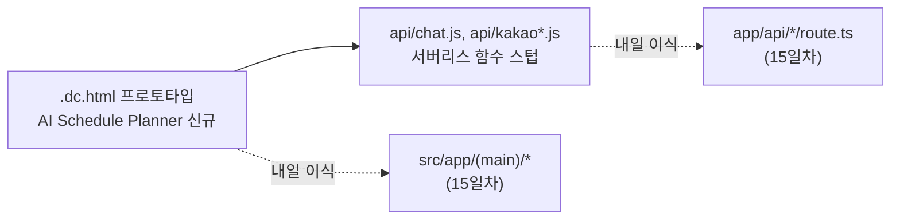

# 오늘 배운 것: 화면을 하나 더 늘리는 대신, 내일을 위해 API부터 스텁으로 준비하기

## 들어가며 (Situation)

13일차까지 팀 프로젝트는 화면 7개(로그인·회원가입·홈·탐색·동선짜기·내 일정·커뮤니티)와 업무 분석 문서 정비까지 끝낸 상태였다. 하지만 이 모든 화면은 여전히 Claude Design 캔버스가 만드는 `.dc.html` 파일이었다 — `support.js`라는 런타임이 그 파일을 읽어서 화면처럼 보여주는 프로토타입 단계였다. 오늘은 이 프로토타입에 마지막 화면 하나(AI 일정 생성)를 더 채우고, 내일(15일차) 있을 "진짜 코드로 옮기기" 작업을 앞두고 API 쪽을 먼저 준비해 두는 날이었다.

## 문제 상황 (Task)

- 지역·기간·동행·예산·이동수단 등을 입력받아 일정을 추천해 주는 **AI 일정 생성** 흐름이 아직 화면으로 없었다. 지금까지 만든 "동선짜기" 화면은 사용자가 직접 방문지를 하나씩 추가하는 방식이라, "일단 추천부터 받고 시작하기"라는 다른 진입 경로가 빠져 있었다.
- 커뮤니티 화면은 PC 폭 기준으로만 확인했다. 실제 폰 폭에서 카드 배치나 글자 크기가 어떻게 깨지는지 확인할 방법이 없었다.
- 다음날 화면을 실제 코드로 옮기면, AI 어시스턴트가 쓸 채팅 API와 지도(카카오) API도 같이 옮겨야 한다. 이때 API 키를 클라이언트 코드에 그대로 두면 노출되므로, 서버 쪽에서 대신 요청해 주는 **프록시 함수**가 필요했다 — 그런데 이걸 화면 이식과 동시에 처음부터 설계하면 하루 만에 다 못 끝낼 것 같았다.

## 해결 과정 (Action)

### A. AI Schedule Planner — 새 화면 하나

💡 지금까지 화면은 "방문지 검색 → 추가"만 있었는데, 오늘 추가한 화면은 **입력 단계를 거쳐 완성된 일정 후보를 먼저 보여주고, 그 결과로 동선짜기를 시작**하는 흐름이다.

- 지역 선택(칩 선택 + 직접 입력) → 기간(캘린더) → 동행 → 예산 등 여러 단계를 하나의 화면 안에서 순서대로 넘기는 구조로 만들었다. 캘린더 칸을 그려주는 `buildCalCells(viewYear, viewMonth, startStr, endStr, onDayClick, isDark)` 같은 순수 함수를 화면 로직과 분리해서 두었다 — 나중에 Next.js로 옮길 때 `src/lib/`로 그대로 가져갈 수 있게 하려는 의도다.
- 마지막 단계에서 "다시 추천받기"와 "이 일정으로 시작하기" 두 버튼을 뒀다. 추천 결과가 마음에 안 들면 처음부터 다시 받을 수 있게 하고, 마음에 들면 그 결과를 그대로 동선짜기 화면의 시작 상태로 넘기는 구조다.

### B. Community Mobile Preview — 별도 미리보기 화면

🟢 커뮤니티 화면 자체를 반응형으로 고치는 대신, **모바일 폭으로 미리 보여주기만 하는 화면을 따로 하나 더 만들었다.** 실제 서비스에 필요한 화면은 아니고, 확인 전용이다. 이렇게 나눈 이유는 커뮤니티 화면 자체의 반응형 CSS는 아직 다듬는 중이라 매번 브라우저 창 크기를 줄여가며 확인하기 번거로웠기 때문이다 — 나중에 이 미리보기 화면은 지워도 되는, 개발 중에만 쓰는 용도임을 명확히 해뒀다.

### C. 채팅·지도 API를 서버리스 함수 스텁으로 미리 준비

⚠️ 아직 실제 서비스 코드가 아니라 프로토타입 단계지만, AI 어시스턴트가 쓸 API 키(Gemini)를 클라이언트에 그대로 두면 안 되기 때문에 **Vercel Serverless Function**으로 프록시부터 만들어 두었다.

```js
// api/chat.js
// Vercel Serverless Function: POST /api/chat
// Proxies chat requests to the Gemini API without exposing the API key to the client.
const GEMINI_MODEL = 'gemini-3.8-flash';
const GEMINI_URL = `https://generativelanguage.googleapis.com/v1beta/models/${GEMINI_MODEL}:generateContent`;

export default async function handler(req, res) {
  if (req.method !== 'POST') {
    res.status(405).json({ error: 'Method not allowed' });
    return;
  }
  const apiKey = process.env.GEMINI_API_KEY;
  if (!apiKey) {
    res.status(500).json({ error: 'Server is missing GEMINI_API_KEY' });
    return;
  }
  // ... 이하 message/history/context를 받아 Gemini에 프록시
}
```

- **용어 카드 — 서버리스 함수(Serverless Function)를 프록시로 쓰는 이유**
  - 클라이언트(브라우저)에서 바로 Gemini API를 호출하면, API 키가 자바스크립트 코드 안에 그대로 노출된다. 누구나 개발자 도구로 키를 복사해 갈 수 있다.
  - 대신 브라우저는 우리 서버(`/api/chat`)만 호출하고, 그 서버가 `process.env.GEMINI_API_KEY`(환경변수, 코드에 없음)를 이용해 Gemini에 요청한다. 키는 서버 밖으로 절대 나가지 않는다.
  - `api/kakao.js`, `api/kakao-config.js`도 같은 이유로 미리 만들어 뒀다 — 지도 검색은 서버 전용 키로, 지도 SDK 로드는 브라우저에 공개해도 되는 키로 나눠 프록시한다.

- `api/chat.js`의 시스템 프롬프트에는 "사용자의 경로 설정을 네가 대신 바꾸지는 않아"라는 문장을 명시적으로 넣었다. AI가 추천은 하되 사용자 데이터를 직접 조작하지 못하게 역할을 제한해 둔 것이다.



## 결과 (Result)

- 디자인 캔버스 화면이 7개에서 8개(AI 일정 생성 추가)로 늘었고, 커뮤니티는 모바일 폭 확인 전용 화면을 따로 확보했다.
- 채팅·카카오 API 서버리스 함수 스텁을 미리 만들어 두어, 15일차 마이그레이션 문서(`MIGRATION.md`)의 `api/*.js → app/api/*/route.ts` 매핑표가 실제로 옮길 대상이 준비된 상태로 하루를 시작할 수 있었다.
- API 키를 코드가 아닌 환경변수로 분리하는 습관을 화면을 만들기 **전에** 먼저 잡아뒀다 — 나중에 되돌아가 고치는 것보다 처음부터 이렇게 시작하는 게 더 쉬웠다.

## 더 학습하면 좋은 개념

- **서버리스 함수(Serverless Function)** — API 키를 숨기는 프록시 패턴의 기반이 되는 개념. 요청이 올 때만 실행되고 상시 서버를 띄워두지 않는다는 점까지 이해하면 왜 Vercel이 이 방식을 기본으로 쓰는지 알 수 있다.
- **환경 변수(Environment Variables)** — `process.env.GEMINI_API_KEY`처럼 코드와 비밀 값을 분리하는 방법. 13일차에 배운 `.env.local` 개념이 오늘은 서버리스 함수 쪽에서도 그대로 적용됐다.
- **시스템 프롬프트 설계** — AI 어시스턴트에게 "무엇을 하지 말아야 하는지"까지 명시하는 것의 중요성. 오늘은 "사용자 데이터를 대신 바꾸지 않는다"는 제약을 프롬프트 안에 넣었다.
- **반응형 vs 별도 미리보기 화면** — 커뮤니티 모바일 미리보기처럼 실서비스에는 없지만 개발 확인용으로만 두는 화면을 언제 만들고 언제 지워야 하는지 판단 기준을 더 살펴볼 만하다.

## 참고 자료
- [Vercel 공식 문서 - Functions](https://vercel.com/docs/functions)
- [Next.js 공식 문서 - Environment Variables](https://nextjs.org/docs/app/building-your-application/configuring/environment-variables)
- [Google AI 공식 문서 - Gemini API](https://ai.google.dev/gemini-api/docs)
