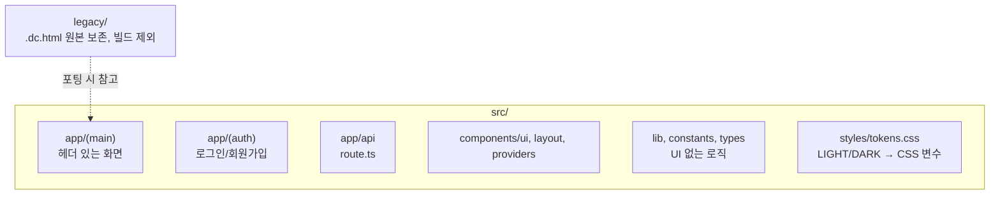

# 오늘 배운 것: 프로토타입을 "베끼는" 게 아니라 "구조를 바꿔서 옮기는" 방법

## 들어가며 (Situation)

14일차까지 만든 것은 전부 Claude Design 캔버스였다. `.dc.html` 파일 하나가 화면 하나였고, `support.js`라는 자체 런타임이 그 파일 안의 `<x-dc>` 마크업과 `{{ }}` 템플릿을 읽어서 화면처럼 보여주는 구조였다. 실제 사용자가 접속해서 로그인하고 데이터를 저장하는 서비스가 되려면 이 프로토타입을 실제 웹 프레임워크 위로 옮겨야 했다. 오늘부터 팀 저장소 `team-hello-pj/pinder`를 실제로 쓰기 시작했다.

## 문제 상황 (Task)

- `.dc.html`의 문법(`class Component extends DCLogic`, `state = { … }`, `<sc-if>`, `<sc-for>`, `{{ c.bg }}` 테마 객체)은 Next.js의 JSX·React 상태 관리와 1:1로 대응되지 않는다. 그냥 파일을 복사하는 게 아니라 **문법 자체를 다시 써야** 했다.
- 화면 6개(홈·탐색·마이페이지·내 일정·커뮤니티·로그인/회원가입)와 플래너(동선짜기)까지, 하루 만에 옮겨야 할 화면이 많았다.
- 이제부터는 나 혼자 쓰는 프로젝트가 아니라 팀원들과 같은 저장소에서 동시에 작업해야 한다. 폴더 구조 규칙이나 CI(빌드 확인) 없이 시작하면 나중에 병합할 때 충돌이 훨씬 커질 게 뻔했다.

## 해결 과정 (Action)

### A. 프로토타입 문법을 Next.js 문법으로 바꾸는 대응표부터 만들었다

💡 화면을 옮기기 전에, "프로토타입의 이 문법은 Next.js에서 이렇게 쓴다"는 대응표를 `docs/MIGRATION.md`에 먼저 적어뒀다. 팀원 누구든 화면 하나를 옮길 때 이 표만 보면 되게 하려는 목적이었다.

| 프로토타입 | Next.js |
|---|---|
| `Route Planner App.dc.html` | `src/app/(main)/planner/page.tsx` |
| `<x-dc>` + `{{ }}` 템플릿 | JSX |
| `class Component extends DCLogic` + `state = {…}` | `useState` / `useReducer` |
| `<sc-if value="{{ cond }}">` | `{cond ? <A /> : null}` |
| `<sc-for>` | `{items.map((item) => <Row key={item.id} … />)}` |
| `{{ c.bg }}` 같은 테마 객체 | `var(--pd-bg)` CSS 변수 |
| 인라인 `style="…"` | `*.module.css` |
| `api/*.js` (Vercel 함수) | `src/app/api/*/route.ts` |

- **개념 카드 — 테마 객체에서 CSS 변수로**
  - 프로토타입은 `LIGHT`/`DARK` 자바스크립트 객체를 만들어 `{{ c.bg }}`처럼 값을 직접 문자열에 꽂아 넣는 방식이었다.
  - Next.js에서는 이 값을 `tokens.css`에 `--pd-bg` 같은 CSS 변수로 옮기고, `[data-theme='dark']` 선택자가 그 변수 값만 바꾸도록 했다. 컴포넌트 코드는 라이트/다크 구분 없이 한 벌만 쓰면 된다 — 다크 전용 클래스(`.cm-dark` 등)를 따로 만들 필요가 없어진 것이 핵심 이득이다.

### B. 폴더 구조와 협업 기반을 화면보다 먼저 세팅했다

- `docs/ARCHITECTURE.md`(폴더 구조)·`CONTRIBUTING.md`(브랜치·커밋·PR 규칙)·`TEAM.md`(화면별 담당자)·`MIGRATION.md`(위 대응표)를 화면 코드보다 먼저 커밋했다.
- `.github/`에 CI(lint·typecheck·build)와 PR·이슈 템플릿, CODEOWNERS를 뒀다. 🟢 이렇게 해두면 팀원이 화면을 옮기다가 문법을 잘못 써도 병합 전에 자동으로 걸러진다.
- 원본 `.dc.html` 전체는 `legacy/` 폴더에 그대로 보존했다. **빌드 대상이 아니라서** 실제 서비스에는 영향이 없고, 화면을 옮길 때 원본 마크업/로직을 확인하는 용도로만 쓴다.

### C. 화면 6개 이식 순서와 시행착오

실제 커밋 순서는 홈 → 탐색·마이페이지 → 내 일정 → 커뮤니티 → 로그인/회원가입(실제 세션 연결까지) → 플래너(동선짜기) 순이었다.

🔴 플래너는 다른 화면과 달리 한 번에 끝내지 못했다. `wip(planner): 경로 만들기 화면 이식 진행 중 (미완성, 미검증)`이라는 커밋을 남길 만큼 로직이 복잡했다 — 지도·이동수단·경로 재조정까지 얽혀 있어서 화면만 옮긴다고 끝나는 게 아니었다.

또한 팀원이 `main` 브랜치에 legacy 디자인을 먼저 바꿔둔 상태였어서, 이식 작업 중간에 `merge: main 브랜치 병합 (팀원의 legacy 디자인 변경 반영)`을 한 번 거쳐야 했다. 팀 저장소를 실제로 쓰기 시작하자마자 "내 작업 중에 남이 바꾼 것"을 반영하는 상황을 처음 겪은 것이다.

- **용어 카드 — 데이터 호환 유지**
  - `localStorage` 키 이름을 레거시 프로토타입과 완전히 동일하게 유지했다(`pd-theme`, `rp-saved-routes` 등).
  - 직접 문자열을 여기저기 흩어 쓰지 않고 `src/lib/storage.ts`의 `STORAGE_KEYS`를 import해서 쓰도록 규칙을 정했다. 화면을 옮겨도 이전에 저장해 둔 데이터를 계속 읽을 수 있게 하려는 이유다.

🟢 마지막으로 Google 로그인까지 실제로 연동했다(`f6bc0cb`). 화면 이식에 그치지 않고 실제 OAuth 흐름까지 하루 안에 붙인 셈이다. 다만 이때는 받은 ID 토큰의 payload만 디코드해서 믿는 수준이었고, 서명 검증은 커밋 메시지에 TODO로 남겨둔 채였다 — 이 구멍은 다음날(16일차) 백엔드 전환과 함께 메웠다. 자세한 과정은 [pinder API 연동기 — 구글 로그인 편]({{ site.baseurl }}/projects/pinder-google-oauth/)에 따로 정리했다.

## 결과 (Result)

- `pinder` 저장소에 12개 커밋으로 프로젝트 뼈대(App Router 구조, 협업 문서, CI)와 화면 6개(홈·탐색·마이페이지·내 일정·커뮤니티·로그인/회원가입) 이식, Google 로그인 연동까지 끝냈다.
- 플래너(동선짜기)만 "미완성" 상태로 남겨, 다음날 실제 데이터 연결과 함께 마무리하기로 했다 — 무리하게 하루 안에 다 밀어넣지 않고 범위를 조정한 판단이었다.
- `localStorage` 키를 그대로 유지한 덕분에 프로토타입 때 저장해 둔 값을 새 코드베이스에서도 이어서 쓸 수 있음을 확인했다.

## 더 학습하면 좋은 개념

- **App Router (Next.js)** — `(main)`, `(auth)` 같은 괄호 폴더(Route Groups)가 URL에는 나타나지 않으면서 레이아웃만 분리해 주는 구조를 오늘 처음 실제로 적용해봤다. 공식 문서로 라우팅 규칙을 더 확인할 필요가 있다.
- **CSS 변수 기반 테마 전환** — 자바스크립트 객체로 색을 분기하던 방식에서 CSS 변수 하나로 라이트/다크를 전환하는 방식으로 바꾼 것의 성능·유지보수 이점을 더 깊이 알아둘 만하다.
- **점진적 마이그레이션(Incremental Migration)** — 화면 전체를 한 번에 옮기지 않고 `legacy/`를 보존한 채 화면 단위로 순차 이식하는 전략. 왜 이 방식이 리스크를 줄이는지 이름으로 알아두면 다음 마이그레이션에도 적용할 수 있다.
- **OAuth 2.0과 Google 로그인** — 오늘 연동한 Google 로그인이 내부적으로 어떤 절차(인가 코드, 토큰 교환)를 거치는지 아직 블랙박스로 남아 있다.

## 참고 자료
- [Next.js 공식 문서 - Route Groups](https://nextjs.org/docs/app/building-your-application/routing/route-groups)
- [Next.js 공식 문서 - CSS Modules](https://nextjs.org/docs/app/building-your-application/styling/css)
- [MDN - CSS Custom Properties](https://developer.mozilla.org/en-US/docs/Web/CSS/--*)
- [Google Identity 공식 문서](https://developers.google.com/identity)
