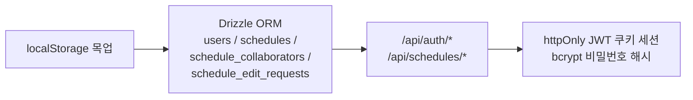

# 오늘 배운 것: 화면이 진짜처럼 보이는 것과 실제로 동작하는 것은 다르다

## 들어가며 (Situation)

15일차에 화면 6개를 Next.js로 옮겼지만, 로그인·회원가입·경로 저장은 여전히 `localStorage`에 값을 넣었다 뺐다 하는 눈속임이었다. 13일차에 연습 프로젝트에서 이미 한 번 겪었던 "각자의 브라우저에만 저장되는" 문제가 팀 프로젝트에서도 똑같이 남아 있었다. 오늘은 이 목업을 실제 데이터베이스와 인증 로직으로 바꾸는 날이었다.

## 문제 상황 (Task)

- 회원가입·로그인·이메일 인증·구글 로그인·회원탈퇴·경로 저장이 전부 `localStorage` 목업이었다. 여러 사람이 같은 링크로 들어와도 서로의 데이터를 볼 수 없었다.
- 이메일 인증번호 발송에 Resend를 붙였는데, **도메인 인증 전까지는 계정 소유 이메일로만 발송이 가능**하다는 제약을 뒤늦게 발견했다. 실사용자(학교 이메일 등)에게는 인증 메일이 아예 가지 않는 상태였다.
- 회원탈퇴 이후 로그인 화면으로 돌아가지 않는 문제, 탈퇴 후에도 남아있는 인증코드 등 부가적인 흐름 문제도 함께 발견됐다.

## 해결 과정 (Action)

### A. Neon Postgres + Drizzle ORM으로 실제 백엔드 연결

- `users`, `schedules`, `schedule_collaborators`, `schedule_edit_requests` 네 개 테이블을 Neon Postgres에 두고, `/api/auth/*`·`/api/schedules/*` 실제 서버 API로 회원가입/로그인/이메일 인증/구글 로그인/회원탈퇴/경로 저장을 전부 교체했다.
- 세션은 httpOnly JWT 쿠키로 발급하고, 비밀번호는 bcrypt로 해시해서 저장했다.
- 플래너의 초대 링크·편집 권한 요청/승인 같은 협업 UI도 실제 `schedule_collaborators`/`schedule_edit_requests` 테이블과 연결했다 — 화면은 15일차에 이미 만들어 뒀던 것을, 오늘에서야 진짜 데이터와 이었다.

- **개념 카드 — httpOnly 쿠키와 bcrypt**
  - `httpOnly` 쿠키는 자바스크립트(`document.cookie`)로 읽을 수 없는 쿠키다. 세션 토큰을 여기에 담으면 XSS 공격으로 토큰을 훔쳐가는 경로 하나를 원천 차단할 수 있다.
  - `bcrypt`는 비밀번호를 그대로 저장하지 않고 되돌릴 수 없는 해시 값으로 바꿔 저장하는 방식이다. DB가 유출돼도 원래 비밀번호를 바로 알 수 없다.

### B. 이메일 인증: Resend에서 Gmail SMTP로

🔴 Resend는 도메인 인증 전까지 계정 소유 이메일로만 발송이 가능해서 실사용자에게 인증번호를 못 보내는 문제가 있었다.

🟢 Gmail SMTP(nodemailer + 앱 비밀번호)로 바꾸자 발신 계정만 Gmail이면 되고 수신자 제한이 없어졌다 — 도메인 구매·인증 없이 바로 임의의 주소로 실발송이 가능했다. `GMAIL_USER`/`GMAIL_APP_PASSWORD` 환경변수가 없으면 이전처럼 서버 로그로 대체하도록 안전망도 남겨뒀다.

실제로 `colbeld@g.eulji.ac.kr`로 발송해서 수신까지 직접 확인했다.

| 발송 방식 | 제약 | 이번 프로젝트에서 |
|---|---|---|
| Resend | 도메인 인증 전엔 계정 소유 이메일만 수신 가능 | 실사용자에게 발송 불가 → 폐기 |
| Gmail SMTP (nodemailer) | 발신 계정만 Gmail이면 수신자 제한 없음 | 실사용자에게 발송 성공 |

### C. 회원가입/탈퇴 흐름의 시행착오

⚠️ 이 부분은 한 번에 끝나지 않았다.

- 프로필 사진 업로드, 가입·탈퇴 안내 이메일, 가입 전 중복 이메일 사전 차단을 추가했다.
- 회원탈퇴 후 로그인 화면으로 이동하지 않는 버그를 고쳤는데(`fix(my-page): 일반 회원탈퇴 후 로그인 화면으로 이동하지 않던 문제 수정`), 이후 다른 커밋에서 같은 문제가 재발해 `fix(my-page): 회원탈퇴 후 로그인 화면 이동 재적용`으로 다시 고쳐야 했다. 같은 버그가 두 번 나온 건 탈퇴 로직과 리다이렉트 로직이 서로 다른 곳에 흩어져 있었기 때문이었다.
- 로그인 성공 시 이동 화면을 플래너에서 메인 화면으로 바꾸고, 탈퇴 시 남아있던 인증코드까지 정리하도록 했다.
- 비밀번호 찾기 화면(`/forgot-password`)을 새로 만들었다 — legacy 프로토타입에는 없던 화면이라, 이메일 입력 → 인증번호 확인 → 새 비밀번호 설정 3단계 흐름을 회원가입과 같은 인증번호 검증 API(`/api/auth/verify-code`)를 재사용해서 만들었다. 실제로 가입 → 비밀번호 재설정 → 예전 비밀번호 로그인 실패 → 새 비밀번호 로그인 성공까지 curl로 직접 검증했다.

## 결과 (Result)

- 인증·경로 저장이 전부 `localStorage` 목업에서 Neon Postgres 기반 실제 API로 바뀌었다.
- 실사용자 이메일(`colbeld@g.eulji.ac.kr`)로 인증번호가 실제로 발송·수신되는 것을 확인했다 — Resend의 도메인 제약을 Gmail SMTP로 우회한 결과다.
- 비밀번호 찾기 화면을 새로 만들고 curl로 전체 흐름(가입→재설정→로그인)을 직접 검증해, "화면상 동작해 보인다"가 아니라 "API 응답으로 확인했다" 수준까지 확인했다.
- 회원탈퇴 후 리다이렉트 버그가 같은 문제로 두 번 나온 것을 계기로, 관련 로직이 여러 곳에 흩어져 있으면 같은 버그가 재발할 수 있다는 것을 실감했다.

## 더 학습하면 좋은 개념

- **JWT와 세션 관리** — httpOnly 쿠키에 담은 JWT가 어떻게 검증되고 만료되는지, 서버가 세션을 어디까지 신뢰해도 되는지는 19일차에 다시 문제로 등장한다.
- **비밀번호 해싱(bcrypt)** — 단방향 해시가 왜 "복호화 불가능"해야 안전한지, salt는 어떤 역할을 하는지 공식 문서·표준(OWASP)으로 확인해 둘 필요가 있다.
- **SMTP와 이메일 발송 서비스 비교** — Resend 같은 트랜잭션 이메일 서비스와 Gmail SMTP의 차이(도메인 인증, 발송량 제한, 신뢰도)를 표로 정리해보면 다음에 서비스를 고를 때 기준이 생긴다.
- **ORM(Object-Relational Mapping)** — Drizzle ORM이 SQL을 어떻게 타입 안전하게 감싸주는지, raw SQL과 비교했을 때 얻는 것과 잃는 것은 무엇인지 더 살펴볼 만하다.

## 참고 자료
- [Drizzle ORM 공식 문서](https://orm.drizzle.team/docs/overview)
- [Nodemailer 공식 문서](https://nodemailer.com/about/)
- [MDN - Using HTTP cookies (HttpOnly)](https://developer.mozilla.org/en-US/docs/Web/HTTP/Cookies)
- [Neon 공식 문서](https://neon.tech/docs/introduction)
