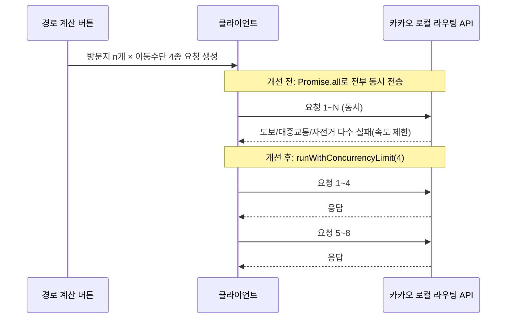

# 오늘 배운 것: 한꺼번에 다 쏘는 게 항상 빠른 건 아니다

## 들어가며 (Situation)

16일차에 인증·경로 저장을 실제 DB로 바꾸면서 플래너(동선짜기)도 실사용 단계에 들어섰다. 그런데 실제로 여러 명이 여러 날짜에 걸친 여행 일정을 만들어보니, "하루짜리 여행"만 가정하고 짰던 경로 계산 로직 곳곳에서 문제가 드러났다. 오늘은 팀 저장소 전체 커밋 171개 중 상당수가 몰린 날로, 플래너의 경로 계산 코어 로직을 거의 다시 다듬었다.

## 문제 상황 (Task)

- "경로 계산" 버튼을 누르면 방문지 수 × 이동수단 4종(그리고 최적 경로 계산 시엔 방문지 수의 제곱만큼) 카카오 API 요청을 `Promise.all`로 한 번에 전부 동시에 쏘고 있었다. 자동차(카카오 모빌리티)는 대체로 버텼지만, 도보·대중교통·자전거(카카오 로컬 라우팅)는 요청이 몰리면 속도 제한에 걸려 실패하는 경우가 많았다. 실패한 항목은 "경로 검색 버튼을 눌러 실제 경로를 조회해주세요"라는 안내만 남아, 마치 그 이동수단 자체가 지원 안 되는 것처럼 보였다.
- 여행을 여러 날짜(일차)로 나눠 계획할 때, 최적 경로 계산 결과(`routeOptimization`)가 일차 하나짜리 값으로만 저장되고 있었다. 그래서 1일차, 2일차를 각각 계산해도 마지막으로 계산한 일차의 결과만 화면에 반영됐다.

## 해결 과정 (Action)

### A. 동시 요청 제한으로 속도 제한 회피

🔴 원인은 명확했다 — 요청을 한꺼번에 너무 많이 쏘고 있었다.

🟢 `runWithConcurrencyLimit`이라는 유틸을 새로 만들어 동시 요청 수를 4개씩으로 제한하도록 `searchAllRoutes`/`buildLegMatrix`를 수정했다. 요청을 안 쏘는 게 아니라 **한 번에 몇 개까지 동시에 나갈지만 제어**하는 방식이라, 전체 소요 시간은 조금 늘어나도 실패율은 크게 줄었다.

- **용어 카드 — 동시성 제어(Concurrency Limiting)**
  - `Promise.all`은 배열에 담긴 모든 비동기 작업을 동시에 시작한다. 작업 수가 적을 땐 빠르지만, 외부 API처럼 초당 요청 수 제한(rate limit)이 있는 대상에는 오히려 독이 된다.
  - 동시성 제한은 "전체를 한꺼번에"가 아니라 "정해진 개수만큼 묶어서 순차적으로" 처리하는 방식이다. 큐에서 하나가 끝나면 다음 하나를 꺼내 실행하는 구조로 흔히 구현한다.

### B. 일차별로 독립된 최적경로 계산

⚠️ 겉보기엔 "계산 버튼이 가끔 이상하게 동작한다" 정도로 보였지만, 원인은 상태 구조 자체였다.

- `routeOptimization`을 일차 하나짜리 값이 아니라 **일차별 맵**(`routeOptimizationByDay`)으로 구조를 바꿨다. 전체보기에서 여러 일차를 각각 계산해 두면, 최단시간/최단거리를 토글할 때 계산해 둔 모든 일차에 그 결과가 각각 반영된다. 총 이동거리/시간은 전체 구간 합산이라 이 부분만 고치면 자동으로 맞게 나왔다.
- 이 참에 `applyOptimizedOrder`가 호출 시점의 `places` 스냅샷이 아니라 항상 `setPlaces`의 최신 상태를 기준으로 재배치하도록 바꿨다. 여러 일차를 연달아 적용할 때 뒤 호출이 앞 호출의 변경을 덮어쓰던 잠재적 버그도 함께 없앴다.

| 문제 | 원인 | 해결 |
|---|---|---|
| 도보/대중교통/자전거 경로 검색 실패 | 방문지 수 × 이동수단만큼 동시 요청 | `runWithConcurrencyLimit(4)`로 동시 요청 수 제한 |
| 전체보기에서 마지막 일차 결과만 반영 | `routeOptimization`이 일차 구분 없는 단일 값 | `routeOptimizationByDay`로 일차별 맵으로 전환 |
| 여러 일차 연달아 적용 시 앞선 변경 덮어쓰기 | 호출 시점 스냅샷을 기준으로 재배치 | 항상 최신 `setPlaces` 상태를 기준으로 재배치 |

💡 오늘은 이 동시성 문제 말고도 "경로선이 지도에 안 보인다"는 같은 증상의 버그가 하루에만 네 번 더 나왔다 — 원인은 매번 달랐다(존재하지 않는 API 파라미터, 실패를 영구 캐시하는 로직, stale 클로저 등). 다섯 가지를 원인별로 모아 [pinder API 연동기 — 카카오맵 편]({{ site.baseurl }}/projects/pinder-kakao-map/)에 정리했다.

- **개념 카드 — 클로저가 붙잡은 오래된 상태(Stale Closure)**
  - `applyOptimizedOrder`가 호출된 "그 순간"의 `places` 값을 기억한 채로 나중에 실행되면, 그 사이 다른 곳에서 `places`가 바뀌었어도 오래된 값을 기준으로 동작한다.
  - 항상 `setPlaces(prev => …)`처럼 최신 상태를 넘겨받는 형태로 바꾸면, 여러 업데이트가 연달아 일어나도 서로 덮어쓰지 않는다.

### C. 그 밖의 시각화·안정성 개선

- 지도 경로선(폴리라인)과 방문지 순번 배지 색을 일차마다 다른 색으로 통일해서, 여러 날짜의 경로가 지도 위에서 서로 섞이지 않게 구분했다.
- 다크모드에서 상태색(info/warn/danger) 배경이 지나치게 밝게 뜨던 문제를 수정했다.
- 비로그인 상태에서 커뮤니티·내 일정에 접근하면 로그인/회원가입을 유도하는 모달을 띄우도록 했고, AI 추천 장소 검색이 실패할 경우를 대비한 폴백 쿼리도 추가했다.

### D. AI 일정 생성기가 같은 도시만 추천하던 문제

오늘 카카오 API와 별개로, Gemini 기반 AI 일정 생성기도 크게 손봤다. 같은 광역 지역(예: 경기)을 고르면 매번 같은 도시(수원)만 추천되던 문제를 temperature 조정(0.4 → 1)과 "넓은 지역은 분산 추천하라"는 프롬프트 보강으로 고쳤고, AI가 지어낸 이동시간·거리도 실제 카카오 길찾기 API로 재계산하도록 바꿨다. `/api/chat` AI 도우미가 로컬에선 되는데 Vercel Production에서만 안 열리던 문제도 같은 날 추적했다 — 이 부분은 [pinder API 연동기 — Gemini AI 편]({{ site.baseurl }}/projects/pinder-gemini-ai/)에 따로 정리했다.

## 결과 (Result)

- 도보/대중교통/자전거 경로 검색의 실패율을 동시 요청 제한(4개)으로 크게 줄였다 — 요청 자체를 줄인 게 아니라 **속도를 조절**한 것이 핵심이었다.
- 다일차 여행에서 각 날짜별 최적경로 계산 결과가 서로 덮어쓰지 않고 독립적으로 유지되도록 상태 구조를 고쳤다.
- 지도 색상 통일, 다크모드 상태색 수정, 비로그인 유도 모달까지 더해 플래너가 실사용에 훨씬 가까운 상태가 됐다.

## 더 학습하면 좋은 개념

- **API Rate Limit 대응 패턴** — 오늘 겪은 문제는 특정 서비스만의 이슈가 아니라 외부 API를 다룰 때 공통으로 마주치는 문제다. 재시도(retry)·지수 백오프(exponential backoff)까지 같이 알아두면 다음에 비슷한 문제를 더 빨리 해결할 수 있다.
- **React의 상태 업데이트와 클로저** — `applyOptimizedOrder` 사례처럼, 이벤트 핸들러 안에서 붙잡은 상태 값이 실행 시점에는 오래된 값일 수 있다는 점을 React 공식 문서로 확인해 둘 필요가 있다.
- **정규화된 상태 구조(Normalized State)** — `routeOptimization`을 일차별 맵으로 바꾼 것처럼, 여러 개의 독립된 항목을 다룰 때는 단일 값이 아니라 키로 구분된 구조가 왜 안전한지 원칙으로 정리해볼 만하다.
- **지도 시각화(폴리라인·마커)** — 카카오맵에서 여러 경로선과 마커를 색으로 구분해 그리는 방식은 다른 지도 SDK(Google Maps 등)에도 비슷하게 적용되는 개념이라 비교해보면 좋다.

## 참고 자료
- [카카오 로컬 API 공식 문서](https://developers.kakao.com/docs/latest/ko/local/dev-guide)
- [MDN - Promise.all()](https://developer.mozilla.org/en-US/docs/Web/JavaScript/Reference/Global_Objects/Promise/all)
- [React 공식 문서 - State as a Snapshot](https://react.dev/learn/state-as-a-snapshot)
