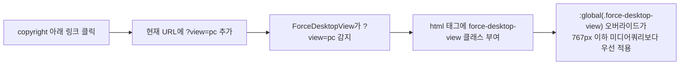

# 오늘 배운 것: 새로 만들지 않고 있는 흐름을 다시 태우는 법

## 들어가며 (Situation)

17일차까지 플래너의 경로 계산 로직을 집중적으로 다듬었다. 오늘은 방향을 바꿔, 방문지를 추가하는 새로운 방법(지도 클릭)과 모바일에서 PC 화면을 확인하는 방법을 만들었다. 두 기능 모두 처음부터 새로 짜지 않고, 이미 있던 흐름을 최대한 재사용하는 쪽으로 풀었다.

## 문제 상황 (Task)

- 지금까지 방문지를 추가하는 방법은 검색뿐이었다. 지도에서 원하는 위치를 직접 클릭해서 추가하고 싶어도, 클릭한 좌표만으로는 그 자리에 어떤 장소(이름·카테고리)가 있는지 알 수 없었다.
- 일부 화면은 PC 폭을 기준으로 설계돼서, 모바일에서 보면 정보가 너무 눌려 보이거나 확인하기 불편했다. 그렇다고 PC 전용 페이지를 새로 하나 더 만들면 같은 화면을 두 벌 관리해야 하는 부담이 생긴다.

## 해결 과정 (Action)

### A. 모바일에서 "웹 버전으로 보기"

🟢 새 페이지를 만들지 않고, **URL 쿼리 파라미터 하나로 기존 반응형 CSS의 우선순위만 바꾸는 방식**을 택했다.

- 각 모듈 CSS(헤더·홈·커뮤니티·탐색·내 경로)에 `:global(.force-desktop-view)` 오버라이드를 추가해서, 기존에 있던 767px 이하 미디어쿼리보다 우선 적용되도록 했다.
- `viewport` meta 태그를 조작하지 않고 기존 반응형 CSS 구조를 그대로 유지했다 — 별도 PC 페이지를 만들지 않고 같은 라우트·컴포넌트를 그대로 쓰기 때문에, 로그인 세션이나 저장된 데이터 연동에도 영향이 없었다.

⚠️ 다만 처음 붙였을 때는 PC 레이아웃이 모바일 화면 폭으로 잘려서 나오는 문제가 있었다. 강제로 데스크톱 클래스를 씌운 것과 실제 화면 폭이 여전히 모바일이라는 사실 사이의 간극에서 생긴 문제로, 잘리는 부분의 폭 계산 방식을 다시 맞춰서 해결했다.

- **용어 카드 — CSS Modules의 `:global` 탈출구**
  - CSS Modules는 클래스 이름을 자동으로 고유하게 만들어(예: `Header_wrap__a1b2`) 다른 컴포넌트와 이름이 겹치지 않게 해준다.
  - `:global(...)`은 이 자동 변환을 건너뛰고 전역 클래스 선택자를 그대로 쓰겠다는 표시다. `html.force-desktop-view`처럼 컴포넌트 바깥(루트 요소)에 붙는 클래스를 기준으로 스타일을 걸 때 필요하다.

### B. 지도 클릭으로 실제 장소 후보 추가

💡 기존에는 지도 하단에 별도의 장소정보 bar가 있었는데, 이를 없애고 **지도를 클릭하면 바로 주변 실제 장소 후보 팝업**이 뜨도록 바꿨다.

- `/api/kakao`에 새 `nearby` 액션을 추가해, 클릭한 좌표의 역지오코딩(좌표 → 주소 변환)과 카테고리 검색을 병렬로 조회했다.
- 후보가 없으면 클릭 좌표와 역지오코딩 주소만으로 바로 확인 팝업("이 위치를 추가하시겠습니까?")으로 넘어가도록 예외 처리를 뒀다.
- 후보를 선택한 뒤에는 **기존 검색 흐름과 완전히 같은 확인 팝업·`addSelectedPlace` 경로**를 그대로 탄다. 그래서 저장되는 장소 데이터 구조, 경로 계산, `routeCache` 무효화가 검색으로 추가한 장소와 동일하게 동작한다.

🔴 처음 구현에서는 지도 클릭 후보 검색 범위가 좁아서 주변에 장소가 있어도 후보가 안 뜨는 경우가 있었고, 후보 팝업을 취소했을 때 지도에 임시로 찍힌 marker가 지워지지 않고 남는 문제도 있었다. 검색 범위를 넓히고, 취소 시 임시 marker를 정리하는 처리를 추가로 붙였다(마커가 완전히 사라지지 않는 부분은 20일차에 한 번 더 손봤다).

| 방문지 추가 방법 | 장소 정보 확보 방법 | 이후 흐름 |
|---|---|---|
| 검색 | 사용자가 입력한 검색어로 카카오 장소 검색 | 확인 팝업 → `addSelectedPlace` |
| 지도 클릭(오늘 추가) | 좌표 역지오코딩 + 카테고리 검색(`nearby`) | 동일한 확인 팝업 → `addSelectedPlace` |

## 결과 (Result)

- 모바일 화면에서도 링크 하나로 PC 레이아웃을 그대로 확인할 수 있게 됐다 — 별도 페이지 없이 기존 반응형 CSS의 우선순위만 바꾼 방식이라 유지보수 대상이 늘지 않았다.
- 지도를 클릭하는 것만으로 실제 주변 장소 후보를 검색해 방문지로 추가할 수 있게 됐고, 이 흐름이 검색으로 추가하는 기존 흐름과 완전히 같은 코드 경로를 타기 때문에 저장 데이터나 경로 계산에 별도의 예외를 만들지 않았다.

## 더 학습하면 좋은 개념

- **CSS Modules와 `:global` 스코프** — 컴포넌트 스코프 CSS와 전역 CSS를 섞어 써야 하는 상황(오늘처럼 루트 요소의 강제 클래스로 하위 스타일을 바꾸는 경우)이 언제 필요한지 원칙을 세워두면 좋다.
- **역지오코딩(Reverse Geocoding)** — 좌표를 주소로 바꾸는 이 기능이 지도 서비스마다(카카오·구글·네이버) 어떻게 다른 API 형태로 제공되는지 비교해볼 만하다.
- **기존 흐름 재사용 vs 새 코드 경로 추가** — 오늘 두 기능 모두 "새로 만들지 않고 기존 것을 다시 태운다"는 판단을 했다. 언제 재사용이 맞고 언제 새 경로가 맞는지 기준을 정리해두면 다음 기능 추가 때 판단이 빨라진다.
- **캐시 무효화(Cache Invalidation)** — `routeCache`가 방문지 추가 시 왜, 어떻게 무효화되어야 하는지는 아직 표면적으로만 알고 있어서 더 깊이 볼 필요가 있다.

## 참고 자료
- [Next.js 공식 문서 - CSS Modules](https://nextjs.org/docs/app/building-your-application/styling/css)
- [MDN - Media Queries](https://developer.mozilla.org/en-US/docs/Web/CSS/CSS_media_queries/Using_media_queries)
- [카카오 로컬 API 공식 문서 - 좌표로 주소 변환하기](https://developers.kakao.com/docs/latest/ko/local/dev-guide#coord-to-address)
