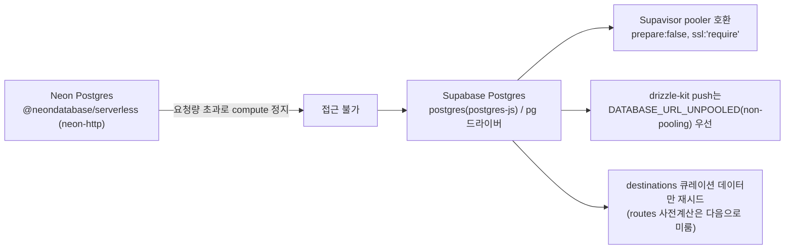

# 오늘 배운 것: DB가 막히면 "무중단"이 아니라 "무엇을 포기할지"부터 정해야 한다

## 들어가며 (Situation)

16일차부터 실제 데이터를 쌓기 시작한 Neon Postgres가, 실사용이 늘면서 요청량 초과로 completely 정지되는 사태를 맞았다. 데이터를 옮기고 말고 할 것도 없이 **DB 자체에 접속이 안 되는** 상황이었다. 주말(9/19~20)을 지나 월요일인 오늘, 가장 먼저 이 문제부터 해결해야 했다.

## 문제 상황 (Task)

🚨 Neon 계정이 요청량 초과로 compute 자체가 정지되어, 기존 데이터를 꺼낼 수조차 없는 상태였다. 보통의 DB 마이그레이션이라면 "기존 데이터를 새 DB로 옮기고 트래픽을 전환"하는 순서를 밟지만, 이번엔 **원본에 접근할 수 없으니 데이터 이전이라는 선택지 자체가 없었다.**

- 그리고 이전부터 잠재해 있던 버그도 함께 드러났다. DB 마이그레이션이나 탈퇴 등으로 세션 쿠키의 유저 id가 실제 `users` 테이블에 없어졌는데도, JWT 서명 자체는 유효해서 서버가 여전히 로그인 상태로 취급하고 있었다. 그 상태에서 글쓰기·좋아요처럼 그 id를 외래키(FK)로 쓰는 동작을 하면 제약 위반으로 500 에러가 났다.
- 배포 설정 파일(`vercel-deployments.json`)이 실수로 저장소에 커밋되어 있던 것도 뒤늦게 발견됐다.

## 해결 과정 (Action)

### A. Neon에서 Supabase로 — "스키마만 옮기고 데이터는 새로 쌓기"

💡 데이터를 꺼낼 수 없으니, 목표를 "무중단 이전"에서 "스키마 구조는 그대로 유지한 채 새 DB에서 다시 시작"으로 조정했다. 과거 데이터 소실은 감수하는 대신 서비스를 계속 이어갈 수 있는 쪽을 택한 것이다.

- 드라이버를 `@neondatabase/serverless`(neon-http)에서 `postgres`(postgres-js)/`pg`로 교체했다.
- Supabase의 커넥션 풀러(Supavisor)와 호환되도록 `prepare:false`, `ssl:'require'` 옵션을 적용했다.
- 스키마를 실제로 반영하는 `drizzle-kit push`는 풀링된 연결 대신 `DATABASE_URL_UNPOOLED`(non-pooling 연결)를 우선 쓰도록 했다 — 스키마 변경(DDL)은 풀러를 거치면 예기치 않게 실패하는 경우가 있어서다.
- 데이터 중에서 서비스 운영에 꼭 필요한 `destinations`(여행지 큐레이션) 데이터만 새로 시드했고, 경로 사전계산(routes) 데이터는 서비스 필수 요소가 아니라고 판단해 다음으로 미뤘다 — 전부를 한 번에 복구하려 하지 않고 우선순위를 나눈 것이다.

- **용어 카드 — 커넥션 풀링과 pooler**
  - 서버리스 환경은 요청마다 함수가 새로 실행될 수 있어서, DB 연결을 매번 새로 맺으면 연결 수가 금방 한계에 도달한다. Supavisor 같은 pooler는 여러 요청이 소수의 실제 DB 연결을 공유하도록 중개해준다.
  - 다만 pooler를 거치면 일부 세션 단위 기능(예: DDL, prepared statement)이 제한될 수 있어서, 스키마 변경처럼 민감한 작업은 pooler를 거치지 않는 연결(`UNPOOLED`)을 따로 쓴다.

### B. 탈퇴한 유저의 세션을 더 이상 신뢰하지 않도록

🔴 JWT 서명이 유효하다고 해서 그 유저가 실제로 존재한다는 보장은 아니었다.

🟢 `getSessionUser`가 매 요청마다 DB로 해당 유저가 실제로 존재하는지 확인하도록 바꿨다. 존재하지 않으면 쿠키를 지우고 401(미인증)로 처리한다.

| 이전 | 이후 |
|---|---|
| JWT 서명만 유효하면 로그인 상태로 취급 | 매 요청마다 DB에서 유저 존재 여부 확인 |
| 삭제된 유저 id로 글쓰기/좋아요 시도 → FK 제약 위반 500 에러 | 존재하지 않으면 쿠키 삭제 후 401 |

⚠️ 매 요청마다 DB를 확인하는 만큼 약간의 지연이 늘어나지만, 삭제된 계정으로 인한 500 에러(사용자 입장에서는 원인을 알 수 없는 오류)보다는 안전한 쪽을 택했다.

### C. 실수로 커밋된 배포 설정 제거, README를 실측 기반으로

- `vercel-deployments.json`이 저장소에 올라가 있던 것을 발견하고 제거한 뒤 `.gitignore`에 추가했다. 배포 관련 설정 파일이 저장소에 남아있으면 안 된다는 걸 실제 사례로 확인한 셈이다.
- README의 "협업 방식"·"데모" 섹션을 그동안 말로만 채워뒀던 부분에서 벗어나, `pinder`/`hello-planning` 두 저장소의 git log·diff와 GitHub Issues/PR API를 **직접 조회한 값**으로 다시 채웠다. 브랜치 전략·이슈·PR·역할 분담·충돌 사례를 실제 데이터 기반으로 서술했고, 데모 섹션도 Vercel 배포 링크와 `vercel env pull` 기반 로컬 실행 방법, 실제 기능 흐름 순서로 다시 썼다.

## 결과 (Result)

- Neon에서 완전히 막혔던 DB를 Supabase로 옮겨 서비스를 다시 운영할 수 있는 상태로 되돌렸다. 과거 데이터 전량은 소실됐지만, 스키마와 서비스 필수 데이터(destinations)는 유지했다.
- 탈퇴한 유저의 세션으로 인한 500 에러를 401로 정상 처리되도록 바꿔, 삭제된 계정과 관련된 예외 상황을 명확히 구분했다.
- 실수로 커밋된 배포 설정 파일을 제거하고 `.gitignore`로 재발을 막았다.
- README의 협업·데모 섹션을 "그럴듯하게 쓴 설명"에서 "실제 git/PR 데이터로 검증한 설명"으로 바꿨다.

## 더 학습하면 좋은 개념

- **커넥션 풀링(Connection Pooling)** — Supavisor 같은 pooler가 서버리스 환경에서 왜 필요한지, transaction 모드와 session 모드의 차이를 공식 문서로 더 확인해볼 필요가 있다.
- **DB 마이그레이션 전략** — 오늘처럼 원본 데이터에 접근할 수 없는 최악의 상황에서의 대응(스키마 우선 복구)과, 평소에 해야 할 백업·이중화 전략을 비교해서 정리해두면 좋다.
- **세션 검증의 신선도(Freshness) vs 비용** — 매 요청 DB 확인처럼 "확인 빈도를 높이면 안전해지지만 비용이 늘어나는" 트레이드오프를 다른 사례(캐시 무효화, 토큰 재검증)와 함께 비교해볼 만하다.
- **.gitignore와 민감 정보 관리** — 배포 설정 파일처럼 "코드는 아니지만 저장소에 남으면 안 되는 파일"을 프로젝트 초기에 어떻게 분류해둬야 하는지 체크리스트로 만들어볼 만하다.

## 참고 자료
- [Supabase 공식 문서 - Connection Pooling](https://supabase.com/docs/guides/database/connecting-to-postgres#connection-pooler)
- [Drizzle ORM 공식 문서 - PostgreSQL](https://orm.drizzle.team/docs/get-started-postgresql)
- [MDN - HTTP 응답 상태 코드 401](https://developer.mozilla.org/en-US/docs/Web/HTTP/Status/401)
- [GitHub 공식 문서 - REST API (Pull requests)](https://docs.github.com/en/rest/pulls/pulls)
