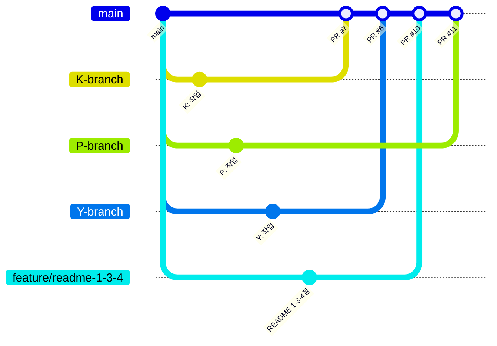

# 오늘 배운 것: 협업 방식은 문서를 먼저 쓴다고 정해지지 않는다

## 들어가며 (Situation)

19일차에 README의 협업 섹션을 "git log 실측 기반"으로 다시 썼다. 그런데 그 문서가 반영하지 못한 새로운 협업 패턴이 바로 다음 날인 오늘 생겼다 — 지금까지는 팀원들이 대체로 `origin/main`에 바로 커밋하는 방식이었는데, 오늘 처음으로 `K-branch`·`P-branch`·`Y-branch`·`feature/readme-1-3-4` 같은 브랜치에서 PR이 열리고 실제로 병합됐다. 문서가 실제 협업 방식을 따라가지 못한 셈이라, 문서를 다시 갱신하는 것부터 오늘 하루가 시작됐다.

## 문제 상황 (Task)

- 어제 실측 기반으로 다시 쓴 README가 오늘 새로 생긴 PR 기반 협업 패턴(브랜치 분기 → PR → 병합)을 반영하지 못한 상태가 됐다. 문서를 또 갱신해야 했다.
- 18일차에 만든 "지도 클릭으로 방문지 추가" 흐름에서, 후보 확인 팝업을 취소했을 때 지도 위에 남는 임시 마커가 지워지지 않는 문제가 여전히 남아 있었다.

## 해결 과정 (Action)

### A. PR 4건 병합 — pinder에서 처음 생긴 브랜치 기반 협업

| PR | 브랜치 | 내용 |
|---|---|---|
| #6 | Y-branch | 팀원 작업 반영 |
| #7 | K-branch | 팀원 작업 반영 |
| #9 | chore/format-fix | 포맷 정리 |
| #10 | feature/readme-1-3-4 | README 1·3·4절 보강 |
| #11 | P-branch | 팀원 작업 반영 |
| #12 | docs/readme-collab-images-table | 협업 스크린샷을 표 형식으로 축소 |
| #13 | docs/demo-order-update | 데모 시연 순서 갱신 |

💡 지금까지는 "누가 무엇을 했는지"를 커밋 메시지로만 추적했다면, 오늘부터는 PR 단위로 변경 범위를 묶어서 검토·병합하는 흐름이 처음 생겼다.

### B. README를 오늘의 협업 방식에 맞춰 다시 갱신

- 새로 생긴 PR 분기·병합 사례를 반영해 브랜치 전략 gitGraph와 PR 활용 수치를 README에 업데이트했다.
- README 5절의 이슈·PR 스크린샷이 나열식으로 너무 길어 표 형식으로 축소했다.
- 시연 순서를 실제 데모 스크립트 순서에 맞춰 다시 정리했다.
- 총 커밋 횟수 통계를 396+로 실측 갱신했다 — 어림값이 아니라 실제 git log 결과를 기준으로 삼는 습관을 계속 이어갔다.

- **개념 카드 — 살아있는 문서(Living Document)**
  - README나 협업 문서를 한 번 쓰고 끝내지 않고, 실제 작업 방식이 바뀔 때마다 같이 갱신하는 방식을 living document라고 부른다.
  - 19일차와 오늘처럼 문서를 실측 기반으로 쓰기 시작하면, 오히려 "문서가 현실을 못 따라간다"는 것이 더 빨리 드러난다 — 지어낸 문서였다면 애초에 이 격차 자체를 눈치채지 못했을 것이다.

### C. 지도 클릭 방문지 추가 흐름의 마지막 버그

🔴 18일차에 만든 지도 클릭 → 후보 팝업 흐름에서, 팝업을 취소해도 클릭했던 자리에 찍힌 임시 마커가 지도에 그대로 남는 문제가 있었다.

🟢 확인 팝업을 취소하는 경로에 임시 마커를 제거하는 처리를 추가해서 해결했다. 이와 함께 변수 추가(경로 조건 변경) 완료 시 경로가 자동으로 재계산되도록 하고, 전체보기에서 일차 간 드래그 이동도 허용해 플래너 조작감을 조금 더 다듬었다.

## 결과 (Result)

- pinder 저장소에서 처음으로 브랜치 기반 PR 협업(K/P/Y-branch, feature/readme-1-3-4 등 PR 4건 이상)이 실제로 이뤄졌고, 이를 README의 협업 섹션·gitGraph·통계에 반영했다.
- 총 커밋 횟수(396+)까지 실측으로 갱신해, README가 "설명"이 아니라 "증거"에 가까운 문서가 됐다.
- 18일차부터 이어져 온 지도 클릭 방문지 추가 흐름의 마지막 버그(취소 시 임시 마커 잔류)를 제거해, 검색으로 추가하든 지도 클릭으로 추가하든 부작용 없이 취소할 수 있게 됐다.

## 더 학습하면 좋은 개념

- **Git 브랜치 전략(Feature Branch Workflow)** — 오늘 처음 생긴 브랜치 기반 PR 협업이 왜 커밋을 바로 main에 올리는 방식보다 검토·롤백에 유리한지 공식 문서로 원리를 정리해볼 만하다.
- **Pull Request 리뷰 프로세스** — PR을 열고 병합하는 것 자체보다, 그 사이에 어떤 리뷰·CI 체크가 이뤄져야 하는지가 더 중요한 부분이라 GitHub 공식 문서로 더 깊이 볼 필요가 있다.
- **문서와 코드의 동기화** — README를 실측 기반으로 유지하는 습관이 이번 주 내내 반복됐다(13일차 요구사항 문서, 19·20일차 협업 문서). 이 패턴을 하나의 원칙으로 이름 붙여 정리해두면 다음 프로젝트에도 그대로 적용할 수 있다.
- **UI의 잔여 상태 정리(Cleanup on Cancel)** — 지도 임시 마커처럼, 취소 동작이 눈에 보이는 부작용(잔여 UI)을 남기지 않는지 확인하는 습관을 다른 화면에도 체크리스트로 적용해볼 만하다.

## 참고 자료
- [GitHub 공식 문서 - About pull requests](https://docs.github.com/en/pull-requests/collaborating-with-pull-requests/proposing-changes-to-your-work-with-pull-requests/about-pull-requests)
- [Git 공식 문서 - Branching](https://git-scm.com/book/en/v2/Git-Branching-Branches-in-a-Nutshell)
- [Mermaid 공식 문서 - gitGraph](https://mermaid.js.org/syntax/gitgraph.html)
