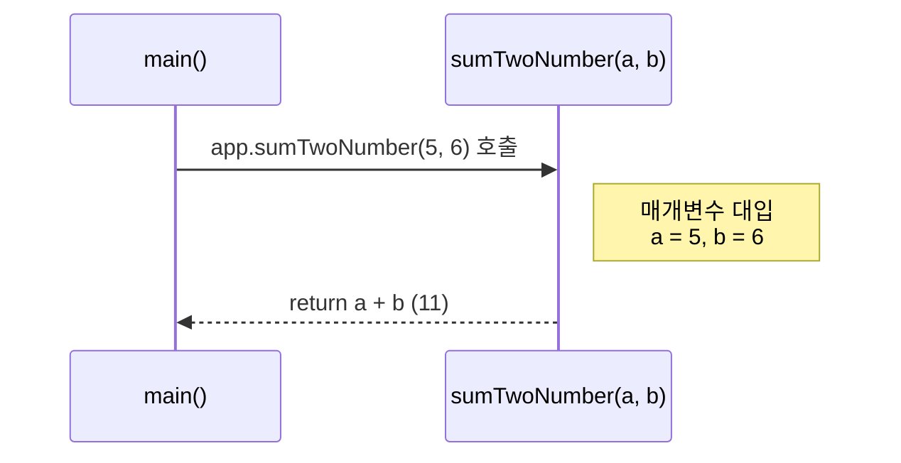
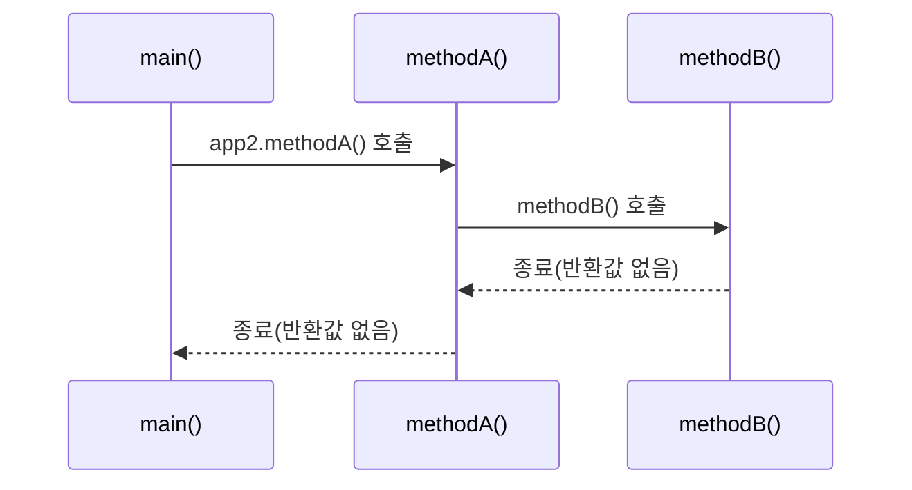
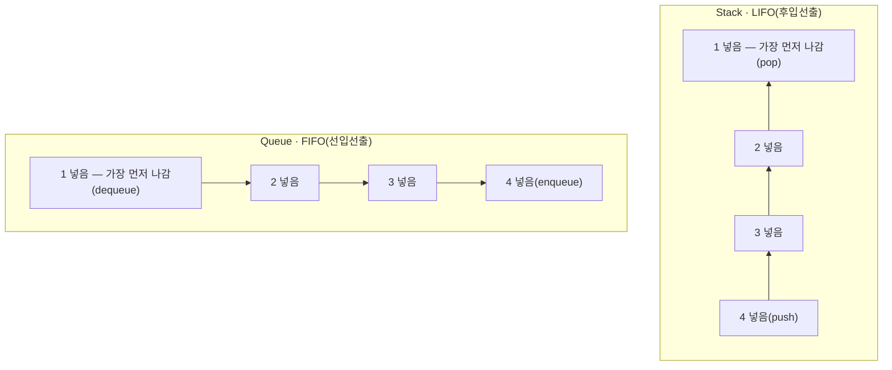

# 오늘 배운 것: 메서드로 중복 줄이고 배열로 값 묶어 관리하기

## 들어가며 (Situation)

모듈 2 2일차. 어제는 JDK 설치부터 리터럴·변수·연산자 등 자바의 가장 기초적인 문법을 익혔고, 오늘은 `chap02-control-flow-and-method` 프로젝트로 넘어와 실행 흐름을 제어하는 조건문·반복문과, 코드를 재사용 가능한 단위로 나누는 메서드를 실습했다. 이어서 자료 학습으로 여러 값을 하나의 이름으로 묶어 관리하는 배열의 기초까지 훑었다.

패키지는 `a_controlflow`(조건문), `b_loop`(반복문), `c_method`(메서드) 세 개로 나뉘어 있었고, 각 패키지마다 2~4개의 `Application` 클래스를 직접 작성하며 실행 결과를 눈으로 확인하는 방식으로 진행했다.

## 문제 상황 (Task)

오늘 확인해야 했던 것은 네 가지였다.

- `if-else if`와 `switch`가 같은 다중 분기 문제를 어떻게 다르게 해결하는가
- `for`, `while`, `do-while`은 왜 세 종류나 존재하는가 — 서로 어떤 상황에 유리한가
- 메서드가 없을 때 생기는 문제(코드 중복)를 메서드가 어떻게 해결하는가
- 변수를 하나씩 따로 선언하는 대신 배열을 쓰면 무엇이 달라지는가

특히 `&&`, `||` 조건 순서가 실행 속도에 영향을 준다는 내용과, 반복문을 직접 작성하다 의도와 다르게 동작한 경험이 있어서 그 과정을 기록해둔다.

## 해결 과정 (Action)

### 1. if-else if로 다중 분기 처리하기

점수에 따라 등급을 나누는 코드부터 시작했다.

```java
int score = 80;

if (score >= 90) {
    System.out.println("A 등급입니다!");
} else if (score >= 80) {
    System.out.println("B 등급입니다!");
} else if (score >= 70) {
    System.out.println("C 등급입니다!");
} else {
    System.out.println("재수강 확정");
}
```



💡 `else if`는 위에서부터 순서대로 조건을 검사하다가 **처음 참이 되는 조건에서 멈춘다.** 그래서 `score >= 90`을 통과 못 한 값만 `score >= 80` 검사로 넘어가는 식으로, 이미 앞에서 걸러진 범위는 다시 검사할 필요가 없다.

나이에 따라 할인율을 계산하는 예제로 한 번 더 연습했다.

```java
Scanner sc = new Scanner(System.in);
System.out.print("나이를 입력해주세요 : ");
int age = sc.nextInt();

double discountRate;

if (age < 13) {
    discountRate = 0.5;       // 청소년 50%
} else if (age >= 65) {
    discountRate = 0.3;       // 노약자 30%
} else {
    discountRate = 0.0;
}

System.out.println("나이 : " + age + ", 할인율 :" + (discountRate * 100) + "%");
```



### 2. switch 문으로 값 비교하기

월(month) 값에 따라 분기하는 코드로 `switch`의 구조를 익혔다.

```java
int month = 1;

switch (month) {
    case 1:
        System.out.println("1월");
        break;
    case 2:
        System.out.println("2월");
        break;
    case 3:
        System.out.println("3월");
        break;
    default:
        System.out.println("그 외!");
        break;
}
```



🔴 `break`를 빼먹으면 일치한 `case` 이후의 모든 코드가 순서대로 실행되어버린다(fall-through). `switch`는 "정확히 일치하는 값"만 비교할 수 있고 대소 비교는 불가능하다는 점에서 `if-else if`와 역할이 갈린다.

| 상황 | if-else if | switch |
|------|-----------|--------|
| 범위 비교(`>=`, `<`) | 가능 | 불가능 |
| 정확한 값 일치 비교 | 가능 | 가능 |
| 비교 대상 타입 | 모든 boolean 조건식 | 정수·문자·문자열(JDK 7+) |
| 분기 종료 | 자동(블록 단위) | `break` 명시 필요 |

### 3. 단축평가로 조건 순서 최적화하기

가장 흥미로웠던 부분이다. `&&`는 좌항이 `false`이면 우항을 아예 실행하지 않고, `||`는 좌항이 `true`이면 우항을 실행하지 않는다. 이 특성을 **단축평가(short-circuit evaluation)**라고 부른다.

```java
int age = 25;
String discount;

// 비효율적: 드문 조건(19세 이하)을 먼저 검사
if (age <= 19) {
    discount = "학생 할인 가능";
} else {
    discount = "할인 불가";
}

// 효율적: 자주 발생하는 조건(19세 초과)을 먼저 검사
if (age > 19) {
    discount = "학생 할인 가능";
} else {
    discount = "할인 불가";
}
```



💡 회원가입 검증처럼 "아이디 중복 확인(1분)"과 "비밀번호 길이 확인(0.5초)"을 `&&`로 묶어야 한다면, **실패 확률이 높고 비용이 싼 조건을 좌항에** 두는 게 유리하다. 어차피 하나만 실패해도 전체가 실패이므로, 비싼 검사를 굳이 먼저 돌릴 이유가 없다.

⚠️ 코드에서는 `System.nanoTime()`으로 두 방식의 시간 차이를 직접 재보려 했는데, 단발성 측정값은 JIT 컴파일 워밍업이나 분기 예측 여부에 따라 흔들려서 신뢰하기 어려웠다. 실제 성능 차이를 확인하려면 같은 조건을 충분히 많이 반복해서 평균을 내야 한다는 것도 함께 알게 됐다.

### 4. for·while·do-while로 반복하기

| 상황 | for | while |
|------|-----|-------|
| 반복 횟수를 미리 알 때 | 유리 | - |
| 조건에 따라 불확실하게 반복할 때 | - | 유리 |
| 초기식·조건식·증감식을 한눈에 보고 싶을 때 | 유리 | - |

`for`로 벤치프레스 횟수를 세되, 짝수 번째는 침묵하도록 만들었다.

```java
for (int i = 1; i <= 5; i++) {
    if (i % 2 == 0) {
        System.out.println("침묵함...");
    } else {
        System.out.println("성원님 " + i + "번 했습니다~");
    }
}
```



`while`은 조건식만으로 반복 여부를 결정한다.

```java
int count = 0;

while (count <= 5) {
    System.out.println("카운트 : " + count);
    count++;
}
```



🔴 `do-while`을 연습하다가 의도와 다르게 동작하는 코드를 만들었다.

```java
static void main(String[] args) {

    int num = 0;

    do {
        System.out.println("0~2까지 반복 출력 : " + num);
        num++;
    } while (num > 3);
}
```



의도는 `num`이 0, 1, 2일 때 세 번 출력하는 것이었는데, 실제로는 **딱 한 번만 출력되고 끝났다.** 원인은 두 가지였다.

- `do-while`은 "일단 한 번 실행하고 나서" 조건을 검사하는데, 조건을 `num > 3`으로 적어서 `num`이 1이 되는 즉시 거짓이 되어버렸다. 3번 반복하려면 `num < 3`이어야 했다.
- 접근 제어자를 빼먹고 `static void main`이라고 적었다. `main()`은 JVM이 프로그램의 시작점으로 인식하려면 반드시 `public static void main(String[] args)` 형태여야 한다.

🟢 do-while은 "최소 1회는 실행을 보장해야 하는 로직"에 쓴다는 것을 이 실수 덕분에 더 분명히 이해했다 — 조건을 반대로 적어도 "일단 한 번은" 찍히기 때문에, 겉으로는 동작하는 것처럼 보여서 실수를 알아채기 더 어려웠다.

### 5. 메서드로 중복 로직 줄이기

메서드 없이 두 수를 더하는 코드를 반복해서 짜보고, 그 다음 메서드로 옮겨 비교했다.

```java
// 메서드가 없을 때 : 더하고 싶을 때마다 변수 선언 + 연산 + 출력이 반복된다
int num1 = 1;
int num2 = 2;
System.out.println("1번째 연산 결과 : " + (num1 + num2));

int num3 = 3;
int num4 = 4;
System.out.println("2번째 연산 결과 : " + (num3 + num4));
```

```java
public class Application01 {
    public static void main(String[] args) {
        Application01 app = new Application01();

        System.out.println("연산 : " + app.sumTwoNumber(5, 6));
        System.out.println("연산 : " + app.sumTwoNumber(7, 8));
        System.out.println("연산 : " + app.sumTwoNumber(9, 10));
    }

    public int sumTwoNumber(int a, int b) {
        return a + b;
    }
}
```



- **메서드 (Method)**
  - 특정 작업을 수행하는 코드 블록. `[접근제어자] [반환타입] 메서드명(매개변수) { ... return 반환값; }` 형태로 선언한다.
  - 코드의 재사용성과 가독성을 높이고, 같은 로직을 여러 곳에서 값만 바꿔 호출할 수 있게 해준다.

`app.sumTwoNumber(5, 6)`을 호출하면 `main()` 영역을 벗어나 메서드 내부로 실행 흐름이 옮겨갔다가, `return` 값을 들고 다시 호출한 자리로 돌아온다.



메서드가 메서드를 부르는 흐름도 확인했다.

```java
public class Application02 {
    public static void main(String[] args) {
        System.out.println("main() 시작됨!");

        Application02 app2 = new Application02();
        app2.methodA();

        System.out.println("main() 종료됨!");
    }

    public void methodA() {
        System.out.println("methodA() 호출됨!");
        methodB();
        System.out.println("methodA() 종료됨!");
    }

    public void methodB() {
        System.out.println("methodB() 호출됨!");
    }
}
```





⚠️ `methodB()`는 `methodA()` 안에서 호출하기 전까지는 아무리 클래스 안에 정의되어 있어도 실행되지 않았다. "선언되어 있다"와 "호출된다"는 완전히 다른 이야기라는 걸 눈으로 확인한 부분이다.

메서드를 부르고 돌아오는 흐름은 결국 실행 중이던 지점을 잠시 밀어두고, 새 작업이 끝나면 다시 꺼내 이어서 진행하는 구조다. 수업 중 함께 정리한 스택(Stack)·큐(Queue) 개념도 이 흐름과 이어져 있어서 같이 남겨둔다.



- **스택(Stack)**
  - 나중에 넣은 값이 먼저 나가는 후입선출(LIFO) 구조. 메서드 호출이 쌓였다가 안쪽부터 순서대로 반환되는 것과 같은 원리다.
- **큐(Queue)**
  - 먼저 넣은 값이 먼저 나가는 선입선출(FIFO) 구조. 순서를 지켜 처리해야 하는 대기열에 쓰인다.

### 6. 배열로 여러 값 한 번에 관리하기

메서드 실습 뒤에는 학습 자료로 배열을 훑었다. 아래 예제 코드는 강의 자료의 예시를 참고한 것이며 직접 실행해본 코드는 아니다.

5명의 점수를 각각 다른 변수에 담으면 학생이 늘어날 때마다 변수와 반복 없는 덧셈 코드가 계속 늘어난다. 배열은 이 문제를 "같은 이름 + 인덱스"로 해결한다.

```java
// 배열이 없다면 학생 수만큼 변수가 늘어난다
int score1 = 80;
int score2 = 90;
int score3 = 75;

// 배열로 묶으면 반복문으로 접근할 수 있다
int[] scores = new int[5];

for (int i = 0; i < scores.length; i++) {
    scores[i] = sc.nextInt();
}

double sum = 0;
for (int i = 0; i < scores.length; i++) {
    sum += scores[i];
}

double avg = sum / scores.length;
```

- **1차원 배열**
  - `자료형[] 변수명 = new 자료형[길이];` 형태로 선언하며, 길이는 한 번 정하면 바꿀 수 없다.
  - 인덱스는 0부터 시작하고, 마지막 인덱스는 항상 `길이 - 1`이다. `length`는 메서드가 아니라 필드라서 괄호 없이 `배열.length`로 쓴다.

2차원 배열은 "배열의 배열"이다. 표(행·열) 형태의 데이터를 다룰 때 등장했다.

```java
int[][] iarr = {
    {1, 2, 3, 4, 5},
    {6, 7, 8, 9, 10},
    {11, 12, 13, 14, 15}
};

for (int i = 0; i < iarr.length; i++) {
    for (int j = 0; j < iarr[i].length; j++) {
        System.out.print(iarr[i][j] + " ");
    }
    System.out.println();
}
```

💡 바깥 배열의 각 인덱스가 또 하나의 1차원 배열 주소를 담고 있어서, `iarr[i].length`처럼 행마다 길이를 따로 물어볼 수 있다. 그래서 각 행의 길이가 달라도 되는 가변 배열도 만들 수 있다.

⚠️ 배열을 다른 변수에 대입하는 것(`int[] copy = original;`)은 값이 아니라 **주소만 복사(얕은 복사)**하는 것이라, `copy`의 값을 바꾸면 `original`도 함께 바뀐다. 진짜 별개의 배열이 필요하면 `clone()`이나 `Arrays.copyOf()`처럼 힙에 새 공간을 만들어 값을 옮기는 깊은 복사를 써야 한다는 것만 우선 개념으로 짚었다.

## 결과 (Result)

오늘 하루 만에 `a_controlflow`(4개), `b_loop`(3개), `c_method`(2개) 총 9개의 예제 클래스를 직접 작성하며 자바의 3대 제어 구조(조건·반복·메서드 호출)를 실습하고, 배열의 선언·순회·얕은 복사 개념까지 훑었다.

- 조건 순서가 실행 결과가 아니라 **실행 비용**에 영향을 줄 수 있다는 걸 코드로 확인했다(단축평가).
- `do-while` 조건을 반대로 적는 실수를 직접 겪고 나서야 "최초 1회 보장"이라는 특징이 왜 중요한지 체감했다.
- 메서드로 분리하면 같은 연산 로직(`sumTwoNumber`)을 값만 바꿔 3번 호출할 수 있어, 메서드 없이 짠 코드보다 중복되는 줄 수가 확연히 줄었다.
- 배열 대입이 값 복사가 아니라 주소 복사라는 걸 알고 나니, 왜 "복사했는데 원본도 같이 바뀌었다"는 실수가 생기는지 이해가 됐다.

## 더 학습하면 좋은 개념

- **깊은 복사 4가지 방법과 정렬 알고리즘** — `clone()`, `System.arraycopy()`, `Arrays.copyOf()`의 차이와, 오늘 개념만 짚은 배열을 실제로 줄 세우는 선택·버블·삽입 정렬을 다음에 코드로 실습할 예정이다.
- **콜 스택(Call Stack)과 재귀(Recursion)** — `methodA()`가 `methodB()`를 부르고 돌아오는 흐름을 이해했다면, 메서드가 자기 자신을 부르는 재귀와 콜 스택 동작을 이어서 보면 좋다.
- **switch 표현식(Switch Expressions)** — JDK 14부터는 `break` 없이 값을 바로 반환하는 새 switch 문법이 생겼다. fall-through 실수를 구조적으로 막아준다.
- **메서드 오버로딩(Overloading)** — 같은 이름의 메서드를 매개변수만 다르게 여러 개 정의하는 방법으로, 오늘 만든 `sumTwoNumber`를 다른 타입에도 대응시키는 다음 단계다.

## 참고 자료
- [Oracle Java Tutorials - The if-then and if-then-else Statements](https://docs.oracle.com/javase/tutorial/java/nutsandbolts/if.html)
- [Oracle Java Tutorials - The switch Statement](https://docs.oracle.com/javase/tutorial/java/nutsandbolts/switch.html)
- [Oracle Java Tutorials - The for Statement](https://docs.oracle.com/javase/tutorial/java/nutsandbolts/for.html)
- [Oracle Java Tutorials - The while and do-while Statements](https://docs.oracle.com/javase/tutorial/java/nutsandbolts/while.html)
- [Oracle Java Tutorials - Arrays](https://docs.oracle.com/javase/tutorial/java/nutsandbolts/arrays.html)
- [Oracle Java Language Specification - Conditional-And/Or Operators](https://docs.oracle.com/javase/specs/jls/se21/html/jls-15.html#jls-15.23)
- [JEP 361: Switch Expressions](https://openjdk.org/jeps/361)
