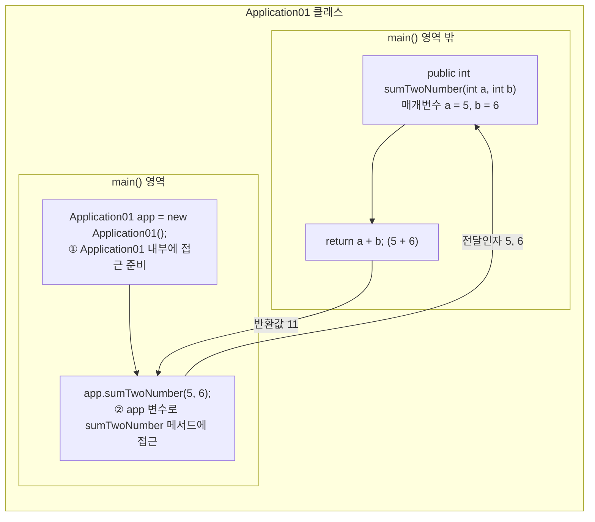
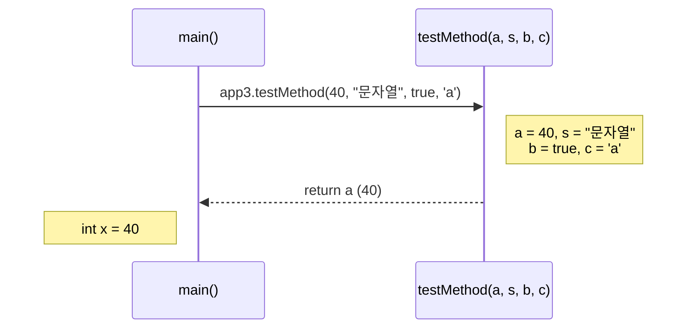
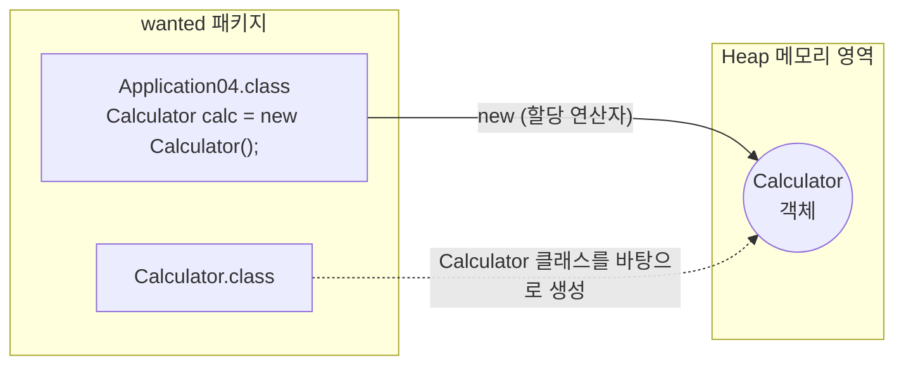
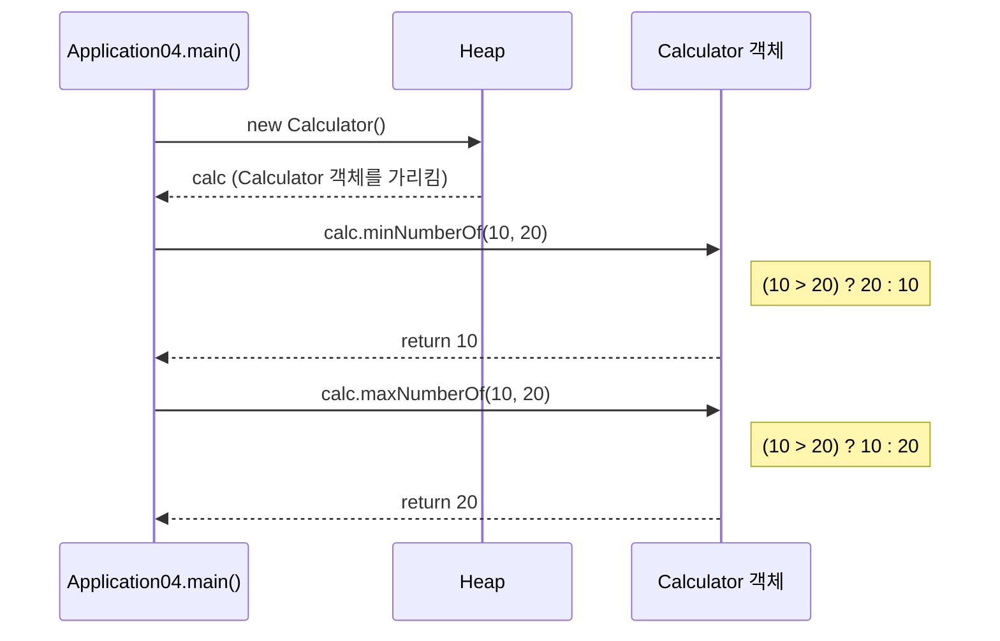

# 오늘 배운 것: 매개변수·전달인자로 값 주고받고 new로 다른 클래스 메서드 호출하기

## 들어가며 (Situation)

모듈 2 3일차. 어제는 `c_method` 패키지에서 `sumTwoNumber(int a, int b)`처럼 같은 클래스 안의 메서드를 만들고 부르는 데까지 갔다. 오늘은 같은 패키지에서 `Application03`, `Application04`, `Calculator` 세 클래스를 이어서 작성했다.

오늘 실습은 어제의 메서드를 두 방향으로 넓히는 작업이었다.

- `Application03` — 여러 타입의 값을 한꺼번에 넘기고(전달인자), 받고(매개변수), 결과를 돌려받는(반환 타입) 흐름 전체
- `Application04` + `Calculator` — 호출하는 쪽과 메서드가 있는 쪽이 **서로 다른 클래스**일 때 호출하는 방법

수업은 오전에 1·2일차 내용을 한 장으로 복습하면서 시작했고, 그 내용을 표로 다시 정리하면 아래와 같다.

| 구분 | 1일차 | 2일차 |
|------|-------|-------|
| 주제 | 리터럴, 변수, 연산자 | 조건문, 반복문, 메서드 |
| 핵심 개념 | 리터럴은 **값**, 변수는 값을 담는 **공간**이다. `int x = 4;`는 자료형 `int`, 변수명 `x`, 대입연산자 `=`, 리터럴 `4`로 이루어진다. | 조건문은 프로그램의 **분기**를 지정하고, 반복문은 패턴이 있는 반복 코드를 **반복문으로 치환**한다. |
| 세부 | 문자열 `String`, 문자 `char`, 정수 `byte` `short` `int` `long`, 실수 `float` `double`, 논리 `boolean` | 조건문 `if-else`, `switch-case` / 반복문 `for`, `while`, `do-while` (초기식·증감식·조건식) |



## 문제 상황 (Task)

오늘 풀어야 했던 질문은 세 가지였다.

- 메서드를 부를 때 넘기는 값과, 메서드가 받는 변수는 같은 말인가 다른 말인가
- 반환 타입 자리에 `void` 대신 `int`를 적으면 메서드가 무엇을 해야 하는가
- 같은 클래스가 아니라 `Calculator`라는 다른 클래스에 있는 메서드는 어떻게 부르는가

오늘의 핵심 키워드로 수업에서 정리한 목록은 아래와 같다.

1. 매개변수
2. 전달인자
3. 메서드의 호출
4. 메서드의 반환 타입
5. 다른 영역에 있는 메서드를 호출하려면 Heap 메모리에 할당해야 하고, 할당할 때는 `new`라는 할당 연산자를 사용한다.

## 해결 과정 (Action)

### 1. 전달인자와 매개변수 구분하기

어제 수업 필기에서 이미 두 단어가 나왔다. 호출하는 쪽 `sumTwoNumber(5, 6)`의 `5, 6`이 전달인자, 메서드 선언부 `sumTwoNumber(int a, int b)`의 `int a, int b`가 매개변수다. `main()` 영역 안과 밖으로 나누어 그리면 값이 오가는 길이 보인다.



| 구분 | 전달인자 (Argument) | 매개변수 (Parameter) |
|------|--------------------|---------------------|
| 위치 | 메서드를 **호출하는 곳** | 메서드를 **선언하는 곳** |
| 정체 | 실제로 넘기는 값 | 그 값을 받아 담는 변수 |
| 타입 표기 | 쓰지 않는다 (`40`, `"문자열"`) | 반드시 쓴다 (`int a`, `String s`) |
| 예시 | `testMethod(40, "문자열", true, 'a')` | `testMethod(int a, String s, boolean b, char c)` |

`Application03`에서는 타입이 다른 값 4개를 한 번에 넘겨서 이 관계를 확인했다.

```java
public class Application03 {
    public static void main(String[] args) {

        Application03 app3 = new Application03();
        int x = app3.testMethod(40, "문자열", true, 'a'); // 40이 된다.

        System.out.println("당신의 나이는 " + x + "세 입니다.");
    }

    // 1. void -> int 반환타입을 지정하는 자리
    public int testMethod(int a, String s, boolean b, char c) {
        return a;
    }
}
```

💡 전달인자는 **왼쪽부터 순서대로** 매개변수에 대입된다. `40 → int a`, `"문자열" → String s`, `true → boolean b`, `'a' → char c`. 그래서 개수와 순서, 타입이 선언부와 맞아야 호출할 수 있다.

이 코드에서는 실제로 `a`만 `return`하고 `s`, `b`, `c`는 쓰지 않는다. 값을 넘기는 형태를 보여주는 예제라서 그런 것이고, 결과는 `당신의 나이는 40세 입니다.`가 출력된다.

### 2. 메서드의 형태와 반환 타입

수업 자료의 주석에 정리된 메서드의 기본 형태는 다음과 같다.

```java
[접근제어자] [반환타입] 메소드명([매개변수 타입 매개변수 명]) {
    실행할 코드
    [return 반환값;] // 반환타입이 void가 아니라면 return 은 생략될 수 없다.
}
```

🔴 반환 타입이 `void`가 아니면 `return`을 생략할 수 없다. `testMethod`가 `int`를 돌려주기로 선언했으니 `return a;`처럼 `int` 값을 반드시 돌려줘야 하고, 호출한 쪽은 그 값을 `int x`로 받는다.



접근제어자는 메서드를 어디서 부를 수 있는지 정한다. 수업 주석에는 네 가지가 있었다.

| 접근제어자 | 접근 가능한 범위 |
|-----------|-----------------|
| `public` | 모든 클래스 |
| `protected` | 같은 패키지, 자식 클래스 |
| (생략, default) | 같은 패키지 |
| `private` | 같은 클래스 내부 |

⚠️ 주석에는 default가 "작성하지 않을 때"로만 적혀 있어서 범위를 공식 문서로 다시 확인했다. Oracle 튜토리얼 표에서 접근제어자를 생략하면 같은 패키지 안에서만 접근할 수 있다. 아직 `protected`는 자식 클래스를 배우지 않아서 표만 옮겨 적었다.

### 3. 다른 클래스의 메서드 호출하기: new와 Heap

`Application04`는 `Calculator`라는 다른 클래스의 메서드를 부른다. 메서드 몸체는 삼항연산자 한 줄이다.

```java
public class Calculator {

    public int minNumberOf(int a, int b){
        // 삼항연산자
        return (a > b) ? b : a;
    }

    public int maxNumberOf(int a, int b){
        // 삼항연산자
        return (a > b) ? a : b;
    }
}
```

`Calculator`를 만들 때 주석으로 생각 순서를 적어두고 시작했다. 전달받을 정수를 담을 매개변수 2개가 필요하고, 두 값을 비교해야 하고, 결과가 정수니까 반환 타입은 `int`다. 이 순서로 정하고 나니 선언부가 자연스럽게 나왔다.

`if-else`로 쓰면 4줄이 되는 비교를 삼항연산자로 한 줄에 `return`하는 것이 이 메서드의 포인트다.

호출하는 쪽은 아래와 같다.

```java
public class Application04 {

    public static void main(String[] args) {

        int first = 10;
        int second = 20;

        // 1. 호출 준비
        Calculator calc = new Calculator();
        // 2. 최솟값 메서드 호출
        int min = calc.minNumberOf(first, second);

        System.out.println(first + ", " + second + " 중 최솟값은 : " + min + "입니다.");

        // 3. 최댓값 메서드 호출
        int max = calc.maxNumberOf(first, second);
        System.out.println(first + ", " + second + " 중 최댓값은 : " + max + "입니다.");
    }
}
```

- **호출 준비 (`Calculator calc = new Calculator();`)**
  - 다른 영역에 있는 메서드를 부르려면 먼저 그 클래스로 객체를 만들어 변수에 담아야 한다.
  - 이 한 줄이 어제 `Application01 app = new Application01();`으로 쓰던 것과 같은 패턴이다. 어제는 같은 클래스라 이유를 깊게 따지지 않았고, 오늘 다른 클래스로 바꾸며 그 이유가 보였다.
- **할당 연산자 `new`**
  - 수업 필기에서는 `new`를 "할당 연산자"라고 부르고, Heap 메모리 영역에 `Calculator`를 만들어 올리는 역할로 설명했다.
  - `wanted` 패키지 아래 `Application.class`, `Calculator.class`가 있고, `new`가 실행되면 Heap에 `Calculator`가 생기는 그림이다.



💡 필기 한쪽에는 "대문자로 시작하는 것들 ex) 클래스"도 적혀 있다. `Calculator`, `Application04`, `String`은 모두 대문자로 시작하고, 이건 문법이 아니라 자바의 이름 짓는 관례다. 클래스 이름과 변수·메서드 이름(`calc`, `minNumberOf`)을 눈으로 구분하는 데 도움이 된다.

호출 흐름을 그림으로 그리면 이렇다.



🟢 실행하면 `10, 20 중 최솟값은 : 10입니다.`, `10, 20 중 최댓값은 : 20입니다.`가 차례로 출력된다. 호출 두 번이 서로 다른 메서드로 갈라지고, 각각 돌려받은 `int`를 `min`, `max` 변수에 담는다.

## 결과 (Result)

오늘은 클래스 3개(`Application03`, `Application04`, `Calculator`)를 작성했고 메서드 3개(`testMethod`, `minNumberOf`, `maxNumberOf`)를 호출해서 결과를 확인했다. 오늘 실습 중에 코드가 막히거나 의도와 다르게 동작한 경우는 없었다.

- 전달인자는 호출하는 곳의 값, 매개변수는 선언하는 곳의 변수라는 구분이 코드에서 보였다.
- 반환 타입이 `int`이면 `return`으로 `int`를 돌려줘야 하고, 호출한 쪽은 변수로 받는다는 흐름을 `x`, `min`, `max` 세 곳에서 확인했다.
- 다른 클래스의 메서드는 `new`로 객체를 먼저 만들어야 부를 수 있다는 것을 `Application04`에서 확인했다. 어제 같은 클래스 안에서는 무심코 쓰던 `new`의 이유를 이제 설명할 수 있다.
- 두 값 비교는 삼항연산자로 한 줄에 쓸 수 있다.

## 더 학습하면 좋은 개념

- **static 메서드와 인스턴스 메서드** — `main`은 `static`인데 `testMethod`는 아니어서 `new`로 만든 객체로 불렀다. 왜 `static`이면 `new` 없이 부를 수 있는지 알면 오늘 `new`를 쓴 이유가 더 분명해진다.
- **메서드 오버로딩(Overloading)** — 같은 이름에 매개변수만 다른 메서드를 여러 개 만드는 방법이다. `minNumberOf`를 `double`에도 쓰고 싶을 때 바로 필요해진다.
- **접근제어자와 캡슐화** — 오늘 표로만 옮긴 `private`, `protected`가 실제로 언제 쓰이는지 알아야 어떤 메서드를 `public`으로 열지 판단할 수 있다.
- **Stack과 Heap 메모리** — 오늘 그린 Heap 영역 다이어그램을 기준으로, 지역 변수는 어디에 있고 객체는 어디에 있는지 나눠 보면 `calc` 변수와 `Calculator` 객체의 관계가 정확해진다.

## 참고 자료
- [Oracle Java Tutorials - Defining Methods](https://docs.oracle.com/javase/tutorial/java/javaOO/methods.html)
- [Oracle Java Tutorials - Passing Information to a Method or a Constructor](https://docs.oracle.com/javase/tutorial/java/javaOO/arguments.html)
- [Oracle Java Tutorials - Creating Objects](https://docs.oracle.com/javase/tutorial/java/javaOO/objectcreation.html)
- [Oracle Java Tutorials - Controlling Access to Members of a Class](https://docs.oracle.com/javase/tutorial/java/javaOO/accesscontrol.html)
- [Oracle Java Tutorials - Understanding Class Members](https://docs.oracle.com/javase/tutorial/java/javaOO/classvars.html)
- [Oracle Java Tutorials - Equality, Relational, and Conditional Operators](https://docs.oracle.com/javase/tutorial/java/nutsandbolts/op2.html)
