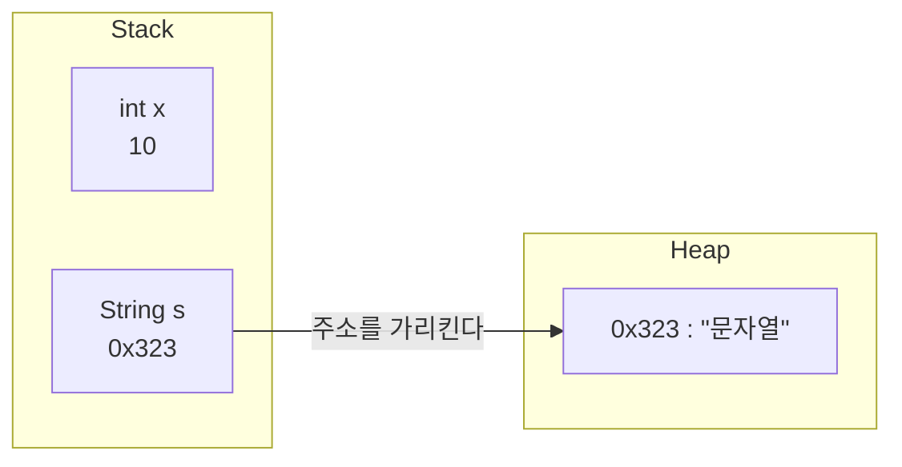
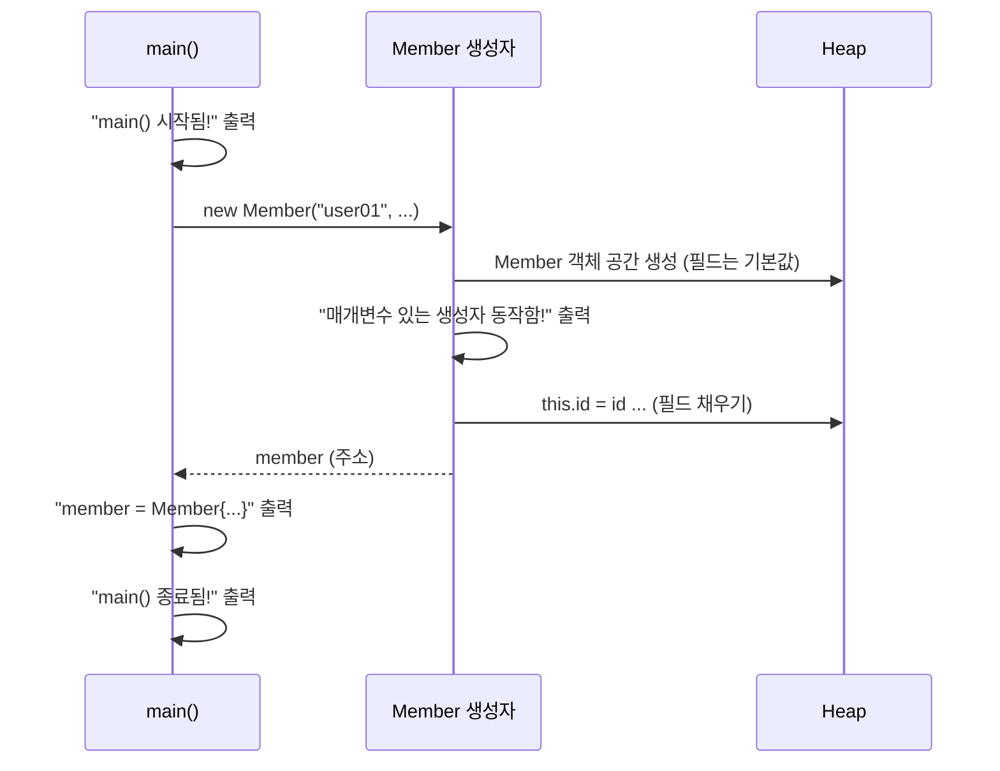
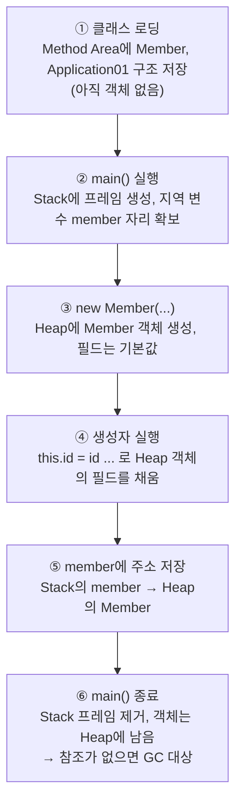

# 오늘 배운 것: String·배열·클래스·생성자로 객체와 Heap 이해하기

## 들어가며 (Situation)

모듈 2 4일차. 어제까지는 메서드를 만들고 `new`로 다른 클래스의 메서드를 부르는 데까지 갔다. 이날은 `chap03-object-oriented-programming` 프로젝트를 시작해서 `com.wanted.oop` 아래 두 패키지를 실습했다.

- `a_object` — 이미 있는 참조 자료형 `String`(`a_string`)과 배열(`b_array`)
- `b_oop` — 내가 직접 자료형을 만드는 클래스(`a_uesr_type`)와 생성자(`b_constructor`)

패키지 이름은 실습 프로젝트에 적힌 그대로 옮겼다(`a_uesr_type`의 오타 포함).



흐름은 "기본 자료형만으로는 부족하다 → 참조 자료형을 쓴다 → 아예 내가 자료형을 만든다" 순서였다. 이 글은 그 순서대로 따라가고, 노션에 있는 심화 자료는 이날 실습 범위까지만 뽑아 뒤쪽에 따로 정리한다.

## 문제 상황 (Task)

실습 코드의 주석에서 던진 질문은 네 가지였다.

- `String`은 `"java"`로도, `new String("java")`로도 만드는데 둘은 같은가
- 변수는 값 하나만 담는데 값이 5개, 10개이면 변수를 그만큼 만들어야 하는가
- 값을 넣은 적도 없는 `int[5]`의 `0`번 칸은 왜 `0`이 출력되는가
- 아이디·이름·나이·취미처럼 **자료형이 서로 다른 값**을 한 사람 단위로 묶으려면 어떻게 하는가

## 해결 과정 (Action)

### 1. String: 리터럴과 new는 같은 문자열이 아니다

`a_string/Application01`은 `length()`, `charAt(index)`, `trim()`을 써 보는 실습이었다. 인덱스가 0부터 시작하니 반복문 조건은 `i < str1.length()`다.

```java
String str1 = "apple";
for (int i = 0; i < str1.length(); i++) {
    System.out.println(str1.charAt(i));   // a p p l e 한 글자씩
}

String trimStr = "   java   ";
System.out.println("공백 제거 후 : #" + trimStr.trim() + "#");   // #java#
```

실습 주석에는 공부법도 적혀 있었다. 메서드를 다 외우고 쓰는 게 아니라, 써 보고 출력해 보고 이해하는 순서다.

`Application02`가 이날 가장 중요한 실험이었다. 문자열을 만드는 두 방식을 비교한다.

```java
String str1 = "java";               // 리터럴
String str2 = new String("java");   // 객체 생성
String str3 = "java";
String str4 = new String("java");

System.out.println(str1 == str2);       // false
System.out.println(str1 == str3);       // true
System.out.println(str2 == str4);       // false
System.out.println(str1.equals(str2));  // true
```

| 비교 | 결과 | 이유 |
|------|------|------|
| `str1 == str3` | `true` | 둘 다 리터럴이라 같은 문자열을 가리킨다 |
| `str1 == str2` | `false` | `new`가 새 공간을 만들어서 주소가 다르다 |
| `str2 == str4` | `false` | `new`를 만날 때마다 새 공간이 생긴다 |
| `str1.equals(str2)` | `true` | 주소가 아니라 문자열 내용을 비교한다 |

💡 참조 자료형 변수는 값이 아니라 **Heap에 있는 값의 주소**를 가진다. `==`는 그 주소를 비교하고, `equals()`는 내용을 비교한다. 생성 방식과 상관없이 같은 문자열인지 보려면 `equals()`를 쓴다.

수업 필기 그림(`참조자료형.png`)도 같은 내용이었다. `int x = 10;`은 Stack의 `x` 칸에 `10`이 직접 들어가지만, `String s = "문자열";`은 Stack의 `s`에 `0x323` 같은 주소가 들어가고 실제 문자열은 Heap에 있다.



⚠️ 이 글은 수업 그림대로 문자열이 Heap에 있는 것으로 정리했다. 리터럴끼리 같은 객체를 공유하는 세부 동작(문자열 풀)은 아직 배우지 않았고, 이 `==` 결과의 정확한 규칙은 공식 문서(JLS §3.10.5)로 따로 확인해야 한다.

### 2. 배열: 변수의 한계를 동일한 자료형의 묶음으로 넘기기

`b_array/Application01`은 1~5를 `num1`~`num5` 변수 5개에 담아 더하는 코드로 시작한다. 주석이 지적한 한계는 이렇다.

- 변수는 값을 **1개** 담는 공간이라, 값이 여러 개면 변수도 여러 개가 필요하다
- 그래서 **같은 자료형의 묶음**인 배열을 쓴다 (핵심은 "동일한 자료형")

```java
int[] iarr = new int[5];       // 선언 + 할당

System.out.println(iarr);          // 주소 형태의 값이 나온다
System.out.println(iarr.length);   // 5
System.out.println(iarr[0]);       // 0
```

`iarr`를 그냥 출력하면 값이 아니라 주소 같은 문자열이 나오는데, 배열도 참조 자료형이라 변수가 Heap의 주소를 가지기 때문이다. 그리고 값을 넣지 않았는데 `iarr[0]`이 `0`인 이유는 수업에서 Heap의 특징으로 설명했다.

🟢 Heap 공간에는 빈 값이 존재할 수 없다. 값을 넣지 않아도 JVM이 기본값으로 채운다.

| 자료형 | 기본값 |
|--------|--------|
| 정수 | `0` |
| 실수 | `0.0` |
| 논리 | `false` |
| 참조 | `null` |

배열의 장점은 인덱스가 0부터 1씩 늘어난다는 점이어서 반복문과 잘 맞는다는 것이다. `iarr2.length`로 돌리면 크기가 10이든 100이든 같은 코드로 처리된다.

`Application02`는 이를 이용한 점수 계산기다. `Scanner`로 5명의 점수를 받아 `scores[i]`에 넣고, 합계와 평균을 `double`로 계산한다.

```java
int[] scores = new int[5];
for (int i = 0; i < scores.length; i++) {
    System.out.print((i + 1) + "번 째 학생의 java 점수를 입력해주세요 : ");
    scores[i] = sc.nextInt();
}

double sum = 0;
for (int i = 0; i < scores.length; i++) {
    sum += scores[i];                  // sum = sum + scores[i]
}
double avg = sum / scores.length;
```

주석 처리된 `sum = sum + scores[i]`와 `sum += scores[i]`가 같은 뜻임을 같이 적어 둔 부분이 눈에 띄었다. 합계를 `double`로 선언한 것은 평균을 실수로 출력해야 해서다. `int` 합계를 `int` 개수로 나누면 소수점이 잘리기 때문이다.

### 3. 사용자 정의 자료형: Member 클래스

회원 한 명의 정보는 `String id`, `String pwd`, `String name`, `int age`, `char gender`, `String[] hobby`로 자료형이 제각각이다. 배열은 동일한 자료형만 묶을 수 있으니 한 사람 단위로 묶을 방법이 없다. 수업 주석이 정리한 단점은 세 가지다.

1. 변수명을 전부 직접 관리해야 한다
2. 회원 정보를 메서드에 넘기려면 전달인자와 매개변수가 너무 비대해진다
3. 메서드는 `return`으로 **1개의 자료형**만 돌려줄 수 있어서 회원 정보를 묶어 반환할 수 없다

🔴 세 번째가 결정적이었다. 어제 배운 반환 타입 규칙(반환값은 하나)과 이어져서, 값이 여러 개면 묶음 자체가 하나의 타입이어야 한다는 결론이 나온다.

해결책이 클래스다. `Member` 클래스에는 메서드 없이 변수만 선언한다.

```java
public class Member {
    String id;
    String pwd;
    String name;
    int age;
    char gender;
    String[] hobby;
}
```

메서드 밖에 선언한 이 변수를 **필드**(전역변수, 인스턴스 변수, 속성)라고 부른다. 사용은 `클래스명 변수명 = new 클래스명();`으로 객체를 만든 뒤 `.`으로 필드에 접근한다.

```java
Member member = new Member();
System.out.println("member 의 이름 : " + member.name);   // null
System.out.println("member 의 나이  : " + member.age);   // 0

member.id = "user02";
member.hobby = new String[] {"야구시청", "배드민턴"};
```

값을 넣기 전에 읽어 보니 `name`은 `null`, `age`는 `0`이 나온다. 배열에서 본 기본값 규칙이 객체의 필드에도 그대로 적용된다. 필드도 Heap에 있기 때문이다.

### 4. 생성자: 객체가 만들어지는 순간에 값 채우기

필드를 `member.id = ...`처럼 한 줄씩 채우면 번거롭다. `b_constructor/Member`는 같은 필드에 생성자 두 개를 만든다.

```java
public Member() {
    System.out.println("기본생성자 동작함!");
}

public Member(String id, String pwd, String name, int age, char gender, String[] hobby) {
    System.out.println("매개변수 있는 생성자 동작함!");
    this.id = id;
    this.pwd = pwd;
    this.name = name;
    this.age = age;
    this.gender = gender;
    this.hobby = hobby;
}
```

수업 주석에서 정리한 생성자의 정의는 "객체가 최초에 생성되는 시점, 즉 `new`를 만나는 시점에 가장 먼저 동작하는 메서드"다. 형식은 메서드와 비슷하지만 **반환 타입이 없고 이름이 클래스명과 같다.**

- **기본 생성자**
  - 매개변수가 없는 생성자. 필드는 기본값으로 초기화된다.
  - 생성자를 하나도 쓰지 않으면 컴파일러가 자동으로 넣어 준다. 그래서 어제까지 `new Member()`가 문제없이 됐던 것이다.
- **매개변수 있는 생성자**
  - 전달인자로 필드를 초기화한다. `this.id = id`에서 `this.id`는 필드, 오른쪽 `id`는 매개변수다.

⚠️ 매개변수 있는 생성자를 직접 작성하면 컴파일러는 기본 생성자를 **자동으로 만들지 않는다.** 이날 `Member`에는 기본 생성자를 직접 적어 두었기 때문에 `new Member()`와 `new Member(...)` 둘 다 쓸 수 있다.

호출하는 쪽은 인자 6개를 순서대로 넘긴다.

```java
System.out.println("main() 시작됨!");
Member member = new Member("user01", "pass01", "raccoon", 20, '남', new String[]{"탁구", "야구"});
System.out.println("member = " + member);
System.out.println("main() 종료됨!");
```



출력 순서가 `main() 시작됨!` → `매개변수 있는 생성자 동작함!` → `member = ...` → `main() 종료됨!`이다. 생성자가 `new` 시점에 실행된다는 것을 이 순서로 눈으로 확인했다.

`member`를 그냥 출력했을 때 주소 대신 필드 값이 나오는 것은 `Member`에 `toString()`을 재정의해서다(IntelliJ가 자동 생성한 형태). `hobby` 배열은 주소가 아니라 내용으로 보이도록 `Arrays.toString(hobby)`를 썼다.

📌 `Membercopy`는 클래스 껍데기만 만들어 두고 비워 둔 상태라 이 글에서는 다루지 않는다.

## 결과 (Result)

이날 작성한 클래스는 `a_string`·`b_array`·`a_uesr_type`·`b_constructor` 패키지에 걸쳐 실습 파일 8개다(`Membercopy` 제외).

- `String`의 `==`는 주소, `equals()`는 내용을 비교한다는 것을 `true`/`false` 네 줄로 확인했다.
- 배열과 객체 필드는 값을 넣지 않아도 기본값(`0`, `0.0`, `false`, `null`)으로 채워진다는 것을 확인했다.
- 서로 다른 자료형 6개를 `Member` 클래스 하나로 묶어, 인자 6개를 `new`에 한 번에 넘기는 형태로 바꿨다.
- 생성자는 `new` 시점에 가장 먼저 동작하고, 매개변수 있는 생성자를 쓰면 기본 생성자는 자동으로 생기지 않는다.

이날 실습 중 의도와 다르게 동작한 코드는 따로 없었다. 점수 계산기(`b_array/Application02`)의 실행 결과 수치는 입력값에 따라 달라지므로 이 글에는 적지 않았다.

## 심화: 노션 자료 중 오늘 범위까지만

노션 `notion/` 폴더에는 파일이 5개 있다. 다 읽고 오늘 실습에 해당하는 부분만 골랐다.

| 노션 자료 | 오늘 포함한 부분 | 제외한 부분 (이유) |
|-----------|----------------|-------------------|
| 1. 객체지향의 개념과 필요성 | 클래스·객체·인스턴스 관계 | 절차지향 리팩토링, 객체 간 협력·메시지 (실습에서 객체 둘이 협력하는 코드가 없었다) |
| 2. Java의 클래스와 객체 | 필드, 기본·매개변수 있는 생성자, Stack·Heap·Method Area, 객체 생성 순서 | `static`, 오버로딩 정식 설명, `this()`/`super()`, 가변인자, GC (실습에 없음) |
| 3. OOP의 4가지 핵심 개념 | 없음 | 캡슐화·상속·다형성·추상화 (실습에 없음) |
| 4. SOLID 원칙 | 없음 | 설계 원칙 전체 (실습 범위를 넘음) |
| 5. 예외 처리 | 없음 | 예외 전체 (실습에 없음) |

경계가 애매했던 곳이 두 군데 있었다. 생성자 두 개가 한 클래스에 같이 있는 것은 사실 오버로딩이지만, 오늘 수업에서는 그 이름을 쓰지 않아서 "다음에 배울 개념"으로 남겼다. `this.id = id`의 `this`는 쓰였지만 `this()`(다른 생성자 호출)는 쓰이지 않아 `this()`는 제외했다.

### 클래스와 객체

- **클래스 (Class)**
  - 객체를 추상화해서 인스턴스를 만들 목적으로 정의해 둔 소스 코드 작성 단위다. 아직은 파일일 뿐이다.
  - 문법적으로는 서로 다른 타입의 데이터와 메서드를 묶은 **사용자 정의 자료형**이다. `Member`가 바로 이것이다.
- **객체 (Object) / 인스턴스**
  - 클래스에 정의된 대로 `new`로 JVM의 Heap 영역에 할당된 공간이다.
  - `Member member = new Member(...)`에서 `member`는 객체가 아니라 객체를 가리키는 변수(참조)다.

노션의 비유는 "클래스는 자동차 설계도, 객체는 공장에서 찍어 낸 자동차"다. 설계도(`Member.java`) 하나로 `new`를 할 때마다 회원 객체가 따로 만들어진다.

### 필드와 지역변수의 생명 주기

노션 표 중 오늘 범위에 해당하는 두 줄만 옮긴다(클래스 변수 행은 `static`을 배울 때 다룬다).

| 변수 | 생성 시기 | 소멸 시기 |
|------|----------|----------|
| 인스턴스 변수(필드) | 인스턴스 생성 시 | 참조하지 않을 때 (GC 소관) |
| 지역 변수 | 메서드 호출 시 | 메서드 종료 시 |

실습의 `iarr`, `member`, `str1` 같은 `main()` 안 변수는 지역 변수라 `main()`이 끝나면 사라진다. 반면 `Member` 객체의 `id`, `name` 같은 필드는 객체가 Heap에 남아 있는 동안 유지된다.

### JVM 메모리 3영역과 `new Member(...)`의 한 걸음씩

| 영역 | 저장되는 것 | 생명 주기 |
|------|------------|----------|
| Method Area | 클래스 정보(필드·메서드 구조), `static`, 상수 | JVM 종료 시까지 |
| Heap | `new`로 만든 객체 | GC가 제거하기 전까지 |
| Stack | 메서드 호출 때마다 생기는 스택 프레임(지역 변수, 매개변수, 참조 변수) | 메서드 종료 시 제거 |

노션은 `Student s = new Student();`로 설명한다. 같은 순서를 이날의 `Member`로 바꿔 그리면 아래와 같다(노션의 예시를 실습 코드로 바꿔 그린 것이다).



💡 이 그림이 위의 모든 실험을 한 번에 설명한다. `String`·배열·객체는 모두 Heap에 있고 변수에는 주소가 있어서 `==`가 주소를 비교하고, Heap은 빈 값이 없어서 기본값이 채워지며, `new`를 만날 때마다 새 공간이 만들어진다.

⚠️ 노션 설명은 "`main()`이 끝나면 객체는 Heap에 남고, 더 이상 참조되지 않으면 GC가 제거한다"까지다. GC 동작 방식과 메모리 누수는 노션에서도 옵션 항목이라 이번에는 제외했다.

## 더 학습하면 좋은 개념

- **메서드·생성자 오버로딩과 시그니처** — 오늘 `Member`에 생성자 두 개가 공존할 수 있었던 이유가 바로 이것이다. 매개변수의 타입·개수·순서가 다르면 다른 생성자가 된다.
- **`this()`와 `super()`** — 생성자가 다른 생성자를 부르는 방법이다. 오늘 `Member`의 중복 초기화 코드를 줄이려면 필요해진다.
- **`static`과 Method Area** — `main`이 `static`인 이유, 클래스 변수가 객체마다 따로 생기지 않는 이유를 이어서 설명해 준다. 오늘 Method Area는 이름만 봤다.
- **캡슐화와 접근제어자** — `Member`의 필드를 `public`으로 열어 두고 `member.id = ...`로 바로 바꾸는 것이 왜 위험한지 알려 준다. 노션 3번 자료의 첫 주제이기도 하다.
- **문자열 풀(String pool)과 `intern()`** — `"java" == "java"`가 `true`인 이유의 정확한 규칙이다. 오늘은 결과만 확인했다.

## 참고 자료
- [Oracle Java Tutorials - Classes](https://docs.oracle.com/javase/tutorial/java/javaOO/classes.html)
- [Oracle Java Tutorials - Providing Constructors for Your Classes](https://docs.oracle.com/javase/tutorial/java/javaOO/constructors.html)
- [Oracle Java Tutorials - Creating Objects](https://docs.oracle.com/javase/tutorial/java/javaOO/objectcreation.html)
- [Oracle Java Tutorials - Arrays](https://docs.oracle.com/javase/tutorial/java/nutsandbolts/arrays.html)
- [Oracle Java Tutorials - Primitive Data Types (기본값)](https://docs.oracle.com/javase/tutorial/java/nutsandbolts/datatypes.html)
- [Java SE 공식 API - String](https://docs.oracle.com/en/java/javase/21/docs/api/java.base/java/lang/String.html)
- [JLS 3.10.5 String Literals](https://docs.oracle.com/javase/specs/jls/se21/html/jls-3.html#jls-3.10.5)
