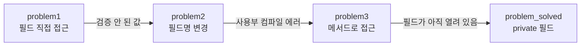
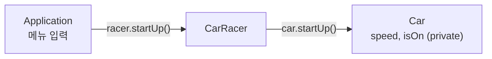
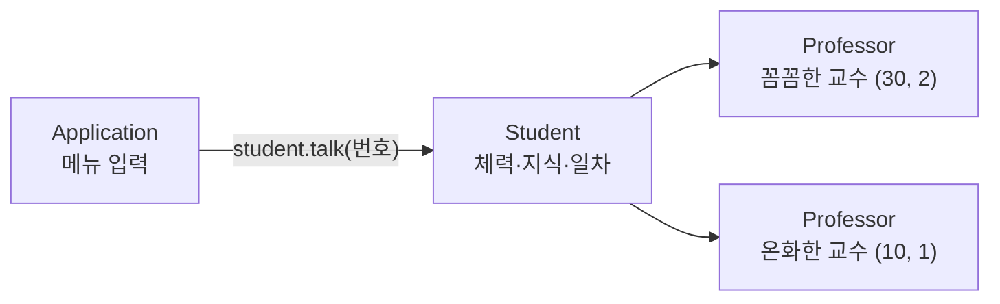
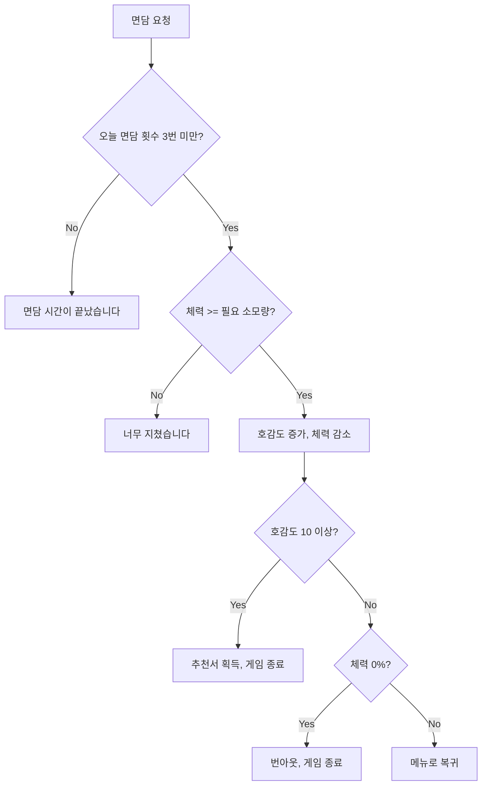
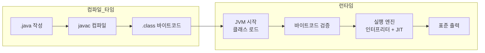

# 오늘 배운 것: 캡슐화·추상화를 연구실 생존기로 직접 구현

## 들어가며 (Situation)

모듈 2 5일차. 어제 `b_oop` 패키지의 `a_uesr_type`(사용자 정의 자료형)과 `b_constructor`(생성자)까지 했고, 이날은 같은 `b_oop` 아래 두 패키지를 이어서 실습했다.

- `c_encapsulation` — 필드를 그대로 열어 둘 때 생기는 문제를 `problem1` → `problem2` → `problem3` → `problem_solved` 순서로 한 단계씩 고친다
- `d_abstraction/run` — 카레이서가 자동차를 운전하는 프로그램으로 추상화와 객체 간 메시지 전달을 배운다

그리고 수업에서 "직접 실습해 보라"고 해서, `d_abstraction/run`과 같은 구조를 따라 별도 프로젝트 `project_abstraction`에 콘솔 게임 **「연구실 생존기」**(`d_abstraction/lab`)를 직접 만들었다. 노션 자료는 어제 이어서 2번 자료의 남은 부분과 3번 자료의 추상화·캡슐화를 읽었다.



글은 수업 실습(캡슐화 → 추상화)을 먼저 따라가고, 직접 만든 게임을 거쳐, 노션 심화 정리로 끝난다.

## 문제 상황 (Task)

이날 풀어야 했던 질문은 세 가지였다.

- 어제 만든 `Member`처럼 필드에 `객체.필드`로 바로 접근하면 어떤 문제가 생기는가
- 요구사항만 주어졌을 때 **어떤 클래스가 필요하고 서로 무슨 메시지를 주고받는지**를 어떻게 뽑아내는가
- 그걸 내 힘으로 설계하면 클래스 3개짜리 프로그램이 정말 요구사항대로 돌아가는가

## 해결 과정 (Action)

### 1. 캡슐화: 필드를 열어 두면 생기는 문제 세 가지

`c_encapsulation`은 같은 `Monster`(이름과 체력)를 네 번 고쳐 쓴다. 한 번에 정답을 보여 주지 않고 **문제가 터지는 순간을 먼저 보여 주는** 구성이라 이유가 선명하게 남았다.



**problem1 — 검증되지 않은 값이 그대로 들어간다**

```java
Monster monster2 = new Monster();
monster2.name = "피카츄!";
monster2.hp = -200;                  // 검증 없이 대입된다

Monster monster3 = new Monster();
monster3.name = "갸라도스";
monster3.setHp(-300);                // setHp()를 거치면 0으로 보정된다
```

`Monster`에는 `hp >= 0`일 때만 값을 넣고 음수면 0으로 강제하는 `setHp()`가 이미 있었다. 하지만 `monster2.hp = -200`처럼 필드에 바로 쓰면 이 검사를 **건너뛸 수 있다.** 같은 클래스인데 몬스터 2는 체력이 `-200`, 몬스터 3은 `0`이 된다.

**problem2 — 필드 이름을 바꾸면 사용하는 곳이 한꺼번에 깨진다**

요구사항이 바뀌어 `name`을 `kinds`로 바꾸자, 필드를 직접 쓰던 `Application`의 코드가 전부 컴파일 에러가 났다. `problem2/Application`이 거의 통째로 주석 처리되어 있는 것이 그 흔적이다. 사용하는 곳이 열 군데면 열 군데를 다 고쳐야 한다.

**problem3 — 메서드를 만들어도 필드가 열려 있으면 소용없다**

문제 1, 2를 이렇게 풀었다. 필드에 값을 넣는 일은 `setName()`, `setHp()`로, 값을 읽는 일은 `getInfo()`로 하도록 바꿨다. `Application`이 필드명을 모르게 되니 이름이 바뀌어도 에러 범위 밖이다.

```java
public void setName(String name) {
    this.kinds = name;
}

public String getInfo()  {
    return "몬스터의 이름은 " + this.kinds + "이고, " +
            "체력은 " + this.hp + "입니다.";
}
```

그래도 구멍이 남는다. 필드가 여전히 열려 있어서 `monster3.hp = -5500;`이 컴파일된다. 실제로 돌려 보면 `setHp(-300)`으로 `0`이 된 몬스터 3의 `getInfo()`가 `체력은 -5500입니다.`로 바뀐다.

🔴 메서드로 접근하는 길을 만들어도, **필드로 접근하는 길을 닫지 않으면** 검증 로직은 우회된다.

**problem_solved — 필드를 private으로 닫는다**

```java
public class Monster {
    private String kinds;
    private int hp;
    // setHp(), setName(), getInfo() 는 그대로
}
```

```java
// monster3.hp = -5500;      // private 이라 외부에서 접근 자체가 거부된다 (컴파일 에러)
```

🟢 필드는 `private`으로 닫고, 바꾸고 읽는 일은 `public` 메서드로만 하게 한다. 이렇게 하면 값 검증이 메서드 안에 모이고, 필드 이름이 바뀌어도 메서드 이름만 유지하면 사용하는 곳은 그대로다.

| 문제 | 필드를 열어 둘 때 | 캡슐화 후 |
|------|-----------------|----------|
| 잘못된 값 | `monster2.hp = -200`이 그대로 들어간다 | `setHp()` 안에서 음수를 0으로 보정한다 |
| 필드명 변경 | 사용하는 곳 전부 컴파일 에러 | 메서드 이름이 같으면 영향 없음 |
| 검증 우회 | `monster3.hp = -5500` 가능 | `private`이라 컴파일 단계에서 차단 |

수업 주석에 있던 `this`도 이 실습에서 같이 정리했다. `setHp(int hp)`의 매개변수 `hp`와 필드 `hp`의 이름이 같을 때 지역 변수가 우선되므로, 필드에 넣으려면 `this.hp = hp`처럼 `this.`를 붙인다. `this`는 객체가 만들어질 때 자기 자신의 주소를 가리키는 변수다.

### 2. 추상화: 카레이서가 자동차를 운전한다

`d_abstraction/run`의 주석은 추상화를 "**공통된 부분을 추출하고, 공통되지 않는 부분은 제거하는 것**"이라고 정의한다. 현실을 그대로 옮기기엔 너무 방대하니, 프로그램 목적에 맞게 단순화한다는 뜻이다. 카레이싱 프로그램이라면 속력과 시동 여부는 남기고 자동차 색이나 브랜드는 버린다.

설계는 정해진 순서로 진행했다.

1. **요구사항 작성** — "자동차는 처음에 멈춘 상태로 대기한다", "달리는 중이면 시동을 끌 수 없다" 같은 문장 7개
2. **클래스 후보 추출** — 문장에서 "~은/는, ~이/가" 앞 단어가 대부분 클래스 후보다. 여기서는 카레이서와 자동차
3. **수신 메시지 정리** — 각 객체가 받을 수 있는 메시지는 그 객체가 해야 할 일과 같다
4. **클래스 설계** — 상태(필드)와 행동(메서드)으로 옮긴다

| 객체 | 수신 메시지 | 가지는 상태 |
|------|-----------|-----------|
| 카레이서 (`CarRacer`) | 시동을 걸어라 / 엑셀을 밟아라 / 브레이크를 밟아라 / 시동 꺼라 | 자동차 |
| 자동차 (`Car`) | 시동을 걸어라 / 앞으로 가라 / 멈춰라 / 시동을 꺼라 | 속력(`speed`), 시동 여부(`isOn`) |

같은 "시동"이라도 카레이서의 메서드는 `startUp()`·`stepAccel()`·`stepBreak()`·`turnOff()`, 자동차의 메서드는 `startUp()`·`go()`·`stop()`·`turnOff()`로 이름이 다르다. 사람이 하는 행동(엑셀을 **밟는다**)과 차가 하는 행동(앞으로 **간다**)을 구분했기 때문이다.

`Car`의 `stop()`은 요구사항 4, 5번(달리는 중이면 멈춘다, 이미 멈췄으면 안내한다)을 상태 두 개로 나눠 처리한다.

```java
public void stop() {
    if (isOn) {
        if (speed > 0 ) {
            this.speed = 0;
            System.out.println("끼~~~~~~~~~~~익 브레이크 밟기 OK. 차는 멈췄습니다.");
        } else {
            System.out.println("차는 이미 멈춰있습니다!!!!!!!!");
        }
    } else {
        System.out.println("🪓차의 시동이 걸려있지 않습니다!" + "시동부터 확인해주세요!🪓");
    }
}
```

호출 구조가 오늘의 핵심이었다. `Application`은 `Car`를 모르고, `CarRacer`만 안다.



```java
public class CarRacer {
    // Car 는 CarRacer 만 접근해야 한다.
    // Application 은 Car 에 접근하면 안된다. 그래서 캡슐화 씀
    private Car car = new Car();

    public void startUp() {
        car.startUp();
    }
    // stepAccel() → car.go(), stepBreak() → car.stop(), turnOff() → car.turnOff()
}
```

💡 클래스도 자료형이라서 `CarRacer`의 필드로 `Car`를 둘 수 있다. 그리고 그 필드를 `private`으로 닫으면 `Application`은 `Car`에게 직접 메시지를 보낼 수 없다. 앞에서 본 캡슐화가 객체 사이의 **연결 구조**에도 쓰인 셈이다.

### 3. 직접 만든 「연구실 생존기」: 같은 구조로 키워 보기

수업 예제를 이해했는지 확인하려고 `project_abstraction` 프로젝트에 새 주제를 같은 구조로 만들었다. 요구사항·클래스 후보·수신 메시지·상태 전이표는 프로젝트의 `oop-design-hint` 스킬이 만든 기획서(`document/연구실_생존기_기획서.md`)를 기준으로 삼았고, `Application`·`Student`·`Professor` 구현은 직접 했다.

게임 규칙은 이렇다. 학생이 꼼꼼한 교수와 온화한 교수 중 한 분과 면담해서 5일 안에 호감도를 10 이상 모으면 추천서를 받고 클리어한다. 체력이 0%가 되면 번아웃으로, 5일이 지나도 못 받으면 기한 초과로 끝난다.

| 항목 | `d_abstraction/run` | `d_abstraction/lab` |
|------|--------------------|--------------------|
| 메뉴 루프 | `Application` | `Application` |
| 행위자 | `CarRacer` | `Student` |
| 대상 | `Car` (1개) | `Professor` (**같은 클래스로 2개**) |
| 상태 | 속력, 시동 여부 | 체력, 지식, 일차 / 호감도, 면담 횟수 |



**같은 클래스, 다른 값 — 생성자의 쓸모**

두 교수는 성격만 다르고 하는 일은 같다. 그래서 클래스를 둘로 나누지 않고, 어제 배운 생성자로 이름·체력 소모량·호감도 증가량을 받아 같은 `Professor`를 두 번 `new` 했다. 이름·소모량·증가량은 생성 후 바뀔 일이 없어서 `private final`로 두었다.

```java
private Professor strictProfessor = new Professor("꼼꼼한 교수", 30, 2);
private Professor kindProfessor = new Professor("온화한 교수", 10, 1);
```

호감도와 면담 횟수는 객체마다 따로 쌓이므로(`favor`, `talkCount`) 두 교수의 상태가 섞이지 않는다.

**책임을 나누는 기준: 묻는 메서드와 행동 메서드**

`Professor`는 `canTalk()`, `isFavorFull()` 같은 **묻는 메서드**로 true/false만 돌려주고 출력은 하지 않는다. 안내 문구와 체력 바는 `Student`만 출력한다. 필드는 전부 `private`이고, 바깥에서 상태를 바꾸는 길은 `talk()`, `newDay()` 같은 의미 있는 행동 메서드 하나뿐이다. 앞서 `problem3`에서 본 "열린 필드" 문제가 생기지 않는 구조다.

```java
public void talk() {
    if (canTalk()) {           // Student 가 이미 검사했어도, 객체가 스스로 한 번 더 지킨다
        this.favor += gain;
        this.talkCount++;
    }
}
```

**면담 한 번의 판정 순서**

`Student.talkWith()`가 가장 신경 쓴 메서드다. 요구사항에는 "횟수 초과를 체력 부족보다 먼저 검사한다", "한 번에 호감도 10 이상이 되면서 체력이 0%가 되면 클리어가 번아웃보다 우선한다" 같은 **순서 규칙**이 있어서 조건 분기의 순서가 곧 설계였다.



체력 소모량은 `calcCost()`로 뽑았다. 지식이 5 이상이면 절반(소수점 버림), 단 최소 10%다.

```java
private int calcCost(Professor professor) {
    if (knowledge >= BONUS_KNOWLEDGE) {
        return Math.max(MIN_COST, professor.getCost() / 2);
    } else {
        return professor.getCost();
    }
}
```

⚠️ 이 규칙 때문에 온화한 교수(소모량 10%)는 절반이 5%지만 최소 10%가 적용되어 **지식 보너스를 받지 못한다.** 버그가 아니라 요구사항 31번에 적힌 의도된 규칙이다.

**기한 처리: 휴식이 곧 하루**

`rest()`는 체력 회복(최대 100%), 두 교수에게 `newDay()`(면담 횟수 0, 호감도 유지), `day++`를 한 번에 처리한다. 일차가 5를 넘으면 기한 초과다.

```java
stamina = (stamina + REST_AMOUNT > MAX_STAMINA) ? MAX_STAMINA : stamina + REST_AMOUNT;
strictProfessor.newDay();
kindProfessor.newDay();
day++;
```

**남은 아쉬움: 같은 숫자가 두 곳에 있다**

코드 주석에도 적어 둔 부분인데, "하루 3번 면담"과 "호감도 10"이 `Professor`의 `canTalk()`·`isFavorFull()`에는 숫자 그대로, `Student.showRules()`의 안내 문구에도 숫자 그대로 들어 있다. 한쪽만 바꾸면 규칙 안내와 실제 동작이 어긋난다. 같은 값을 한곳에서 관리하는 방법(상수)은 노션에서 본 `static final` 쪽이 답에 가깝고, 이 프로젝트에서는 다음 단계로 남겼다.

## 결과 (Result)

수업 실습 11개 파일(`c_encapsulation` 8개, `d_abstraction/run` 3개)과 직접 만든 3개 파일(`Application` 127줄, `Student` 183줄, `Professor` 91줄, 합계 401줄)을 정리했다.

| 구분 | 확인한 내용 |
|------|-----------|
| 캡슐화 | 직접 대입으로 열려 있던 경로 `monster3.hp = -5500`이 `private` 적용 후 컴파일 단계에서 막힌다 |
| 추상화 | 카레이서 예제에서 클래스 2개·메시지 8개(각 4개)를 요구사항 문장에서 뽑아냈다 |
| 직접 구현 | 같은 `Professor` 클래스로 객체 2개를 만들고, 호감도·면담 횟수가 교수마다 따로 쌓인다 |
| 동작 검증 | 기획서 12장 점검 시나리오 4개를 입력해서 기대 결과와 같게 나왔다 |

점검 시나리오 중 눈에 띄는 결과는 이렇다.

| 입력 | 결과 |
|------|------|
| 꼼꼼한 교수만 면담 4번 | 체력 100 → 70 → 40 → 10%, 네 번째는 "오늘 면담 시간이 끝났습니다" |
| 공부 5번 후 면담 3번 → 휴식 → 면담 2번 | 지식 5라서 소모량이 30% → 15%로 줄어 체력 35 → 20 → 5%, 휴식 후 2일차에 호감도 10 도달, "추천서 획득!" |
| 휴식만 5번 | 5번째 휴식에서 "기한이 지났습니다. 추천서를 받지 못했습니다" |
| 공부 10번 | 체력 10% → 0%, "번아웃으로 휴학합니다" |

이날 배운 것을 한 줄로 줄이면, **캡슐화는 필드를 닫는 일이고 추상화는 무엇을 남기고 무엇을 버릴지 정하는 일**이었다. 그리고 둘을 합치면 `Application`은 `Student`만, `Student`는 `Professor`만 아는 구조가 된다.

## 심화: 노션 자료 중 오늘 범위까지만

어제는 노션 1번 자료 전체와 2번 자료의 3-2까지 정리했다. 오늘은 **2번 자료의 남은 부분**과 **3번 자료의 추상화(1-1 ~ 1-3)·캡슐화(3장)**를 읽었다.

| 노션 자료 | 포함한 부분 | 제외한 부분 |
|-----------|-----------|------------|
| 2. Java의 클래스와 객체 | 2-5 초기화 순서(그림만 있어 한 줄), 3-3 GC, 3-4 메모리 누수, 3-5 Hello World, 3-6 질문 | 3-5-3 "Too Much 버전"(노션이 수료 후에 보라고 한 부분) |
| 3. OOP의 4가지 핵심 개념 | 1장 추상화(1-1 ~ 1-3), 3장 캡슐화(3-1 ~ 3-5) | 다형성(2장), 상속과 컴포지션(4장) |
| 4. SOLID 원칙, 5. 예외 처리 | 없음 | 전체 |

⚠️ 코드 예시는 노션 자료의 예시 코드를 옮긴 것이고 직접 실행한 실습 코드가 아니다. 오늘 실습과 이어지는 곳만 실습 코드로 바꿔 설명했다.

### 추상화 (노션 3번 자료 1-1 ~ 1-3)

- **추상화 (Abstraction)**
  - 유연성을 위해 공통적인 것을 추출하고 공통적이지 않은 것을 제거하는 것. 추상화를 거쳐 객체가 도출되고, 그 객체를 만들기 위해 클래스를 설계한다.
  - 노션의 예시는 라디오다. 사용자는 전원·주파수·볼륨이라는 **인터페이스**만 알면 되고 내부 회로는 몰라도 된다. 카레이서가 `Car`의 내부 필드를 몰라도 `startUp()`만 부르면 되는 것과 같다.
- **행위 중심 vs 데이터 중심 추상화**
  - 행위 중심은 "무엇을 할 수 있나"(예: `Runnable`의 `run()`), 데이터 중심은 "무엇을 가지고 있나"(예: `MemberDTO` 같은 DTO)에 집중한다.
  - 노션은 OOP에서 중요한 건 객체 간 상호작용이므로 **메서드(행위) 중심**을 우선하고, DTO처럼 필요할 때만 데이터 중심을 쓴다고 정리한다. 오늘 카레이서와 연구실 생존기는 행위 중심, 어제의 `Member`와 오늘의 `Monster` 필드는 데이터 쪽에 가까웠다.

추상클래스와 인터페이스는 면접 질문으로 자주 나온다고 노션이 따로 표시한 부분이다.

| 구분 | 추상 클래스 | 인터페이스 |
|------|-----------|-----------|
| 자체 인스턴스 생성 | 불가 | 불가 |
| 상속 범위 | 단일 상속 | 다중 구현 |
| 키워드 | `extends` | `implements` |
| 필드 | 상태(필드)를 가질 수 있다 | 상수(`public static final`)만 |
| 어울리는 관계 | **is-a** (`Cat`은 `Animal`의 일종) | **can-do** (`Bird`는 `Flyable`) |

`has-a`(A는 B를 가진다, `Car` has-a `Engine`)는 컴포지션이고, 오늘의 `CarRacer`와 `Car`, `Student`와 `Professor`가 바로 이 관계다.

🟢 노션의 "잘못된 추상화" 사례가 오늘 주제와 가장 가까웠다. `Employee` 추상 클래스에 `writeCode()`를 넣으면 개발자가 아닌 `Admin`도 억지로 구현해야 하고, 결국 `UnsupportedOperationException`을 던지게 된다(리스코프 치환 원칙 위반). 공통 속성은 추상 클래스에 두고 일부만 하는 행동은 `Coder` 인터페이스로 분리해서 푼다. "공통점이 아닌 것을 억지로 추상화하면 하위 클래스에 불필요한 책임이 넘어간다"는 문장이 핵심이다.

⚠️ 노션 예시 코드 두 곳은 그대로 컴파일되지 않는다. `abstract class AbstractClass()`처럼 클래스 이름 뒤에 괄호가 있고, 인터페이스 예시의 `public static final PI1 = 3.1415;`에는 자료형이 빠져 있다. 또 노션 표는 인터페이스의 모든 메서드가 `abstract`라고 적었지만, Java 8부터는 `default`·`static` 메서드도 가질 수 있다([Oracle Java Tutorials - Interfaces](https://docs.oracle.com/javase/tutorial/java/IandI/createinterface.html)).

### 캡슐화 (노션 3번 자료 3장)

노션 3-1이 보여 주는 문제점 두 가지(잘못된 값, 필드명 변경 시 전파)는 오늘 `problem1`, `problem2`와 같은 `Monster` 예제다. 노션이 덧붙인 캡슐화의 필요성은 네 가지다.

1. 내부 구현을 숨기고 인터페이스만 노출한다
2. 잘못된 데이터 변경을 막아 무결성을 지킨다
3. 내부 구조가 바뀌어도 약속된 메서드만 유지하면 되므로 유지보수가 쉽다
4. 객체가 다른 객체의 내부 구조를 몰라도 협력할 수 있어 **결합도가 낮아진다**

접근 제어자 표는 이렇다.

| 제어자 | 같은 클래스 | 같은 패키지 | 자식 클래스 | 전체 |
|--------|:----------:|:---------:|:---------:|:----:|
| `public` | O | O | O | O |
| `protected` | O | O | O | |
| (default) | O | O | | |
| `private` | O | | | |

오늘 실습에서는 `private`(필드)과 `public`(메서드) 두 가지만 썼다. 같은 패키지끼리만 보이는 default는 `Monster`의 필드를 아무 제어자 없이 선언했던 `problem1` ~ `problem3`의 상태다.

- **불변 객체 (Immutable Object)**
  - 생성 후 상태가 절대 변하지 않는 객체. `String`, `Integer`, `LocalDate`가 대표적이다.
  - 설계 규칙: `final` 클래스, 모든 필드 `private final`, 생성자로만 초기화, setter 제거, 가변 객체를 필드로 가질 때는 방어적 복사.
  - 오늘 `Professor`의 `name`, `cost`, `gain`은 이 규칙의 일부(`private final` + 생성자 초기화)를 따르지만, 호감도(`favor`)가 바뀌므로 객체 전체가 불변은 아니다.
- **Java Bean**
  - 규약: 패키지에 속할 것, 필드는 `private`, 기본 생성자 명시, 모든 필드에 public getter/setter, (선택) `Serializable`. 주로 데이터를 담는 VO·DTO에 쓴다.
  - 오늘 `Professor`는 기본 생성자도 setter도 없어서 Java Bean이 아니다. 데이터 묶음이 아니라 **행동을 가진 객체**로 설계했기 때문이다.

| 항목 | 불변 객체 | Java Bean |
|------|----------|-----------|
| 필드 변경 | 불가 | 가능 |
| setter | 없음 | 필수 |
| 생성자 | 모든 값을 초기화 | 기본 생성자 필요 |
| 용도 | 안정성, 스레드 안전성 | 도구·프레임워크와의 연동 |

### JVM 메모리의 남은 부분 (노션 2번 자료 3-3 ~ 3-6)

어제 Heap·Stack·Method Area와 객체 생성 순서까지 봤고, 오늘은 객체가 **사라지는 쪽**을 읽었다.

- **가비지 컬렉션 (GC)**
  - 더 이상 쓰지 않는 객체를 JVM이 자동으로 정리하는 메커니즘. Mark and Sweep, Generational GC, G1 GC 등 알고리즘이 여러 가지다.
  - 실행 시점이 정해져 있지 않다. `System.gc()`는 요청일 뿐 반드시 실행되지 않는다. 참조를 끊거나(`s = null`) 스코프를 벗어나면 대상이 된다.
- **메모리 누수 (Memory Leak)**
  - 필요 없는데도 참조가 남아 GC가 회수하지 못하는 객체. 노션이 든 상황은 컬렉션에 `add()`하고 `remove()`하지 않았을 때, `static` 변수에 객체를 오래 담았을 때, 리스너를 등록하고 해제하지 않았을 때 세 가지다.
  - `static` 변수는 Method Area에서 프로그램 종료까지 살아 있어서, 거기 담긴 객체는 그동안 GC 대상이 되지 않는다.

⚠️ 노션은 "Java 11 이상에서는 G1 GC가 기본값"이라고 적었다. 기본 GC는 JVM 버전과 실행 환경에 따라 달라질 수 있어서, 정확한 기준은 [HotSpot GC 튜닝 가이드](https://docs.oracle.com/en/java/javase/17/gctuning/introduction-garbage-collection-tuning.html)에서 확인해야 한다.

Hello World를 출력할 때 일어나는 일은 노션의 "알찬 개발자 버전"까지만 정리했다.



노션 3-6의 질문 두 개도 정리해 둔다.

| 질문 | 노션의 답 |
|------|---------|
| GC는 Heap만 대상인가 | 주 대상은 Heap이다. Stack과 네이티브 메모리는 대상이 아니다. 다만 클래스 언로딩이 일어나면 Metaspace(메서드 영역)의 메타데이터도 회수될 수 있다 |
| 메서드 안 지역 클래스는 메서드가 끝나면 바로 수거되나 | 인스턴스는 GC 대상이 되지만 클래스 메타 정보는 **즉시 수거되지 않는다.** 클래스 로더가 살아 있는 동안 남고, JVM이 언로딩 조건을 만족한다고 판단할 때 회수된다 |

## 더 학습하면 좋은 개념

- **`static final` 상수** — `Student`의 `MAX_DAY` 같은 상수가 `private final` 인스턴스 필드라서 `Student` 객체마다 Heap에 복사본이 생긴다. `static final`이면 Method Area에 하나만 있고, 호감도 목표 10처럼 여러 클래스에서 쓰는 값을 한곳에서 관리할 수 있다.
- **배열과 컬렉션(`List`)** — 기획서의 확장 아이디어 4번처럼 교수님이 세 명 이상이 되면 `talk(int no)`의 `if-else`가 계속 길어진다. 객체를 묶음으로 다루는 방법을 알면 분기 없이 `professors[no]`로 접근할 수 있다.
- **상속과 다형성** — `Professor`가 성격별로 갈라진다면(꼼꼼형·온화형) 같은 메시지에 다르게 반응하게 하는 구조가 필요하다. 노션 3번 자료의 2장(다형성), 4장(상속과 컴포지션)이 바로 이어지는 내용이다.
- **리스코프 치환 원칙(LSP)과 SOLID** — 노션이 잘못된 추상화의 사례에서 언급한 원칙이다. 상속·인터페이스 설계가 "맞는지" 판단하는 기준이 되므로, 노션 4번 자료로 넘어가기 전에 의미를 알아 두면 좋다.
- **방어적 복사와 불변 객체** — `private` 필드라도 getter가 가변 객체(배열, 리스트)의 참조를 그대로 돌려주면 캡슐화가 깨진다. `Member`의 `hobby` 배열 같은 필드에서 실제로 마주칠 문제다.

## 참고 자료

- [Oracle Java Tutorials - Controlling Access to Members of a Class](https://docs.oracle.com/javase/tutorial/java/javaOO/accesscontrol.html)
- [Oracle Java Tutorials - Abstract Methods and Classes](https://docs.oracle.com/javase/tutorial/java/IandI/abstract.html)
- [Oracle Java Tutorials - Interfaces](https://docs.oracle.com/javase/tutorial/java/IandI/createinterface.html)
- [Java Virtual Machine Specification SE 17 - Run-Time Data Areas](https://docs.oracle.com/javase/specs/jvms/se17/html/jvms-2.html#jvms-2.5)
- [HotSpot Virtual Machine Garbage Collection Tuning Guide (JDK 17)](https://docs.oracle.com/en/java/javase/17/gctuning/introduction-garbage-collection-tuning.html)
