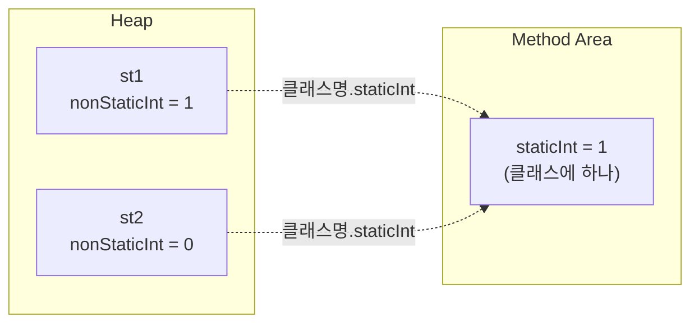
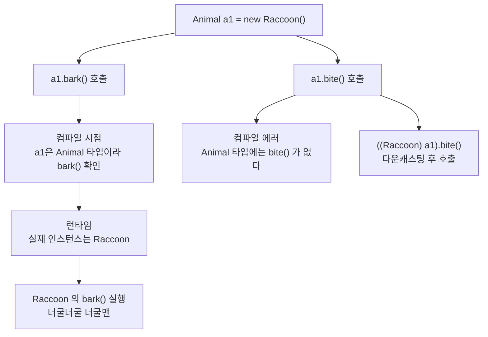

# 오늘 배운 것: 상속과 다형성으로 같은 호출, 다른 동작 구현

## 들어가며 (Situation)

모듈 2 6일차. 10/5는 개천절 대체공휴일이라 10/2(5일차) 다음 수업이다. 이날은 `chap03-object-oriented-programming` 프로젝트에서 `b_oop`의 남은 패키지를 마치고, `com.wanted.oop` 바로 아래에 새 패키지 두 개를 열었다.

- `b_oop/e_overloading` — 메서드 시그니처와 오버로딩(`OverloadingTest`)
- `b_oop/f_keyword` — `a_static`, `b_singleton`, `c_final`
- `c_inheritance/extend` — `Car`를 상속하는 `CapsCar`(경찰차)
- `d_polymorphism` — `Animal`을 상속하는 `Raccoon`·`Koala`, 그리고 인터페이스(`a_interface`)



흐름은 "키워드로 클래스 하나를 다루는 법(`static`, `final`) → 클래스 사이의 관계(상속) → 관계를 이용한 설계(다형성)" 순서였다. 이 글도 그 순서를 따르고, 노션은 다형성과 상속 부분을 뒤쪽에 따로 정리한다.

## 문제 상황 (Task)

실습 코드 주석에서 던진 질문을 정리하면 이렇다.

- 같은 이름의 메서드를 여러 개 만들 수 있다는데, 컴파일러는 무엇으로 서로 다른 메서드라고 구분하는가
- 객체를 몇 개 만들든 **하나만 있어야 하는 값**이나 객체는 어떻게 만드는가
- 한 번 정한 값을 **바꾸지 못하게** 하려면 어떻게 하는가
- 경찰차도 차인데, `run()`·`soundHorn()`을 `Car`와 똑같이 또 써야 하는가
- 너구리와 코알라를 `Animal` 하나로 다루면서도, 호출했을 때는 각자 다르게 동작하게 할 수 있는가

## 해결 과정 (Action)

### 1. 오버로딩: 이름이 아니라 시그니처로 구분한다

`OverloadingTest`는 컴파일 에러가 나는 경우를 **주석 처리**해 두고 하나씩 풀어 보는 실습이었다. 주석이 정의한 메서드 시그니처는 "메서드를 식별할 수 있는 고유한 값, 즉 `메서드명([매개변수])`"이다.

| 선언 | 컴파일 | 이유 |
|------|--------|------|
| `public void test()` 한 번 더 | 에러 | 시그니처가 같다 |
| `private void test()` | 에러 | 접근제한자는 시그니처가 아니다 |
| `private int test()` | 에러 | 반환타입은 시그니처가 아니다 |
| `public void test(int num2)` | 에러 | 매개변수 **이름**은 시그니처가 아니다 |
| `test(int num)` | 성립 | 매개변수 유무가 다르다 |
| `test(int num, String str)` | 성립 | 매개변수 개수가 다르다 |
| `test(String str, int num)` | 성립 | 매개변수 **순서**가 다르다 |
| `test2()` | 성립 | 메서드 이름 자체가 다르다 |

🟢 4일차에 노션으로 본 표가 실습 코드로 그대로 확인된 셈이다. 오버로딩은 매개변수의 타입·개수·순서가 달라야 성립하고, 접근제한자·반환타입·매개변수 이름은 상관없다.

### 2. static: 객체와 상관없이 하나만 존재한다

`a_static`은 같은 클래스에 `static`이 붙은 필드와 붙지 않은 필드를 나란히 두고 비교한다.

```java
public class StaticFieldTest {
    private int nonStaticInt;
    private static int staticInt;

    public static int getStaticInt() {
        return staticInt;
    }

    public void increaseStatic() {
        // static 변수는 클래스명.변수명 으로 접근한다. this 는 사용되지 않는다.
        StaticFieldTest.staticInt++;
    }
    // increaseNonStatic() 은 this.nonStaticInt++
}
```

`Application`에서 객체 `st1`로 두 값을 1씩 올린 뒤, **새 객체 `st2`**를 만들어 같은 값을 읽어 봤다.

| 시점 | non-static 값 | static 값 |
|------|:------------:|:---------:|
| `st1` 생성 직후 | 0 | 0 |
| `st1`에서 각각 1 증가 | 1 | 1 |
| 새 객체 `st2`로 읽기 | **0** | **1** |

`st2`의 non-static 값은 0이지만 static 값은 `st1`이 올린 1이 그대로 보인다. 일반 필드는 객체마다 Heap에 따로 있고, `static` 필드는 객체와 상관없이 클래스에 하나만 있기 때문이다.



💡 `static`은 객체를 만드는 시점이 아니라 **어플리케이션 시작 시점**에 초기화된다는 것이 수업 주석의 핵심이다. 그래서 `StaticFieldTest.getStaticInt()`처럼 `new` 없이 `클래스명.메서드()`로 부른다. 4일차 노션에서 정리한 "클래스 변수는 클래스 로딩 시 생성, 프로그램 종료 시 소멸"을 직접 실행해서 확인한 것이다.

### 3. 싱글톤: static으로 객체를 하나만 만든다

싱글톤은 어플리케이션 안에서 객체를 **단 하나만** 만들어 공유하는 디자인 패턴이다. 수업 주석의 비유는 "리모컨은 1개"였다. 두 방식을 모두 실습했다.

```java
public class EagerSingleton {
    private static EagerSingleton eager = new EagerSingleton();   // 클래스가 로드될 때 만든다

    private EagerSingleton() {}                                    // 외부에서 new 금지

    public static EagerSingleton getInstance() {
        return eager;
    }
}
```

```java
public class LazySingleton {
    private static LazySingleton lazy;                             // 처음엔 null

    private LazySingleton() {}

    public static LazySingleton getInstance() {
        if (lazy == null) {                                        // 처음 요청받을 때 만든다
            lazy = new LazySingleton();
        }
        return lazy;
    }
}
```

| 구분 | 이른 초기화 (Eager) | 게으른 초기화 (Lazy) |
|------|--------------------|--------------------|
| 만드는 시점 | 클래스 로드 시 | `getInstance()`를 처음 부를 때 |
| 필드 | `new`로 바로 초기화 | `null`로 시작 |
| `getInstance()` | 저장한 객체를 그대로 반환 | `null`이면 만들고 반환 |
| 쓰이지 않아도 | 객체가 만들어진다 | 만들어지지 않는다 |

두 방식 모두 `getInstance()`를 두 번 불러서 `hashCode()`를 찍었다. 실행할 때마다 숫자 자체는 달라지지만, **두 번 부른 값이 항상 같았다**(이날 실행: `eager1`과 `eager2`가 같은 값, `lazy1`과 `lazy2`가 같은 값). 같은 객체를 돌려받았다는 증거다.

🟢 핵심은 **기본 생성자를 `private`으로 막은 것**이다. `new EagerSingleton()`이 외부 클래스에서 컴파일되지 않으니, 객체를 얻는 길은 `getInstance()` 하나뿐이다. 5일차의 캡슐화(필드를 `private`으로 닫기)가 이번에는 생성자에 쓰였다.

💡 `EagerSingleton`에는 `hashCode()`를 만든 적이 없는데도 호출된다. 모든 클래스는 따로 적지 않아도 `Object`를 상속하고, `hashCode()`는 `Object`가 가진 메서드이기 때문이다. 아래 상속에서 같은 원리가 다시 나온다.

⚠️ 게으른 초기화는 여러 스레드가 동시에 `getInstance()`를 부르면 객체가 둘 만들어질 수 있다는 점이 알려져 있다. 수업에서는 다루지 않았고 스레드를 배운 뒤에 공식 자료로 따로 확인해야 해서, 이 글에서는 결론을 적지 않는다.

### 4. final: 한 번 정하면 바꾸지 못한다

`final`은 "최초에 값을 대입한 뒤 변경 불가능하게 만들 때" 쓴다. `FinalFieldTest`는 final 필드를 초기화하는 방법 두 가지를 보여 준다.

```java
public class FinalFieldTest {
    // 1. 선언과 동시에 초기화
    private final int NON_STATIC_NUM = 1;

    // 2. 선언만 하고, 생성자에서 반드시 초기화
    private final int NON_STATIC_NUM2;

    public FinalFieldTest(int num) {
        this.NON_STATIC_NUM2 = num;
    }
}
```

| 경우 | 컴파일 | 이유 |
|------|--------|------|
| `private final int NON_STATIC_NUM;` (초기화 없음) | 에러 | JVM 기본값 `0`이 들어가는 것을 허용하지 않는다 |
| `this.NON_STATIC_NUM = num;` (setter) | 에러 | 값을 다시 대입할 수 없다 |
| 생성자에서 `NON_STATIC_NUM2 = num` | 성립 | 생성자를 통해 한 번만 초기화 |

final 변수 이름은 식별하기 쉽게 **대문자와 `_`**로 쓴다는 점도 주석에 있었다.

💡 5일차에 만든 `Professor`의 `private final String name`·`cost`·`gain`이 바로 두 번째 방식이다. 생성자로 한 번 받고 그 뒤로는 바뀌지 않는다.

### 5. 상속: 부모의 것은 내 것이다

`c_inheritance/extend`의 주석은 상속을 "부모의 돈(필드, 메서드)을 자식이 물려받는다"는 비유로 시작한다. 경찰차는 차이므로 **IS-A 관계**가 성립한다. 경찰차에도 달리기와 경적이 필요한데, 같은 메서드를 또 쓰지 말고 부모의 것을 재활용하자는 발상이 상속이다.

```java
public class CapsCar extends Car {

    @Override
    public void run() {
        System.out.println("경찰차는 삐용삐용~~ 하면서 달립니다!!");
    }

    @Override
    public void soundHorn() {
        System.out.println("삐~~~~~~용~~~~~~~~~~삐~~~~~~~");
    }

    // 부모에 없는, 자식만의 고유 기능
    public void 무전하기 () {
        System.out.println("치지지ㅣㅈㄱ....... 421호에 몬스터 등장ㄷㄷ");
    }
}
```

| 메서드 | `Car` (부모) | `CapsCar` (자식) |
|--------|-------------|-----------------|
| `run()` | 자동차가 달려갑니다 | **재정의** (삐용삐용) |
| `soundHorn()` | 달리는 중일 때만 빵빵 | **재정의** (사이렌) |
| `stop()`, `isRunning()` | 있음 | **재정의 없이 그대로 물려받음** |
| `무전하기()` | 없음 | 자식만의 고유 메서드 |

`CapsCar`에는 `stop()`을 쓴 적이 없는데 `capsCar.stop()`을 호출하면 "자동차가 멈춥니다..."가 나온다. 상속받았기 때문이다. 반대로 부모 `Car` 객체는 `무전하기()`를 쓸 수 없다. 방향은 **부모 → 자식** 한쪽뿐이다.

**생성자는 물려받지 않지만, 부모 생성자가 먼저 돈다**

`new CapsCar()`만 했는데 출력은 이 순서였다.

```text
Car 클래스의 기본생성자 호출됨...
CapsCar 의 기본 생성자 호출됨..
```

`CapsCar` 생성자 안에 부모를 부르는 코드를 쓰지 않았는데도 `Car`의 생성자가 먼저 실행된다. 자식 객체 안에는 부모 부분이 먼저 만들어져야 하기 때문이다. 4일차 노션에서 `super()`를 "부모 클래스의 생성자를 호출한다"고 봤는데, 쓰지 않아도 컴파일러가 부모의 기본 생성자 호출을 앞에 넣어 준다는 것을 이 출력으로 확인했다.

**주석 처리된 `super.run()`이 가리키는 것**

`CapsCar.run()` 안에는 `// super.run();`이 주석 처리되어 있다. 주석대로 `this`는 자기 자신, `super`는 부모를 가리킨다. 코드를 따라가 보면 이 한 줄의 의미가 보인다.

🔴 `Car`의 `runningStatus`는 `private`이라 자식이 직접 바꿀 수 없다. 그리고 `CapsCar.run()`은 `super.run()`을 부르지 않으므로, 경찰차가 "달립니다"를 출력해도 `isRunning()`은 계속 `false`다. 지금은 `CapsCar.soundHorn()`도 상태를 확인하지 않아서 눈에 띄지 않지만, 재정의한 메서드가 부모의 기능을 **대체**하는지 **확장**하는지는 `super.`를 부르느냐로 갈린다.

⚠️ 이 부분은 실행한 출력이 아니라 코드를 읽고 내린 결론이다. `super.run()` 주석을 풀어 직접 확인해 보는 것이 남아 있다.

### 6. 다형성: 부모 타입 변수에 자식 객체를 담는다

`d_polymorphism`은 `Animal`(부모)을 `Raccoon`과 `Koala`가 상속하고 `eat()`·`run()`·`bark()`를 모두 재정의한다. 자식마다 고유 메서드도 하나씩 있다.

| 클래스 | 재정의한 메서드 | 고유 메서드 |
|--------|----------------|------------|
| `Animal` | `eat()`, `run()`, `bark()` (원본) | 없음 |
| `Raccoon` | 3개 모두 | `bite()` |
| `Koala` | 3개 모두 | `sleep()` |

주석이 정의하는 다형성은 "**하나의 인스턴스가 여러 가지 타입을 가질 수 있는 것**"이다. `Raccoon` 객체는 `Raccoon` 타입이면서 `Animal` 타입이기도 하다.

```java
// IS-A: 너구리는 동물이다 (O), 동물은 너구리다 (X)
Animal a1 = new Raccoon();     // 가능: 부모 타입 변수에 자식 객체
// Raccoon r1 = new Animal();  // 컴파일 에러: 부모 객체는 자식 공간에 들어갈 수 없다

a1.bark();                     // 너굴너굴 너굴맨...  (Animal 의 bark 가 아니라 Raccoon 의 bark)
// a1.bite();                  // 컴파일 에러: a1 은 Animal 타입이라 bite() 를 모른다
((Raccoon) a1).bite();         // 분노한 너구리가 깨물기 시작합니다...
```

세 줄에서 컴파일러와 JVM이 보는 것이 다르다. 이것을 정리한 것이 주석의 **동적 바인딩**이다. 컴파일 시점에는 `a1`이 `Animal` 타입이라 `Animal`의 메서드와 연결되어 있다가, 런타임에 실제 인스턴스(`Raccoon`)의 재정의된 메서드로 바뀌어 동작한다.



| 구분 | 방향 | 작성 방법 |
|------|------|----------|
| 업캐스팅 | 자식 → 부모 타입 | `Animal a1 = new Raccoon()` (묵시적, 생략 가능) |
| 다운캐스팅 | 부모 → 자식 타입 | `((Raccoon) a1)` (명시적으로만) |

🟢 **"하나의 호출, 객체별로 다른 동작"**이 다형성의 효과다. `a1`이 `Koala`였다면 같은 `a1.bark()`가 "드르렁"을 냈을 것이다.

⚠️ 이 실습의 `a1`은 실제로 `Raccoon`이라 다운캐스팅이 안전하다. 노션에 따르면 실제 타입과 맞지 않게 캐스팅하면 런타임에 `ClassCastException`이 나고, 이를 막으려고 `instanceof`로 먼저 검사한다. 이 부분은 오늘 코드로 직접 실행하지는 않았다.

### 7. 인터페이스: 해야 할 일만 강제한다

`d_polymorphism/a_interface`는 같은 `Animal`을 **클래스가 아니라 인터페이스**로 바꾼 버전이다. 주석은 인터페이스를 "**Can-Do**, 이 인터페이스를 구현하는 클래스가 해야 하는 메서드를 강제한다"고 설명한다.

```java
public interface Animal {
    void run();
    void eat();
    void bark();
}

// 인터페이스는 extends 가 아니라 implements 로 구현한다
public class Raccoon implements Animal {
    @Override
    public void run() {
        System.out.println("너구리가 폴짝폴짝 뛰어댕깁니다..");
    }
    @Override
    public void eat() { }
    @Override
    public void bark() { }
}
```

실습에서 확인한 규칙은 주석 처리된 에러 코드 세 개와 성립하는 코드 하나다.

| 시도 | 결과 | 의미 |
|------|------|------|
| `public Animal() {}` | 에러 | 인터페이스는 생성자를 쓸 수 없다 |
| `public void test() {}` (본문 있음) | 에러 | 인터페이스의 메서드는 본문(구현부)을 못 쓴다 |
| `new Animal()` | 에러 | 구현체가 없어서 `new`로 만들 수 없다 |
| `Animal animal = new Raccoon()` | 성립 | 구현 클래스로 만들고 다형성이 적용된다 |

🔴 `Raccoon`의 `eat()`과 `bark()`는 본문이 비어 있다. 컴파일은 통과하고 호출해도 아무것도 출력되지 않는다. 인터페이스가 강제하는 것은 **메서드가 존재하는 것**이지 그 안의 **내용**이 아니다. 이 부분은 코드를 읽고 내린 결론이다.

| 구분 | 클래스 상속 (`d_polymorphism`) | 인터페이스 구현 (`a_interface`) |
|------|-------------------------------|------------------------------|
| 키워드 | `extends` | `implements` |
| 관계 | IS-A (너구리는 동물이다) | Can-Do (할 수 있는 일을 정한다) |
| 부모의 메서드 | 본문이 있고 물려받는다 | 본문이 없고 반드시 구현해야 한다 |

## 결과 (Result)

실습 클래스 18개(총 517줄)를 `e_overloading`, `f_keyword`, `c_inheritance`, `d_polymorphism`에서 정리했다.

| 구분 | 확인한 내용 |
|------|-----------|
| 오버로딩 | 컴파일 에러 사례 4개(같은 시그니처, 접근제한자, 반환타입, 매개변수 이름)와 성립 사례 4개로 시그니처 구성 요소를 구분했다 |
| `static` | 객체 `st1`에서 1로 올린 `static` 값을 새 객체 `st2`가 그대로 읽고(`1`), non-static 값은 `0`이었다 |
| 싱글톤 | 이른·게으른 두 방식 모두 `getInstance()`를 두 번 부른 결과의 `hashCode()`가 서로 같았다 |
| `final` | 초기화하는 방법 2가지와 에러 사례 2개(초기화 누락, 재대입)를 확인했다 |
| 상속 | `CapsCar`가 `run()`·`soundHorn()`만 재정의하고 `stop()`·`isRunning()`은 물려받았으며, `new CapsCar()` 때 부모 생성자가 먼저 호출됐다 |
| 다형성 | 부모 타입 변수 `Animal a1`로 `Raccoon`을 담아 `a1.bark()`가 `Raccoon`의 메서드로 동작했고, 고유 메서드는 다운캐스팅 후에만 호출됐다 |

이날을 한 줄로 줄이면, **`static`·`final`은 클래스에 대한 약속이고, 상속·다형성은 클래스 사이의 약속**이었다. 그리고 5일차에 캡슐화로 닫은 것(`private`)이 이번에도 생성자(싱글톤), 필드(`Car`의 `runningStatus`)에서 다시 효과를 냈다.

## 심화: 노션 자료 중 오늘 범위까지만

노션 3번 자료에서 **2장 다형성**과 **4장의 4-1(상속이란)**을 읽었다. `static`·초기화 블록·`static import`·싱글턴은 4일차 글에서 정리했고, 5일차까지 1번·2번 자료와 3번 자료의 추상화·캡슐화를 끝냈다.

| 노션 자료 | 포함한 부분 | 제외한 부분 |
|-----------|-----------|------------|
| 3. OOP의 4가지 핵심 개념 | 2장 다형성 전체(2-1 ~ 2-3), 4장의 4-1 상속(장단점, 깊은 계층, 결합도) | 4-2 컴포지션(아직 배우지 않은 범위) |
| 4. SOLID 원칙, 5. 예외 처리 | 없음 | 전체 |

⚠️ 코드 예시는 노션 자료의 예시 코드를 옮긴 것이고 오늘 직접 실행한 실습 코드가 아니다. 오늘 실습과 이어지는 곳만 실습 코드로 바꿔 설명했다.

### 다형성의 필요성 (노션 2-1)

노션은 다형성을 "객체지향의 꽃"이라 부르며, 개념을 읽는 데서 끝내지 말고 **남에게 설명해 보거나 나만의 예제를 작성**해 보라고 권한다. 필요한 이유는 네 가지다.

- **하나의 타입으로 관리**
  - 여러 타입의 객체를 하나의 타입으로 묶어 관리하면 유지보수성과 생산성이 올라간다.
  - 노션 예시: `Car[] carr`에 `Sonata`, `Morning`, `Avante`를 담고 `for (Car car : carr) { car.move(); }`로 한 번에 움직인다.
- **관리할 메시지 종류가 줄어든다**
  - 다형성이 없으면 `moveSonata()`, `moveMorning()`처럼 차 종류마다 메서드 이름을 기억해야 하지만, 있으면 `move()` 하나로 끝난다.
- **확장성**
  - 새 차(`Santafe`)가 추가돼도 `move(Car car)`를 다시 만들 필요가 없다.
- **낮은 결합도**
  - `pay(현금)`, `pay(카드)`를 따로 두지 않고 `pay(결제수단)`으로 받으면, 결제수단이 늘어도 `pay()`는 그대로다. 구체 클래스가 아니라 부모 타입에 의존하기 때문이다.

오늘 `Application01`은 변수에 담는 데까지만 보여 줬고, 위 `for` 반복 예시처럼 부모 타입 배열에 여러 자식을 담아 보는 것은 직접 해 보지 않았다.

### 오버라이딩과 오버로딩 (노션 2-2)

면접에 자주 나온다고 표시된 표다.

| 구분 | 오버라이딩 (overriding) | 오버로딩 (overloading) |
|------|------------------------|----------------------|
| 위치 | 하위 클래스 | 같은 클래스 |
| 메서드 이름 | 동일 | 동일 |
| 매개변수 | 동일(타입·개수·순서) | 다름 |
| 반환 타입 | 동일 | 관계없음 |
| 접근 제어자 | 부모보다 같거나 넓어야 함 | 관계없음 |
| 예외 처리 | 부모와 같거나 더 구체적 | 관계없음 |

- **오버라이딩 성립 조건**
  - 메서드명·매개변수(타입·개수·순서)·리턴타입이 같아야 한다.
  - 부모의 `private` 메서드와 `final` 메서드는 오버라이딩할 수 없다.
  - 접근제어자는 부모와 같거나 더 넓은 범위여야 하고, 예외는 같거나 더 구체적(하위)이어야 한다.
- **`@Override`**
  - 부모나 인터페이스의 메서드를 재정의한다는 것을 컴파일러에게 알려서 정확히 오버라이딩했는지 검증하게 한다.
  - 없으면 컴파일러는 조용히 넘어가서 의도와 다르게 동작할 수 있다. `CapsCar`, `Raccoon`, `Koala`에 모두 붙어 있다.
- **동적 바인딩 (Dynamic Binding)**
  - 컴파일 당시에는 해당 타입의 메서드와 연결되어 있다가 런타임에 실제 인스턴스의 오버라이딩된 메서드로 바뀌는 것.
  - 성립 조건은 상속 관계의 부모·자식에 **오버라이딩된 메서드**를 호출하는 것이다. 오늘 `a1.bark()`가 그 예다.

⚠️ 노션 표와 조건은 반환 타입을 "동일"로 적었다. 실제 Java는 부모 메서드의 반환 타입의 하위 타입을 돌려주는 재정의도 허용하는 것(공변 반환 타입)으로 알려져 있어서, 정확한 규칙은 공식 문서([Overriding and Hiding Methods](https://docs.oracle.com/javase/tutorial/java/IandI/override.html))로 확인해야 한다.

### 업캐스팅·다운캐스팅과 instanceof (노션 2-3)

- **업캐스팅**
  - 하위 → 상위 타입 형변환. 묵시적으로 일어나서 `(Animal)`을 생략해도 된다.
- **다운캐스팅**
  - 상위 → 하위 타입 형변환. 명시적으로만 가능하며, 오버라이딩한 것이 아닌 자식 고유의 기능을 쓰려면 필요하다. 오늘 `((Raccoon) a1).bite()`다.
- **`instanceof`**
  - 참조 변수가 실제로 어떤 클래스의 인스턴스인지 `true`/`false`로 알려 준다. 캐스팅 전에 검사하면 `ClassCastException`을 피할 수 있다.

```java
// 노션 예시 코드
Car car = new Sonata();
if (car instanceof Sonata) {
    ((Sonata) car).moveSonata();
}
```

### 상속 (노션 4-1)

- **상속이란**
  - 부모의 필드·메서드를 자식이 물려받아 자기 것처럼 쓰는 기술이다. 단, **생성자는 물려받지 않는다.**
  - 부모의 **타입도 함께 상속**되는데, 이것이 다형성의 문법적 토대다. `Raccoon`이 `Animal` 타입 변수에 들어갈 수 있는 이유가 이것이다.
  - Java는 **단일 상속**만 지원하고, `extends`를 쓴다.

| 구분 | 내용 |
|------|------|
| 장점 | 코드 재사용성 증가, is-a 관계로 계층 설계, 다형성과 함께 유연한 프로그래밍 |
| 단점 | 높은 결합도(자식이 부모에 강하게 의존), 부모 하나만 상속 가능, 계층이 깊어지면 유지보수 어려움 |

- **깊은 상속 계층의 문제**
  - `A ← B ← C ← D`처럼 이어지면 `D`는 `A~C`의 설계에 암묵적으로 의존하고, 한 클래스를 고치면 모든 하위 클래스에 영향이 간다.
  - 노션의 표현으로는 "코드 재사용이 아니라 **코드 복잡도 전파**"가 될 수 있다.
- **상속 관계의 결합도**
  - 부모의 `print()`가 바뀌면 `print()`를 부르는 `FancyPrinter.printFancy()`도 의도치 않게 달라질 수 있다.

💡 노션의 결론은 "**상속은 강력하지만 신중하게**"다. 공통 기능 공유, 정확한 is-a 관계, 변하지 않는 구조일 때만 적합하다. 오늘의 `CapsCar`(경찰차는 차다)와 `Raccoon`(너구리는 동물이다)은 is-a가 분명한 경우였다. 4-2의 컴포지션(has-a)은 아직 배우지 않은 범위다.

## 더 학습하면 좋은 개념

- **`super`와 생성자 체인** — `CapsCar.run()`에서 주석 처리된 `super.run()`과, 쓰지 않았는데 먼저 실행된 `Car`의 생성자는 같은 원리다. `super.run()` 주석을 풀어 `isRunning()`이 어떻게 바뀌는지 확인하면 재정의가 부모를 대체하는지 확장하는지가 분명해진다.
- **`Object` 클래스** — `EagerSingleton`에서 직접 만들지 않은 `hashCode()`가 호출된 것은 모든 클래스가 `Object`를 상속하기 때문이다. `toString()`, `equals()`와 `hashCode()`의 관계는 4일차 `Member`의 `toString()` 재정의와도 이어진다.
- **`instanceof`와 `ClassCastException`** — 오늘 다운캐스팅은 안전한 경우만 해 봤다. `Koala`를 `Raccoon`으로 캐스팅하면 어떻게 되는지 직접 실행해 보면 노션이 `instanceof` 검사를 권하는 이유가 선명해진다.
- **스레드 안전한 싱글톤과 `static final`** — 게으른 초기화의 동시성 문제를 스레드를 배운 뒤 확인하고, 5일차 `Student`의 `MAX_DAY` 같은 상수를 `static final`로 바꿨을 때 객체마다의 복사본이 사라지는 것을 비교해 본다.
- **컴포지션 (has-a)** — 상속의 결합도 문제를 푸는 대안으로 노션 4-2에서 이어진다. 5일차의 `Student`가 `Professor`를 필드로 가진 구조가 바로 컴포지션이었다.

## 참고 자료

- [Oracle Java Tutorials - Inheritance](https://docs.oracle.com/javase/tutorial/java/IandI/subclasses.html)
- [Oracle Java Tutorials - Overriding and Hiding Methods](https://docs.oracle.com/javase/tutorial/java/IandI/override.html)
- [Oracle Java Tutorials - Polymorphism](https://docs.oracle.com/javase/tutorial/java/IandI/polymorphism.html)
- [Oracle Java Tutorials - Understanding Class Members (static)](https://docs.oracle.com/javase/tutorial/java/javaOO/classvars.html)
- [Oracle Java Tutorials - Interfaces](https://docs.oracle.com/javase/tutorial/java/IandI/createinterface.html)
- [Oracle Java Tutorials - Using the Keyword super (Subclass Constructors)](https://docs.oracle.com/javase/tutorial/java/IandI/super.html)
- [Oracle Java Tutorials - Defining Methods (오버로딩)](https://docs.oracle.com/javase/tutorial/java/javaOO/methods.html)
- [Oracle Java Tutorials - Writing Final Classes and Methods](https://docs.oracle.com/javase/tutorial/java/IandI/final.html)
