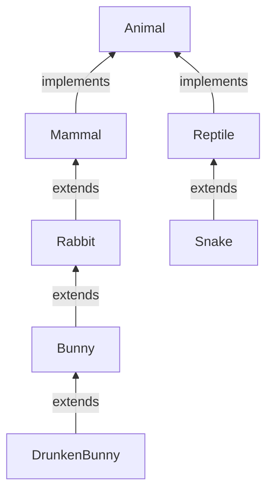
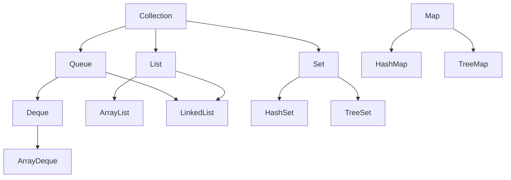

# 오늘 배운 것: 제네릭과 List·Set으로 타입 안전하게 담기

## 들어가며 (Situation)

모듈 2 7일차. 10/6(6일차) 다음 수업이다. 이날은 새 프로젝트 `chap04-generic-and-collection`을 열어 패키지 두 개를 실습했다.

- `a_generic/a_basic` — 제네릭 클래스 `GenericTest<T>`와 래퍼 클래스
- `a_generic/b_use` — `Animal` 계층과 `RabbitFarm<T extends Rabbit>`, 와일드카드 `WildcardFarm`
- `b_collection/a_list` — `ArrayList`와 `BookDTO`
- `b_collection/b_set` — `HashSet`, `TreeSet`(로또 추첨기)

노션은 `3. 컬렉션 프레임워크와 Exception`의 1장(JCF의 필요성과 구조 이해)까지 읽었고, 글 뒤쪽 "심화"에 따로 정리한다.



흐름은 "담는 그릇의 타입을 컴파일 시점에 정한다(제네릭) → 그 그릇들의 표준 모음을 쓴다(컬렉션)" 순서였다. 6일차에 배운 상속·다형성이 제네릭의 타입 제한과 와일드카드에서 그대로 다시 나온다.

## 문제 상황 (Task)

오늘은 막힌 곳 없이 모든 실습을 이해하고 넘어갔다. 그래서 문제 상황은 실습 코드 주석이 던진 질문으로 정리한다.

- 값을 하나 담는 클래스를 만들 때, `int`용·`String`용을 따로 만들지 않고 하나로 쓸 수 있는가
- 담을 수 있는 타입을 **컴파일 시점에** 막으려면 어떻게 하는가
- 토끼 농장에 `Rabbit`뿐 아니라 `Bunny`, `DrunkenBunny`도 받고 싶지만 `Mammal`이나 `Snake`는 막고 싶다면?
- 크기가 고정된 배열 대신, 개수가 변하는 데이터를 담는 방법은 무엇인가
- 중복을 자동으로 걸러내고, 정렬까지 보장되는 모음은 없는가

## 해결 과정 (Action)

### 1. 제네릭: 타입을 클래스 밖에서 정한다

`GenericTest<T>`는 필드 하나를 `T`로 선언한 클래스다. 클래스 선언부 끝의 `<>`(다이아몬드 연산자) 안에 타입 변수를 쓰고, 관례상 `T`라고 적는다.

```java
public class GenericTest<T> {
    private T value;

    public T getValue() { return value; }
    public void setValue(T value) { this.value = value; }
}
```

*(실습 코드에서 `toString()`을 뺀 일부)*

`Application`에서는 같은 클래스를 두 방식으로 써 봤다.

```java
GenericTest gt = new GenericTest();       // 타입을 지정하지 않음
gt.setValue(1);
gt.setValue("안녕하세요");                  // 숫자 다음 문자열도 들어간다

GenericTest<String> gt2 = new GenericTest<>();
gt2.setValue("문자열");
// gt2.setValue(1);                        // 컴파일 에러
```

| 구분 | `GenericTest` (타입 미지정) | `GenericTest<String>` |
|------|------------------------------|------------------------|
| 담을 수 있는 값 | 아무 타입이나 | `String`만 |
| 잘못 넣었을 때 | 컴파일은 통과한다 | **컴파일 에러** |
| 타입 안전성 | 낮다 (타입 미지정 사용을 raw type이라 하며, 컴파일러가 경고를 띄운다) | 높다 |

💡 제네릭의 핵심은 수업 주석 그대로 "내부 데이터 타입을 **컴파일 시점에** 지정한다"는 것이다. 틀린 타입은 실행해 보기 전에 컴파일러가 먼저 막아 준다.

다이아몬드 안에는 기본자료형을 쓸 수 없다. `GenericTest<int>`는 컴파일 에러이고 `GenericTest<Integer>`로 써야 한다. 이때 쓰는 것이 래퍼 클래스다.

- **래퍼 클래스 (Wrapper Class)**
  - 기본자료형(`int`, `char`, `boolean` 등)을 인스턴스화한 참조자료형 객체다.
  - `int → Integer`, `byte → Byte`, `short → Short`, `boolean → Boolean`, `char → Character`처럼 짝이 있다.
  - 제네릭의 타입 변수는 참조자료형만 받기 때문에, 기본자료형을 담으려면 이 클래스로 바꿔 써야 한다.

- **타입 변수 (Type Variable)**
  - `<T>`의 `T`처럼 "어떤 타입이 올지 아직 모르는 자리"를 가리키는 이름이다.
  - 관례상 `T`를 쓰고, 클래스를 사용하는 쪽에서 `<String>`처럼 실제 타입을 채운다.

### 2. 타입 제한: `T extends Rabbit`

`b_use` 패키지의 상속 구조는 이렇게 짜여 있다. `Animal`은 인터페이스이고, `Mammal`과 `Reptile`이 이를 구현한다.



토끼 농장 `RabbitFarm`은 어떤 토끼가 들어올지 모르니 제네릭으로 만들었다. 그런데 `<T>`만 쓰면 포유류, 파충류, 뱀까지 다 들어올 수 있다. 그래서 `T extends Rabbit`으로 상한을 둔다.

```java
public class RabbitFarm<T extends Rabbit> {
    public T animal;

    public RabbitFarm() {}
    public RabbitFarm(T animal) { this.animal = animal; }

    public T getAnimal() { return animal; }
    public void setAnimal(T animal) { this.animal = animal; }
}
```

*(getter·setter 등 일부 생략)*

`Application01`은 컴파일 에러가 나는 줄을 주석으로 남겨 두고, 되는 줄과 나란히 비교한 실습이었다.

| 코드 | 컴파일 | 이유 |
|------|--------|------|
| `RabbitFarm<Rabbit>` | 성립 | `Rabbit` 자신 |
| `RabbitFarm<Bunny>`, `RabbitFarm<DrunkenBunny>` | 성립 | `Rabbit`을 상속한 자식 |
| `RabbitFarm<Mammal>` | **에러** | `Mammal`은 `Rabbit`의 부모라 상한을 넘는다 |
| `farm2.setAnimal(rabbit)` (`farm2`는 `RabbitFarm<Bunny>`) | **에러** | `Bunny` 농장에 부모인 `Rabbit`은 못 넣는다 |
| `farm2.setAnimal(drunkenBunny)` | 성립 | `DrunkenBunny`는 `Bunny`의 자식 |

마지막 줄 뒤에 `farm2.getAnimal().cry()`를 호출했다. 코드로 따라가면 `DrunkenBunny`가 `cry()`를 재정의했으므로 `DrunkenBunny`의 울음이 출력된다. 6일차에 확인한 **동적 바인딩**이 제네릭 안에서도 똑같이 적용되는 것이다.

🟢 `RabbitFarm<T extends Rabbit>` 덕분에 `getAnimal()`의 결과에 바로 `.cry()`를 부를 수 있다. 상한이 있으니 컴파일러가 `T`가 최소한 `Rabbit`이라는 것을 알기 때문이다.

### 3. 와일드카드: 메서드 매개변수에서 타입 범위 제한

제네릭 클래스 객체를 **메서드의 매개변수로 받을 때** 타입 변수의 범위를 제한하는 것이 와일드카드 `?`다. `WildcardFarm`에 세 가지를 모두 만들어 봤다.

```java
public class WildcardFarm {
    public void anyType(RabbitFarm<?> farm)               { farm.getAnimal().cry(); }
    public void extendsType(RabbitFarm<? extends Bunny> farm) { farm.getAnimal().cry(); }
    public void superType(RabbitFarm<? super Bunny> farm)     { farm.getAnimal().cry(); }
}
```

| 와일드카드 | 이름 | 받을 수 있는 범위 | 실습에서 |
|-----------|------|------------------|----------|
| `<?>` | 제한 없음 | 아무거나 | `Rabbit`, `Bunny`, `DrunkenBunny` 농장 모두 성립 |
| `<? extends Bunny>` | 상한 제한 | `Bunny` 이거나 그 **자식** | `RabbitFarm<Rabbit>`은 에러 |
| `<? super Bunny>` | 하한 제한 | `Bunny` 이거나 그 **부모** | `RabbitFarm<DrunkenBunny>`는 에러 |

⚠️ `extends`는 위쪽(부모)이 막히고, `super`는 아래쪽(자식)이 막힌다. 반대로 외우기 쉬워서, 실습 코드가 에러 나는 줄(`extendsType`에 `Rabbit`, `superType`에 `DrunkenBunny`)을 주석으로 남겨 둔 이유를 하나씩 따라가 봤다.

`super Bunny`에서 받을 수 있는 건 사실상 `Rabbit`과 `Bunny`뿐이다. `RabbitFarm`의 `T`가 이미 `Rabbit` 아래로 제한되어 있어서, `Bunny`보다 위인 `Mammal`은 애초에 `RabbitFarm<Mammal>`을 만들 수 없기 때문이다.

### 4. 컬렉션 프레임워크: 세 가지 모음

여기서부터가 `b_collection`이다. 수업 주석은 컬렉션을 세 가지로 나눈다.

| 종류 | 순서 | 중복 | 오늘 쓴 구현체 |
|------|------|------|----------------|
| **List** | 있다 | 허용 | `ArrayList` |
| **Set** | 없다 | 불가 | `HashSet`, `TreeSet` |
| **Map** | 키·값 쌍 | key는 중복 불가 | 오늘 코드에는 없음 |

`List`·`Set`은 인터페이스라 생성자를 쓸 수 없다. 즉 `new List()`는 못 하고, 구현체인 `ArrayList`로 객체를 만든다. `ArrayList`는 가장 많이 쓰이고, 내부적으로 배열의 특징을 갖는다.

### 5. ArrayList: 타입 없이 쓰면 무엇이든 들어간다

```java
List list = new ArrayList();      // 제네릭 없이

list.add("apple");
list.add(1);
list.add(123.123);
list.add(true);
list.add(new Date());

list.add(1, "banana");            // 1번 위치에 끼워 넣기
list.remove(2);
```

제네릭을 쓰지 않은 `List`에는 문자열, 정수, 실수, 불리언, `Date`가 한꺼번에 들어갔다. 1번 절의 `GenericTest`(타입 미지정)와 같은 상황이다.

코드를 따라가며 `list`를 추적하면 이렇다.

| 단계 | list |
|------|------|
| 5개를 `add` 한 뒤 | `[apple, 1, 123.123, true, Date]` |
| `add(1, "banana")` | `[apple, banana, 1, 123.123, true, Date]` |
| `remove(2)` | `[apple, banana, 123.123, true, Date]` |

`add(1, "banana")`는 뒤의 값을 한 칸씩 밀어서 끼워 넣는다. `remove(2)`는 숫자 `2`를 **인덱스**로 받아 2번 위치의 값(`1`)을 지웠다. 수업 주석은 "배열의 단점: 고정 크기, 기존 값 수정"이라고 적어 두었다. `ArrayList`는 그 단점을 크기 자동 조절로 해결한 대신 중간 삽입·삭제는 값을 밀어야 한다는 한계를 가진다.

🔴 `System.out.println("1번 공간에 있는 값 = " + list.get(2))`처럼 출력 문구와 인덱스가 어긋나게 쓰기 쉽다. 인덱스는 0부터라서 `get(2)`는 세 번째 값(`123.123`)이다.

그다음에는 제네릭을 붙여서 `List<String>`을 만들고 `Collections.sort(strings)`로 `a, c, b, d`를 정렬했다. 문자열은 정렬 기준이 이미 정해져 있어서 별도 설정 없이 `a, b, c, d`로 정렬된다.

### 6. BookDTO와 `List<BookDTO>`

`Application02`는 "책 5권을 한 변수에 저장하고 가격 오름차순으로 정렬해 본다"는 과제 주석으로 시작한다. 처음엔 책마다 `book1`~`book5` 변수를 만드는 방식을 주석으로 남겨 두고, 곧바로 `List<BookDTO>` 하나로 바꿨다.

```java
List<BookDTO> bookList = new ArrayList<>();
bookList.add(new BookDTO(1, "홍길동전", "허균", 50000));
bookList.add(new BookDTO(2, "목민심서", "정약용", 45000));
// ... 3~5번째 책 생략

for (int i = 0; i < bookList.size(); i++) {
    System.out.println((i + 1) + "번째 책 : " + bookList.get(i));
}

for (BookDTO book : bookList) {
    System.out.println(book.getNo() + "번째 책 : " + book);
}
```

*(실습 코드의 일부)*

- **DTO (Data Transfer Object)**
  - 행위(메서드)가 아니라 **데이터 운반**에 집중하는 클래스다.
  - 필드, 기본 생성자, 모든 필드를 초기화하는 생성자, getter, setter, `toString`으로 이루어진다.
  - `BookDTO`는 책 번호·제목·저자·가격 네 필드를 가진다.

- **향상된 for 문**
  - `for (BookDTO book : bookList)`처럼 컬렉션의 값을 하나씩 변수에 담아 순회한다.
  - 인덱스 `i`를 쓰는 일반 `for`와 결과는 같지만 `get(i)`와 `size()`를 쓰지 않아 짧다.

💡 변수 5개가 `List<BookDTO>` 한 개로 줄었고, 담을 수 있는 타입이 `BookDTO`로 고정되어 다른 타입은 컴파일 단계에서 막힌다. 제네릭과 컬렉션이 만나는 지점이다.

⚠️ 오늘 `Application02`는 목록을 만들고 두 방식으로 출력하는 데까지만 실습했고, 주석에 적힌 **가격 오름차순 정렬은 코드로 작성하지 않았다.** `Collections.sort`는 `String`처럼 정렬 기준이 있는 타입에만 바로 쓸 수 있어서, `BookDTO`를 정렬하려면 기준을 따로 알려 줘야 한다. 이 부분은 아래 "더 학습하면 좋은 개념"에 남겨 둔다.

### 7. Set: 순서 없음, 중복 없음

`Set`은 요소의 저장 순서를 유지하지 않고, 같은 요소의 중복 저장을 허용하지 않는다. 가장 많이 쓰는 구현체는 `HashSet`이다.

```java
Set<String> hset = new HashSet<>();
hset.add("java");
hset.add("db");
hset.add("servlet");
hset.add("spring");
hset.add("jpa");
hset.add("jpa");   // 중복
```

`jpa`를 두 번 `add` 했지만 `hset`에는 한 번만 남는다. 출력 순서는 입력 순서와 다를 수 있다. 순서를 보장하지 않는 것이 `Set`의 특징이기 때문이다.

### 8. TreeSet으로 만든 로또 추첨기

`TreeSet`은 `Set`처럼 중복을 허용하지 않으면서, `HashSet`과 달리 **이진 검색 트리 구조**로 데이터의 정렬을 보장한다. 수업 주석은 조회가 빠르다는 점을 장점으로 짚었다. (공식 문서 기준으로 `TreeSet`은 `TreeMap` 기반이라 균형 잡힌 트리를 쓰고, 기본 연산은 log(n) 시간이다.)

```java
Set<Integer> lotto = new TreeSet<>();

while (lotto.size() < 7) {
    lotto.add((int) (Math.random() * 45) + 1);
}

System.out.println("lotto = " + lotto);
```

난수식은 `(int)(Math.random() * 45) + 1`이다. `Math.random()`은 0 이상 1 미만이라서 `* 45`로 0~44, `+ 1`로 1~45가 된다.

반복문이 `for`가 아니라 `while (lotto.size() < 7)`인 점이 중요하다. 같은 번호가 나오면 `Set`이 알아서 무시하므로 크기가 늘지 않고, 서로 다른 7개가 모일 때까지 계속 뽑는다. 중복 검사 코드를 직접 쓰지 않아도 된다.

🟢 `Set`의 중복 제거 + `TreeSet`의 자동 정렬을 합치면, 중복 검사와 정렬 코드 없이 "겹치지 않는 번호를 오름차순으로" 얻는다. 출력은 실행할 때마다 달라지지만 항상 1~45 사이의 서로 다른 7개 숫자가 오름차순으로 나온다.

### 9. 오늘 코드로 만난 에러 정리

오늘은 막히는 문제는 없었다. 실습 코드에 주석으로 남겨 둔 컴파일 에러 줄을 모아, 왜 에러인지 정리했다. (주석을 풀어 직접 컴파일해 본 것은 아니다.)

| # | 코드 | 에러 원인 |
|---|------|-----------|
| 1 | `gt2.setValue(1)` (`GenericTest<String>`) | 지정한 타입과 다른 값 |
| 2 | `GenericTest<int>` | 기본자료형은 타입 변수가 될 수 없다 |
| 3 | `RabbitFarm<Mammal>` | `T extends Rabbit`의 상한 위반 |
| 4 | `farm2.setAnimal(rabbit)` | `Bunny` 농장에 부모 타입 |
| 5 | `extendsType(new RabbitFarm<Rabbit>(...))` | `? extends Bunny`의 상한 위반 |
| 6 | `superType(new RabbitFarm<DrunkenBunny>(...))` | `? super Bunny`의 하한 위반 |

## 결과 (Result)

| 항목 | 오늘 |
|------|------|
| 실습 프로젝트 | `chap04-generic-and-collection` 1개 |
| 실습한 패키지 | 4개 (`a_basic`, `b_use`, `a_list`, `b_set`) |
| 자바 파일 | 18개 |
| 주석으로 남겨 둔 컴파일 에러 줄 정리 | 6건 |
| 새로 쓴 컬렉션 구현체 | `ArrayList`, `HashSet`, `TreeSet` 3종 |

- 제네릭은 타입 오류를 **실행 전(컴파일 시점)**에 잡아 준다. 타입을 지정하지 않으면 `List` 하나에 문자열·정수·`Date`가 섞여 들어가는 것을 직접 확인했다.
- `extends`·`super`·`?` 세 와일드카드를 직접 호출해 보고, 에러가 나는 줄과 나지 않는 줄을 구분할 수 있게 되었다.
- `List`는 순서와 중복을 허용하고 `Set`은 순서와 중복을 허용하지 않는다. `TreeSet`은 거기에 정렬까지 더한다.
- 확인하지 못한 것: `BookDTO` 가격순 정렬, `Map`. 둘 다 오늘 코드에 없어서 따로 정리하지 않았다.

## 심화: 노션 자료 중 오늘 범위

노션 `3. 컬렉션 프레임워크와 Exception`의 **1. JCF의 필요성과 구조 이해**를 읽었다. 이 자료는 오늘 실습한 `List`·`Set`이 왜 필요하고 전체 구조에서 어디에 있는지를 설명한다. 같은 폴더의 다른 장은 아직 없어서 이 자료만 정리한다.

⚠️ 코드 예시는 노션 자료의 예시 코드를 옮긴 것이고 오늘 직접 실행한 실습 코드가 아니다.

### 배열의 한계 세 가지 (노션 1절)

노션은 배열의 한계를 세 가지로 나누고, 컬렉션(JCF)이 각각 어떻게 보완하는지 표로 비교한다.

| 한계 | 배열 | 컬렉션 |
|------|------|--------|
| 크기 | 한 번 정하면 변경 불가. 늘리려면 새 배열을 만들고 `System.arraycopy`로 복사 | 동적 크기. `ArrayList`는 내부적으로 배열을 쓰지만 크기를 자동으로 조절 |
| 타입 안정성 | `Object[]`로 우회하면 타입이 섞이고, 꺼낼 때 `ClassCastException`이 날 수 있다(런타임) | 제네릭으로 `list.add(123)`을 **컴파일 에러**로 막는다 |
| 편의 기능 | 삽입·삭제·정렬·검색·중복 제거를 직접 구현 | `add()`, `remove()`, `contains()`, `size()` 등 내장 |

💡 오늘 실습과 바로 이어진다. 제네릭을 쓰지 않은 `List`에 문자열·정수·`Date`가 섞여 들어간 것이 노션의 `Object[]` 문제와 같은 상황이고, `List<String>`·`List<BookDTO>`로 바꾸면 그 문제가 컴파일 단계에서 막힌다.

### JCF의 구조 (노션 2절)

노션은 컬렉션을 "많은 데이터를 효과적으로 처리하는 클래스들의 집합"으로 소개하고, 이 Collection Framework 개념이 JDK 1.2에서 정의되었다고 적는다.



*(노션 설명을 바탕으로 간략히 그린 구조도. `Map`은 `Collection`을 상속하지 않고 따로 존재한다. `LinkedList`는 `List`뿐 아니라 `Queue`·`Deque`의 구현체이기도 하다. `Vector`·`PriorityQueue` 등 노션에 나오는 일부 구현체는 생략했다.)*

| 인터페이스 | 순서 | 중복 | 대표 구현체 (노션) |
|-----------|------|------|-------------------|
| `List` | 있다 (인덱스로 접근) | 허용 | `ArrayList`, `LinkedList`, `Vector` |
| `Set` | 없다 (노션 표 기준. `TreeSet`은 정렬을 유지한다) | 불가 | `HashSet`, `TreeSet` |
| `Queue` | FIFO(선입선출), 우선순위 처리 가능 | - | `LinkedList`, `PriorityQueue`, `ArrayDeque` |
| `Deque` | 양방향 큐 | - | `ArrayDeque`, `LinkedList` |
| `Map<K, V>` | 없다 | key 불가, value 허용 | (`Collection` 상속 안 함) |

- **일관된 API**
  - `Collection`이 `add(E e)`, `remove(Object o)`, `contains(Object o)`, `size()`, `isEmpty()`, `clear()`, `iterator()`, `forEach(...)` 같은 공통 메서드를 규격화한다.
  - 그래서 `List`든 `Set`이든 같은 방식으로 쓰고 유지보수할 수 있다.

- **프로그래밍 비용 감소·품질 향상**
  - 이미 제공되는 자료구조를 쓰면 low-level 알고리즘을 고민할 시간과 노력을 아낄 수 있다.
  - 노션은 개발 속도뿐 아니라 기동 속도와 품질 향상도 기대할 수 있다고 적는다.

🟢 (내가 오늘 실습과 연결해 본 해석이다.) 변수 타입을 `List`(인터페이스)로 두면 구현체를 바꿔도 `add`·`get`·`size` 호출은 그대로다. 이 중 `add`·`size`는 `Collection`의 공통 메서드이고 `get`은 `List`의 메서드다. 오늘 `Set<Integer> lotto = new TreeSet<>()`를 쓴 것도 같은 구조다.

### 컬렉션끼리 변환하기 (노션 2-4절)

노션은 JCF의 클래스들이 서로 **변환**되는 일이 잦다고 강조한다.

| 변환 | 설명 |
|------|------|
| `List` ↔ `Set` | 중복 제거 또는 순서 부여를 위해 자주 변환 (아래 코드는 `List` → `Set`만) |
| `Set` ↔ `Map` | `Set`의 요소를 key로 두고 value를 부가 정보로 매핑 |
| `Map` → `Set` | `keySet()`, `entrySet()` |
| `List` → `Map` | 속성을 key로 매핑(Stream API 활용). id로 빠르게 탐색할 때 |

```java
// List -> Set (중복 제거)
List<String> list = Arrays.asList("a", "b", "a");
Set<String> set = new HashSet<>(list);

// Map -> Set (keySet)
Map<String, Integer> map = Map.of("A", 1, "B", 2);
Set<String> keys = map.keySet();
```

*(노션 예시 코드 중 일부. `Set` → `Map` 예시(`Collectors.toMap`)는 생략했다.)*

🟢 `new HashSet<>(list)`로 `[a, b, a]`를 담으면 `a`가 한 번만 남는다. 오늘 `HashSet`에 `jpa`를 두 번 넣어도 한 번만 남은 것과 같은 원리다. 노션은 이 코드를 `List -> Set (중복 제거)` 예시로 보여 준다.

### 노션 내용 중 확인이 필요한 부분

⚠️ 아래는 노션 문장을 그대로 믿기 전에 공식 문서로 확인한 부분이다.

- 노션은 `Set`이 "`null`도 단 하나만 저장한다"고 적는다. `HashSet`은 `null` 하나를 허용하지만, `TreeSet`은 자연 순서(`Comparable`) 정렬일 때 `null`을 `add`하면 `NullPointerException`이 난다. 구현체마다 다르다.
- 노션은 컬렉션 기능으로 `sort()`, `distinct()`, `filter()`를 함께 묶는다. `distinct()`·`filter()`는 컬렉션 메서드가 아니라 **Stream API**(`java.util.stream.Stream`)의 메서드이고, 정렬은 `List.sort(...)` 또는 `Collections.sort(...)`이며 `Set`에는 정렬 메서드가 없다.

## 더 학습하면 좋은 개념

- **`Comparable`과 `Comparator`** — `Collections.sort`는 `String`처럼 정렬 기준이 있는 타입에 바로 쓸 수 있다. `BookDTO`를 가격순으로 정렬하려면 이 둘 중 하나로 기준을 알려 줘야 하고, `TreeSet`에 직접 만든 클래스를 넣을 때도 같은 이유로 필요하다.
- **`Map` (`HashMap`, `TreeMap`)** — 수업 주석에서 컬렉션 세 종류 중 하나로 소개만 하고 실습은 하지 않았다. `key`가 `Set`처럼 중복 불가인 이유와 `TreeSet`이 내부적으로 `TreeMap`에 기대는 구조를 함께 보면 오늘 배운 `Set`이 더 선명해진다.
- **`equals()`와 `hashCode()`** — `HashSet`이 "같은 요소"를 판단하는 기준이다. `String`은 값이 같으면 같은 요소로 취급하지만, `BookDTO`처럼 직접 만든 클래스는 이 두 메서드를 재정의하지 않으면 필드가 같아도 다른 객체로 들어간다.
- **PECS (Producer Extends, Consumer Super)** — 와일드카드 `extends`와 `super`를 언제 쓸지 정하는 널리 알려진 기준이다. 오늘은 "받을 수 있는 범위"만 확인했는데, 꺼내 쓰는지 넣는지에 따라 선택이 갈린다.
- **타입 소거 (Type Erasure)** — 제네릭 타입 정보는 컴파일 후 사라진다. 그래서 `new T()`가 안 되고, 런타임에는 `List<String>`과 `List<Integer>`가 같은 클래스로 보인다.

## 참고 자료

- [Oracle Java Tutorials - Generics](https://docs.oracle.com/javase/tutorial/java/generics/index.html)
- [Oracle Java Tutorials - Wildcards](https://docs.oracle.com/javase/tutorial/java/generics/wildcards.html)
- [Oracle Java Tutorials - Autoboxing and Unboxing (래퍼 클래스)](https://docs.oracle.com/javase/tutorial/java/data/autoboxing.html)
- [Oracle Java Tutorials - Collections Introduction](https://docs.oracle.com/javase/tutorial/collections/intro/index.html)
- [Oracle Java Tutorials - Collections Interfaces](https://docs.oracle.com/javase/tutorial/collections/interfaces/index.html)
- [Java SE API - Stream](https://docs.oracle.com/en/java/javase/21/docs/api/java.base/java/util/stream/Stream.html)
- [Java SE API - TreeSet](https://docs.oracle.com/en/java/javase/21/docs/api/java.base/java/util/TreeSet.html)
