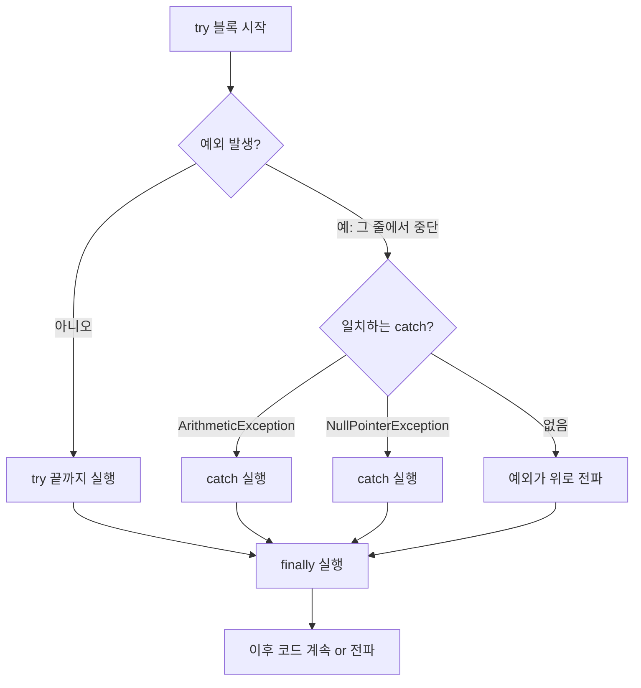
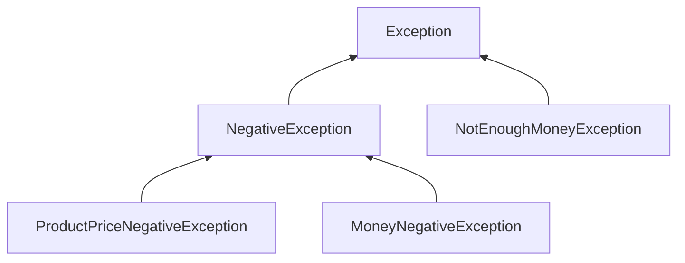
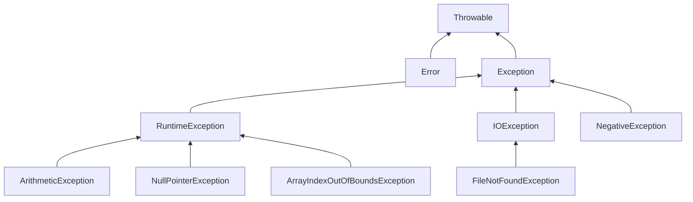

# 오늘 배운 것: Map 키-값 저장과 예외 처리·파일 입출력

## 들어가며 (Situation)

모듈 2 8일차. 10/7(7일차)에 `chap04-generic-and-collection`에서 List·Set까지 했고, 오늘은 컬렉션의 마지막인 Map을 하고 새 프로젝트 `chap05-exception-file-io`로 넘어갔다.

- `chap04` · `b_collection/c_map` — `HashMap`, `Properties`
- `chap05` · `a_exception/a_basic` — 예외를 처리하지 않으면 어떻게 되는가
- `chap05` · `a_exception/b_solved` — `try-catch-finally`와 `throw`
- `chap05` · `a_exception/c_userexception` — 사용자 정의 예외 클래스
- `chap05` · `b_fileio` — `FileWriter`, `FileReader`



7일차에 "여러 개를 담는 그릇"을 배웠다면, 오늘은 키로 값을 찾는 그릇(Map), 그리고 코드가 잘못 돌아갈 때 프로그램이 죽지 않게 하는 방법(예외 처리)과 프로그램 밖의 파일과 데이터를 주고받는 방법(File IO)이다. 오늘은 막힌 곳 없이 실습을 모두 이해하고 넘어갔다.

## 문제 상황 (Task)

오늘 실습 코드의 주석이 던진 질문들로 정리한다.

- 순서 번호(인덱스) 대신 **이름으로** 값을 찾아 꺼내려면 어떻게 하는가
- 같은 키를 두 번 넣으면 어떻게 되는가
- DB 주소·계정 같은 설정값은 어떤 구조로 들고 있는가
- `int[5]`의 6번 인덱스를 읽거나 `null`에 `.length()`를 부르면 프로그램은 어떻게 되는가
- 그런 오류가 나도 프로그램이 계속 돌게 하려면?
- 자바가 미리 정의해 둔 예외로는 "가진 돈이 부족합니다" 같은 우리 업무 규칙을 표현하기 어려운데, 직접 만들 수 있는가
- 프로그램이 끝나도 남는 데이터는 어떻게 파일로 저장하고 다시 읽는가

## 해결 과정 (Action)

### 1. Map: 키-값 한 쌍으로 저장한다

수업 주석이 정리한 Map의 특징은 두 가지다.

- **Key-Value** — 키-값 한 쌍으로 데이터를 저장한다.
- **Key는 내부적으로 Set 방식**이다 — 그래서 키는 중복될 수 없다.

`Map`도 `List`·`Set`처럼 인터페이스라서, 구현체인 `HashMap`으로 객체를 만든다.

```java
Map map = new HashMap();            // 제네릭 없이

map.put("one", new Date());
map.put(12, "apple");
map.put(12, "banana");              // 같은 키: 나중 값으로 덮어쓴다

System.out.println("map = " + map);
System.out.println("banana 값 출력하기 :" + map.get(12));
```

직접 실행해 보니 출력은 이랬다.

```text
map = {one=Thu Oct 08 16:08:16 KST 2026, 12=banana}
banana 값 출력하기 :banana
```

`12`를 두 번 넣었지만 항목은 한 개만 남고, 값은 뒤에 넣은 `banana`다. `apple`은 에러 없이 조용히 사라진다.

🔴 같은 키를 `put` 하면 **오류 없이 덮어쓴다.** 실수로 키가 겹쳐도 알려 주지 않으므로, 키를 어떻게 정할지 미리 정해 둬야 한다.

제네릭을 붙이면 7일차에 본 것처럼 타입이 고정된다.

```java
Map<String, String> map2 = new HashMap<>();
map2.put("one", "java");
map2.put("two", "javascript");
map2.put("three", "python");

map2.remove("three");               // 키로 삭제
```

수업 주석은 "Map의 Key는 암묵적으로 String 타입으로 하는 것이 일반적"이라고 적는다. 실행 결과는 `remove` 전 `{one=java, two=javascript, three=python}`, 후 `{one=java, two=javascript}`다.

| 구분 | List | Set | Map |
|------|------|-----|-----|
| 꺼내는 기준 | 인덱스 | (순회) | **키** |
| 저장 단위 | 값 1개 | 값 1개 | 키-값 **쌍** |
| 중복 | 값 중복 허용 | 값 중복 불가 | 키 중복 불가, 같은 키는 덮어씀 |
| 오늘 쓴 구현체 | `ArrayList` | `HashSet`, `TreeSet` | `HashMap`, `Properties` |

### 2. Properties: 키·값이 모두 String인 설정 파일용 Map

`Application02`는 `Properties`다. 수업 주석은 `.env`의 `DATABASE_URL = ...`을 예로 들며, 설정 파일에서 쓰는 Map이고 **Key와 Value가 모두 String**이라는 점이 특징이라고 정리한다.

```java
Properties prop = new Properties();
prop.setProperty("driver", "cj.jdbc.driver.mysql");
prop.setProperty("url", "jdbc:mysql://localhost/menudb");
prop.setProperty("username", "wanted");
prop.setProperty("password", "wanted");

System.out.println("prop = " + prop);
```

`HashMap`은 `put`, `Properties`는 `setProperty`를 쓴다. 직접 실행한 출력은 이랬다.

```text
prop = {password=wanted, driver=cj.jdbc.driver.mysql, url=jdbc:mysql://localhost/menudb, username=wanted}
```

넣은 순서(driver → url → username → password)와 출력 순서가 다르다. Map도 `Set`처럼 순서를 보장하지 않는다는 것을 눈으로 확인했다.

💡 DB 접속 정보처럼 "이름 = 값" 문자열을 코드 밖으로 빼는 설정 파일은 Key·Value가 모두 문자열이면 충분하다. 그래서 타입 제한이 아예 String으로 박힌 `Properties`가 따로 있다.

### 3. 예외: 처리하지 않으면 프로그램이 멈춘다

여기서부터 `chap05`다. 수업 주석은 오류를 둘로 나눴다.

- **컴파일 오류** — 코드를 작성할 때 발생. 없는 변수 참조, 타입 불일치 등.
- **런타임 오류** — 프로그램을 실행하면서 발생. 대표적으로 `NullPointerException`(null 참조).

`a_basic`은 처리 없이 일부러 예외를 일으킨다.

```java
System.out.println("프로그램 시작...");

int[] iarr = new int[5];
System.out.println("6번째 인덱스 출력 : " + iarr[6]);

String str = null;
str.length();

System.out.println("프로그램 종료...");
```

실행 결과는 이랬다.

```text
프로그램 시작...
Exception in thread "main" java.lang.ArrayIndexOutOfBoundsException: Index 6 out of bounds for length 5
	at com.wanted.a_exception.a_basic.Application.main(Application.java:18)
```

세 가지를 확인했다.

- 길이 5인 배열의 인덱스 6을 읽는 순간 `ArrayIndexOutOfBoundsException`이 발생했다.
- 바로 뒤의 `str.length()`(NPE 예정)는 **실행되지도 않았다.** 예외가 나면 그 줄에서 흐름이 끊긴다.
- `"프로그램 종료..."`도 찍히지 않았다. 주석 그대로 "비정상적으로 종료"된다.

🔴 예외를 처리하지 않으면 한 줄의 오류가 뒤의 모든 코드를 날린다. 이 상태가 오늘 문제의 출발점이다.

### 4. try-catch-finally로 처리한다

`b_solved`는 같은 오류를 처리하는 방식이다. 수업 주석이 정리한 두 가지는 이렇다.

| 방식 | 역할 |
|------|------|
| `try - catch - finally` | `try` 예외 가능 코드, `catch` 특정 예외 처리, `finally` 발생 여부와 무관하게 항상 실행 |
| `throws` 를 이용한 예외 전파 | 호출한 쪽으로 예외 처리를 넘김 |

```java
try {
    int result = 10 / 0;        // new ArithmeticException();
    String str = null;
    str.length();               // new NullPointerException();
} catch (ArithmeticException e) {
    System.out.println("예외 메세지 = " + e.getLocalizedMessage());
    System.out.println("ArithmeticException 예외 발생!!!!!!");
} catch (NullPointerException e) {
    System.out.println("예외 메세지 = " + e.getLocalizedMessage());
    System.out.println("NullPointerException 예외 발생!!!!!!");
} finally {
    System.out.println("예외 발생 여부와 관계 없이 실행됨...");
}
```

`try` 안에 오류가 **둘** 있는데 실행해 보니 출력은 이랬다.

```text
예외 메세지 = / by zero
ArithmeticException 예외 발생!!!!!!
예외 발생 여부와 관계 없이 실행됨...
```

`NullPointerException`의 `catch`는 한 번도 실행되지 않았다. `10 / 0`에서 이미 예외가 났고, 그 줄에서 `try` 블록이 끊겨 `str.length()`까지 가지 못했기 때문이다. 3절에서 본 "예외가 나면 그 줄에서 흐름이 끊긴다"를 `try` 안에서도 그대로 확인한 셈이다. `finally`는 예외가 났어도 실행되었다.



⚠️ `catch`는 위에서부터 차례로 맞는 것을 찾는다. 여러 `catch`가 있어도 실행되는 것은 **하나**뿐이다.

### 5. throw: 직접 예외를 일으키고 호출한 쪽에 넘긴다

두 번째 블록은 `checkAge(-10)`을 호출한다.

```java
try {
    checkAge(-10);
} catch (IllegalArgumentException e) {
    System.out.println("e.getMessage() = " + e.getMessage());
}

public static void checkAge(int age) {
    if (age < 0) {
        throw new IllegalArgumentException("나이는 음수일 수 없습니다!");
    }
    System.out.println("전달 받은 " + age + "는 유효한 나이입니다!");
}
```

출력은 `e.getMessage() = 나이는 음수일 수 없습니다!`였다. 수업 주석은 "실제로 예외를 발생시키는 메서드는 `checkAge()`이고, `throw`는 해당 메서드가 아닌 **호출한 쪽**에서 예외 처리를 담당하도록 위임한다고 보면 된다"고 정리한다.

그래서 `-10`이 들어오면 `"유효한 나이입니다"` 줄은 실행되지 않고, 던져진 예외는 `main`의 `catch`가 받는다.

- **throw**
  - 예외 객체를 **직접 던지는** 문장이다. `throw new IllegalArgumentException("메시지")`.
  - 던진 즉시 그 메서드는 중단되고, 호출한 쪽에서 `catch`로 받아야 한다.

- **catch 로 받은 e**
  - `e.getMessage()`는 예외를 만들 때 넘긴 메시지(생성자 인자)를 돌려준다.
  - `e.getLocalizedMessage()`는 4절에서 `/ by zero`를 출력했다.

### 6. 사용자 정의 예외: 우리 업무 규칙을 예외로 만든다

수업 주석은 이렇게 말한다. JDK가 미리 정의한 예외로는 현실 세계에서 생기는 수많은 예외를 처리하기에 **너무 추상적이고 제한적**이다. 그래서 `c_userexception`에서는 "상품 가격과 내가 가진 돈"을 비교하는 프로그램을 만들며, 세 가지 상황을 예외로 만들었다.

1. 상품 가격이 음수
2. 가진 돈이 음수
3. 가진 돈이 상품 가격보다 적음

예외 클래스는 4개다. 만드는 방법은 **모든 예외의 부모인 `Exception`을 상속**하는 것이다.

```java
public class NegativeException extends Exception {
    public NegativeException(String message) {
        super(message);
    }
}

public class ProductPriceNegativeException extends NegativeException {
    public ProductPriceNegativeException(String message) {
        super(message);
    }
}
```

*(`MoneyNegativeException`도 `NegativeException`을 같은 방식으로 상속, `NotEnoughMoneyException`은 `Exception`을 직접 상속)*



"음수라서 안 됨"이라는 공통점(`NegativeException`) 아래에 "가격이 음수", "돈이 음수"를 자식으로 두고, 성격이 다른 "돈 부족"은 `Exception` 바로 아래에 둔 구조다. 6일차에 배운 **상속**이 예외 설계에 그대로 쓰였다.

던지는 쪽은 `ExceptionTest.checkMoney`다.

```java
public void checkMoney(int productPrice, int money)
        throws ProductPriceNegativeException, MoneyNegativeException, NotEnoughMoneyException {

    if (productPrice < 0) {
        throw new ProductPriceNegativeException("상품의 가격은 음수일 수 없습니다!!!!!!");
    }
    if (money < 0) {
        throw new MoneyNegativeException("가진 돈이 음수일 수 없습니다!!!!!");
    }
    if (money < productPrice) {
        throw new NotEnoughMoneyException("가진 돈 보다 상품의 가격이 더 비싸요.........");
    }
    System.out.println("가진 돈이 충분합니다. 즐쇼!");
}
```

메서드 선언부의 `throws`는 "이 메서드는 이 예외들을 던질 수 있다"를 알리는 것이다. 받는 쪽 `main`은 세 `catch`를 모두 쓰고 `et.checkMoney(50000, 30000)`을 호출했다. 가격 50,000이 가진 돈 30,000보다 비싸므로 출력은 `가진 돈 보다 상품의 가격이 더 비싸요.........`였다.

⚠️ `Exception`을 상속한 예외는 `throws`로 선언하거나 `try-catch`로 처리하지 않으면 **컴파일이 되지 않는다.** 4절의 `ArithmeticException`·`NullPointerException`은 처리를 강제하지 않았던 것과 다르다. (이 구분은 공식 문서의 checked / unchecked exception이다. 오늘 실습에서 직접 컴파일 에러를 내 보지는 않았다.)

💡 예외를 코드 흐름 대신 **클래스 이름과 메시지**로 구분하게 되니, `catch`만 읽어도 "가격 음수 / 돈 음수 / 돈 부족" 세 갈래가 바로 보인다.

### 7. 파일 입출력: FileWriter와 FileReader

`b_fileio`는 파일을 쓰고 다시 읽는 실습이다. 코드의 주석 하나가 이 절의 구조를 설명한다. "File IO 관련 클래스들은 객체 생성 시 예외를 반드시 처리하게 설정이 되어 있다." 즉 위의 `Exception` 상속 예외(checked)가 실제로 쓰이는 사례다.

```java
// 파일 쓰기
try {
    FileWriter writer = new FileWriter("output.txt");
    writer.write("Hello, File IO!!!");
    writer.write("File Test");
    writer.flush();                 // 버퍼에 있는 데이터를 밀어서 디스크에 저장
} catch (IOException e) {
    throw new RuntimeException(e);
}

// 파일 읽기
try {
    FileReader reader = new FileReader("output.txt");
    int data;
    while ((data = reader.read()) != -1) {      // 파일 끝이면 -1
        System.out.println((char) data);
    }
} catch (FileNotFoundException e) {
    throw new RuntimeException(e);
} catch (IOException e) {
    throw new RuntimeException(e);
}
```

- **flush()**
  - `write`한 내용은 먼저 버퍼(연결 통로)에 쌓인다. `flush()`가 그 데이터를 밀어서 디스크에 저장한다.
  - 수업 주석 그대로 "버퍼에 있는 데이터를 밀어서 디스크에 저장"하는 단계다.

- **read() 와 -1**
  - `FileReader.read()`는 한 번에 **문자 하나**를 `int`로 돌려주고, 파일 끝에 도달하면 `-1`을 반환한다.
  - 그래서 `(data = reader.read()) != -1`로 끝까지 반복하고, 출력할 때는 `(char) data`로 문자로 바꿔야 한다.

직접 실행한 결과, 프로젝트 폴더에 `output.txt`가 만들어졌고 내용은 `Hello, File IO!!!File Test`였다. 두 `write`를 이어서 썼으므로 줄바꿈 없이 붙어 있다. 읽을 때는 `println`으로 문자 하나씩 출력해서 `H`, `e`, `l`, `l`, `o`, `,` … 가 **한 줄에 한 글자씩** 나왔다.

⚠️ 파일 경로 `"output.txt"`는 상대 경로라서 프로그램을 실행한 위치 기준으로 만들어진다. 이번엔 프로젝트 루트(`chap05-exception-file-io/`)에 생겼다. 또 `FileWriter`를 `new FileWriter("output.txt")`로 만들면 실행할 때마다 기존 내용을 덮어쓰는 것이 기본 동작이다. (공식 문서 기준, 오늘 두 번 실행해 덮어쓰기를 확인한 것은 아니다.)

⚠️ 오늘 코드에는 `writer.close()`, `reader.close()`가 없다. `flush()` 덕분에 파일에는 정상 저장됐지만, 열어 둔 파일을 닫는 것은 따로 해야 하는 일이다. 이 부분은 아래 "더 학습하면 좋은 개념"의 `try-with-resources`로 이어진다.

## 결과 (Result)

| 항목 | 오늘 |
|------|------|
| 실습 프로젝트 | `chap04`(c_map 이어서) + `chap05-exception-file-io` 신규 |
| 실습한 패키지 | 5개 (`c_map`, `a_basic`, `b_solved`, `c_userexception`, `b_fileio`) |
| 자바 파일 | 11개 (`c_map` 2 + 예외 8 + File IO 1) |
| 직접 만든 예외 클래스 | 4개 |
| 새로 쓴 클래스 | `HashMap`, `Properties`, `FileWriter`, `FileReader` |
| 새로 쓴 키워드 | `try` · `catch` · `finally` · `throw` · `throws` |

- `Map`은 키로 값을 찾고, 같은 키는 **조용히 덮어쓴다.** `Properties`는 Key·Value가 모두 String인 설정용 Map이다.
- 예외를 처리하지 않으면 그 줄에서 흐름이 끊기고 프로그램이 종료된다. `try-catch-finally`는 이 흐름을 살리고, 일치하는 `catch` 하나만 실행된다.
- 예외 클래스도 `Exception`을 상속해 우리 업무 규칙에 맞게 만들 수 있다. 상속 구조로 "음수" 같은 공통 성격을 묶을 수 있다.
- 파일 쓰기는 `write` 후 `flush`, 읽기는 `read()`가 `-1`을 돌려줄 때까지 반복한다.

## 심화: 노션 자료 중 오늘 범위

노션 `3. 컬렉션 프레임워크와 Exception`의 **2. JCF 주요 인터페이스 활용**과 **3. 예외 처리(Exception Handling)**를 읽었다. 7일차에 읽은 "1. JCF의 필요성과 구조 이해"에 이어지는 장이다.

⚠️ 아래 코드 예시는 노션 자료의 예시 코드를 옮긴 것이고 오늘 직접 실행한 실습 코드가 아니다.

### 컬렉션 3종, 언제 무엇을 쓰는가 (노션 2장 §4)

노션은 요구사항을 먼저 주고 "적합한 컬렉션"을 고르는 방식으로 정리한다.

| 요구사항 | 적합한 컬렉션 | 이유 |
|----------|---------------|------|
| 학생 이름을 입력 순서대로 저장, 같은 이름 중복 가능 | `List<String>` | 순서 유지 + 중복 허용 |
| 같은 학생이 여러 번 출석해도 한 번만 기록 | `Set<String>` (`HashSet`) | 중복 불가, 순서 무관 |
| 이름으로 점수를 빠르게 조회 | `Map<String, Integer>` | 이름이 Key, 점수가 Value |

💡 7일차 `List`·`Set`과 오늘 `Map`이 노션에서는 한 표로 묶인다. 고르는 기준은 "순서가 필요한가 / 중복을 막아야 하는가 / 이름(키)으로 찾는가" 세 질문이다.

- **`Map`을 순회하는 `entrySet()`**
  - `keySet()`은 모든 Key, `values()`는 모든 Value, `entrySet()`은 Key-Value 쌍(`Map.Entry<K, V>`) 전체를 돌려준다.
  - 오늘 실습은 `put`·`get`·`remove`까지만 했고, 전체를 훑는 이 방식은 코드로 해 보지 않았다.

```java
for (Map.Entry<String, Integer> entry : scores.entrySet()) {
    System.out.println(entry.getKey() + " : " + entry.getValue());
}
```

*(노션 예시 코드)*

- **`HashSet`과 `equals()`·`hashCode()`**
  - 노션은 `new User("Alice")`를 두 번 넣은 `HashSet<User>`의 `size()`가 2가 나오는 예를 든다. `equals()`·`hashCode()`를 재정의하지 않았기 때문이다.
  - `HashSet`은 이 두 메서드로 중복을 판단하므로, 직접 만든 클래스를 담으려면 둘 다 오버라이딩해야 한다고 정리한다.
  - 오늘 `HashMap`의 Key가 중복 불가인 것도 같은 원리다. 노션은 `HashSet`이 내부적으로 `HashMap`으로 만들어져 있다고 적는다.

### 예외 처리 이론 (노션 3장)

| 구분 | Error | Exception |
|------|-------|-----------|
| 의미 | 시스템 수준의 심각한 문제 | 개발자가 예측하고 처리할 수 있는 문제 |
| 예 | JVM 에러, 정전, 하드웨어 문제 | 0으로 나누기, 배열 범위 초과 |
| 처리 | 코드로 처리하기 어렵다 | `try-catch`·`throws`로 흐름을 제어한다 |

둘 다 `Throwable`을 상속한다. 오늘 `NegativeException extends Exception`으로 만든 예외들이 이 계층에서 어디에 놓이는지 그려 보면 이렇다.



*(노션의 계층도 설명과 오늘 실습에 나온 클래스를 합쳐 간략히 그린 구조도)*

| 구분 | Checked | Unchecked (`RuntimeException` 계열) |
|------|---------|--------------------------------------|
| 처리 | 반드시 해야 하며 안 하면 **컴파일 에러** | 강제하지 않는다 |
| 오늘 실습의 예 | `NegativeException` 등 사용자 정의 예외, `IOException` | `ArithmeticException`, `NullPointerException`, `ArrayIndexOutOfBoundsException` |

🟢 6절에서 "처리하지 않으면 컴파일이 안 된다"고 적은 `Exception` 상속 예외와, 3절에서 아무 처리 없이 그냥 터진 `ArrayIndexOutOfBoundsException`이 바로 이 표의 두 열이다.

노션은 `RuntimeException`의 후손도 다섯 가지 소개한다.

| 예외 | 발생 상황 |
|------|-----------|
| `ArithmeticException` | 0으로 나눌 때 |
| `ArrayIndexOutOfBoundsException` | 배열 인덱스 범위를 넘을 때 |
| `NullPointerException` | `null` 상태의 인스턴스에 접근할 때 |
| `ClassCastException` | 형변환 시 자료형에 문제가 있을 때 |
| `NegativeArraySizeException` | 배열 크기를 음수로 지정할 때 |

세 가지는 오늘 실습에서 만났고, `ClassCastException`·`NegativeArraySizeException`은 만나지 못했다.

- **`catch` 순서**
  - 여러 `catch`를 이어 쓸 수 있고, 상위 타입의 예외를 처리하는 `catch`는 **아래쪽**에 둔다고 노션은 적는다.
  - 오늘 `main`은 자식 예외 두 개와 `NotEnoughMoneyException`만 잡았지만, 만약 부모 `NegativeException`의 `catch`를 추가한다면 `ProductPriceNegativeException`(자식)보다 아래에 둬야 한다는 뜻이다.

- **오버라이딩 시 예외 범위**
  - 오버라이딩한 메서드는 부모의 원본 메서드보다 **더 상위 타입의 예외**를 던질 수 없다.
  - 노션 예시: 부모가 `throws IOException`이면 자식은 예외 없음, 같은 `IOException`, 더 구체적인 `FileNotFoundException`은 되고 `Exception`은 에러다.

```java
public class SubClass extends SuperClass {
    @Override
    public void method() throws FileNotFoundException {}   // 정상 (부모는 throws IOException)
}
```

*(노션 예시 코드 중 정상 케이스 하나만 옮겼다)*

- **try-with-resources**
  - Java 7에서 추가되었고, `finally` 없이 자원 반납(`close()`)을 처리하려고 도입된 문법이다.
  - 노션 요약은 `AutoCloseable`을 구현한 자원을 자동으로 반환한다고 정리한다.

```java
try (BufferedReader in = new BufferedReader(new FileReader("test.dat"))) {
    String s;
    while ((s = in.readLine()) != null) {
        System.out.println(s);
    }
} catch (IOException e) {
    e.printStackTrace();
}
```

*(노션 예시를 단순화함. 원본은 `catch (FileNotFoundException e)`와 `catch (IOException e)` 두 개로 나눠 쓴다)*

🟢 오늘 7절에서 "`close()` 없이 `flush()`만 했다"고 적은 부분의 해법이 바로 이 구문이다. 위 예시는 줄 단위로 읽는 `BufferedReader.readLine()`도 보여 주는데, 오늘 `FileReader.read()`는 문자 하나씩이었다.

노션 Summary는 마지막으로 **예외 삼키기를 지양**하고 적절한 예외 메시지와 로깅을 남기라고 정리한다. 빈 `catch {}`로 예외를 무시하면 원인을 잃어버리기 때문이다. 오늘 `b_fileio`처럼 `throw new RuntimeException(e)`로 감싸 다시 던지는 방식은 원인(`e`)을 함께 넘긴다는 점에서 삼키는 것과 다르다.

### 노션 내용 중 확인이 필요한 부분

⚠️ 아래는 노션 문장을 그대로 믿기 전에 공식 문서와 대조해 본 부분이다. 오늘 직접 실행해서 확인한 것은 아니다.

- 노션은 `Set`이 "하나의 `null` 값만 저장할 수 있다"고 적는다. `HashSet`은 `null`을 하나 허용하지만 `TreeSet`은 자연 순서 정렬에서 `null`을 `add`하면 `NullPointerException`이 난다. 7일차에도 적은 구현체별 차이다.
- 노션은 `HashMap`이 "저장은 느리지만 검색이 뛰어나다"고 적는다. 공식 문서는 해시가 잘 분산될 때 기본 연산(`get`, `put`)이 **상수 시간**이라고 설명한다. 저장이 특별히 느리다고 보기는 어렵다.
- 노션은 `ArrayList`를 만들면 "내부적으로 10칸짜리 배열을 생성"한다고 적는다. 기본 용량이 10인 것은 맞지만, 최근 JDK는 빈 배열로 시작해 **첫 `add` 때** 10칸을 잡는 것으로 알려져 있다. 구현 세부는 JDK 버전을 확인해야 한다.
- 노션은 "Unchecked Exception 계열은 기본적으로 이미 처리되어 있다"고 적는다. 정확히는 컴파일러가 처리를 **강제하지 않는** 것이고, 처리하지 않으면 3절의 실행 결과처럼 프로그램이 종료된다. Unchecked에는 `RuntimeException` 계열 외에 `Error`도 포함된다.

## 더 학습하면 좋은 개념

- **`AutoCloseable`을 직접 구현한 자원** — try-with-resources는 `FileReader` 같은 기존 클래스뿐 아니라 `AutoCloseable`을 구현한 모든 클래스에 쓸 수 있다. 직접 만든 자원 클래스에 `close()`를 구현해 보면 자동 반환이 어떤 순서로 일어나는지 보인다.
- **`BufferedReader` / `BufferedWriter`와 `Files`** — 오늘은 문자 하나씩 읽었는데, 버퍼를 쓰면 줄 단위로 효율적으로 읽을 수 있다. 실무 파일 처리의 기본 형태다.
- **예외 로깅 (SLF4J 등)** — 노션이 말한 "예외 삼키기 지양"은 `printStackTrace()`보다 로그로 남기는 습관으로 이어진다. 운영 환경에서 원인을 추적하려면 필수다.
- **오버라이딩과 예외 범위 (리스코프 치환 원칙)** — 부모보다 넓은 예외를 던질 수 없는 이유는 부모 타입으로 쓰는 코드가 깨지지 않게 하려는 것이다. SOLID 원칙과 연결해서 보면 외우지 않아도 이해된다.
- **`HashMap`의 동작 원리 (`hashCode` / `equals`)** — "키는 중복 불가"가 어떻게 판단되는지, 직접 만든 클래스를 키로 쓸 때 왜 두 메서드를 재정의해야 하는지를 알면 Map과 Set(`HashSet`)이 함께 이해된다.

## 참고 자료

- [Java SE API - Map](https://docs.oracle.com/en/java/javase/21/docs/api/java.base/java/util/Map.html)
- [Java SE API - HashMap](https://docs.oracle.com/en/java/javase/21/docs/api/java.base/java/util/HashMap.html)
- [Java SE API - Properties](https://docs.oracle.com/en/java/javase/21/docs/api/java.base/java/util/Properties.html)
- [Oracle Java Tutorials - Exceptions](https://docs.oracle.com/javase/tutorial/essential/exceptions/index.html)
- [Oracle Java Tutorials - The try-with-resources Statement](https://docs.oracle.com/javase/tutorial/essential/exceptions/tryResourceClose.html)
- [Java SE API - FileWriter](https://docs.oracle.com/en/java/javase/21/docs/api/java.base/java/io/FileWriter.html)
- [Java SE API - FileReader](https://docs.oracle.com/en/java/javase/21/docs/api/java.base/java/io/FileReader.html)
