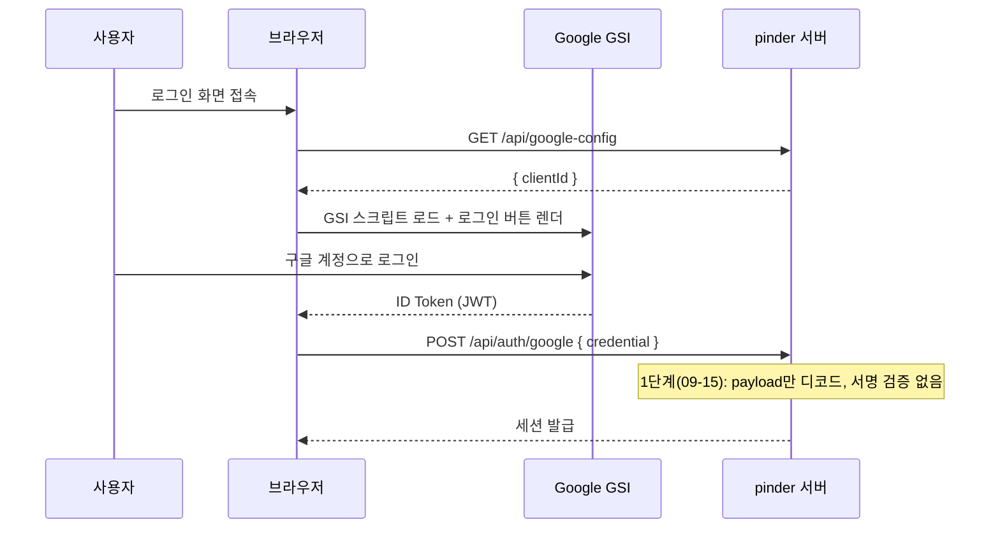

> `pinder` 팀 프로젝트에서 내가 맡은 외부 서비스 연동을 하나씩 깊게 기록하는 시리즈다. 이 편은 Google 로그인 — [일차별 학습노트]({{ site.baseurl }}/cloud/day15/)에는 "Google 로그인까지 연동했다" 한 줄로 지나간 작업이지만, 실제로는 이틀에 걸쳐 두 단계로 끝난 일이었다.

## 문제 상황 (Task)

레거시 `.dc.html` 프로토타입의 로그인 화면에는 Google 로그인 버튼이 이미 그려져 있었다. 하지만 그건 정말 그림뿐이었다 — 클릭해도 아무 일도 일어나지 않는 자리표시자(placeholder)였다. 실제로 작동하게 만들려면:

- 프로토타입에 하드코딩돼 있던 Client ID를 코드에 그대로 박아두지 않고 서버 환경변수로 옮겨야 했다.
- Google Identity Services(GSI) 스크립트를 로드하고, 로그인 성공 시 돌아오는 ID 토큰(JWT)을 실제로 검증해야 했다.
- "이미 가입한 사람"과 "구글로 처음 오는 사람"을 구분해서, 후자는 바로 계정을 만들지 않고 회원가입 화면으로 보내야 했다 — 아이디·별명·비밀번호는 직접 입력받아야 하는 서비스 정책 때문이었다.

## 시도한 방법 (Action)

### 1단계(09-15) — 일단 로그인은 되게 만든다



가장 먼저 한 건 Kakao 연동 때 썼던 패턴을 그대로 가져오는 것이었다. `GOOGLE_CLIENT_ID`를 서버 환경변수로 두고, 브라우저는 `/api/google-config`를 호출해서만 클라이언트 ID를 받아온다. `lib/google-auth.ts`에서 GSI 스크립트를 로더로 감싸고, 로그인 버튼을 실제로 렌더링한 뒤 성공 콜백에서 `SessionProvider`로 로그인 처리까지 붙였다.

🔴 다만 이 시점의 구현은 받은 ID 토큰의 payload를 그냥 디코드해서 믿는 수준이었다 — 서명 검증이 없었다. 커밋 메시지에도 이걸 숨기지 않고 그대로 적었다.

> `lib/google-auth.ts: GSI 스크립트 로더 + 로그인 버튼 렌더링 + JWT payload 디코드(서명 검증은 없음 — TODO 로 명시, 이 앱 전체가 아직 목업 인증 단계라 같은 신뢰 수준으로 맞춤)`

⚠️ 이때는 로그인/회원가입 전체가 아직 `localStorage` 목업이던 시점이라, "다른 부분도 어차피 실제 보안 경계가 없으니 여기만 완벽하게 만드는 게 우선순위상 맞지 않다"는 판단이었다. 대신 TODO로 명시해서 다음날 반드시 고칠 항목이라는 걸 남겨뒀다.

### 2단계(09-16) — 진짜 백엔드로 옮기면서 서명 검증을 붙인다

다음날 인증 전체를 Neon Postgres 기반 실제 백엔드로 옮기는 작업(`feat(backend): 인증/경로 목업을 실제 백엔드로 교체`) 안에서, Google 로그인도 같이 하드닝됐다. `src/lib/server/google.ts`에 `google-auth-library`의 `OAuth2Client`를 써서 진짜 서명 검증을 붙였다.

```ts
export async function verifyGoogleCredential(
  credential: string,
): Promise<VerifiedGoogleProfile | null> {
  const clientId = process.env.GOOGLE_CLIENT_ID;
  if (!clientId) return null;

  const client = new OAuth2Client(clientId);
  try {
    const ticket = await client.verifyIdToken({ idToken: credential, audience: clientId });
    const payload = ticket.getPayload();
    if (!payload?.sub || !payload.email || !payload.email_verified) return null;
    return { googleId: payload.sub, email: payload.email, name: payload.name ?? payload.email };
  } catch {
    return null;
  }
}
```

🟢 `verifyIdToken`은 서명뿐 아니라 발급자(issuer)와 audience(우리 Client ID로 발급된 토큰이 맞는지)까지 함께 검증한다. `email_verified`가 거짓이면 아예 거부하도록 했다 — 이메일이 확인되지 않은 구글 계정으로 우리 서비스에 가입하는 경로를 막기 위해서였다.

### 3단계(09-16) — "로그인"과 "가입"을 분리한다

여기서 새로운 문제가 나왔다. 처음 구글로 오는 사람을 곧바로 계정으로 만들어 로그인시키면, 우리 서비스가 요구하는 아이디·별명·비밀번호를 받을 기회가 없었다. `feat(auth): 구글 첫 로그인 시 바로 가입시키지 않고 회원가입 화면으로 이동` 커밋에서 이 흐름을 다시 짰다.

| 상황 | 이전 | 이후 |
|---|---|---|
| 이미 googleId/이메일이 매칭되는 계정 | 바로 로그인 | 바로 로그인 (동일) |
| 처음 구글로 오는 계정 | 즉시 계정 생성 후 로그인 | 이메일 인증만 완료 처리 → `needsSignup` 응답 → `/signup?email=...&googleVerified=1`로 이동 |

회원가입 화면은 이 쿼리 파라미터로 이메일·이름을 미리 채우고 이메일 인증 단계를 건너뛰게 했다(입력칸도 잠금). 아이디·별명·비밀번호만 직접 입력하면 가입이 완료된다.

🔴 그런데 이 변경의 부작용으로, 구글로 "처음" 온 사람에게 나가야 할 환영 이메일이 안 나가는 문제가 생겼다. 환영 이메일 발송 로직이 "계정이 새로 생성되는 시점"을 기준으로 걸려 있었는데, 구글 흐름이 2단계(이메일 인증 완료 → 회원가입 화면에서 실제 가입 완료)로 쪼개지면서 그 기준점이 어긋난 것이다. `feat(email): 환영/탈퇴 이메일 디자인 개선 + 구글 첫 로그인 시 환영 이메일 누락 수정`에서 "기존 이메일 계정에 연결되는 경우는 제외하고, 진짜 새 계정이 만들어지는 순간"을 다시 정확히 짚어서 고쳤다.

### 4단계(09-17) — 다크모드에서 흰 박스가 남는다

기능은 다 됐는데 디자인이 안 맞았다. 구글 로그인 버튼은 구글이 제공하는 위젯을 그대로 렌더링하는 방식이라 커스텀 스타일을 직접 입힐 수 없었다. 다크모드에서 버튼 주위에 흰 박스가 그대로 남아 눈에 띄었다.

🟢 `fix(login): 다크모드 구글 로그인 버튼 주위 흰 박스 제거`, `fix(login): 구글 로그인 버튼을 자체 디자인 + 투명 오버레이로 교체`로 해결했다 — 실제 구글 버튼은 투명하게 위에 겹쳐 클릭만 받게 하고, 눈에 보이는 버튼은 레거시 디자인 그대로의 자체 버튼을 그렸다.

## 배운 점 (Result)

- **"일단 동작하게"와 "안전하게 동작하게"는 다른 작업이다.** 09-15엔 로그인이 화면상으론 완벽하게 됐지만, 서명 검증 없이 payload를 믿는 구현이었다. TODO로 남겨두고 다음날 실제로 갚았다는 점이 중요했다 — 눈속임으로 남겨두지 않고 커밋 메시지에 명시했기 때문에 놓치지 않을 수 있었다.
- **OAuth 버튼은 "로그인"과 "가입"이 항상 같지 않다.** 우리 서비스처럼 별도의 아이디·비밀번호를 요구하는 정책이 있으면, 소셜 로그인도 "이미 있는 사람"과 "처음 오는 사람"을 분기해야 한다는 걸 직접 겪으며 알게 됐다.
- **부가 효과(환영 이메일)는 메인 로직을 바꿀 때 같이 깨질 수 있다.** 가입 흐름을 2단계로 쪼갠 순간 "계정 생성 시점"을 기준으로 삼던 다른 로직이 조용히 어긋났다 — 이후로는 흐름을 바꿀 때 "이 이벤트를 기준으로 도는 다른 로직이 있는가"를 먼저 확인하는 습관이 생겼다.

## 더 학습하면 좋은 개념

- **OAuth 2.0 / OpenID Connect** — Authorization Code와 ID Token(JWT)의 차이, `audience`·`issuer` 클레임이 왜 검증돼야 하는지를 공식 스펙 기준으로 정리해두면 다음에 다른 소셜 로그인을 붙일 때도 같은 틀을 재사용할 수 있다.
- **JWT 서명 검증** — `verifyIdToken`이 내부적으로 Google의 공개키(JWKS)를 가져와 서명을 검증하는 절차를 좀 더 깊이 알아두면, "왜 payload 디코드만으론 안 되는지"를 남에게 설명할 수 있는 수준까지 이해가 깊어진다.
- **계정 연동(Account Linking) 정책** — 이메일이 같은 기존 계정과 구글 로그인을 자동으로 연결할지, 별도 확인을 거칠지는 서비스마다 정책이 다르다. 보안과 사용자 편의 사이의 트레이드오프를 다른 서비스 사례로 비교해볼 만하다.
- **Progressive Hardening(점진적 보강)** — 09-15의 임시 구현을 09-16에 갚은 패턴처럼, MVP 단계에서 의도적으로 남겨둔 리스크를 어떻게 추적하고 언제 갚을지 팀 차원의 규칙으로 만들어두면 좋다.

## 참고 자료
- [Google Identity Services 공식 문서](https://developers.google.com/identity/gsi/web/guides/overview)
- [Google - OpenID Connect 로 ID 토큰 검증하기](https://developers.google.com/identity/openid-connect/openid-connect#validatinganidtoken)
- [google-auth-library-nodejs GitHub](https://github.com/googleapis/google-auth-library-nodejs)
- [MDN - HttpOnly 쿠키와 세션 보안](https://developer.mozilla.org/en-US/docs/Web/HTTP/Cookies)
