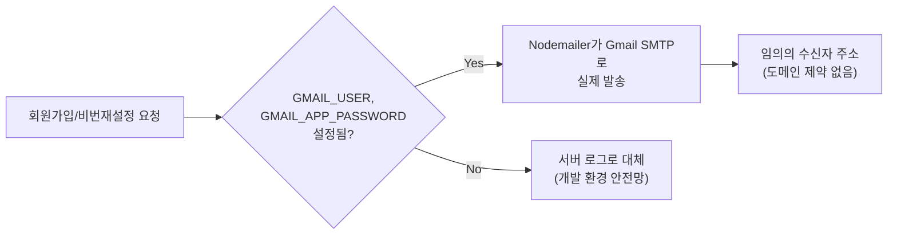

> [일차별 학습노트 16일차]({{ site.baseurl }}/cloud/day16/)에도 이 작업이 실려 있지만, 여기서는 Resend가 왜 막혔는지, Gmail SMTP로 넘어가면서 같이 터진 문제까지 더 깊게 남긴다.

## 문제 상황 (Task)

회원가입·비밀번호 재설정에는 이메일 인증번호가 필수였다. 처음엔 트랜잭션 이메일 서비스인 Resend를 붙였는데, 실제로 팀원이 아닌 다른 이메일(학교 이메일 등)로 가입을 시도하자 인증 메일이 전혀 도착하지 않았다.

🔴 원인을 찾아보니 Resend는 **도메인 인증 전까지는 계정 소유 이메일로만 발송이 가능**했다. 우리는 커스텀 도메인을 구매·인증할 계획이 없었기 때문에, 이 제약은 우회 방법이 아니라 서비스 자체를 못 쓰게 만드는 벽이었다.

## 시도한 방법 (Action)

### 1차 대응 — 일단 회원가입이 막히지는 않게

Resend가 실패해도 회원가입 자체는 진행돼야 했다. 처음엔 발송 실패 시 그대로 에러를 던지고 있어서, 가입 시도 자체가 막혀 있었다.

🟢 `fix(email,chat): Resend 발송 실패는 로그로 대체, 깨진 chat 라우트 문법 수정`에서 발송이 실패하면 인증번호를 서버 로그로 남기고 가입은 정상 진행하도록 바꿨다. `RESEND_API_KEY`가 아예 없을 때와 같은 대체 경로를 재사용한 것이라, 나중에 도메인을 인증하면 코드 변경 없이 바로 실발송으로 전환될 수 있게 설계했다.

⚠️ 다만 이건 임시방편이었다 — 실사용자는 로그를 볼 수 없으니, 인증번호를 "받을 수 없는" 상태 자체는 그대로였다.

### 2차 대응 — Gmail SMTP로 완전히 갈아타기

같은 날 `feat(email): Resend 대신 Gmail SMTP로 이메일 인증번호 실발송`으로 발송 수단 자체를 바꿨다. Nodemailer + Gmail 앱 비밀번호(App Password) 조합이었다.

| 발송 방식 | 제약 | 우리 케이스 |
|---|---|---|
| Resend (도메인 미인증) | 계정 소유 이메일로만 발송 가능 | 실사용자에게 발송 불가 |
| Gmail SMTP (nodemailer + 앱 비밀번호) | 발신 계정만 Gmail이면 수신자 제한 없음 | 실사용자에게 발송 성공 |

🟢 `GMAIL_USER`/`GMAIL_APP_PASSWORD` 환경변수가 없으면 이전처럼 서버 로그로 대체하는 안전망도 그대로 남겨서, 로컬 개발 환경에서는 실제 메일을 안 보내고도 인증번호를 확인할 수 있게 했다.

실제로 내 학교 이메일 계정으로 발송해서 수신까지 직접 확인했다 — 로그로 "발송됐다"고 나오는 것과 실제로 받은 편지함에 도착하는 것은 다른 확인이라, 이 단계를 건너뛰지 않았다.

### 부산물 — 같은 커밋에서 발견한 깨진 API 라우트

이메일 문제를 고치던 중, 팀원 커밋이 main에 문법 오류(`JSON.stringify` 괄호 불일치)가 있는 채로 올라와 있어서 `/api/chat`이 통째로 깨져 있는 걸 발견했다. 실제로 호출해서 재현을 확인한 뒤 같은 커밋에서 같이 고쳤다.

💡 이메일 문제를 붙잡고 있다가 곁가지로 발견한 버그였지만, "메일이 왜 안 오지?"를 확인하려고 이것저것 API를 직접 호출해보는 과정에서 우연히 걸린 문제였다 — 한 영역을 디버깅하다 보면 다른 영역의 문제도 같이 드러난다는 걸 실감했다.

### 그 다음 문제들 — 쿨다운과 발신자 표시명

다음날(09-17) 인증번호 재전송을 연속으로 눌러도 메일이 계속 나가는 문제가 발견됐다.

🔴 `issueVerificationCode`에 실제 쿨다운 검사가 없이 클라이언트 상태(버튼 비활성화)만 믿고 있었다 — 느린 네트워크나 연타 상황에서는 클라이언트 검사를 우회해서 인증 메일이 여러 통 발송될 수 있었다.

🟢 `fix(auth): 이메일 인증번호 재전송 쿨다운 서버 강제 + 발신자 표시명 수정`에서 서버 쪽에 `createdAt` 기준 60초 쿨다운을 강제했다. 같은 커밋에서 Gmail 발신자 표시명 `"p:nder"`가 콜론 때문에 따옴표 없이 파싱되어 일부 메일 클라이언트에서 `"p"`로만 잘려 보이던 문제도 같이 고쳤다.

## 배운 점 (Result)

- **무료/저가 이메일 서비스의 제약은 문서를 미리 읽어도 실사용자 테스트 전까지 체감이 안 된다.** Resend의 도메인 인증 제약은 공식 문서에 분명히 적혀 있었지만, "내 계정으로 보내는 테스트"에서는 항상 성공했기 때문에 문제를 늦게 발견했다. 실사용자와 다른 주소로 실제 발송 테스트를 해보는 습관이 필요했다.
- **클라이언트 검증만으로는 규칙이 지켜지지 않는다.** 재전송 쿨다운을 버튼 비활성화로만 막아뒀던 게 서버에서 강제되지 않으면 우회될 수 있다는 걸 직접 겪었다 — 이후로는 "클라이언트가 막아주는 규칙"과 "서버가 반드시 강제해야 하는 규칙"을 구분해서 생각하게 됐다.
- **폴백 경로를 미리 설계해두면 서비스를 나중에 다시 만질 필요가 없다.** `RESEND_API_KEY`/`GMAIL_USER`가 없을 때 로그로 대체하는 경로를 처음부터 공유해둔 덕분에, 로컬 개발 환경은 실제 메일 발송 설정 없이도 그대로 굴러갔다.

## 더 학습하면 좋은 개념

- **SMTP와 트랜잭션 이메일 서비스 비교** — Nodemailer/SMTP 직접 발송과 Resend·SendGrid 같은 API 기반 서비스가 각각 도메인 인증, 발송량 제한, 전달률(deliverability) 측면에서 어떻게 다른지 공식 문서로 비교해두면 다음 프로젝트에서 선택 기준이 생긴다.
- **SPF/DKIM/DMARC** — 지금은 Gmail 계정으로 그냥 보내고 있지만, 실제 서비스라면 발신 도메인의 신뢰도를 올리는 이 세 가지 레코드를 이해해야 스팸함으로 분류되는 문제를 피할 수 있다.
- **서버 측 Rate Limiting** — 이메일 재전송 쿨다운처럼, 비용이 들거나 남용될 수 있는 모든 액션은 클라이언트가 아니라 서버가 최종 방어선이어야 한다는 원칙을 다른 기능(로그인 시도 등)에도 일관되게 적용해볼 만하다.
- **이메일 헤더 인코딩** — 발신자 표시명에 특수문자(`:`)가 들어갈 때 왜 따옴표 처리가 필요한지, RFC 5322 헤더 형식을 알아두면 비슷한 인코딩 문제를 다시 겪지 않는다.

## 참고 자료
- [Nodemailer 공식 문서](https://nodemailer.com/about/)
- [Nodemailer - Gmail 사용 가이드](https://nodemailer.com/usage/using-gmail/)
- [Google - 앱 비밀번호로 로그인하기](https://support.google.com/accounts/answer/185833)
- [Resend 공식 문서 - Domain Verification](https://resend.com/docs/dashboard/domains/introduction)
