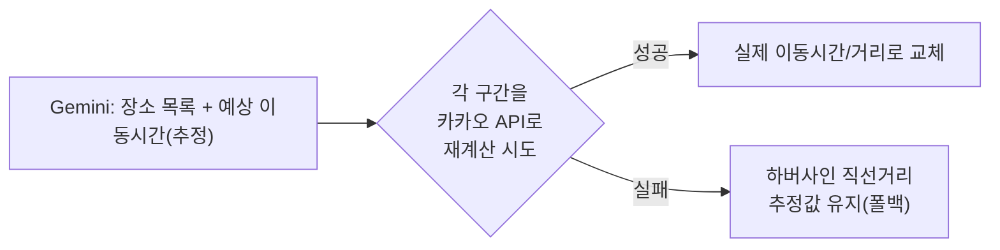
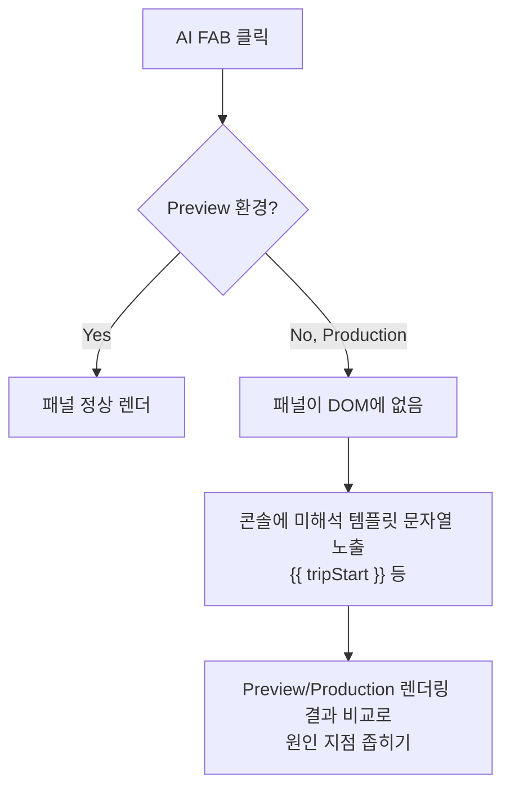

> 시리즈 마지막 편. Gemini를 쓰는 두 기능 — AI 일정 생성 마법사와 채팅형 AI 도우미(`/api/chat`) — 을 다룬다. 앞의 셋(구글·이메일·카카오)이 "처음부터 안 됨"이었다면, 이번은 "로컬에선 되는데 배포하면 이상해지는" 종류의 문제라 원인을 좁히는 과정 자체가 달랐다.

## 문제 상황 (Task)

`/api/route-generate`는 Gemini에게 사용자가 고른 지역·일정·이동수단을 넘겨 여행 일정을 통째로 생성해달라고 요청하는 라우트였다. `/api/chat`은 지금 짜고 있는 경로를 컨텍스트로 넘겨 질문에 답하는 채팅형 도우미였다. 둘 다 겉으로는 잘 도는 것처럼 보였는데, 실제로 써보니 문제가 두 층위에서 나왔다.

1. **AI가 만드는 결과 자체의 품질** — 같은 광역 지역을 고르면 매번 같은 도시만 추천되고, 이동시간·거리는 AI가 지어낸 추정값이었다.
2. **배포 환경에서만 재현되는 문제** — Preview(로컬/미리보기)에서는 정상 동작하는 AI 도우미가 Vercel Production에서는 아예 열리지 않았다.

## 시도한 방법 (Action)

### 1. "경기"를 고르면 항상 "수원"만 나왔다

🔴 광역 지역(예: 경기)을 선택하면 AI가 매번 그 안의 특정 도시(예: 수원) 하나로만 일정을 몰아서 추천했다. "다시 추천받기"를 눌러도 비슷한 결과가 반복됐다.

원인을 두 가지로 나눠 봤다 — 모델의 무작위성(temperature)이 낮아서 같은 입력에 비슷한 출력이 나오는 것과, 프롬프트 자체가 "넓은 지역을 어떻게 분산해서 추천해야 하는지"를 지시하지 않고 있는 것.

🟢 `fix(routes): AI 일정 생성 다양성 개선 + 실제 카카오 경로로 이동시간/거리 계산`에서 세 가지를 같이 고쳤다.

| 조치 | 이전 | 이후 |
|---|---|---|
| temperature | 0.4 | 1 |
| 프롬프트 지시 | 지역 분산 지시 없음 | 도 전체처럼 넓은 지역은 여러 시/군/구에 분산 추천하도록 명시 |
| 이동수단 반영 | 프롬프트에 미전달 | 이동수단 전달(도보/자전거는 가깝게, 자동차/대중교통은 넓게) |
| 재추천 | 매번 같은 조건으로 재요청 | 직전 추천 장소를 제외 목록으로 함께 전달 |

- **개념 카드 — temperature와 재현성**
  - temperature는 다음 토큰을 고를 때 얼마나 "덜 확실한" 선택지도 고려할지를 조절하는 값이다.
  - 값이 낮으면(0에 가까울수록) 같은 입력에 거의 같은 출력이 나온다 — 일관성은 높지만 다양성이 떨어진다.
  - 이번처럼 "같은 지역을 여러 번 물어도 다른 장소가 나와야 하는" 요구에는 temperature를 올리는 것만으로는 부족했다 — 프롬프트에 "분산해서 추천하라"는 지시를 명시하지 않으면, 모델이 여전히 가장 유명한 도시로 수렴하는 경향이 있었다.

### 2. AI가 지어낸 이동시간을 실제 API로 재계산

🔴 AI가 생성한 일정에는 장소 사이 이동시간·거리도 함께 딸려 나왔는데, 이건 모델이 지리 지식으로 "추정"한 값이었다. 실제 도로·대중교통 상황을 반영하지 못했다.

🟢 같은 커밋에서 총 이동시간/거리를 직선거리(하버사인 공식) 추정 대신 **실제 카카오 길찾기 API**(`fetchRouteLeg`)로 재계산하도록 바꿨다. 카카오 API 호출이 실패하는 구간만 기존 직선거리 추정으로 폴백하도록 해서, 전체가 실패하지는 않게 안전망을 남겼다.

💡 "AI가 준 숫자를 그대로 보여줄지, 실제 API로 검증할지"는 이 기능에서 가장 중요한 판단이었다. LLM은 그럴듯한 숫자를 잘 만들어내지만, 사실 여부를 스스로 검증하지 않는다는 걸 이 작업을 하면서 체감했다.

### 3. 추천 장소가 지도에 안 찍히는 문제

같은 날 AI 추천 장소를 방문지로 추가하는 흐름에서도 두 가지 버그가 이어서 나왔다.

- 🔴 AI가 준 이름+주소 힌트를 그대로 합친 쿼리 하나만 카카오에 검색해서, 주소 힌트가 부정확하면 결과가 아예 없어 "위치를 찾지 못해 추가하지 못했어요"로 항상 실패했다. 🟢 검색 실패 시 장소명만으로 한 번 더 시도하는 폴백을 추가했다(AI 일정 생성 마법사와 같은 패턴).
- 🔴 AI 도우미(채팅)로 추천받은 장소는 좌표 없이 바로 방문지 목록에 들어가서, 목록엔 이름이 뜨는데 지도엔 핀이 안 찍히는 상태가 됐다. 🟢 방문지 검색 추가와 동일하게 카카오에서 실제로 검색해 찾은 장소로 확인 팝업을 띄운 뒤 추가하도록 바꿨다. 추천 장소가 여러 개면 하나씩 순서대로 확인받는 큐 구조로 만들고, 팝업이 추가·취소·X·ESC 중 무엇으로 닫히든 한 곳(`useEffect`)에서만 다음 큐를 이어가게 해서 상태가 멈춰버리는 일이 없게 했다.

### 4. `/api/chat`이 로컬에선 되는데 배포하면 안 열렸다

가장 오래 붙잡고 있던 문제였다. AI 도우미 FAB(플로팅 버튼)를 누르면 로컬/Preview 환경에서는 패널이 정상적으로 열렸는데, Vercel Production 배포에서만 버튼을 눌러도 아무 반응이 없었다.

🚨 겉보기엔 버튼 자체가 사라진 것처럼 보였다. 브라우저 콘솔을 직접 열어 확인해가며 원인을 좁혀갔다:

1. AI FAB를 클릭했을 때 실제로 클릭 이벤트가 발생하는지부터 확인 — 이벤트는 정상적으로 잡혔다.
2. 버튼 자체의 표시 상태(`display: none`류 조건부 렌더링)를 의심해 관련 클래스·조건부 렌더링 로직(`aiPanelClass`, `aiFabDisplay`)을 하나씩 짚었다.
3. AI 패널 자체가 DOM에 아예 존재하지 않는 상태인 걸 확인했다 — 클릭이 안 먹는 게 아니라, 열어야 할 패널이 애초에 렌더링되지 않고 있었다.
4. 브라우저 콘솔에서 `{{ tripStart }}`, `{{ tripEnd }}`, `{{ routePolyline... }}` 같은 **해석되지 않은 템플릿 문자열**이 그대로 노출되는 걸 발견했다 — 레거시 `.dc.html` 프로토타입의 템플릿 문법 흔적이 Production 빌드 경로에서만 살아남아 있었다는 신호였다.
5. Preview와 Production의 렌더링 결과를 나란히 비교하면서, 두 환경에서 실제로 다르게 번들링/렌더링되는 지점을 좁혀갔다.

⚠️ 이 문제는 카카오·이메일 연동처럼 "설정 값 하나가 틀렸다"는 식으로 단순하게 끝나지 않았다 — 레거시 프로토타입에서 넘어온 잔재(`.rp-ai-fab`, `.rp-ai-panel` 같은 클래스명은 `legacy/` 폴더의 원본 `.dc.html`에 실제로 존재한다)와 실제 서비스 코드 사이의 경계가 배포 환경에 따라 다르게 처리된 것이 근본 원인이었다. 브라우저에서 직접 확인할 수 있는 것(DOM 존재 여부, 콘솔 오류)부터 하나씩 지워나가며 범위를 좁히는 방식으로 접근했다.

## 배운 점 (Result)

- **LLM 출력의 다양성은 temperature만으로 해결되지 않는다.** 모델 파라미터와 프롬프트 지시를 함께 조정해야 "같은 도시만 반복 추천"같은 문제가 실제로 개선된다는 걸 확인했다.
- **AI가 준 숫자는 검증 없이 그대로 보여주면 안 된다.** 이동시간·거리처럼 사실성이 중요한 값은 AI의 추정을 실제 API 결과로 다시 검증하는 계층을 하나 더 둬야 한다.
- **로컬에서 재현되지 않는 버그는 "환경 차이"부터 의심해야 한다.** Preview와 Production의 차이를 비교하는 방식으로 원인 범위를 좁혀간 것이, 처음부터 코드 로직만 붙잡고 있었을 때보다 훨씬 빨랐다.
- **레거시 코드의 흔적(미해석 템플릿, 이름만 남은 클래스)은 겉보기엔 죽은 코드처럼 보여도 특정 환경에서만 살아나 문제를 일으킬 수 있다.** 포팅이 "끝났다"고 생각한 뒤에도 원본 프로토타입의 잔재를 계속 의심해야 한다는 걸 이 문제로 배웠다.

## 더 학습하면 좋은 개념

- **LLM 샘플링 파라미터(temperature, top-p)** — temperature 외에도 top-p/top-k 같은 샘플링 파라미터가 출력 다양성에 어떻게 다르게 기여하는지 공식 문서로 비교해두면, 다음에 비슷한 "결과가 너무 획일적이다" 문제를 더 정확하게 조정할 수 있다.
- **Grounding / 사실 검증이 필요한 AI 응답 설계** — 이동시간처럼 사실성이 중요한 값을 LLM이 직접 만들게 두지 않고 외부 API로 검증·대체하는 패턴을 RAG(Retrieval-Augmented Generation) 개념과 연결해서 더 깊이 봐둘 만하다.
- **Next.js의 Preview/Production 빌드 차이** — 같은 코드가 두 환경에서 다르게 동작한 원인을 이번엔 브라우저 관찰로 좁혔지만, Next.js가 실제로 두 환경을 어떻게 다르게 번들링·캐싱하는지 공식 문서로 원리를 알아두면 다음엔 더 빨리 짚을 수 있다.
- **구조화된 출력(Structured Output)** — `/api/chat`이 Gemini에게 고정된 JSON 스키마(`reply`/`suggestions`/`recommendedPlaces`)로만 응답하게 강제하는 방식을 썼는데, 이 기법이 왜 자유 텍스트보다 안정적인지 공식 문서로 정리해두면 다음 AI 기능에도 그대로 적용할 수 있다.

## 참고 자료
- [Google AI - Gemini API 문서](https://ai.google.dev/gemini-api/docs)
- [Google AI - 구조화된 출력(Structured Output)](https://ai.google.dev/gemini-api/docs/structured-output)
- [Google AI - 프롬프트 설계 전략](https://ai.google.dev/gemini-api/docs/prompting-strategies)
- [Next.js 공식 문서 - Preview Deployments](https://nextjs.org/docs/app/building-your-application/deploying#preview-deployments)
- [Vercel 공식 문서 - Environments](https://vercel.com/docs/deployments/environments)
