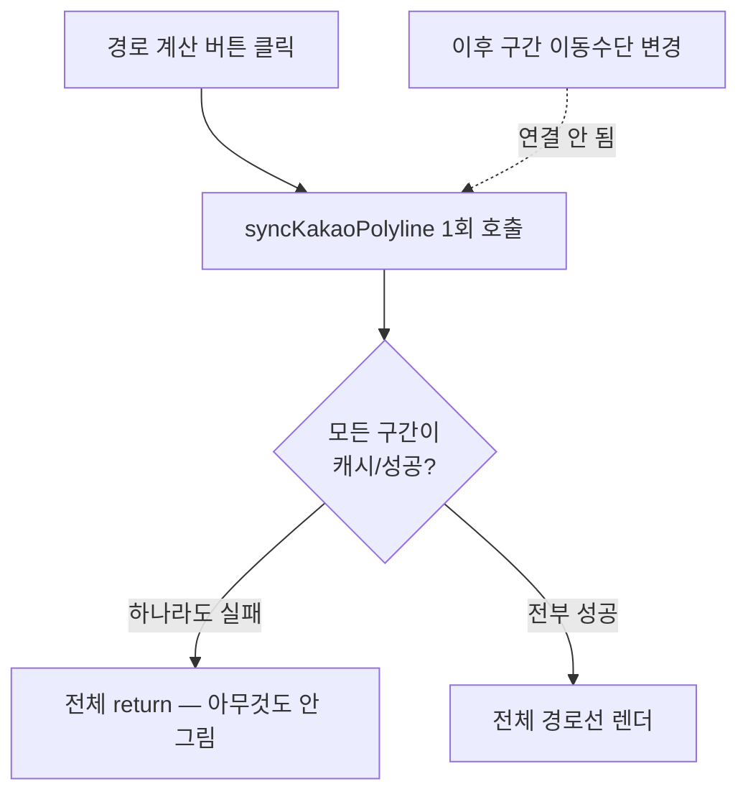

> 플래너(동선짜기)의 지도·경로 기능은 카카오 API 세 종류(Map SDK, 로컬 라우팅, 모빌리티 길찾기)를 함께 쓴다. [17일차 학습노트]({{ site.baseurl }}/cloud/day17/)에는 동시 요청 제한 문제를 깊게 다뤘는데, 여기서는 그날 하루 동안 "지도에 경로선이 안 보인다"는 같은 증상으로 신고됐던 버그 다섯 개를 원인별로 모아 정리한다.

## 문제 상황 (Task)

16~17일차 이틀 동안 플래너에서 반복적으로 나온 리포트는 거의 다 같은 문장이었다 — "경로가 계산됐다는데 지도에 선이 안 보여요." 그런데 실제로 뜯어보면 매번 원인이 달랐다. 아이콘이 헷갈려서 못 찾은 것부터, 렌더링 로직 자체의 결함, 존재하지도 않는 API 파라미터, 실패를 영원히 기억해버리는 캐시, 클로저가 붙잡은 옛날 상태까지 — 다섯 가지가 전부 "경로선이 안 보인다"는 하나의 증상 뒤에 숨어 있었다.

## 시도한 방법 (Action)

### 증상 1 — 아이콘을 못 찾아서 (09-16)

가장 사소했던 원인. 카카오맵 길찾기 버튼이 이동수단 칩과 떨어진 곳에 있어서 사용자가 아예 못 찾고 있었다.

🟢 아이콘을 이동수단 칩 바로 옆으로 옮기고, 카카오톡 말풍선처럼 보이던 아이콘도 지도 핀(map-pin) 모양으로 바꿨다. 같은 커밋에서 경로 조회 실패 시 "경로 정보를 불러오지 못했어요"라는 뭉뚱그린 문구 대신 **Kakao API가 실제로 돌려준 오류 메시지를 그대로 노출**하도록 바꿨다 — 이후 다른 진짜 원인들을 훨씬 빨리 찾을 수 있었던 결정적인 선택이었다.

### 증상 2 — 하나라도 실패하면 전체를 포기하던 렌더링 (09-16)

🔴 `syncKakaoPolyline`이 여러 구간 중 **하나라도** 캐시가 없거나 실패하면 전체 경로선을 아예 그리지 않고 함수를 종료해버리고 있었다. 게다가 이 함수는 "경로 계산" 버튼을 누른 직후 딱 한 번만 호출됐다 — 이후 구간별로 이동수단을 바꿔도 지도가 갱신되지 않았다.

🟢 구간별로 **개별 Polyline**을 그리도록 바꿔서, 일부 구간이 실패해도 나머지는 지도에 표시되게 했다. 그리고 `routeCache`/`segments`가 바뀔 때마다 `useEffect`로 자동으로 다시 그리도록 연결해서, 이동수단을 바꿀 때마다 매번 수동으로 다시 계산 버튼을 누를 필요가 없게 했다.

### 증상 3 — API에 존재하지 않는 값을 보내고 있었다 (09-17)

🔴 가장 허탈했던 원인. "최단 거리" 기준으로 자동차 경로를 계산할 때 카카오모빌리티 길찾기 API에 `priority='SHORTEST'`를 보내고 있었는데, **이 값은 애초에 카카오 API에 존재하지 않는 값**이었다. 매번 400(invalid priority) 에러로 실패해서, 최단 거리 기준으로는 자동차 경로 자체를 못 받아오고 있었다.

증상 1에서 만들어둔 "실제 오류 메시지 노출" 덕분에 이번엔 원인을 빠르게 찾을 수 있었다. 카카오 API 문서를 다시 확인해서 유효한 값이 `RECOMMEND`/`TIME`/`DISTANCE` 셋뿐이라는 걸 확인하고, `'distance'` → `'DISTANCE'`로 고쳤다.

같은 커밋에서 일차별 지도 경로선 팔레트도 손봤다 — 주황/파랑 계열이 서로 구분이 잘 안 된다는 피드백을 받아 초록/빨강/보라/자홍/청록/골드 조합으로 바꿨다.

### 증상 4 — 한 번 실패하면 영원히 실패로 남는 캐시 (09-17)

🔴 `fetchSegmentRouteForModeWithCriteria`가 캐시에 값이 있으면 **성공이든 실패든** 무조건 재조회를 건너뛰고 있었다. 그래서 도보·대중교통·자전거처럼 요청이 몰려 한 번이라도 실패한 구간은, 이동수단을 바꾸고 "경로 검색"을 다시 눌러도 영원히 재시도되지 않고 그대로 실패 상태로 남았다.

🟢 최적 경로 계산 쪽(`fetchLeg`)은 이미 실패 캐시를 재시도 대상으로 취급하고 있었다는 걸 확인하고, 경로 검색 쪽도 같은 방식으로 맞췄다 — 실패로 캐시된 항목은 "이미 조회함"으로 치지 않도록 수정.

- **개념 카드 — 캐시의 성공/실패는 다르게 취급해야 한다**
  - 캐시는 "이미 확인했으니 다시 안 해도 된다"는 전제로 동작한다.
  - 하지만 그 확인 결과가 **일시적인 실패**(요청 몰림, 네트워크 오류 등)였다면, "이미 확인했다"는 전제가 틀렸을 수 있다.
  - 성공 캐시는 그대로 재사용하되, 실패 캐시는 "아직 확인 안 된 것"처럼 취급해 재시도 대상에 남겨두는 것이 이번에 배운 원칙이었다.

### 증상 5 — 클로저가 붙잡은 옛날 상태 (09-17)

🔴 다일차(여러 날짜) 동선 최적화에서 `runMultiDayOptimalRoute`가 일차마다 순서대로 `runOptimalRoute`를 호출할 때, **stale 클로저**를 참조하고 있었다. 앞 일차의 재정렬 결과가 아직 반영되기 전의 `places` 값을 기준으로 다음 일차 경로를 검색해버린 것이다. 그 결과 최적화 후 실제 인접 쌍과 캐시된 경로의 인접 쌍이 어긋나서, 2일차부터는 경로선이 아예 그려지지 않았다.

🟢 항상 최신 콜백을 참조하는 `ref`를 통해 호출하도록 고쳤다. [17일차 학습노트]({{ site.baseurl }}/cloud/day17/)에서 다룬 "클로저가 붙잡은 오래된 상태" 문제와 뿌리가 같은 원인이었다 — 그날 하루에만 같은 패턴의 버그가 최소 두 곳에서 나온 셈이다.

## 배운 점 (Result)

- **같은 증상 뒤에는 여러 원인이 숨어 있을 수 있다.** "경로선이 안 보인다"는 신고 다섯 건이 각각 UI 위치, 렌더링 결함, 잘못된 API 파라미터, 캐시 정책, 클로저 문제로 전부 달랐다. 증상만 보고 이전에 고친 원인이라고 단정하지 않고 매번 새로 재현·확인한 것이 시간을 아꼈다.
- **오류 메시지를 실제로 노출하는 것 자체가 디버깅 속도를 바꾼다.** 증상 1에서 만들어둔 "Kakao API의 실제 오류 메시지 노출"이 없었다면, 증상 3의 `SHORTEST` 오타를 훨씬 늦게 발견했을 것이다.
- **캐시는 "확인했다"와 "성공했다"를 구분해야 한다.** 실패까지 영구 캐시하면 일시적 오류가 영구 장애처럼 보인다.

## 더 학습하면 좋은 개념

- **카카오 로컬/모빌리티 API의 파라미터 스펙** — `priority` 같은 열거형(enum) 파라미터는 문서를 매번 원본으로 재확인해야 한다는 걸 이번에 체감했다. 공식 문서의 요청 파라미터 표를 습관적으로 다시 보는 루틴을 만들어둘 만하다.
- **useEffect의 의존성 배열과 자동 재렌더링** — `routeCache`/`segments` 변화에 자동으로 반응하도록 만든 패턴을 React 공식 문서 기준으로 더 정리해두면, "왜 자동으로 갱신 안 되지?" 류의 버그를 미리 피할 수 있다.
- **실패를 구분하는 캐시 설계(Stale-While-Revalidate 계열)** — 성공/실패/만료를 구분해서 캐시하는 표준 패턴들을 비교해보면, 지금은 임시방편으로 고친 부분을 더 일반적인 규칙으로 다듬을 수 있다.
- **[동시성 제어와 API Rate Limit 대응]({{ site.baseurl }}/cloud/day17/)** — 같은 날 다룬 동시 요청 제한 문제는 여기서 다룬 다섯 가지와는 또 다른 원인이었다. 17일차 학습노트에 별도로 정리해뒀다.

## 참고 자료
- [카카오 로컬 API 공식 문서 - 길찾기](https://developers.kakao.com/docs/latest/ko/local/dev-guide)
- [카카오모빌리티 길찾기 API 문서](https://developers.kakaomobility.com/docs/navi-api/directions/)
- [React 공식 문서 - Referencing Values with Refs](https://react.dev/learn/referencing-values-with-refs)
- [MDN - Web APIs와 비동기 오류 처리](https://developer.mozilla.org/en-US/docs/Learn_web_development/Extensions/Async_JS)
