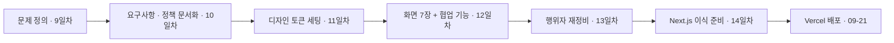
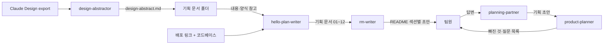

  
🧭

  

    
p:nder — AI 기반 동선 플래너

    
목적지를 입력하면 최적화된 일정과 이동 동선을 자동으로 짜주는 여행 경로 서비스. 4인 팀 "인사팀"이 2026.09.07~09.21, 기획부터 배포까지 직접 만들었다.

    

      👥 김예린·류다연·양다연·박유수
      📅 2026.09.07 ~ 09.21
      🧩 컴포넌트 9종
    

    

      <a class="project-hero__link" href="https://pinder-one.vercel.app/" target="_blank" rel="noopener">🔗 라이브 사이트 방문하기</a>
      <a class="project-hero__link project-hero__link--ghost" href="https://www.figma.com/make/ud387SQMeP4m5WJTFciCXg/Travel-Route-Planner-Wireframe?fullscreen=1&t=kdsf4qiqAWLw50Et-1&code-node-id=0-6" target="_blank" rel="noopener">🎨 피그마 와이어프레임</a>
      <a class="project-hero__link project-hero__link--ghost" href="https://claude.ai/design/p/f9f84bdd-ea4c-4e76-b7bc-cad662483c31?file=Route+Planner+App.dc.html&via=share" target="_blank" rel="noopener">🖌️ Claude Design</a>
    

  

## 들어가며 (Situation)

여행을 같이 가는 팀은 보통 각자 카카오맵·인스타그램·블로그를 따로 뒤져서 가고 싶은 곳을 찾고, 그걸 단톡방에 링크로 쏟아붓는다. 그러고 나면 "그래서 순서는 어떻게 돌 건데?"라는 질문이 남는다 — 약속 장소나 목적지는 정해져 있어도, 주변에서 무엇을 할지와 장소 간 이동 순서를 함께 고려한 효율적인 일정을 짜기는 여전히 어렵다.

모듈 1(서비스 기획과 바이브 코딩)은 이 문제를 4인 팀 "인사팀"(김예린·류다연·양다연·박유수)이 실제로 풀어본 팀 프로젝트였다. 9일차 문제 정의부터 10일차 요구사항 정의, 11~12일차 디자인 시스템 구축, 13~14일차 Next.js 이식 준비를 거쳐 09-21까지 실제 서비스로 배포했다 — 기획 문서 한 줄이 실제로 동작하는 화면이 되고, 그 화면이 다시 인터넷 주소를 갖는 전체 과정을 팀 단위로 겪었다.

## 문제 상황 (Task)

- **핵심 문제**: 여러 명이 가고 싶은 장소를 각자 모아오지만, 그걸 하나의 효율적인 동선으로 합치는 과정은 여전히 수작업이다.
- **우리의 해결 방향**: "장소 입력 → AI가 최적 경로 생성 → 세부 정보 추가해 커스텀" — 목적지를 입력하면 AI가 최적화된 일정과 동선을 자동 생성하고, 생성 이후에도 같은 화면(플래너)에서 계속 수정할 수 있게 한다.
- **팀 프로젝트 특유의 문제**: 혼자 쓰는 서비스가 아니라 "일행"이 함께 보는 서비스이므로, 로그인 여부에 따라 열람·편집 권한이 갈리는 정책까지 문서에 구체적으로 박아둬야 서브에이전트가 엉뚱하게 구현하지 않는다.
- **의도적으로 뺀 범위**: 교통·날씨 변동을 감지해 동선을 자동으로 재조정하는 기능은 기획 단계에서 제외했다. 대신 사용자가 "변수 추가"를 직접 눌러야 재계산이 시작되도록 범위를 좁혔다.

### MVP 기능

| 우선순위 | 카테고리 | 기능 | 상태 |
|---|---|---|---|
| 1 | 장소 탐색 | 목적지 검색 및 추가 | 완료 |
| 2 | 장소 탐색 | 지도에 목적지 표시 | 완료 |
| 3 | 경로 계산 | 출발지 선택 및 경로 계산 | 완료 |
| 4 | 경로 계산 | 최단시간·최단거리 경로 계산 | 완료 |
| 5 | 경로 계산 | 변수·가중치 적용 | 완료 |

## 해결 과정 (Action)

### 1. 기획 — 문제 정의부터 정책까지 문서로 고정

| 단계 | 날짜 | 한 일 | 관련 학습노트 |
|---|---|---|---|
| 문제 정의·시장 조사 | 9일차 | 유사 서비스 분석, 팀 문제정의 합의 | [9일차]({{ site.baseurl }}/cloud/day9/) |
| 요구사항·정책 문서화 | 10일차 | 기획 파트너 서브에이전트와 인터뷰, 문서 4장 작성 | [10일차]({{ site.baseurl }}/cloud/day10/) |
| 행위자 보정 | 13일차 | 화면 기준으로 행위자 3명 → 7명, 단계 14개 → 17개로 재정비 | [13일차]({{ site.baseurl }}/cloud/day13/) |

💡 10일차에 처음 쓴 업무 분석 문서는 "동선을 만드는 사람"만 인터뷰 대상으로 삼았다. 그런데 화면을 만들다 보니 비회원 열람자·커뮤니티 관리자처럼 문서에 없던 역할이 계속 튀어나왔다. 그래서 화면을 기준으로 행위자를 거꾸로 채우는 보정을 거쳤다 — 기획이 항상 화면보다 먼저일 필요는 없고, 어긋났을 때 바로잡는 과정도 기획의 일부였다.

### 2. 디자인 시스템 — 화면보다 토큰이 먼저

11일차에는 화면을 그리기 전에 색·글자 크기·간격 같은 디자인 토큰부터 Claude Design에 등록했다. 12일차에는 7개 화면(로그인·회원가입·홈·탐색·동선짜기·내 일정·커뮤니티)을 다크모드·공통 내비게이션·마이크로 인터랙션으로 통일하고, 동선짜기 화면에는 일행 초대·AI 어시스턴트·활동 로그 기능을 추가로 붙였다.

- **개념 카드 — 도구별 역할 분리**
  - **피그마**: 초안 main 화면 참고, 색상 팔레트 원본 정의(참고용)
  - **Claude Design**: 피그마 팔레트를 참고해 초기 프로토타입 제작·UI/UX 구체화(원본)
  - **VS Code / Claude Code**: Claude Design 프로토타입을 실제 React/Next.js 화면으로 구현·수정(구현)

🔴 다만 의도와 실제 구현이 늘 일치하지는 않았다 — 색상은 토큰(`Brand #7BCB93` 등)만 쓰기로 했지만 실제 CSS 모듈 90건 이상에서 하드코딩된 hex가 발견됐고, 아이콘 라이브러리도 쓰지 않기로 하고 PNG·이모지·인라인 SVG를 혼용했다. 컴포넌트는 `src/components/ui/`에 총 9종(Button·Card·Header·Modal·SegmentedControl·DateRangeCalendar·ImageCropModal·NotificationBell·ThemeToggle 등)이 실제로 export되어 쓰였다.

### 3. Agent 구성 — 화면을 그리는 Agent 대신, 문서를 나눠 맡는 Agent 5개

p:nder는 화면을 직접 만드는 "디자이너 → 퍼블리셔" Agent 대신, **기획·문서 작업을 역할별로 나눠 맡는 Agent 5개**를 저장소(`plan/.claude/agents/*.md`)에 정의해 썼다.

| Agent | 역할 | 제약 |
|---|---|---|
| planning-partner | 기획 인터뷰 진행, 답변을 문서 양식에 기록 | 팀 대신 결정하지 않음, 지정 문서 외 쓰기 금지 |
| product-planner | 기획 문서의 빈 칸·모호한 문장 검증 | Read 전용, 답을 대신 채우지 않음 |
| design-abstractor | Claude Design export를 코드 기준으로 요약 | export 원본 수정 금지 |
| hello-plan-writer | 배포된 서비스를 코드·화면 기준으로 역산해 문서화 | 추측·`[제안]`/`[?]` 태그 금지, 근거 없으면 "미확인" |
| rm-writer | 문서를 종합해 발표용 README 작성 | 근거 없는 내용은 `<확인 필요>`로 표시 |

- **개념 카드 — 사실과 추정을 구분하는 태그 규칙**
  - 모든 Agent 지시문에 공통으로 넣은 규칙: 팀이 확정한 내용은 그대로 적고, AI가 보탠 제안은 `[제안]`, 근거 없는 추정은 `[확인 필요]`/`[?]`로 표시한다.
  - `hello-plan-writer`는 여기서 한 단계 더 나아가 "계획이 아니라 실제로 지금 동작하는 것만 쓴다"는 규칙과 "(근거: `src/app/matches/page.tsx`)"처럼 파일 단위 근거를 남기는 규칙까지 적용했다.
  - 이 규칙 덕분에 이 프로젝트를 코드로 역산해 검증했을 때, AI가 추천한 장소의 좌표를 못 찾으면 가짜 이동시간·지하철 노선명을 지어내 보여주는 결함(`AiGenerateWizard.tsx` → `PlannerClient.tsx` → `route-engine.ts`)을 실제로 잡아낼 수 있었고, 이후 대체 후보 재시도(최대 3회)와 실패 안내 모달로 고쳐졌다.

### 4. 협업 — 잘 굴러간 것과, 굴러가지 않았던 것

🟢 **기획 저장소(`hello-planning`)**: 팀원 성 이니셜별 브랜치(K/P/R/y-branch)로 문서 영역을 나눠 각자 작성하고, PR을 열어 병합하는 방식을 실제로 시도했다. PR 13건 중 7건(#1,2,3,4,5,7,10)이 병합됐다.

🔴 다만 전부 매끄럽지는 않았다. PR#6(류다연, `R-branch`)은 양다연·김예린이 인라인 리뷰 코멘트 12건까지 남겼지만("05번 파일 정책... 추가하면 좋을 거 같습니다" 등) 반영·재승인으로 이어지지 못하고 병합 없이 종료됐다. 이후 `new-R-Branch` → `cherry-branch`로 두 번 더 새 브랜치를 파며 재시도했지만 PR#11~14·16 다섯 건 모두 끝내 병합되지 못했고, 결국 09-17에 PR 없이 `main`에 문서를 직접 복사해 넣으며 마무리했다.

⚠️ **개발 저장소(`pinder`)**: 09-17까지는 `feat/*` 브랜치 이름표만 있을 뿐 실제 분기 없이 전원이 `main`에 직접 커밋하고, 충돌은 로컬에서 `git pull`로 해결하는 방식이 이어졌다(병합 커밋 95개가 전부 이런 충돌 해소용). `feat/saved-view-past-trips`처럼 실제로 갈라진 브랜치 하나는 09-17 이후 지금까지 병합되지 않고 방치돼 있다. 09-22 README 문서화에 와서야(2절 박유수, 1·3·4절 류다연, 5·6절 김예린, 7절 양다연) 처음으로 브랜치 → PR → 실제 "Merge pull request" 버튼 병합 방식이 이 저장소에 자리 잡았다.

- **용어 카드 — 자가병합(self-merge)**
  - PR을 만든 사람이 스스로 승인·병합 버튼을 누르는 것. 기획 저장소의 병합 PR 7건 중 6건이 자가병합이었고, 유일하게 김예린의 PR#10만 류다연이 대신 병합해줬다 — 이 저장소 전체에서 "다른 사람이 리뷰하고 병합해준" 유일한 사례였다.

🔴 같은 파일을 여러 명이 반복 수정하는 지점도 있었다. `PlannerClient.tsx`는 네 명 전원(김예린 46회·양다연 17회·류다연 14회·박유수 8회)이 고쳤고, 모바일 레이아웃을 담당한 `planner.module.css`도 세 명(박유수 21회·김예린 18회·양다연 13회)이 겹쳐서 손댔다. 박유수는 지도 화면 "뒤로가기" 버튼이 검색 오버레이와 겹치는 문제를 09-17 하루에 5번, 양다연은 AI 도우미·현재 위치 버튼이 하단 요약바와 겹치는 문제를 09-18 아침에 7번 연속 수정했다 — `z-index`·`position` 값을 계속 바꾸며 한 번에 맞는 배치를 못 찾은 패턴이었다.

⚠️ **되돌림(revert) 사고도 있었다.** 김예린이 회원탈퇴 후 로그인 화면으로 이동시키는 코드 3줄을 추가하자(`067f9fc`, 09-16 11:39), 13분 뒤 양다연이 설명 없이 그 3줄을 `git revert`로 삭제했고(11:52), 다시 10분 뒤 김예린이 "테스트로 확인된 실제 버그 수정이라 다시 적용한다"고 커밋 메시지에 남기며 같은 코드를 재적용했다(12:02) — 사전 소통 없이 되돌렸다가 다시 되돌려진 사례로, 같은 영역 작업 전 담당·범위를 먼저 공지해야 한다는 교훈으로 남았다.

### 5. 트러블슈팅 — 인프라 문제를 스키마는 그대로 두고 해결

🔴 서비스 운영 중 Neon DB의 네트워크 사용량을 모두 소진해 DB를 쓸 수 없게 되는 문제가 발생했다.

🟢 스키마 구조는 그대로 유지한 채 Supabase로 데이터베이스만 새로 구축해 재배포하는 방식으로 대응했다 — 스키마와 인프라를 분리해 둔 덕분에 DB를 교체해도 나머지 코드에는 영향이 크지 않았다.

| 문제 | 원인 | 해결 |
|---|---|---|
| 커뮤니티 글 작성 실패가 성공으로 처리됨 | 에러 응답을 성공 케이스로 잘못 분기 | 실패 응답을 실패로 처리하도록 분기 로직 수정 |
| 동시 경로 요청이 몰려 일부 이동수단 계산 실패 | 여러 이동수단 API를 동시에 호출해 요청 과부하 | 요청 처리 방식을 수정해 과부하 해소 |
| Neon DB 네트워크 사용량 소진 | 무료 티어 한도 초과 | Supabase로 재배포, 기존 스키마만 그대로 이전 |

### 6. 배포 후 보안 진단 — 셀프 테스트

기획·구현·배포까지 끝낸 뒤, 실제 배포 주소(`pinder-one.vercel.app`)와 코드베이스를 대상으로 정적·능동·수동·부하 4종 보안 점검을 셀프로 돌려봤다. "바이브코딩으로 화면과 기능은 빠르게 나오지만, 눈에 안 보이는 규칙(권한·보안·성능)은 빠지기 쉽다"는 걸 직접 확인해보고 싶었다.

⚠️ **종합 위험도: Medium** — "인가 경계는 탄탄합니다. 남은 건 유료 프록시 무인증과 로그인 방어입니다."

🟢 **잘 되어 있던 것**

- 일정·게시글·댓글·알림 수정/삭제가 전부 세션 사용자로 스코프됨 — 실측에서도 남의 자원 접근이 차단됐다.
- 비밀번호는 bcrypt 해시, JWT는 httpOnly·secure·sameSite 쿠키로 관리하고 매 요청마다 DB에서 사용자 존재를 재확인한다.
- 초대 편집 링크로 들어와도 즉시 편집자가 아니라 "열람자 + 승인 대기" 상태 — 권한 상승 경로가 없다.
- 비밀정보·연결 문자열이 코드·커밋 이력·배포 번들 어디에도 없었다(`.env` 미추적).

🔴 **발견된 문제**

| 심각도 | 항목 | 문제 | 조치 방향 |
|---|---|---|---|
| 🟠 medium | 유료 AI·지도 API 프록시 무인증 | `/api/chat`·`/api/route-generate`·`/api/route-adjust`·`/api/kakao`가 세션 확인 없이 호출됨 — 쿠키 없이 요청해도 401이 아니라 400 응답, 즉 인증 게이트 자체가 없었다 | 서버 라우트에 로그인 인증 필수화 + 사용자별 호출 한도 |
| 🟠 medium | 로그인 무차별 대입 방어 부재 | 비밀번호 오답을 15연속 시도해도 잠금·지연·429 응답이 0건 | 시도 제한(IP·계정)·지수 백오프·잠금 |
| 🟠 medium | RLS 없는 단일 방어선 | 서버가 `DATABASE_URL`로 DB에 직접 접속하고 Row Level Security는 쓰지 않음 — 지금은 라우트별 소유권 검사가 잘 지켜지지만, 라우트 하나만 빠뜨려도 그대로 노출됨 | 서버 인가 + DB 수준 방어를 함께(다층 방어) |
| 🟡 low | 로그인 사용자 열거 | 존재하는 계정과 없는 계정의 오류 메시지가 달라 계정 존재 여부가 드러남 | 실패 응답 문구를 하나로 통일 |
| 🟡 low | 초대 토큰 저엔트로피 | 초대 토큰이 12자리 hex(48비트)로 짧고 만료·폐기가 없어 한 번 유출되면 영구 유효 | 충분한 길이의 추측 불가 토큰 + 만료·1회용 처리 |
| 🟡 low | `legacy/` 폴더·TLS 검증 해제 | 스캐너 경고 47건·gitleaks 8건 대부분은 오탐이지만, 실행되지 않는 디자인 export가 저장소에 남아있는 위생 문제 | `legacy/` 삭제, 스크립트의 TLS 검증 유지 |

- **개념 카드 — 채점표(0~2점 기준)**
  - 비밀정보 관리 **2/2** — 코드·이력·배포 번들 모두 깨끗
  - 인가(쿼리 스코프) **2/2** — 전 라우트가 소유자·역할 기준으로 스코프되고, 실측에서도 IDOR이 차단됨
  - 인증(서버 측) **1/2** — bcrypt+JWT 쿠키 자체는 견고하지만, 유료 프록시 무인증·로그인 시도 제한 부재가 감점
  - 입력 검증 **2/2** — drizzle-orm 파라미터화, 원시 SQL 없음
  - 의존성 관리 **2/2** — high/critical 취약점 0건
  - 레이트리밋/가용성 **1/2** — 부하 자체는 안정적이지만, 로그인·유료 프록시에 명시적 호출 제한이 없음

🟢 부하 테스트(동시 사용자 1~20명, 총 4단계)는 요청 실패 0건으로 안정적이었다 — 첫 요청은 콜드스타트로 지연이 높았지만, 동시 사용자가 늘어도 p50·p95 응답 시간이 오히려 안정적으로 유지됐다.

| 동시 사용자(VU) | 요청 수 | 실패 | p50(ms) | p95(ms) |
|---|---|---|---|---|
| 1 | 26 | 0 | 43 | 148 |
| 5 | 140 | 0 | 32 | 87 |
| 10 | 283 | 0 | 28 | 71 |
| 20 | 572 | 0 | 26 | 63 |

🚨 **가장 먼저 고칠 것**

1. 유료 프록시 4종(`chat`·`route-generate`·`route-adjust`·`kakao`)에 세션 확인 필수화 + 사용자별 하루 호출 한도
2. 로그인에 시도 제한(잠금·지연) 추가 + 실패 메시지 통일로 사용자 열거 차단
3. `legacy/` 폴더를 저장소에서 제거

> "뚫린 곳이 있다면 실력 부족이 아니라 바이브코딩이 '동작하는 프로토타입'까지만 책임지기 때문입니다. 이 팀은 인가 설계가 이미 좋습니다 — 실측에서도 남의 자원 손대기가 막혔습니다. 남은 것은 '로그인하지 않은 요청도 서버에 도달한다'는 사실을 유료 프록시와 로그인 방어에도 적용하는 습관입니다." — 보안 진단 리포트 총평

## 결과 (Result)

- 실제 배포: **[p:nder — pinder-one.vercel.app](https://pinder-one.vercel.app/)**, `main` push 시 Vercel Git Integration이 자동으로 프로덕션 배포를 생성한다.
- 개발 저장소(`pinder`) 총 **337커밋**(김예린 135·박유수 94·양다연 65·류다연 43), 기획 저장소(`hello-planning`) 총 **43커밋**을 거쳐 완성했다.
- 화면 **7장**을 디자인 시스템 기반으로 완성하고, 컴포넌트 **9종**을 공용 부품으로 재사용했다.
- 배포 후 셀프 보안 진단에서 종합 위험도 **Medium**(6개 항목 중 2점 만점 4개·1점 2개)을 받았다 — 인가·비밀정보 관리는 만점이었고, 유료 API 무인증·로그인 방어 부재가 남은 과제로 확인됐다.
- 동시 사용자 20명까지 부하 테스트에서 요청 실패 **0건**을 유지했다.
- 업무 분석 문서의 행위자를 **3명 → 7명**, 단계를 **14개 → 17개**로 보정해 화면과 문서가 어긋나지 않는 상태로 만들었다.
- PR은 기획 저장소 13건 중 7건 병합(6건 미병합), 개발 저장소는 09-22 이후 5건 전부 병합 — "직접 push"에서 "PR 리뷰·병합"으로 협업 방식이 실제로 전환된 지점을 커밋 기록으로 확인했다.
- Neon → Supabase DB 마이그레이션을 스키마 변경 없이 완료해 서비스 중단 없이 인프라 문제를 해결했다.

## 더 학습하면 좋은 개념

- **요구사항 추적성 (Traceability)** — 행위자(A)·요구사항(R)·기능(F)·정책(P) ID를 서로 가리키게 만드는 방식. 문서 단계를 넘어 구현 프롬프트·커밋 메시지까지 이어질 수 있는 실무 패턴이다.
- **디자인 토큰(Design Token)** — 색·간격·타이포그래피를 값이 아니라 이름으로 관리하는 방법. p:nder처럼 규칙을 세워두고도 실제로 지켜지지 않을 수 있다는 걸 확인했으니, 토큰 이탈을 자동으로 잡아주는 린트 규칙까지 학습하면 좋다.
- **브랜치 전략과 트렁크 기반 개발(Trunk-Based Development)** — 이번 프로젝트는 "각자 브랜치 후 PR"과 "전원 main 직접 커밋" 두 방식을 모두 겪었다. 어떤 팀 규모·속도에서 어떤 전략이 맞는지 공식 가이드로 비교해볼 만하다.
- **데이터베이스 마이그레이션과 벤더 종속(Vendor Lock-in)** — 스키마를 인프라와 분리해 둔 덕분에 Neon에서 Supabase로 무리 없이 옮길 수 있었던 이유를 ORM·마이그레이션 도구 공식 문서로 더 깊이 이해할 필요가 있다.
- **동시성 문제와 요청 제어(Concurrency Control)** — 여러 이동수단 API를 동시에 호출하다 과부하가 난 사례를 계기로, 요청 큐잉·재시도·백오프 같은 표준 패턴을 학습하면 다음 프로젝트에서 같은 문제를 미리 피할 수 있다.
- **API 인증과 레이트리밋(Rate Limiting)** — 보안 진단에서 가장 크게 지적된 부분. 로그인 여부 확인과 별개로, 비용이 드는 API(AI·지도 등)는 "누가, 얼마나 자주" 부르는지까지 서버가 직접 통제해야 한다는 걸 실측으로 확인했다.
- **Row Level Security(RLS)와 다층 방어(Defense in Depth)** — 지금은 서버 라우트의 소유권 검사만으로 버티고 있지만, DB 수준에서도 같은 규칙을 걸어두면 라우트 하나를 빠뜨려도 최후 방어선이 남는다.

## 참고 자료

- [Next.js 공식 문서 - Deploying](https://nextjs.org/docs/app/building-your-application/deploying)
- [Vercel 공식 문서](https://vercel.com/docs)
- [MDN - Web Storage API](https://developer.mozilla.org/en-US/docs/Web/API/Web_Storage_API)
- [Git 공식 문서 - Branching Workflows](https://git-scm.com/book/en/v2/Git-Branching-Branching-Workflows)
- [OWASP - Authentication Cheat Sheet](https://cheatsheetseries.owasp.org/cheatsheets/Authentication_Cheat_Sheet.html)
- [Supabase 공식 문서 - Row Level Security](https://supabase.com/docs/guides/database/postgres/row-level-security)
